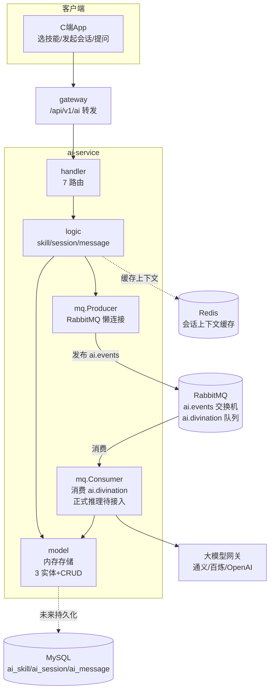

# ai-service AI 问事服务设计文档

> **文档版本**: v1.2
> **创建日期**: 2026-07-01
> **服务端口**: 8098
> **业务域**: 营销 + AI 域
> **关联文档**: [技术架构](../技术架构.md) | [API规范](../API规范.md) | [状态机](../状态机.md) | [业务流程](../业务流程.md)

---

## 1. 服务职责

ai-service 提供问玄东方 C 端 AI 问事对话能力，覆盖 **7 个玄学技能**：

| 技能编码 | 名称 | 说明 |
|---------|------|------|
| `bazi` | 八字命理 | 依据生辰八字推演命格运势 |
| `marriage` | 姻缘测算 | 测算姻缘婚恋走势 |
| `tarot` | 塔罗牌 | 塔罗牌占卜指引 |
| `fengshui` | 风水分析 | 居家风水布局建议 |
| `qimen` | 奇门遁甲 | 奇门遁甲预测决策 |
| `ziwei` | 紫微斗数 | 紫微斗数命盘解析 |
| `liuyao` | 六爻梅花 | 六爻梅花易数占断 |

主要职责：
- 技能列表查询（C 端展示）
- 创建对话会话（用户选定技能）
- 会话列表 / 详情 / 删除（用户管理自己的会话）
- 发送消息（C 端直接问事，同步返回接收确认，异步通过 RabbitMQ 触发模型推理）
- RabbitMQ 事件 `ai.events` 异步驱动大模型推理（解耦模型调用与请求响应）

---

## 2. 架构图

---

## 3. 数据表设计

### 3.1 ai_skill（AI 技能表）

| 字段 | 类型 | 说明 |
|------|------|------|
| id | BIGINT AUTO_INCREMENT | 主键 |
| code | VARCHAR(16) | 技能编码（bazi/marriage/tarot/fengshui/qimen/ziwei/liuyao） |
| name | VARCHAR(32) | 技能名（八字命理等） |
| description | VARCHAR(256) | 技能描述 |
| icon | VARCHAR(256) | 图标地址 |
| prompt_template | TEXT | 提示词模板（系统侧使用，C 端不返回） |
| status | VARCHAR(8) | enabled/disabled |
| created_at | DATETIME | 创建时间 |

### 3.2 ai_session（AI 会话表）

| 字段 | 类型 | 说明 |
|------|------|------|
| id | BIGINT AUTO_INCREMENT | 主键 |
| session_no | VARCHAR(32) | 会话号（`AI` + yyyyMMdd + 3位序号） |
| user_id | VARCHAR(32) | 用户 ID |
| skill_code | VARCHAR(16) | 技能编码 |
| status | VARCHAR(8) | active/closed |
| created_at | DATETIME | 创建时间 |
| updated_at | DATETIME | 最后更新时间 |

### 3.3 ai_message（AI 对话消息表）

| 字段 | 类型 | 说明 |
|------|------|------|
| id | BIGINT AUTO_INCREMENT | 主键 |
| session_id | BIGINT | 会话 ID |
| role | VARCHAR(16) | user/assistant |
| content | TEXT | 消息内容 |
| tokens | INT | 消耗 token 数 |
| created_at | DATETIME | 创建时间 |

---

## 4. 接口清单

### 4.1 C 端接口（前缀 `/api/v1/ai`）

| 方法 | 路径 | 说明 | 角色 |
|------|------|------|------|
| GET | /skills | 技能列表（按 status=enabled 过滤） | customer |
| POST | /sessions | 创建会话（指定 userId + skillCode，可携带首问 question） | customer |
| GET | /sessions | 会话列表（按 userId 过滤，分页） | customer |
| GET | /sessions/:id | 会话详情（含消息列表，按时间正序） | customer |
| GET | /sessions/:id/messages | 会话消息列表（分页，按时间正序） | customer |
| POST | /sessions/:id/messages | 发送用户消息（同步返回 accepted，异步触发推理） | customer |
| DELETE | /sessions/:id | 删除会话（软删除，置 status=closed） | customer |

> 共 **7 个路由**，全部 C 端，无管理台接口。

---

## 5. 业务逻辑要点

1. **会话号生成**：格式 `AI` + `yyyyMMdd` + 3 位序号，例如 `AI20260701001`
2. **技能校验**：创建会话时按 `skillCode` 查询 `ai_skill`，不存在或 `disabled` 返回错误；原型首页/AI页的“开始AI问事”必须先创建 session，再向 `/sessions/:id/messages` 发送用户问题
3. **消息角色**：`user`（用户提问）/ `assistant`（模型回复），按时间正序展示
4. **原型推理闭环**：`POST /sessions/:id/messages` 同步落库 user 消息、尝试发布 `AIDivination` 事件并返回 `accepted`；当前同时写入占位 assistant 回复，正式大模型推理接入后由消费者补全真实解读
5. **会话状态**：`active`（活跃） / `closed`（已关闭，删除即置为 closed），便于软删除与历史追溯
6. **RabbitMQ 容错**：生产者懒连接，RabbitMQ 不可用时 `Publish` 返回 nil 不阻断主流程（与 booking-service 一致）
7. **Token 统计**：消费者写入 assistant 消息时填入实际 token 消耗，便于未来计费
8. **实现状态**：技能列表、会话创建/列表/详情/删除、消息列表/发送已形成内存版闭环；MySQL 持久化、真实模型推理与 token 统计为后续增强
9. **MQ 拓扑**：交换机 `ai.events`（fanout），队列 `ai.divination`（ai-service 自身消费），未来可被 message-service 等订阅扩展

---

## 6. 依赖关系

| 依赖类型 | 依赖服务 | 说明 |
|---------|---------|------|
| MQ → | ai-service 自身 | `ai.events` 交换机异步驱动模型推理 |
| HTTP → | 大模型网关 | 通义/百炼/OpenAI（消费者调用） |
| MQ → | message-service | 推理完成通知（未来扩展） |
| MySQL | askxuan_ai 库 | ai_skill/ai_session/ai_message |
| Redis | 本地 | 会话上下文缓存（未来） |
| RabbitMQ | 本地 | 异步事件总线 |
| etcd | 服务注册 | 服务发现 |
| common | 公共包 | BizError / Ok / JsonError / 中间件 |

---

## 7. 错误码区间

AI 服务使用 `common/errorcode.go` 中的统一错误码（范围 40001-50299），不单独定义错误码区间：

| 区间 | 用途 |
|------|------|
| 40001-40099 | 参数校验错误 |
| 40401-40499 | 资源不存在（如 ErrSessionNotFound=40412） |
| 50001-50099 | 系统内部错误（ErrSystem=50001 / ErrNotImplemented=50002） |
| 50201-50299 | 第三方服务错误（如 ErrAiService=50204） |

---

## 版本记录

| 版本 | 日期 | 说明 |
|------|------|------|
| v1.2 | 2026-07-09 | 补齐内存版技能、会话、消息闭环，新增消息列表接口，明确真实推理待接入 |
| v1.1 | 2026-07-09 | 对齐 App 改进原型：明确 C 端直接问事会话与首问字段 |
| v1.0 | 2026-07-01 | 初始版本：7 技能 + 会话/消息 3 实体 + 6 路由 + RabbitMQ producer 骨架 |
