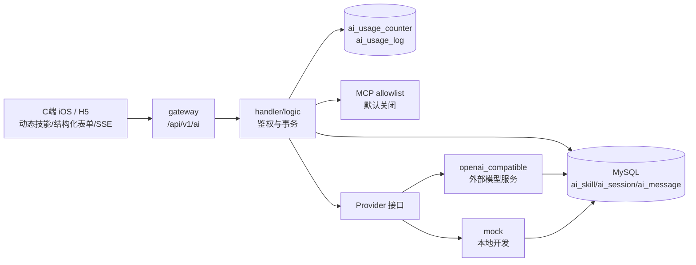

# ai-service AI 问事服务设计文档

> **文档版本**: v1.4
> **创建日期**: 2026-07-01
> **更新日期**: 2026-09-02
> **服务端口**: 8098
> **业务域**: AI 域
> **关联文档**: [技术架构](../技术架构.md) | [API规范](../API规范.md) | [状态机](../状态机.md) | [业务流程](../业务流程.md)

---

## 1. 服务职责

ai-service 提供按用户隔离的专用智能体对话能力。技能目录、结构化输入 schema、能力和受控工具映射从 `ai_skill` 动态读取；`skillCode` 未指定时使用 `general`。

| 技能编码 | 名称 | 说明 |
|---------|------|------|
| `general` | 综合问事 | 直接对话默认入口 |
| `bazi` | 八字命理 | 依据生辰八字推演命格运势 |
| `marriage` | 姻缘测算 | 测算姻缘婚恋走势 |
| `tarot` | 塔罗牌 | 塔罗牌占卜指引 |
| `fengshui` | 风水分析 | 居家风水布局建议 |
| `qimen` | 奇门遁甲 | 奇门遁甲预测决策 |
| `ziwei` | 紫微斗数 | 紫微斗数命盘解析 |
| `liuyao` | 六爻梅花 | 六爻梅花易数占断 |

主要职责：
- 查询启用中的技能配置。
- 根据技能 schema 校验出生日期、时间、地点、历法、性别等结构化输入。
- 创建、查询和关闭当前用户自己的会话。
- 将会话与消息持久化到 MySQL，服务重启后恢复历史。
- 同步接收用户消息并创建 `pending` 助手消息，异步流式调用模型 Provider。
- 按用户执行分钟/日请求额度，记录 token、模型、延迟和估算成本。
- 执行输入与流式输出安全词拦截和统一的高风险内容提示；模型输出不得替代医疗、法律或金融专业意见。
- 通过全局开关和技能白名单调用 MCP 工具；默认关闭，未配置时不伪造工具结果。
- 支持失败状态展示和用户主动重试。

---

## 2. 架构图



模型调用不依赖 RabbitMQ。HTTP 请求先完成用户消息和 `pending` 助手消息的事务写入，再由服务内异步任务调用 Provider；生成增量写回消息并通过 SSE 提供给当前会话所有者，断流客户端回退到消息列表轮询。

---

## 3. 数据表设计

### 3.1 ai_skill（AI 技能表）

| 字段 | 类型 | 说明 |
|------|------|------|
| id | BIGINT AUTO_INCREMENT | 主键 |
| code | VARCHAR(32) | 技能编码，含默认 `general` |
| category / version | VARCHAR | 分类和版本 |
| name | VARCHAR(64) | 技能名称 |
| description | VARCHAR(255) | 技能描述 |
| icon | VARCHAR(255) | 图标地址 |
| prompt_template | TEXT | 系统提示词模板，C 端不返回 |
| source_type / source_ref | VARCHAR | 来源类型及 `ai-module-skills` 修订引用 |
| input_schema | JSON | 客户端动态表单和服务端校验 schema |
| capabilities | JSON | chat/stream/structured_input/mcp 等能力 |
| tool_config | JSON | 服务端受控 MCP server/tool 映射，不向客户端暴露 |
| risk_level / sort_order | VARCHAR / INT | 风险等级和展示顺序 |
| status | VARCHAR(32) | enabled/disabled |
| create_time | DATETIME | 创建时间 |
| update_time | DATETIME | 更新时间 |

### 3.2 ai_session（AI 会话表）

| 字段 | 类型 | 说明 |
|------|------|------|
| id | BIGINT AUTO_INCREMENT | 主键 |
| session_no | VARCHAR(32) | 唯一会话号 |
| user_id | VARCHAR(64) | 会话所有者 |
| skill_code | VARCHAR(32) | 技能编码，应用层默认 general |
| title | VARCHAR(100) | 会话标题，首问自动截取 |
| status | VARCHAR(32) | active/closed |
| create_time | DATETIME | 创建时间 |
| update_time | DATETIME | 最后更新时间 |

### 3.3 ai_message（AI 对话消息表）

| 字段 | 类型 | 说明 |
|------|------|------|
| id | BIGINT AUTO_INCREMENT | 主键 |
| session_id | BIGINT | 会话 ID |
| role | VARCHAR(32) | user/assistant |
| content | TEXT | 消息内容 |
| input_json | JSON | 用户结构化输入快照 |
| tokens | INT | Provider 返回的 token 数 |
| prompt_tokens / completion_tokens | INT | 输入与输出 token |
| provider / model | VARCHAR | 实际 Provider 和模型 |
| cost_micros | BIGINT | 按配置估算的微单位成本 |
| finish_reason | VARCHAR | 模型结束原因 |
| status | VARCHAR(16) | pending/completed/failed |
| error_message | VARCHAR(255) | 面向客户端的失败原因 |
| retry_count | INT | 重试次数 |
| create_time | DATETIME | 创建时间 |

---

### 3.4 ai_usage_counter / ai_usage_log

`ai_usage_counter` 按用户和分钟/日时间桶原子计数；`ai_usage_log` 以 assistant `message_id` 唯一记录技能、Provider、模型、token、成本、延迟和结果，防止重试写入重复成本。

## 4. 接口清单

接口前缀为 `/api/v1/ai`，共 10 个 C 端路由。

| 方法 | 路径 | 说明 |
|------|------|------|
| GET | /skills | 查询动态技能列表及输入 schema，不返回提示词和工具配置 |
| POST | /sessions | 创建会话，首问可携带 `inputs` |
| GET | /sessions | 查询当前用户会话列表 |
| GET | /sessions/:id | 查询会话详情 |
| GET | /sessions/:id/messages | 分页查询消息，按时间正序 |
| POST | /sessions/:id/messages | 发送消息，返回助手 messageId 与 pending 状态 |
| POST | /sessions/:id/messages/:messageId/retry | 重试失败的助手消息 |
| GET | /sessions/:id/messages/:messageId/stream | 当前用户读取 SSE 增量和完成元数据 |
| GET | /usage | 当前用户分钟/日额度与当日 token、成本摘要 |
| DELETE | /sessions/:id | 将会话状态置为 closed |

---

## 5. 业务逻辑要点

1. **直接对话**：创建会话不传 `skillCode` 时使用 `general`；旧客户端仍可传原技能编码。
2. **会话所有权**：仅信任网关注入的 `X-User-Id`，请求体中的兼容 `userId` 只能与其一致；用户不能读取、流式订阅、关闭、发送或重试其他用户的会话。
3. **事务写入**：首问或后续发送均在同一 `sqlx.Session` 中写入 user 消息和 `pending` assistant 消息，任一写入失败整体回滚。
4. **Provider 状态**：Provider 流式增量更新 `content`，成功后写入 token/成本/模型/结束原因；失败后写入 `failed/error_message`，客户端显示可重试状态。
5. **重启恢复**：服务启动时将遗留的 `pending` 助手消息转为 `failed`，错误文案为“服务重启，点击重试”，避免消息永久等待。
6. **重试约束**：仅会话所有者可重试本会话中 `failed` 的 assistant 消息；重试时状态改回 `pending` 并增加 `retry_count`。
7. **客户端流式显示**：iOS 与 H5 发送后订阅该 assistant message 的 SSE；连接中断时轮询消息列表，直到进入 `completed` 或 `failed`。
8. **软删除**：删除会话仅将状态置为 `closed`，历史消息保留用于追溯。
9. **内容安全**：用户输入先执行长度和禁用词校验；流式回答每次落库前再次执行禁用词校验，命中后中止生成并转为可重试失败。
10. **额度和成本**：发送及重试均消耗用户请求额度；token 和成本只在服务端记录，客户端不提交计费数据。
11. **技能与 MCP**：`ai-module-skills` 只作为经审查的来源和 schema 依据，服务不扫描或执行其任意脚本。MCP 必须同时满足 `AI_MCP_ENABLED=true` 和技能 `tool_config.enabled=true`。

---

## 6. Provider 与配置

| Provider | 用途 | 行为 |
|----------|------|------|
| `mock` | 本地开发与无密钥环境 | 返回明确带“本地开发模拟”标识的结果，不伪装外部模型 |
| `openai_compatible` | OpenAI 兼容模型网关 | 调用兼容的 chat completions HTTP 接口 |

环境变量优先于 YAML：

| 环境变量 | 说明 |
|----------|------|
| `AI_PROVIDER` | `mock` 或 `openai_compatible` |
| `AI_BASE_URL` | OpenAI 兼容 API 基础地址 |
| `AI_API_KEY` | Provider 密钥 |
| `AI_MODEL` | 模型名称 |
| `AI_MINUTE_REQUEST_LIMIT` / `AI_DAILY_REQUEST_LIMIT` | 单用户分钟/日请求上限 |
| `AI_MAX_INPUT_CHARS` / `AI_MAX_HISTORY_MESSAGES` / `AI_MAX_OUTPUT_TOKENS` | 输入、历史和输出边界 |
| `AI_INPUT_COST_PER_MILLION` / `AI_OUTPUT_COST_PER_MILLION` | 每百万 token 单价，用于服务端成本估算 |
| `AI_BLOCKED_TERMS` | 逗号分隔的输入拦截词 |
| `AI_MCP_ENABLED` / `AI_MCP_BASE_URL` / `AI_MCP_TIMEOUT_SECONDS` | 受控 MCP 开关、地址和超时 |

DeepSeek 使用 OpenAI-compatible 契约，无需独立 Provider 类型：

```env
AI_PROVIDER=openai_compatible
AI_BASE_URL=https://api.deepseek.com
AI_API_KEY=服务端密钥
AI_MODEL=deepseek-v4-flash
```

Provider 会在 `AI_BASE_URL` 后追加 `/chat/completions`，因此 DeepSeek 基础地址不带 `/v1`。密钥只配置在 ECS 服务端 `0600` 运行时密钥文件，不进入 Git、iOS 或 H5。2026-09-02 已在 ECS 通过真实 `deepseek-v4-flash` 完成动态技能、SSE、历史、用户隔离、结构化字段和额度验收。

`deepseek-v4-flash-vision-exp` 已作为候选视觉模型保存在服务器运行时配置中，但当前公开消息契约仍只接收文本和结构化字段；在图片上传、持久化、内容安全及 iOS/H5 选图闭环完成前，不标记为已启用。token 用量为 Provider 返回的权威值；美元成本需按 DeepSeek 峰谷时段和缓存命中拆分后才可作为准确账务数据，当前 `costMicros=0` 不代表调用免费。

生产环境不得使用 `mock` 冒充真实推理。`openai_compatible` 配置不完整时服务启动失败，避免静默降级。

---

## 7. 依赖关系

| 依赖类型 | 依赖 | 说明 |
|---------|------|------|
| MySQL | askxuan_ai | 技能、会话和消息持久化 |
| HTTP | 模型 Provider | 仅 `openai_compatible` 使用 |
| HTTP | MCP Server | 仅双重开关启用的 allowlist 工具使用 |
| etcd | 服务注册 | 服务发现 |
| common | 公共包 | 统一响应、错误码和中间件 |

---

## 8. 错误与可见状态

| 场景 | 返回/状态 |
|------|-----------|
| 参数缺失或技能无效 | 400 类业务错误 |
| 会话或消息不存在 | 404 类业务错误 |
| 非会话所有者访问 | `40301` 无权限访问 |
| 分钟或日额度耗尽 | `40302` 请求过于频繁 |
| 结构化字段缺失、非法选项、超长或命中安全拦截 | `40003` 参数格式不正确 |
| Provider 调用失败 | 请求已接收，assistant 消息转为 failed 并可重试 |
| 服务在推理期间重启 | pending 恢复为 failed 并可重试 |

---

## 版本记录

| 版本 | 日期 | 说明 |
|------|------|------|
| v1.4 | 2026-09-02 | 动态技能 schema、iOS/H5 SSE、用户额度、安全拦截、token/成本账与受控 MCP 适配 |
| v1.3 | 2026-07-13 | 切换 MySQL 持久化，新增 general 默认入口、Provider、所有权校验、失败重试和重启恢复 |
| v1.2 | 2026-07-09 | 补齐早期内存版会话与消息闭环 |
| v1.1 | 2026-07-09 | 对齐 App 直接问事与历史抽屉原型 |
| v1.0 | 2026-07-01 | 初始版本 |
