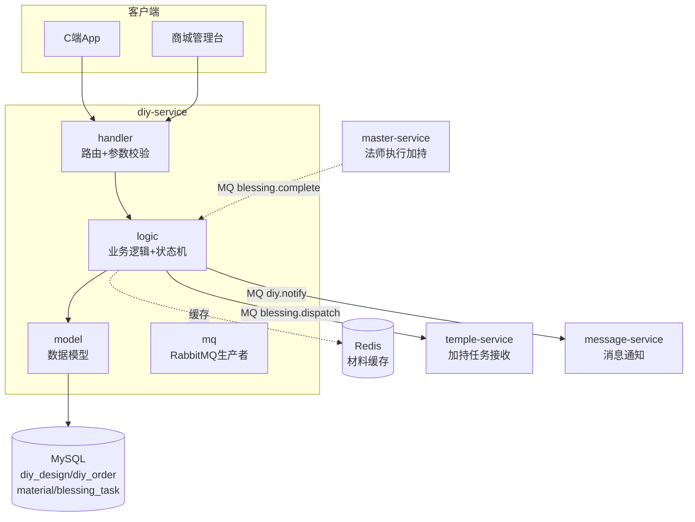
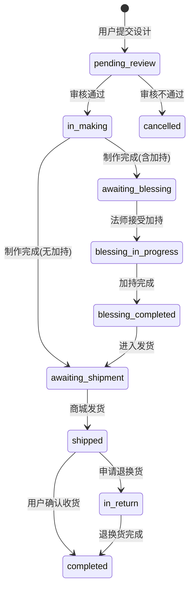
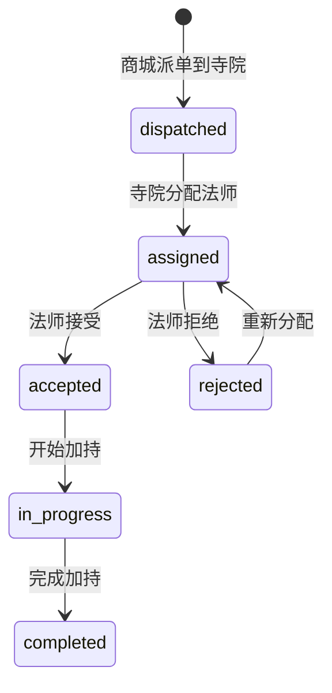

# diy-service DIY手串服务设计文档

> **文档版本**: v1.3
> **创建日期**: 2026-07-01
> **服务端口**: 8088
> **业务域**: 商城业务域
> **关联文档**: [技术架构](../技术架构.md) | [API规范](../API规范.md) | [状态机](../状态机.md) | [业务流程](../业务流程.md) | [统一数据字典](../../standards/统一数据字典.md)

---

## 1. 服务职责

diy-service 负责DIY手串全流程管理，包括：
- DIY设计（保存/广场展示/详情）
- 材料库管理（材料CRUD/分类筛选）
- DIY订单（创建/列表/详情/状态流转）
- 设计广场作品直接下单（服务端按材料 ID/SKU 重定价并保存快照）
- 设计作者收益记录（默认分成 0%，支付成功后进入待结算）
- 加持任务派发（MQ通知寺院/法师）
- 加持服务管理（4项加持服务，对应 extra_service 表）
- 与 temple-service / master-service 通过 MQ 协同完成加持

---

## 2. 架构图



---

## 3. 数据表设计

### 3.1 diy_design（DIY设计表）

| 字段 | 类型 | 说明 |
|------|------|------|
| id | BIGINT AUTO_INCREMENT | 主键 |
| design_no | VARCHAR(32) | 设计编号 |
| user_id | VARCHAR(32) | 用户ID |
| name | VARCHAR(128) | 设计名称 |
| design_data | TEXT | v1/v2 设计文档 JSON；v2 含有序珠位和聚合计价项 |
| total_price | DECIMAL(10,2) | 客户端保存时的展示预估，不作为订单最终价 |
| status | VARCHAR(16) | private/public/pending_review/approved/rejected |
| bless_service_code | VARCHAR(32) | 加持服务编码 |
| create_time | DATETIME | 创建时间 |

#### 3.1.1 设计文档 v2

```json
{
  "version": 2,
  "wristSizeMm": 160,
  "fitAllowanceMm": 5,
  "beads": [
    {
      "slotId": "slot-1",
      "position": 0,
      "materialId": 2,
      "skuId": null,
      "materialName": "星月菩提",
      "spec": "10mm",
      "unitPrice": 18,
      "subtype": "main_bead",
      "image": "/assets/materials/bodhi.jpg",
      "diameterMm": 10
    }
  ],
  "cord": { "materialId": 14, "quantity": 1, "subtype": "cord" },
  "items": [
    { "materialId": 2, "spec": "10mm", "unitPrice": 18, "quantity": 12, "subtype": "main_bead" },
    { "materialId": 14, "spec": "", "unitPrice": 2, "quantity": 1, "subtype": "cord" }
  ]
}
```

`beads` 是客户端恢复、旋转和拖动换位的权威顺序，`items` 是当前设计广场下单解析器使用的聚合投影。旧版直接数组及 `{materials:[...]}` 仍可下单；iOS 编辑时会迁移为 v2。保存设计只持久化快照，客户端负责实时渲染和本地预估；创建订单时服务端忽略文档里的单价并重新查询材料/SKU、状态和库存。

### 3.2 diy_order（DIY订单表）

| 字段 | 类型 | 说明 |
|------|------|------|
| id | BIGINT AUTO_INCREMENT | 主键 |
| order_no | VARCHAR(32) | 订单编号 |
| user_id | VARCHAR(32) | 用户ID |
| design_id | BIGINT | 设计ID |
| material_fee | DECIMAL(10,2) | 材料费 |
| bless_fee | DECIMAL(10,2) | 加持费 |
| total_fee | DECIMAL(10,2) | 总金额 |
| status | VARCHAR(32) | 见状态机 |
| payment_status | VARCHAR(16) | pending/success/refunded，与审核制作状态独立 |
| address_id | BIGINT | 收货地址ID |
| source | VARCHAR(16) | custom/design_square |
| creator_id | VARCHAR(64) | 设计作者ID |
| creator_share_rate | DECIMAL(7,6) | 下单时作者分成比例快照，默认0 |
| original_material_fee | DECIMAL(10,2) | 设计展示材料费 |
| price_changed | TINYINT | 最终价是否变化 |
| design_snapshot | LONGTEXT | 不可变设计快照JSON |
| pricing_snapshot | LONGTEXT | 不可变最终计价快照JSON |
| create_time | DATETIME | 创建时间 |

### 3.3 diy_order_item（DIY订单明细表）

| 字段 | 类型 | 说明 |
|------|------|------|
| id | BIGINT AUTO_INCREMENT | 主键 |
| order_id | BIGINT | 订单ID |
| material_id | BIGINT | 材料ID |
| sku_id | BIGINT | 最终采用的材料SKU ID，无SKU时为0 |
| material_name | VARCHAR(64) | 材料名称 |
| spec | VARCHAR(64) | 规格 |
| unit_price | DECIMAL(10,2) | 单价 |
| quantity | INT | 数量 |
| subtype | VARCHAR(32) | 子类型 |

### 3.4 material（材料表）

| 字段 | 类型 | 说明 |
|------|------|------|
| id | BIGINT AUTO_INCREMENT | 主键 |
| name | VARCHAR(64) | 材料名称 |
| spec | VARCHAR(64) | 规格 |
| unit_price | DECIMAL(10,2) | 单价 |
| unit | VARCHAR(16) | 单位（颗/个/根） |
| category | VARCHAR(32) | main_bead/spacer/buddha_head/pendant/tassel/three_way/cord |
| five_elements | VARCHAR(16) | 五行属性 |
| material_type | VARCHAR(32) | 材质大类：crystal/jade/gemstone/wood/seed/organic/metal/ceramic/glass/textile/cord |
| shape | VARCHAR(32) | 圆珠、切面、桶珠、隔片、三通、佛头、吊坠、流苏或绳线造型 |
| diameter_mm | DECIMAL(5,2) | 前端渲染直径，单位 mm |
| color_hex | VARCHAR(16) | 无图片或 3D 渲染使用的主色 |
| texture_key | VARCHAR(32) | 晶体、玉纹、木纹、菩提、玛瑙、琥珀、青花、景泰蓝等纹理键 |
| finish | VARCHAR(32) | 抛光、哑光、切面、自然面、雕刻、拉丝、编织或釉面 |
| translucency | DECIMAL(4,3) | 通透度，范围 0~1 |
| image | VARCHAR(512) | 图片URL |
| stock | INT | 库存 |
| status | VARCHAR(16) | on_shelf/off_shelf |

商城管理台是材料名称、图片、样式、上下架、价格和库存的唯一运营入口。创建或更新材料会在同一事务中同步默认 `material_sku`；H5 与 iOS 读取材料接口后按上述字段渲染，并把样式保存到设计快照。当前目录初始化为 45 项东方材料和配件，不限于水晶。

### 3.5 material_sku（材料规格表）

| 字段 | 类型 | 说明 |
|------|------|------|
| id | BIGINT AUTO_INCREMENT | 主键 |
| material_id | BIGINT | 材料ID |
| spec | VARCHAR(64) | 规格 |
| price | DECIMAL(10,2) | 价格 |
| stock | INT | 库存 |

### 3.6 blessing_task（加持任务表）

| 字段 | 类型 | 说明 |
|------|------|------|
| id | BIGINT AUTO_INCREMENT | 主键 |
| task_no | VARCHAR(32) | 任务编号 |
| diy_order_id | BIGINT | DIY订单ID |
| temple_code | VARCHAR(32) | 寺院编码 |
| master_code | VARCHAR(32) | 法师编码 |
| status | VARCHAR(16) | 见加持任务状态机 |
| certificate_urls | TEXT | 凭证URL JSON |
| assign_time | DATETIME | 分配时间 |
| complete_time | DATETIME | 完成时间 |

### 3.7 diy_config / diy_creator_earning

`diy_config` 保存可运营配置，`diy_design_creator_share` 取值范围为 0-1，默认 `0`。`diy_creator_earning` 在设计广场订单支付成功后幂等生成，保存订单、设计、作者、支付单、计提基数、比例、收益金额与 `pending` 待结算状态；自主设计订单不生成作者收益。

---

## 4. 接口清单

### 4.1 C端接口

| 方法 | 路径 | 说明 | 角色 |
|------|------|------|------|
| GET | /api/v1/diy/designs | 设计广场列表 | customer |
| POST | /api/v1/diy/designs | 保存设计 | customer |
| GET | /api/v1/diy/designs/:id | 设计详情 | customer |
| POST | /api/v1/diy/designs/:id/order | 从设计广场作品直接下单，返回最终计价与快照 | customer |
| GET | /api/v1/diy/materials | 材料库列表 | customer |
| POST | /api/v1/diy/orders | 创建DIY订单 | customer |
| GET | /api/v1/diy/orders | 我的DIY订单列表 | customer |
| GET | /api/v1/diy/orders/:id | DIY订单详情（含加持进度） | customer |
| GET | /api/v1/diy/blessing-services | 当前已上架加持服务和展示价格 | customer |

### 4.2 商城台接口（需鉴权）

| 方法 | 路径 | 说明 | 角色 |
|------|------|------|------|
| GET | /api/v1/admin/diy/orders | DIY订单管理列表 | shop_admin |
| GET | /api/v1/admin/diy/orders/:id | DIY订单详情 | shop_admin |
| PUT | /api/v1/admin/diy/orders/:id/review | 审核设计（approve/reject） | shop_admin |
| PUT | /api/v1/admin/diy/orders/:id/make-complete | 制作完成 | shop_admin |
| PUT | /api/v1/admin/diy/orders/:id/ship | 发货 | shop_admin |
| GET | /api/v1/admin/diy/materials | 材料管理列表 | shop_admin |
| POST | /api/v1/admin/diy/materials | 创建材料 | shop_admin |
| PUT | /api/v1/admin/diy/materials/:id | 更新材料 | shop_admin |
| PUT | /api/v1/admin/diy/materials/:id/status | 材料上下架 | shop_admin |
| GET | /api/v1/admin/diy/blessing-services | 加持服务列表 | shop_admin |

---

## 5. 状态机

### 5.1 DIY订单状态机

详见 [状态机.md 第2节](../状态机.md#2-diy-手串订单状态机diy-service)



### 5.2 加持任务状态机

详见 [状态机.md 第3节](../状态机.md#3-加持任务状态机diy-service--temple-service--master-service-协同)



---

## 6. 业务逻辑要点

1. **设计广场**：仅展示 `public` 状态的设计
2. **材料分类**：7类（主珠/隔片/佛头/吊坠/流苏/三通/绳线），参照统一数据字典
3. **加持服务**：商城台可维护 `extra_service`；C 端只展示已上架项，下单时服务端再次按服务编码锁定并计价
4. **订单创建**：用户提交设计 → status=pending_review → 等待商城审核
   - 自主设计下单走 `POST /api/v1/diy/orders`，请求体必须带 `items`
   - 设计广场直接下单走 `POST /api/v1/diy/designs/:id/order`，后端从 `diy_design.design_data` 解析材料 ID/规格/数量，仅允许 `public` / `approved` 设计
   - 服务端在同一数据库事务中锁定材料与 SKU，重新查询价格、上下架状态和库存；客户端 `unitPrice` 与设计展示价不参与最终计费
   - 订单、明细、库存扣减和不可变设计/计价快照同事务提交，任一失败完整回滚
5. **支付与作者收益**：payment-service 按订单号校验所属用户、`pending_review` 状态和最终金额；支付成功事件为设计广场订单幂等生成待结算作者收益，默认比例 `0%`，不越过商城审核改变订单状态
6. **审核流程**：支付成功后订单仍为 `pending_review`；商城 approve → `in_making`，reject → `cancelled`，订单状态变更与材料/SKU库存归还同事务完成；已支付订单另走退款流程
7. **制作完成**：使用下单时的不可变设计快照判断加持；订单状态、服务上架校验和 `blessing_task` 创建在同一事务内提交
8. **加持协同**：发 MQ `blessing.dispatch` 到 temple-service；接收 `blessing.complete` 回传更新状态
9. **发货**：填物流单号 → shipped → MQ通知用户
10. **自动收货**：shipped 超过7天自动 completed
11. **退换货期限**：completed 后7天内可申请退换货
12. **实时编辑**：C 端使用 SwiftUI 2.5D 圆环渲染有序珠位，支持旋转、拖动换位/删除、撤销/重做、手围松紧提示和本机草稿恢复；显示金额是本地预估，订单响应是最终计价

---

## 7. 依赖关系

| 依赖类型 | 依赖服务 | 说明 |
|---------|---------|------|
| MQ → | temple-service | blessing.dispatch 派单 |
| MQ ← | master-service | blessing.complete 回传 |
| MQ → | message-service | diy.notify 状态通知 |
| RPC | product-service | 查关联商品（如材料共享） |
| MySQL | askxuan_diy 库 | diy_design/diy_order/diy_order_item/material/material_sku/blessing_task/diy_config/diy_creator_earning |
| Redis | 本地 | 材料库缓存 |
| etcd | 服务注册 | 服务发现 |

---

## 版本记录

| 版本 | 日期 | 说明 |
|------|------|------|
| v1.2 | 2026-07-13 | 设计广场下单服务端重定价、事务快照、支付校验与作者收益 |
| v1.1 | 2026-07-09 | 对齐 App 改进原型：新增设计广场作品直接下单接口 |
| v1.0 | 2026-07-01 | 初始版本：DIY设计/材料/订单/加持任务 骨架设计 |
