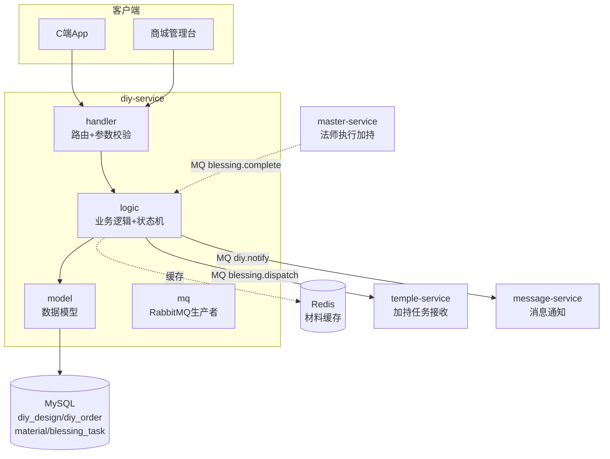
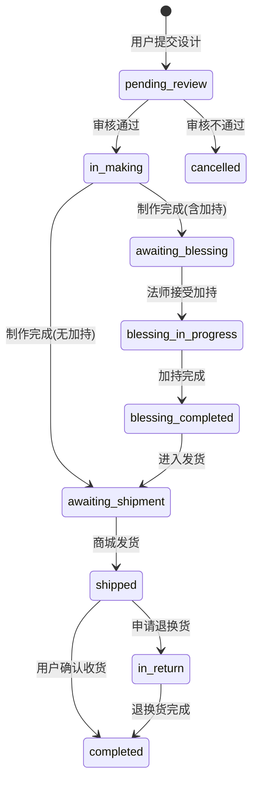
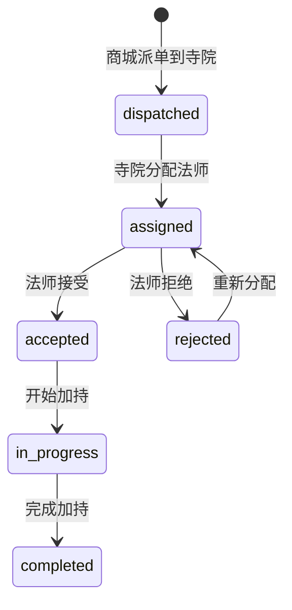

# diy-service DIY手串服务设计文档

> **文档版本**: v1.1
> **创建日期**: 2026-07-01
> **服务端口**: 8088
> **业务域**: 商城业务域
> **关联文档**: [技术架构](../技术架构.md) | [API规范](../API规范.md) | [状态机](../状态机.md) | [业务流程](../业务流程.md) | [统一数据字典](../../standards/统一数据字典.md)

---

## 1. 服务职责

diy-service 负责DIY手串全流程管理，包括：
- DIY设计（保存/广场展示/详情）
- 材料库管理（材料CRUD/分类筛选）
- DIY订单（创建/列表/详情/状态流转）
- 设计广场作品直接下单（复用公开设计的材料配置）
- 加持任务派发（MQ通知寺院/法师）
- 加持服务管理（4项加持服务，对应 extra_service 表）
- 与 temple-service / master-service 通过 MQ 协同完成加持

---

## 2. 架构图

---

## 3. 数据表设计

### 3.1 diy_design（DIY设计表）

| 字段 | 类型 | 说明 |
|------|------|------|
| id | BIGINT AUTO_INCREMENT | 主键 |
| design_no | VARCHAR(32) | 设计编号 |
| user_id | VARCHAR(32) | 用户ID |
| name | VARCHAR(128) | 设计名称 |
| design_data | TEXT | 材料配置JSON |
| total_price | DECIMAL(10,2) | 总价 |
| status | VARCHAR(16) | private/public/pending_review/approved/rejected |
| bless_service_code | VARCHAR(32) | 加持服务编码 |
| create_time | DATETIME | 创建时间 |

### 3.2 diy_order（DIY订单表）

| 字段 | 类型 | 说明 |
|------|------|------|
| id | BIGINT AUTO_INCREMENT | 主键 |
| order_no | VARCHAR(32) | 订单编号 |
| user_id | VARCHAR(32) | 用户ID |
| design_id | BIGINT | 设计ID |
| material_fee | DECIMAL(10,2) | 材料费 |
| bless_fee | DECIMAL(10,2) | 加持费 |
| total_fee | DECIMAL(10,2) | 总金额 |
| status | VARCHAR(32) | 见状态机 |
| address_id | BIGINT | 收货地址ID |
| create_time | DATETIME | 创建时间 |

### 3.3 diy_order_item（DIY订单明细表）

| 字段 | 类型 | 说明 |
|------|------|------|
| id | BIGINT AUTO_INCREMENT | 主键 |
| order_id | BIGINT | 订单ID |
| material_id | BIGINT | 材料ID |
| material_name | VARCHAR(64) | 材料名称 |
| spec | VARCHAR(64) | 规格 |
| unit_price | DECIMAL(10,2) | 单价 |
| quantity | INT | 数量 |
| subtype | VARCHAR(32) | 子类型 |

### 3.4 material（材料表）

| 字段 | 类型 | 说明 |
|------|------|------|
| id | BIGINT AUTO_INCREMENT | 主键 |
| name | VARCHAR(64) | 材料名称 |
| spec | VARCHAR(64) | 规格 |
| unit_price | DECIMAL(10,2) | 单价 |
| unit | VARCHAR(16) | 单位（颗/个/根） |
| category | VARCHAR(32) | main_bead/spacer/buddha_head/pendant/tassel/three_way/cord |
| five_elements | VARCHAR(16) | 五行属性 |
| image | VARCHAR(512) | 图片URL |
| stock | INT | 库存 |
| status | VARCHAR(16) | on_shelf/off_shelf |

### 3.5 material_sku（材料规格表）

| 字段 | 类型 | 说明 |
|------|------|------|
| id | BIGINT AUTO_INCREMENT | 主键 |
| material_id | BIGINT | 材料ID |
| spec | VARCHAR(64) | 规格 |
| price | DECIMAL(10,2) | 价格 |
| stock | INT | 库存 |

### 3.6 blessing_task（加持任务表）

| 字段 | 类型 | 说明 |
|------|------|------|
| id | BIGINT AUTO_INCREMENT | 主键 |
| task_no | VARCHAR(32) | 任务编号 |
| diy_order_id | BIGINT | DIY订单ID |
| temple_code | VARCHAR(32) | 寺院编码 |
| master_code | VARCHAR(32) | 法师编码 |
| status | VARCHAR(16) | 见加持任务状态机 |
| certificate_urls | TEXT | 凭证URL JSON |
| assign_time | DATETIME | 分配时间 |
| complete_time | DATETIME | 完成时间 |

---

## 4. 接口清单

### 4.1 C端接口

| 方法 | 路径 | 说明 | 角色 |
|------|------|------|------|
| GET | /api/v1/diy/designs | 设计广场列表 | customer |
| POST | /api/v1/diy/designs | 保存设计 | customer |
| GET | /api/v1/diy/designs/:id | 设计详情 | customer |
| POST | /api/v1/diy/designs/:id/order | 从设计广场作品直接下单 | customer |
| GET | /api/v1/diy/materials | 材料库列表 | customer |
| POST | /api/v1/diy/orders | 创建DIY订单 | customer |
| GET | /api/v1/diy/orders | 我的DIY订单列表 | customer |
| GET | /api/v1/diy/orders/:id | DIY订单详情（含加持进度） | customer |

### 4.2 商城台接口（需鉴权）

| 方法 | 路径 | 说明 | 角色 |
|------|------|------|------|
| GET | /api/v1/admin/diy/orders | DIY订单管理列表 | shop_admin |
| GET | /api/v1/admin/diy/orders/:id | DIY订单详情 | shop_admin |
| PUT | /api/v1/admin/diy/orders/:id/review | 审核设计（approve/reject） | shop_admin |
| PUT | /api/v1/admin/diy/orders/:id/make-complete | 制作完成 | shop_admin |
| PUT | /api/v1/admin/diy/orders/:id/ship | 发货 | shop_admin |
| GET | /api/v1/admin/diy/materials | 材料管理列表 | shop_admin |
| POST | /api/v1/admin/diy/materials | 创建材料 | shop_admin |
| PUT | /api/v1/admin/diy/materials/:id | 更新材料 | shop_admin |
| PUT | /api/v1/admin/diy/materials/:id/status | 材料上下架 | shop_admin |
| GET | /api/v1/admin/diy/blessing-services | 加持服务列表 | shop_admin |

---

## 5. 状态机

### 5.1 DIY订单状态机

详见 [状态机.md 第2节](../状态机.md#2-diy-手串订单状态机diy-service)

### 5.2 加持任务状态机

详见 [状态机.md 第3节](../状态机.md#3-加持任务状态机diy-service--temple-service--master-service-协同)

---

## 6. 业务逻辑要点

1. **设计广场**：仅展示 `public` 状态的设计
2. **材料分类**：7类（主珠/隔片/佛头/吊坠/流苏/三通/绳线），参照统一数据字典
3. **加持服务**：4项固定服务（E001-E004），价格必须精确匹配统一数据字典
4. **订单创建**：用户提交设计 → status=pending_review → 等待商城审核
   - 自主设计下单走 `POST /api/v1/diy/orders`，请求体必须带 `items`
   - 设计广场直接下单走 `POST /api/v1/diy/designs/:id/order`，后端从 `diy_design.design_data` 解析 `items`，仅允许 `public` / `approved` 设计
5. **审核流程**：approve → in_making；reject → cancelled（触发退款）
6. **制作完成**：含加持 → awaiting_blessing（创建 blessing_task + MQ派单）；无加持 → awaiting_shipment
7. **加持协同**：发 MQ `blessing.dispatch` 到 temple-service；接收 `blessing.complete` 回传更新状态
8. **发货**：填物流单号 → shipped → MQ通知用户
9. **自动收货**：shipped 超过7天自动 completed
10. **退换货期限**：completed 后7天内可申请退换货

---

## 7. 依赖关系

| 依赖类型 | 依赖服务 | 说明 |
|---------|---------|------|
| MQ → | temple-service | blessing.dispatch 派单 |
| MQ ← | master-service | blessing.complete 回传 |
| MQ → | message-service | diy.notify 状态通知 |
| RPC | product-service | 查关联商品（如材料共享） |
| MySQL | askxuan_diy 库 | diy_design/diy_order/diy_order_item/material/material_sku/blessing_task |
| Redis | 本地 | 材料库缓存 |
| etcd | 服务注册 | 服务发现 |

---

## 版本记录

| 版本 | 日期 | 说明 |
|------|------|------|
| v1.1 | 2026-07-09 | 对齐 App 改进原型：新增设计广场作品直接下单接口 |
| v1.0 | 2026-07-01 | 初始版本：DIY设计/材料/订单/加持任务 骨架设计 |
