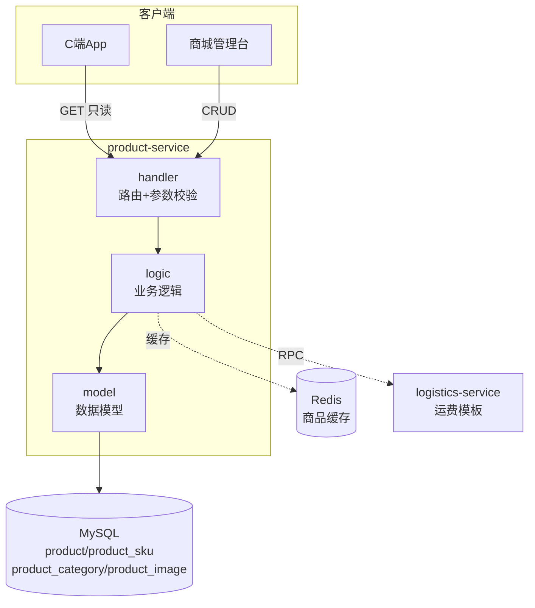
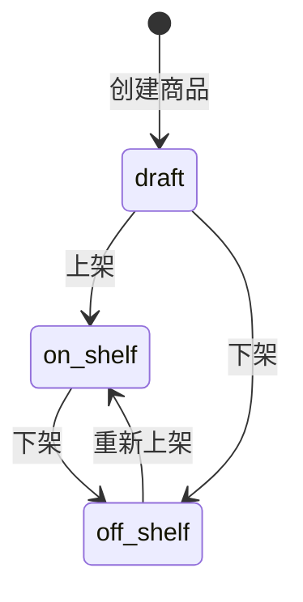

# product-service 商品服务设计文档

> **文档版本**: v1.0
> **创建日期**: 2026-07-01
> **服务端口**: 8086
> **业务域**: 商城业务域
> **关联文档**: [技术架构](../技术架构.md) | [API规范](../API规范.md) | [状态机](../状态机.md) | [业务流程](../业务流程.md)

---

## 1. 服务职责

product-service 负责商城商品全生命周期管理，包括：
- 商品 CRUD（创建/查询/更新/删除）
- SKU 规格管理（多规格商品）
- 商品分类管理（树形结构）
- 商品上下架状态管理
- 商品图片管理（主图/详情图）
- C端商品浏览（列表/详情/分类树）

---

## 2. 架构图

---

## 3. 数据表设计

### 3.1 product（商品表）

| 字段 | 类型 | 说明 |
|------|------|------|
| id | BIGINT AUTO_INCREMENT | 主键 |
| product_no | VARCHAR(32) | 商品编号（P + 日期 + 序号） |
| name | VARCHAR(128) | 商品名称 |
| category_id | BIGINT | 分类ID |
| description | TEXT | 商品描述 |
| main_image | VARCHAR(512) | 主图URL |
| status | VARCHAR(16) | 状态：draft/on_shelf/off_shelf |
| price | DECIMAL(10,2) | 售价 |
| market_price | DECIMAL(10,2) | 划线价 |
| stock | INT | 库存 |
| tags | VARCHAR(256) | 标签（逗号分隔） |
| freight_template_id | BIGINT | 运费模板ID |
| create_time | DATETIME | 创建时间 |
| update_time | DATETIME | 更新时间 |

### 3.2 product_sku（商品规格表）

| 字段 | 类型 | 说明 |
|------|------|------|
| id | BIGINT AUTO_INCREMENT | 主键 |
| product_id | BIGINT | 商品ID |
| spec_name | VARCHAR(64) | 规格名（如"颜色"） |
| spec_value | VARCHAR(128) | 规格值（如"红色"） |
| price | DECIMAL(10,2) | SKU价格 |
| stock | INT | SKU库存 |
| sku_no | VARCHAR(32) | SKU编号 |

### 3.3 product_category（商品分类表）

| 字段 | 类型 | 说明 |
|------|------|------|
| id | BIGINT AUTO_INCREMENT | 主键 |
| parent_id | BIGINT | 父分类ID（0为根） |
| name | VARCHAR(64) | 分类名称 |
| level | INT | 层级（1/2/3） |
| sort | INT | 排序值 |

### 3.4 product_image（商品图片表）

| 字段 | 类型 | 说明 |
|------|------|------|
| id | BIGINT AUTO_INCREMENT | 主键 |
| product_id | BIGINT | 商品ID |
| image_url | VARCHAR(512) | 图片URL |
| sort | INT | 排序值 |
| type | VARCHAR(16) | 类型：main/detail |

---

## 4. 接口清单

### 4.1 C端接口（只读，无需鉴权）

| 方法 | 路径 | 说明 | 请求参数 | 响应 | 角色 |
|------|------|------|---------|------|------|
| GET | /api/v1/products | 商品列表 | categoryId, keyword, page, size | CustomerProductListResp | customer |
| GET | /api/v1/products/:id | 商品详情（含SKU/图片） | id | Product | customer |
| GET | /api/v1/products/categories | 分类树 | - | CustomerCategoryTreeResp | customer |

### 4.2 商城台接口（需鉴权）

| 方法 | 路径 | 说明 | 请求参数 | 响应 | 角色 |
|------|------|------|---------|------|------|
| GET | /api/v1/admin/products | 管理列表（含草稿/下架） | categoryId, keyword, status, page, size | AdminProductListResp | shop_admin |
| POST | /api/v1/admin/products | 创建商品 | AdminProductCreateReq | AdminProductCreateResp | shop_admin |
| GET | /api/v1/admin/products/:id | 商品详情 | id | Product | shop_admin |
| PUT | /api/v1/admin/products/:id | 更新商品 | AdminProductUpdateReq | Product | shop_admin |
| DELETE | /api/v1/admin/products/:id | 删除商品 | id | - | shop_admin |
| PUT | /api/v1/admin/products/:id/status | 上下架 | status | AdminProductStatusResp | shop_admin |
| POST | /api/v1/admin/products/:id/skus | 添加SKU | AdminSkuCreateReq | AdminSkuCreateResp | shop_admin |
| PUT | /api/v1/admin/products/:id/skus/:skuId | 更新SKU | AdminSkuUpdateReq | ProductSku | shop_admin |
| GET | /api/v1/admin/products/categories | 分类列表 | parentId, page, size | AdminCategoryListResp | shop_admin |
| POST | /api/v1/admin/products/categories | 创建分类 | AdminCategoryCreateReq | AdminCategoryCreateResp | shop_admin |
| PUT | /api/v1/admin/products/categories/:id | 更新分类 | AdminCategoryUpdateReq | ProductCategory | shop_admin |
| DELETE | /api/v1/admin/products/categories/:id | 删除分类 | id | - | shop_admin |

---

## 5. 商品状态机

| 状态 | 中文名 | 说明 |
|------|--------|------|
| draft | 草稿 | 新建商品默认状态 |
| on_shelf | 上架 | C端可见可购买 |
| off_shelf | 下架 | C端不可见 |

---

## 6. 业务逻辑要点

1. **商品编号生成**：格式 `P` + `yyyyMMdd` + 3位序号，如 `P20260701001`
2. **C端列表**：仅返回 `on_shelf` 状态商品
3. **管理台列表**：返回所有状态商品（含草稿/下架）
4. **商品详情**：同时返回 SKU 列表和图片列表
5. **库存管理**：商品总库存 = 各 SKU 库存之和（有 SKU 时）
6. **分类树**：支持三级分类，按 sort 排序
7. **删除限制**：`on_shelf` 状态商品不可直接删除，需先下架
8. **缓存策略**：C端商品列表和详情使用 Redis 缓存，上下架时清除缓存

---

## 7. 依赖关系

| 依赖类型 | 依赖服务 | 说明 |
|---------|---------|------|
| RPC | logistics-service | 查询运费模板计算运费 |
| MySQL | askxuan_shop 库 | product/product_sku/product_category/product_image 表 |
| Redis | 本地 | 商品列表/详情缓存 |
| etcd | 服务注册 | 服务发现 |

---

## 版本记录

| 版本 | 日期 | 说明 |
|------|------|------|
| v1.0 | 2026-07-01 | 初始版本：商品/SKU/分类/图片 骨架设计 |
