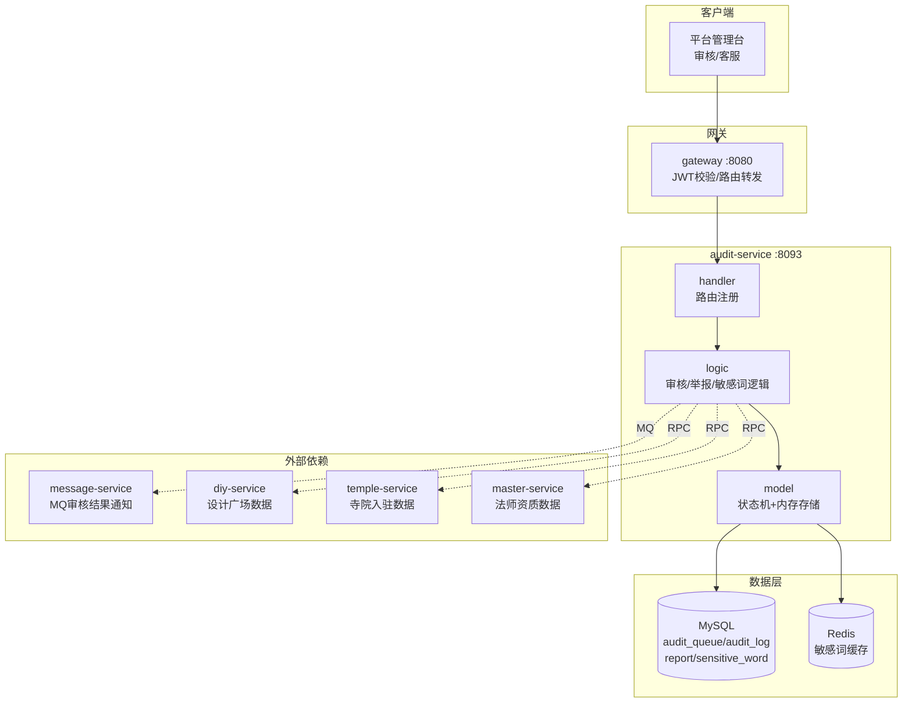

# audit-service 审核服务设计文档

> **文档版本**: v1.0
> **创建日期**: 2026-07-01
> **服务端口**: 8093
> **业务域**: 平台支撑域
> **关联文档**: [技术架构](../技术架构.md) | [状态机](../状态机.md) | [业务流程](../业务流程.md) | [API规范](../API规范.md) | [管理端架构](../../product/管理端架构.md)

---

## 1. 服务职责

audit-service 是问玄东方平台的内容审核与合规管理中枢，覆盖全平台内容安全。核心职责包括：

- **设计广场审核**：审核用户提交的DIY手串设计（合规性、侵权检查）
- **评论审核**：机器预审 + 人工复审用户评论
- **寺院入驻审核**：审核寺院入驻申请（初审→终审）
- **法师资质审核**：审核法师入驻资质（身份证明、法师证明、寺院推荐信）
- **举报处理**：处理用户举报的内容（设计/评论/法师/寺院）
- **敏感词管理**：维护敏感词库，自动拦截违规内容

详细业务说明参见 [管理端架构 3.4.5 内容审核](../../product/管理端架构.md)。

---

## 2. 架构图



---

## 3. 数据表设计

### 3.1 audit_queue（审核队列）

| 字段 | 类型 | 说明 |
|------|------|------|
| id | bigint PK | 主键 |
| biz_type | varchar(16) | 业务类型：design/temple/master/comment |
| biz_id | varchar(32) | 业务ID |
| submitter_id | varchar(16) | 提交者ID |
| content_snapshot | text | 内容快照（JSON） |
| status | varchar(16) | 状态：pending/approved/rejected（设计）；pending/first_pass/final_pass/rejected（寺院）；pending/verified/rejected（法师） |
| auditor_id | varchar(16) | 审核人ID |
| audit_time | datetime | 审核时间 |
| audit_remark | varchar(256) | 审核备注 |
| create_time | datetime | 创建时间 |

### 3.2 audit_log（审核日志）

| 字段 | 类型 | 说明 |
|------|------|------|
| id | bigint PK | 主键 |
| audit_id | bigint | 关联审核ID |
| action | varchar(32) | 操作：submit/approve/reject/first_pass/final_pass/verify |
| operator_id | varchar(16) | 操作人ID |
| remark | varchar(256) | 备注 |
| create_time | datetime | 创建时间 |

### 3.3 report（举报）

| 字段 | 类型 | 说明 |
|------|------|------|
| id | bigint PK | 主键 |
| reporter_id | varchar(16) | 举报人ID |
| target_type | varchar(16) | 举报目标类型：design/comment/master/temple |
| target_id | varchar(32) | 目标ID |
| reason | varchar(256) | 举报原因 |
| evidence_urls | json | 证据截图URL数组 |
| status | varchar(16) | 状态：pending/handled/rejected |
| handler_id | varchar(16) | 处理人ID |
| handle_result | varchar(256) | 处理结果 |
| create_time | datetime | 创建时间 |

### 3.4 sensitive_word（敏感词库）

| 字段 | 类型 | 说明 |
|------|------|------|
| id | bigint PK | 主键 |
| word | varchar(64) | 敏感词 |
| category | varchar(32) | 分类：political/religious/vulgar/advertising |
| status | varchar(16) | 状态：enabled/disabled |
| create_time | datetime | 创建时间 |

---

## 4. 接口清单

| # | 方法 | 路径 | 说明 |
|---|------|------|------|
| 1 | GET | /api/v1/admin/audit/queue | 审核队列（按biz_type筛选） |
| 2 | GET | /api/v1/admin/audit/queue/:id | 审核详情 |
| 3 | PUT | /api/v1/admin/audit/queue/:id/approve | 通过审核 |
| 4 | PUT | /api/v1/admin/audit/queue/:id/reject | 驳回审核（需填remark） |
| 5 | GET | /api/v1/admin/audit/reports | 举报列表 |
| 6 | PUT | /api/v1/admin/audit/reports/:id/handle | 处理举报 |
| 7 | GET | /api/v1/admin/audit/sensitive-words | 敏感词库列表 |
| 8 | POST | /api/v1/admin/audit/sensitive-words | 新增敏感词 |
| 9 | DELETE | /api/v1/admin/audit/sensitive-words/:id | 删除敏感词 |
| 10 | GET | /api/v1/admin/audit/statistics | 审核统计 |

---

## 5. 状态机

详见 [状态机.md 第7节 审核状态机](../状态机.md#7-审核状态机audit-service)。

### 5.1 设计广场审核

```
pending → approved（自动发布到广场）
       → rejected（通知用户修改）
rejected → pending（用户修改后重新提交）
```

### 5.2 寺院入驻审核

```
pending → first_pass（初审通过）→ final_pass（终审通过，上线）
       → rejected              → rejected
rejected → pending（修改后重新提交）
```

### 5.3 法师资质审核

```
pending → verified（审核通过，上线）
       → rejected
rejected → pending（补充材料重新提交）
```

### 5.4 举报状态

```
pending → handled（处理完成）
       → rejected（驳回举报）
```

---

## 6. 业务逻辑

### 6.1 审核流程

1. 各业务服务提交审核请求（设计/寺院入驻/法师资质/评论），写入 audit_queue（status=pending）
2. 平台审核员查看审核队列，按 biz_type 筛选
3. 审核通过：更新状态（approved/first_pass/final_pass/verified）+ 写入 audit_log + MQ通知
4. 审核驳回：更新状态为 rejected + 填写 audit_remark + 写入 audit_log + MQ通知
5. 用户修改后重新提交：rejected → pending

### 6.2 举报处理流程

1. 用户/寺院/法师发起举报，写入 report（status=pending）
2. 平台客服查看举报列表
3. 处理举报：handled（处理完成）或 rejected（驳回）
4. 记录 handle_result

### 6.3 敏感词管理

1. 维护敏感词库（增删改查）
2. 敏感词加载到 Redis 缓存，提供高效匹配
3. 新增评论/设计时自动进行敏感词检测

### 6.4 审核统计

- 各类内容审核量
- 通过率
- 平均审核时长

---

## 7. 依赖关系

| 依赖类型 | 依赖服务 | 用途 |
|---------|---------|------|
| RPC | diy-service | 查询设计广场数据 |
| RPC | temple-service | 查询寺院入驻申请 |
| RPC | master-service | 查询法师资质数据 |
| MQ生产 | message-service | 发送 audit.result 审核结果通知 |
| 数据库 | MySQL | audit_queue/audit_log/report/sensitive_word |
| 缓存 | Redis | 敏感词缓存 |

---

## 版本记录

| 版本 | 日期 | 说明 |
|------|------|------|
| v1.0 | 2026-07-01 | 初始版本：审核服务设计 |
