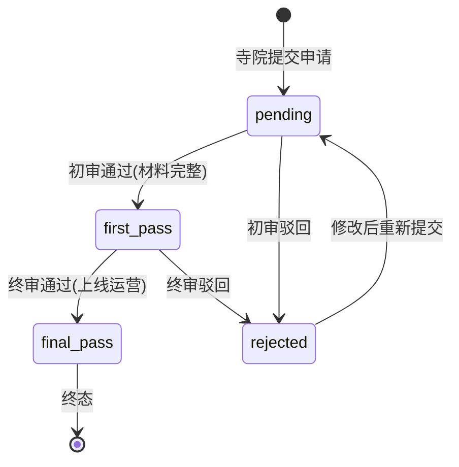
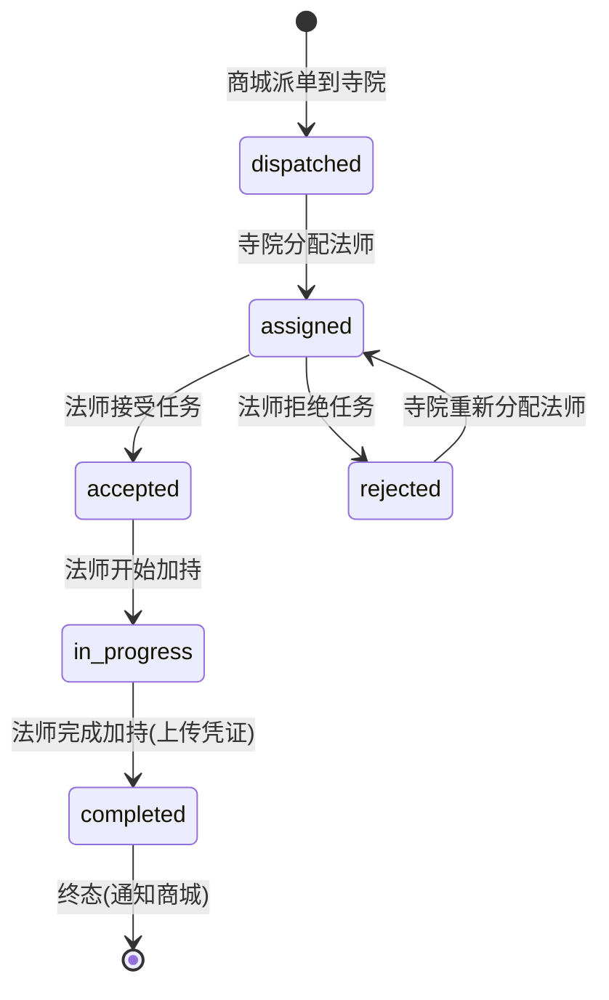

# temple-service 寺院服务设计文档

> **文档版本**: v1.0
> **创建日期**: 2026-07-01
> **服务端口**: 8083
> **业务域**: 核心业务域
> **关联文档**: [技术架构](../技术架构.md) | [API规范](../API规范.md) | [状态机](../状态机.md) | [业务流程](../业务流程.md) | [管理端架构](../../product/管理端架构.md) | [审计报告](../../product/业务逻辑对齐审计报告.md)

---

## 1. 服务职责

temple-service 负责寺院信息、图片、自定义服务、入驻审核与 **加持任务接收**：

- C 端寺院浏览（列表/详情，含图片+服务）
- C 端寺院服务列表
- 寺院管理台：寺院信息编辑、图片管理、服务 CRUD、上下架
- **寺院管理台：加持任务接收与分配法师（修复 Gap-3）**
- 寺院入驻申请提交
- 平台管理台：寺院列表、入驻审核（初审/终审/驳回）、封禁/推荐

> **Gap-3 修复**：新增 `blessing_task` 表与加持任务管理接口，使商城派单的 DIY 加持任务可到达寺院管理台并由寺院分配法师执行。

---

## 2. 架构图

```mermaid
graph TB
    subgraph 客户端
        C1[C端App]
        C2[寺院管理台]
        C5[平台管理台]
    end

    subgraph temple-service
        HANDLER[handler<br/>路由+参数校验]
        LOGIC[logic<br/>寺院/图片/服务/审核/加持任务]
        MODEL[model<br/>temple/temple_image/temple_service<br/>temple_audit/blessing_task]
    end

    GW[gateway]
    DIY[diy-service<br/>MQ派单]
    MASTER[master-service<br/>分配法师]
    MSG[message-service<br/>通知]

    C1 --> GW
    C2 --> GW
    C5 --> GW
    GW --> HANDLER
    HANDLER --> LOGIC
    LOGIC --> MODEL
    DIY -.blessing.dispatch MQ.-> LOGIC
    LOGIC -.blessing.assign MQ.-> MASTER
    LOGIC -.通知.-> MSG
```

---

## 3. 数据表设计

### 3.0 temple（寺院基础表）

> 参照 model/temple.go 的 Temple 结构体

| 字段 | 类型 | 说明 |
|------|------|------|
| id | VARCHAR(16) | 主键（寺院编码 T001~T006） |
| name | VARCHAR(64) | 名称 |
| region | VARCHAR(64) | 地区 |
| type | VARCHAR(32) | 类型：汉传佛教/道教/藏传佛教 |
| sect | VARCHAR(32) | 宗派：禅宗/全真派/格鲁派/正一派 |
| status | VARCHAR(16) | 状态：正常/待审核 |
| address | VARCHAR(256) | 地址 |
| cover_image | VARCHAR(512) | 封面图 URL |
| rating | DECIMAL(2,1) | 评分 |
| description | TEXT | 简介 |
| create_time | DATETIME | 创建时间 |
| update_time | DATETIME | 更新时间 |

### 3.2 temple_image（寺院图片表）

| 字段 | 类型 | 说明 |
|------|------|------|
| id | BIGINT AUTO_INCREMENT | 主键 |
| temple_code | VARCHAR(16) | 寺院编码 |
| url | VARCHAR(512) | 图片 URL |
| type | VARCHAR(16) | 类型：cover/detail/hero |
| sort | INT | 排序值 |
| create_time | DATETIME | 创建时间 |

### 3.3 temple_admin（寺院管理员关联表）

| 字段 | 类型 | 说明 |
|------|------|------|
| id | BIGINT AUTO_INCREMENT | 主键 |
| temple_code | VARCHAR(16) | 寺院编码 |
| account_id | BIGINT | 管理台账号 ID |
| role | VARCHAR(16) | 角色：admin/editor |
| create_time | DATETIME | 创建时间 |

### 3.4 temple_audit（寺院入驻审核表）

> 参照 [状态机 7.2 寺院入驻审核](../状态机.md)

| 字段 | 类型 | 说明 |
|------|------|------|
| id | BIGINT AUTO_INCREMENT | 主键 |
| temple_code | VARCHAR(16) | 寺院编码 |
| applicant_name | VARCHAR(64) | 申请人姓名 |
| contact_phone | VARCHAR(20) | 联系电话 |
| cert_urls | JSON | 资质文件 URL 数组 |
| status | VARCHAR(16) | 状态：pending/first_pass/final_pass/rejected |
| auditor_id | BIGINT | 审核人 ID |
| audit_remark | VARCHAR(256) | 审核备注 |
| create_time | DATETIME | 创建时间 |

### 3.5 temple_service（寺院自定义服务表）

| 字段 | 类型 | 说明 |
|------|------|------|
| id | BIGINT AUTO_INCREMENT | 主键 |
| temple_code | VARCHAR(16) | 寺院编码 |
| service_code | VARCHAR(32) | 服务编码 S001~S007 |
| service_name | VARCHAR(64) | 服务名称 |
| price | DECIMAL(10,2) | 价格 |
| time_slots | JSON | 时段配置 |
| status | VARCHAR(16) | 状态：on_shelf/off_shelf |
| create_time | DATETIME | 创建时间 |

### 3.6 blessing_task（加持任务表）— **修复 Gap-3 核心**

> 参照 [状态机 3 加持任务状态机](../状态机.md)

| 字段 | 类型 | 说明 |
|------|------|------|
| id | BIGINT AUTO_INCREMENT | 主键 |
| task_no | VARCHAR(32) | 任务单号 BT+yyyyMMdd+序号 |
| diy_order_no | VARCHAR(32) | 来源 DIY 订单号 |
| temple_code | VARCHAR(16) | 寺院编码 |
| master_code | VARCHAR(16) | 分配法师编码 |
| status | VARCHAR(16) | 状态：dispatched/assigned/accepted/in_progress/completed/rejected |
| certificate_urls | JSON | 加持凭证 URL 数组 |
| assign_time | DATETIME | 分配法师时间 |
| complete_time | DATETIME | 完成时间 |
| create_time | DATETIME | 创建时间 |

---

## 4. 接口清单

### 4.1 C端接口（公开）

| 方法 | 路径 | 说明 | 请求 | 响应 | 角色 |
|------|------|------|------|------|------|
| GET | /api/v1/temples | 寺院列表（扩展筛选） | ListReq | ListResp | 公开 |
| GET | /api/v1/temples/:id | 寺院详情（含图片+服务） | DetailReq | TempleDetail | 公开 |
| GET | /api/v1/temples/:id/services | 寺院服务列表 | TempleServiceListReq | TempleServiceListResp | 公开 |

### 4.2 寺院管理台接口（需JWT + 寺院管理员）

| 方法 | 路径 | 说明 | 请求 | 响应 | 角色 |
|------|------|------|------|------|------|
| GET | /api/v1/admin/temples/info | 本寺院信息 | - | Temple | temple_admin |
| PUT | /api/v1/admin/temples/info | 编辑寺院信息 | TempleUpdateReq | Temple | temple_admin |
| POST | /api/v1/admin/temples/images | 上传图片 | TempleImageCreateReq | TempleImageCreateResp | temple_admin |
| DELETE | /api/v1/admin/temples/images/:id | 删除图片 | TempleImageDeleteReq | - | temple_admin |
| GET | /api/v1/admin/temples/services | 服务列表 | - | TempleServiceListResp | temple_admin |
| POST | /api/v1/admin/temples/services | 创建服务 | TempleServiceCreateReq | TempleServiceCreateResp | temple_admin |
| PUT | /api/v1/admin/temples/services/:id | 更新服务 | TempleServiceUpdateReq | TempleService | temple_admin |
| PUT | /api/v1/admin/temples/services/:id/status | 服务上下架 | TempleServiceStatusReq | TempleServiceStatusResp | temple_admin |
| GET | /api/v1/admin/temples/blessing-tasks | 加持任务列表 | BlessingTaskListReq | BlessingTaskListResp | temple_admin |
| GET | /api/v1/admin/temples/blessing-tasks/:id | 加持任务详情 | BlessingTaskDetailReq | BlessingTask | temple_admin |
| PUT | /api/v1/admin/temples/blessing-tasks/:id/assign | 分配法师 | BlessingAssignReq | BlessingTask | temple_admin |
| POST | /api/v1/admin/temples/apply | 提交入驻申请 | TempleApplyReq | TempleApplyResp | 公开 |

### 4.3 平台管理台接口（需JWT + 平台超管）

| 方法 | 路径 | 说明 | 请求 | 响应 | 角色 |
|------|------|------|------|------|------|
| GET | /api/v1/admin/platform/temples | 全部寺院 | - | ListResp | platform_super |
| GET | /api/v1/admin/platform/temples/audits | 入驻审核列表 | TempleAuditListReq | TempleAuditListResp | platform_super |
| PUT | /api/v1/admin/platform/temples/audits/:id/first-pass | 初审通过 | TempleAuditActionReq | TempleAudit | platform_super |
| PUT | /api/v1/admin/platform/temples/audits/:id/final-pass | 终审通过 | TempleAuditActionReq | TempleAudit | platform_super |
| PUT | /api/v1/admin/platform/temples/audits/:id/reject | 驳回 | TempleAuditActionReq | TempleAudit | platform_super |
| PUT | /api/v1/admin/platform/temples/:id/status | 封禁/推荐 | TemplePlatformStatusReq | TemplePlatformStatusResp | platform_super |

---

## 5. 状态机

### 5.1 寺院入驻审核（引用 状态机.md 7.2）



### 5.2 加持任务状态机（引用 状态机.md 3，修复 Gap-3）



> 寺院侧关键流转：`dispatched → assigned`（分配法师），后续由 master-service 推进。

---

## 6. 业务逻辑要点

1. **Gap-3 修复**：商城 diy-service 制作完成后发 `blessing.dispatch` MQ 消息，temple-service 消费创建 blessing_task（status=dispatched），寺院管理台在"加持任务"页面查看并分配法师（status=assigned），发 `blessing.assign` MQ 通知 master-service
2. **加持任务分配**：寺院仅能分配本寺院法师；分配后任务进入 assigned，等待法师接受
3. **寺院详情扩展**：返回寺院基础信息 + 图片列表 + 服务列表
4. **图片管理**：封面图(cover)单张，详情图(detail)最多9张，Hero图(hero)单张
5. **服务管理**：寺院自主定价，time_slots 为 JSON 时段配置（如 ["09:00-12:00","13:00-17:00"]）
6. **入驻审核**：初审(first_pass) 校验材料完整性，终审(final_pass) 校验资质真实性并上线
7. **数据隔离**：寺院管理员仅可操作本寺院数据（temple_code 过滤）

---

## 7. 依赖关系

| 依赖类型 | 依赖 | 说明 |
|---------|------|------|
| MQ | diy-service | 消费 blessing.dispatch 接收加持任务 |
| MQ | master-service | 发送 blessing.assign 分配法师 |
| MQ | message-service | 通知寺院管理员/法师 |
| MySQL | temple/temple_image/temple_service/temple_audit/blessing_task | 寺院域数据 |
| RPC | master-service | 校验法师归属 |

---

## 版本记录

| 版本 | 日期 | 说明 |
|------|------|------|
| v1.0 | 2026-07-01 | 扩展管理端 + **修复 Gap-3 加持任务接收与分配** |
