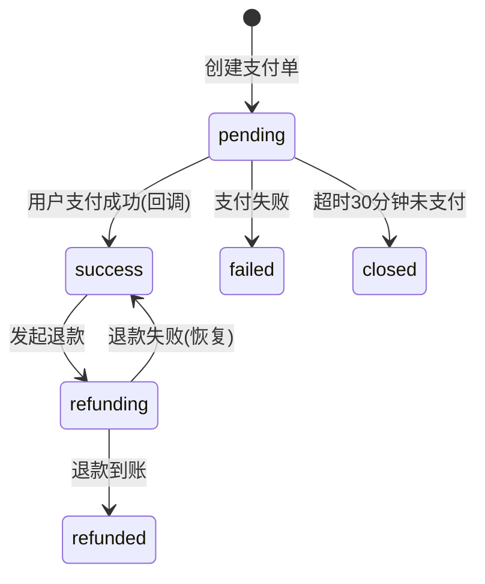

# payment-service 支付服务设计文档

> **文档版本**: v1.1
> **创建日期**: 2026-07-01
> **服务端口**: 8090
> **业务域**: 商城业务域
> **关联文档**: [技术架构](../技术架构.md) | [API规范](../API规范.md) | [状态机](../状态机.md) | [业务流程](../业务流程.md)

---

## 1. 服务职责

payment-service 负责全平台支付与退款管理，包括：
- 微信支付（统一下单/回调处理）
- 支付宝支付（统一下单/回调处理）
- 支付状态查询
- 退款发起与处理
- 支付日志记录（全链路请求/响应）
- MQ 通知（支付成功/退款 → order-service / booking-service / diy-service / finance-service）
- DIY 支付前校验订单所属用户、待支付状态与服务端最终金额

---

## 2. 架构图

```mermaid
graph TB
    subgraph 客户端
        C1[C端App]
    end

    subgraph payment-service
        HANDLER[handler<br/>路由+参数校验]
        LOGIC[logic<br/>业务逻辑+状态机]
        MODEL[model<br/>数据模型]
        MQ[mq<br/>RabbitMQ生产者]
        CHANNEL[支付渠道<br/>微信/支付宝]
    end

    DB[(MySQL<br/>payment/payment_log/refund)]
    REDIS[(Redis<br/>支付单缓存)]
    WX[微信支付API]
    AP[支付宝API]
    ORD[order-service<br/>商城订单]
    BK[booking-service<br/>预约订单]
    DIY[diy-service<br/>DIY订单]
    FIN[finance-service<br/>财务结算]
    MSG[message-service<br/>消息通知]

    C1 --> HANDLER
    WX -->|回调| HANDLER
    AP -->|回调| HANDLER
    HANDLER --> LOGIC
    LOGIC --> MODEL
    MODEL --> DB
    LOGIC -.缓存.-> REDIS
    LOGIC --> CHANNEL
    CHANNEL --> WX
    CHANNEL --> AP
    LOGIC -.MQ payment.notify.-> ORD
    LOGIC -.MQ payment.notify.-> BK
    LOGIC -.MQ payment.notify.-> DIY
    LOGIC -.MQ payment.notify.-> FIN
    LOGIC -.MQ.-> MSG
```

---

## 3. 数据表设计

### 3.1 payment（支付表）

| 字段 | 类型 | 说明 |
|------|------|------|
| id | BIGINT AUTO_INCREMENT | 主键 |
| payment_no | VARCHAR(32) | 支付单号（PAY + 日期 + 序号） |
| order_type | VARCHAR(16) | booking/shop_order/diy_order |
| order_no | VARCHAR(32) | 关联订单编号 |
| amount | DECIMAL(10,2) | 支付金额 |
| channel | VARCHAR(16) | wechat/alipay |
| status | VARCHAR(16) | 见支付状态机 |
| trade_no | VARCHAR(64) | 第三方交易号 |
| create_time | DATETIME | 创建时间 |

### 3.2 payment_log（支付日志表）

| 字段 | 类型 | 说明 |
|------|------|------|
| id | BIGINT AUTO_INCREMENT | 主键 |
| payment_id | BIGINT | 支付单ID |
| action | VARCHAR(32) | 操作类型（create/callback/refund） |
| request | TEXT | 请求内容 |
| response | TEXT | 响应内容 |
| create_time | DATETIME | 创建时间 |

### 3.3 refund（退款表）

| 字段 | 类型 | 说明 |
|------|------|------|
| id | BIGINT AUTO_INCREMENT | 主键 |
| refund_no | VARCHAR(32) | 退款单号 |
| payment_id | BIGINT | 原支付单ID |
| amount | DECIMAL(10,2) | 退款金额 |
| reason | VARCHAR(256) | 退款原因 |
| status | VARCHAR(16) | pending/processing/success/failed |
| create_time | DATETIME | 创建时间 |

---

## 4. 接口清单

### 4.1 C端接口

| 方法 | 路径 | 说明 | 角色 |
|------|------|------|------|
| POST | /api/v1/payments | 创建支付单 | customer |
| GET | /api/v1/payments/:id | 查询支付状态 | customer |

### 4.2 回调接口（公开，无需鉴权）

| 方法 | 路径 | 说明 | 角色 |
|------|------|------|------|
| POST | /api/v1/payments/callback/wechat | 微信支付回调 | 系统公开 |
| POST | /api/v1/payments/callback/alipay | 支付宝回调 | 系统公开 |

### 4.3 内部接口（需鉴权）

| 方法 | 路径 | 说明 | 角色 |
|------|------|------|------|
| POST | /api/v1/payments/refund | 发起退款 | 内部服务 |

---

## 5. 状态机

### 5.1 支付状态机

详见 [状态机.md 第8节](../状态机.md#8-支付状态机payment-service)



---

## 6. 业务逻辑要点

1. **支付单号生成**：格式 `PAY` + `yyyyMMdd` + 6位序号
2. **统一支付入口**：支持 booking/shop_order/diy_order 三种订单类型；`diy_order` 不信任客户端金额，创建支付单前只读 `askxuan_diy.diy_order` 校验订单所属、状态和最终金额
3. **渠道选择**：支持微信支付和支付宝两种渠道
4. **回调处理**：验证签名 → 更新支付状态 → 发 MQ 通知对应业务服务
5. **超时关闭**：pending 超过30分钟自动 closed
6. **退款流程**：创建 refund 记录 → 调第三方退款 API → 更新状态 → 发 MQ 通知
7. **全链路日志**：每次支付/回调/退款操作均记录 payment_log
8. **幂等性**：回调处理需幂等，防止重复通知；fanout 消费端以消费队列名而非 exchange 名作为幂等作用域，确保每个订阅服务都能独立处理同一事件
9. **MQ通知**：支付成功/退款 → 发 `payment.notify` 事件，order-service/booking-service/diy-service/finance-service 消费

---

## 7. 依赖关系

| 依赖类型 | 依赖服务 | 说明 |
|---------|---------|------|
| MQ → | order-service | payment.notify 支付成功通知 |
| MQ → | booking-service | payment.notify 支付成功通知 |
| MQ → | diy-service | payment.notify 支付成功通知 |
| MQ → | finance-service | payment.notify 触发结算 |
| MQ → | message-service | 支付结果通知 |
| HTTP → | 微信支付API | 统一下单/退款/查询 |
| HTTP → | 支付宝API | 统一下单/退款/查询 |
| MySQL | askxuan_payment 库 | payment/payment_log/refund；payment_user 仅额外只读 askxuan_diy.diy_order |
| Redis | 本地 | 支付单缓存/幂等控制 |
| etcd | 服务注册 | 服务发现 |

---

## 版本记录

| 版本 | 日期 | 说明 |
|------|------|------|
| v1.1 | 2026-07-13 | DIY 支付增加订单所属、状态和最终金额校验 |
| v1.0 | 2026-07-01 | 初始版本：微信/支付宝支付/退款 骨架设计 |
