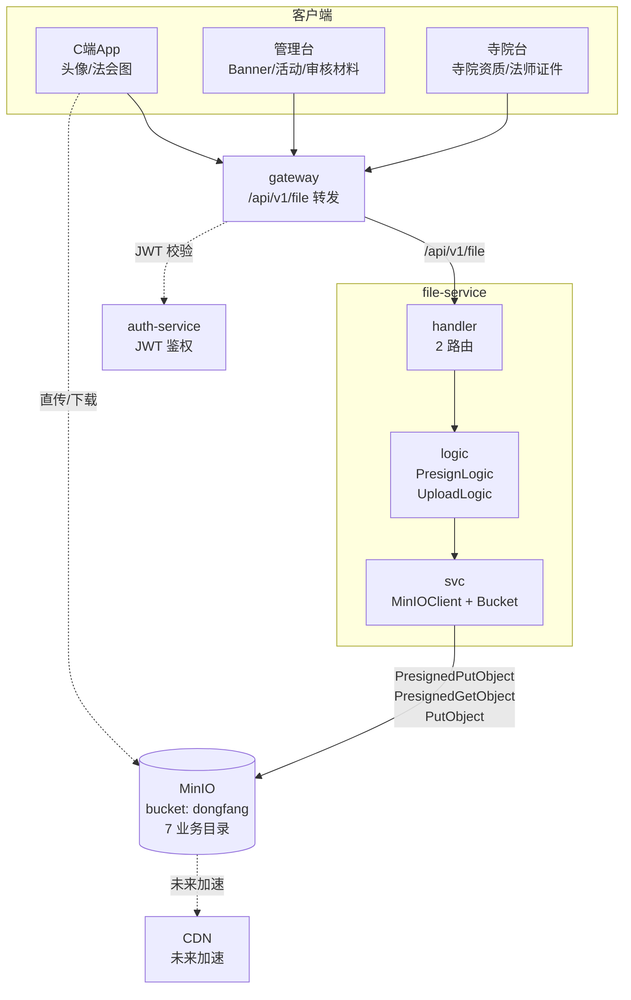

# file-service 文件服务设计文档

> **文档版本**: v1.0
> **创建日期**: 2026-07-01
> **服务端口**: 8097
> **业务域**: 支撑域
> **关联文档**: [技术架构](../技术架构.md) | [API规范](../API规范.md) | [状态机](../状态机.md) | [业务流程](../业务流程.md)

---

## 1. 服务职责

file-service 负责全平台文件上传 / 下载 / 预签名 URL，基于 **MinIO 对象存储**：

- **预签名 URL**（推荐）：C 端 / 管理台先调 `GET /presigned` 拿到上传 URL，前端直传 MinIO，避免大文件经过业务后端
- **后端代传**：小文件场景（如头像）通过 `POST /upload` 走后端 `multipart/form-data` 上传，最大 32MB
- **MinIO Bucket 自动初始化**：服务启动时 `ensureBucket` 幂等创建 `dongfang` bucket，并设置公读策略便于联调
- **业务目录划分**：按 `objectType` 将文件分目录存放，便于权限隔离与生命周期管理
- **文件命名规范**：`{业务目录}/{时间戳}_{原始文件名}`，避免重名并保留可读性

> 现有代码已足够支撑 MVP-4 联调，本文档主要补充业务目录规划 / 命名规范 / 访问权限设计。

---

## 2. 架构图



---

## 3. 数据表设计

> MVP-4 阶段无 DB 表，对象元数据由 MinIO 自身管理。未来如需审计 / 鉴权 / 配额，可补充 `file_meta` 表：

### 3.1 file_meta（文件元数据表，未来）

| 字段 | 类型 | 说明 |
|------|------|------|
| id | BIGINT AUTO_INCREMENT | 主键 |
| object_name | VARCHAR(256) | MinIO 对象名（唯一） |
| bucket | VARCHAR(32) | bucket 名（dongfang） |
| object_type | VARCHAR(16) | 业务目录（temples/masters/...） |
| file_name | VARCHAR(128) | 原始文件名 |
| content_type | VARCHAR(64) | MIME 类型 |
| size | BIGINT | 文件大小（字节） |
| uploader_id | VARCHAR(32) | 上传者 ID |
| uploader_role | VARCHAR(16) | customer/admin/temple/master |
| url | VARCHAR(512) | 可访问 URL |
| created_at | DATETIME | 上传时间 |

---

## 4. 接口清单

### 4.1 现有接口（前缀 `/api/v1/file`）

| 方法 | 路径 | 说明 | 角色 |
|------|------|------|------|
| GET | /presigned | 生成预签名 URL（upload/download 两种） | 全端 |
| POST | /upload | 后端代传（multipart/form-data，字段名 `file`，最大 32MB） | 全端 |

> 共 **2 个路由**，全部公开（网关侧不做鉴权，未来可加 JWT）。

#### 4.1.1 GET /presigned 详解

请求参数（form）：

| 参数 | 类型 | 必填 | 说明 |
|------|------|------|------|
| fileName | string | upload 必填 | 原始文件名（用于生成 objectName） |
| objectType | string | 否 | 业务目录，默认 `temp`（见第 5 节） |
| operate | string | 否 | `upload`（默认）/ `download` |
| objectName | string | download 必填 | 已存在的对象名 |

响应：

```json
{
  "uploadUrl": "http://localhost:9000/dongfang/temples/20260701000000_abc.jpg?X-Amz-...",
  "objectName": "temples/20260701000000_abc.jpg",
  "expiresIn": 900
}
```

#### 4.1.2 POST /upload 详解

请求：`multipart/form-data`，字段名固定为 `file`，最大 32MB。

响应：

```json
{
  "objectName": "temp/20260701000000_avatar.png",
  "url": "http://localhost:9000/dongfang/temp/20260701000000_avatar.png",
  "size": 102400,
  "contentType": "image/png"
}
```

---

## 5. 业务目录规划

按 `objectType` 将文件分目录存放，便于权限隔离、生命周期管理与 CDN 缓存策略：

| objectType | 目录 | 用途 | 上传方 | 访问权限 |
|-----------|------|------|--------|---------|
| `temples` | `temples/` | 寺院图片（外景/法会/资质） | 寺院台 / 管理台 | 公读 |
| `masters` | `masters/` | 法师头像 / 证件照 | 法师台 / 管理台 | 头像公读，证件私有 |
| `booking` | `booking/` | 预约相关材料（如供养凭证） | C 端 / 寺院台 | 私有（预签名下载） |
| `diy` | `diy/` | DIY 商品设计图 / 成品图 | C 端 / 商城台 | 公读 |
| `audit` | `audit/` | 审核材料（身份证 / 营业执照） | 各端上传 | 私有（仅管理台） |
| `avatar` | `avatar/` | C 端用户头像 | C 端 | 公读 |
| `temp` | `temp/` | 临时文件（默认） | 全端 | 公读，TTL 1 天清理 |

### 5.1 目录访问权限设计

- **公读目录**（`temples` / `masters` 头像 / `diy` / `avatar` / `temp`）：bucket 策略允许 `s3:GetObject`，前端可直接通过 URL 访问
- **私有目录**（`masters` 证件 / `booking` / `audit`）：未来通过 bucket policy 拒绝匿名访问，必须走 `GET /presigned?operate=download` 拿临时签名 URL（有效期 15 分钟）
- **联调阶段**：当前 bucket 整体公读，便于前端直接访问；生产环境需按目录细分 policy

### 5.2 生命周期策略（未来）

| 目录 | 策略 |
|------|------|
| `temp/` | 上传 1 天后自动删除 |
| `audit/` | 审核完成后转冷存储 |
| `booking/` | 预约完成后 30 天转冷存储 |
| 其他 | 永久保留 |

---

## 6. 文件命名规范

### 6.1 objectName 生成规则

```
{objectType}/{yyyyMMddHHmmss}_{原始文件名}
```

示例：
- `temples/20260701150000_灵隐寺外景.jpg`
- `avatar/20260701150001_avatar.png`
- `audit/20260701150002_身份证正面.jpg`

### 6.2 实现位置

`internal/logic/presignedlogic.go` 的 `buildObjectName` 函数：

```go
func buildObjectName(objectType, fileName string) string {
    if objectType == "" {
        objectType = "temp"
    }
    ext := filepath.Ext(fileName)
    base := strings.TrimSuffix(fileName, ext)
    stamp := time.Now().Format("20060102150405")
    return fmt.Sprintf("%s/%s_%s%s", objectType, stamp, base, ext)
}
```

### 6.3 命名约定

- 时间戳精确到秒，避免同秒上传重名（如并发可加 userId 后缀）
- 保留原始文件名（含中文），便于运营人工排查
- 扩展名保留，MinIO 通过扩展名 + ContentType 识别类型
- 未来可引入随机 UUID 前缀进一步避免碰撞：`{objectType}/{uuid}_{stamp}_{fileName}`

---

## 7. 业务逻辑要点

1. **预签名优先**：大文件 / 图片 / 视频走 `GET /presigned` 前端直传，避免经过业务后端
2. **后端代传兜底**：小文件 / 需要后端处理的（如缩略图）走 `POST /upload`，最大 32MB
3. **MinIO 容错**：`NewServiceContext` 初始化失败不阻断服务启动，上传时返回 `7001 MinIO 未就绪`
4. **Bucket 自动创建**：启动时 `ensureBucket` 幂等创建 `dongfang` bucket，并设置公读 policy
5. **预签名有效期**：默认 900 秒（15 分钟），可通过 `PresignExpire` 配置调整
6. **下载预签名**：`operate=download` 时必须传 `objectName`，用于私有文件临时访问
7. **CORS**：通过 `common/middleware/cors.go` 允许前端跨域直传 MinIO（MinIO 侧也需配置 CORS）
8. **未来扩展**：图片压缩 / 缩略图 / 水印（消费 `file.uploaded` 事件异步处理）

---

## 8. 依赖关系

| 依赖类型 | 依赖服务 | 说明 |
|---------|---------|------|
| HTTP → | MinIO | 对象存储（PresignedPutObject / PresignedGetObject / PutObject） |
| HTTP ← | 全部服务 | booking-service / marketing-service / audit-service 等均通过网关调用 |
| MySQL | 暂无（file_meta 规划中） | file_meta（未来） |
| etcd | 服务注册 | 服务发现 |
| common | 公共包 | BizError / Ok / JsonError / 中间件 |

---

## 9. 错误码区间

| 错误码 | 用途 |
|--------|------|
| 7001 | MinIO 未就绪 |
| 7002 | 文件解析失败（超过 32MB 或 multipart 格式错误） |
| 7003 | 缺少 file 字段 |
| 1001 | 参数错误（缺 fileName 等） |
| 5000 | 服务器内部错误（生成预签名失败等） |

---

## 版本记录

| 版本 | 日期 | 说明 |
|------|------|------|
| v1.0 | 2026-07-01 | 初始版本：2 接口 + 7 业务目录规划 + 命名规范 + 权限设计 |
