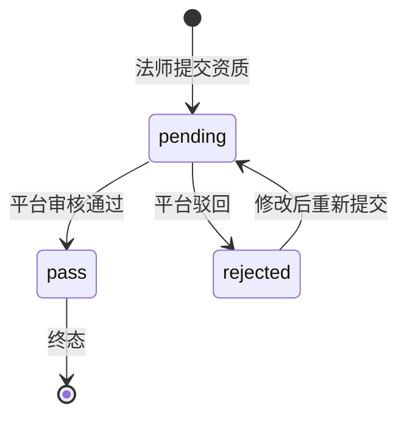
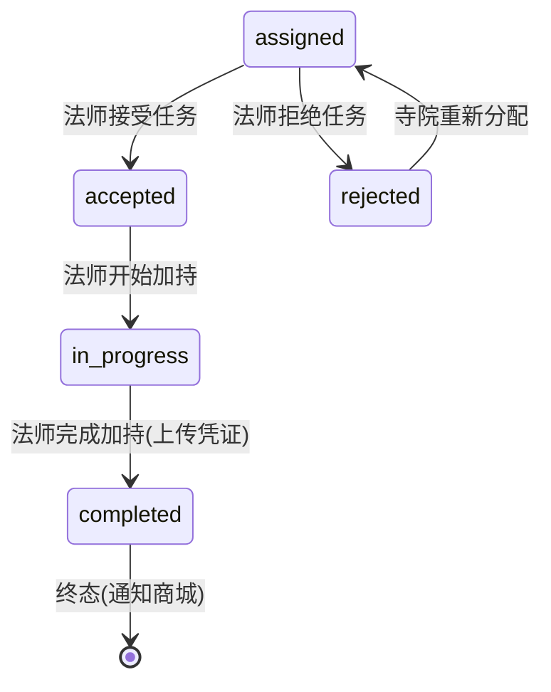

# master-service 法师服务设计文档

> **文档版本**: v1.0
> **创建日期**: 2026-07-01
> **服务端口**: 8084
> **业务域**: 核心业务域
> **关联文档**: [技术架构](../技术架构.md) | [API规范](../API规范.md) | [状态机](../状态机.md) | [业务流程](../业务流程.md) | [管理端架构](../../product/管理端架构.md) | [审计报告](../../product/业务逻辑对齐审计报告.md)

---

## 1. 服务职责

master-service 负责法师信息、资质审核、日程管理与 **加持任务处理**：

- C 端法师浏览（列表/详情）
- 寺院管理台：本寺院法师 CRUD、上下架
- **法师工作台：加持任务接受/开始/完成/拒绝（修复 Gap-4/15）**
- 法师日程管理（时段配置）
- 平台管理台：法师资质审核（通过/驳回）、封禁/解禁

> **Gap-4 修复**：新增 `blessing_task` 表与法师工作台加持任务处理接口，使法师可推进 assigned → accepted → in_progress → completed 全流程。
>
> **Gap-15 修复**：法师工作台新增 accept/start/complete/reject 接口，闭环加持任务执行链路。

---

## 2. 架构图

```mermaid
graph TB
    subgraph 客户端
        C1[C端App]
        C2[寺院管理台]
        C3[法师工作台]
        C5[平台管理台]
    end

    subgraph master-service
        HANDLER[handler<br/>路由+参数校验]
        LOGIC[logic<br/>法师/资质/日程/加持任务]
        MODEL[model<br/>master/master_credential/master_schedule<br/>master_audit/blessing_task]
    end

    GW[gateway]
    TEMPLE[temple-service<br/>blessing.assign MQ]
    DIY[diy-service<br/>blessing.complete MQ]
    MSG[message-service<br/>通知]

    C1 --> GW
    C2 --> GW
    C3 --> GW
    C5 --> GW
    GW --> HANDLER
    HANDLER --> LOGIC
    LOGIC --> MODEL
    TEMPLE -.blessing.assign MQ.-> LOGIC
    LOGIC -.blessing.complete MQ.-> DIY
    LOGIC -.通知.-> MSG
```

---

## 3. 数据表设计

### 3.0 master（法师基础表）

> 参照 model/master.go 的 Master 结构体

| 字段 | 类型 | 说明 |
|------|------|------|
| id | VARCHAR(16) | 主键（展示资料编码，当前 M001~M010；M007~M010 为虚构演示资料） |
| dharma_name | VARCHAR(64) | 法号 |
| lay_name | VARCHAR(64) | 俗名 |
| temple_id | VARCHAR(16) | 所属寺院编码 |
| temple_name | VARCHAR(64) | 所属寺院名称 |
| position | VARCHAR(32) | 职位 |
| sect | VARCHAR(32) | 宗派 |
| belief_code | VARCHAR(32) | 一级信仰流派编码 |
| type | VARCHAR(16) | 类型：佛教/道教 |
| auth_status | VARCHAR(16) | 认证状态：已认证/待审核 |
| shelf_status | VARCHAR(16) | 上下架状态：on_shelf/off_shelf |
| specialties | JSON | 专长数组 |
| avatar | VARCHAR(512) | 头像 URL |
| rating | DECIMAL(2,1) | 评分 |
| create_time | DATETIME | 创建时间 |
| update_time | DATETIME | 更新时间 |

### 3.2 master_credential（法师资质表）

| 字段 | 类型 | 说明 |
|------|------|------|
| id | BIGINT AUTO_INCREMENT | 主键 |
| master_code | VARCHAR(16) | 法师编码 |
| credential_type | VARCHAR(32) | 资质类型：ordination_cert/sect_cert/title_cert |
| credential_url | VARCHAR(512) | 资质文件URL |
| status | VARCHAR(16) | 状态：pending/pass/rejected |
| create_time | DATETIME | 创建时间 |

### 3.3 master_schedule（法师日程表）

| 字段 | 类型 | 说明 |
|------|------|------|
| id | BIGINT AUTO_INCREMENT | 主键 |
| master_code | VARCHAR(16) | 法师编码 |
| date | DATE | 日期 |
| time_slots | JSON | 时段配置 ["09:00-12:00"] |
| status | VARCHAR(16) | 状态：available/booked/off |
| create_time | DATETIME | 创建时间 |

### 3.4 master_audit（法师资质审核表）

> 参照 [状态机 7.3 法师资质审核](../状态机.md)

| 字段 | 类型 | 说明 |
|------|------|------|
| id | BIGINT AUTO_INCREMENT | 主键 |
| master_code | VARCHAR(16) | 法师编码 |
| temple_code | VARCHAR(16) | 所属寺院编码 |
| credential_urls | JSON | 资质文件URL数组 |
| status | VARCHAR(16) | 状态：pending/pass/rejected |
| auditor_id | BIGINT | 审核人ID |
| audit_remark | VARCHAR(256) | 审核备注 |
| create_time | DATETIME | 创建时间 |

### 3.5 blessing_task（加持任务表）— **修复 Gap-4/15 核心**

> 参照 [状态机 3 加持任务状态机](../状态机.md)，法师侧推进 assigned → accepted → in_progress → completed

| 字段 | 类型 | 说明 |
|------|------|------|
| id | BIGINT AUTO_INCREMENT | 主键 |
| task_no | VARCHAR(32) | 任务单号 |
| diy_order_no | VARCHAR(32) | 来源DIY订单号 |
| temple_code | VARCHAR(16) | 寺院编码 |
| master_code | VARCHAR(16) | 法师编码 |
| status | VARCHAR(16) | dispatched/assigned/accepted/in_progress/completed/rejected |
| certificate_urls | JSON | 加持凭证URL数组 |
| assign_time | DATETIME | 分配时间 |
| complete_time | DATETIME | 完成时间 |
| create_time | DATETIME | 创建时间 |

---

## 4. 接口清单

### 4.1 C端接口（公开）

| 方法 | 路径 | 说明 | 请求 | 响应 | 角色 |
|------|------|------|------|------|------|
| GET | /api/v1/masters | 法师列表 | ListReq | ListResp | 公开 |
| GET | /api/v1/masters/:id | 法师详情 | DetailReq | Master | 公开 |

### 4.2 寺院管理台接口（需JWT + 寺院管理员）

| 方法 | 路径 | 说明 | 请求 | 响应 | 角色 |
|------|------|------|------|------|------|
| GET | /api/v1/admin/temples/masters | 本寺院法师列表 | AdminMasterListReq | AdminMasterListResp | temple_admin |
| POST | /api/v1/admin/temples/masters | 添加法师 | AdminMasterCreateReq | AdminMasterCreateResp | temple_admin |
| PUT | /api/v1/admin/temples/masters/:id | 更新法师 | AdminMasterUpdateReq | Master | temple_admin |
| PUT | /api/v1/admin/temples/masters/:id/status | 法师上下架 | AdminMasterStatusReq | AdminMasterStatusResp | temple_admin |

### 4.3 法师工作台接口（需JWT + 法师，修复 Gap-15）

| 方法 | 路径 | 说明 | 请求 | 响应 | 角色 |
|------|------|------|------|------|------|
| GET | /api/v1/admin/masters/blessing-tasks | 加持任务列表 | BlessingTaskListReq | BlessingTaskListResp | master |
| GET | /api/v1/admin/masters/blessing-tasks/:id | 加持任务详情 | BlessingTaskDetailReq | BlessingTask | master |
| PUT | /api/v1/admin/masters/blessing-tasks/:id/accept | 接受任务 | BlessingTaskActionReq | BlessingTask | master |
| PUT | /api/v1/admin/masters/blessing-tasks/:id/start | 开始加持 | BlessingTaskActionReq | BlessingTask | master |
| PUT | /api/v1/admin/masters/blessing-tasks/:id/complete | 完成加持 | BlessingTaskCompleteReq | BlessingTask | master |
| PUT | /api/v1/admin/masters/blessing-tasks/:id/reject | 拒绝任务 | BlessingTaskActionReq | BlessingTask | master |
| GET | /api/v1/admin/masters/schedules | 日程列表 | ScheduleListReq | ScheduleListResp | master |
| PUT | /api/v1/admin/masters/schedules | 更新日程 | ScheduleUpdateReq | ScheduleUpdateResp | master |

### 4.4 平台管理台接口（需JWT + 平台超管）

| 方法 | 路径 | 说明 | 请求 | 响应 | 角色 |
|------|------|------|------|------|------|
| GET | /api/v1/admin/platform/masters/audits | 资质审核列表 | MasterAuditListReq | MasterAuditListResp | platform_super |
| PUT | /api/v1/admin/platform/masters/audits/:id/pass | 审核通过 | MasterAuditActionReq | MasterAudit | platform_super |
| PUT | /api/v1/admin/platform/masters/audits/:id/reject | 审核驳回 | MasterAuditActionReq | MasterAudit | platform_super |
| PUT | /api/v1/admin/platform/masters/:id/status | 封禁/解禁 | MasterPlatformStatusReq | MasterPlatformStatusResp | platform_super |

---

## 5. 状态机

### 5.1 法师资质审核（引用 状态机.md 7.3）



### 5.2 加持任务状态机（法师侧，修复 Gap-4/15）



> 法师侧关键流转：`assigned → accepted → in_progress → completed`（修复 Gap-4），并提供 reject 退回（修复 Gap-15）。

---

## 6. 业务逻辑要点

1. **Gap-4 修复**：temple-service 分配法师后发 `blessing.assign` MQ，master-service 消费更新任务为 assigned；法师在工作台接受(accepted)、开始(in_progress)、完成(completed，上传 certificate_urls)
2. **Gap-15 修复**：法师工作台新增 accept/start/complete/reject 接口，状态流转前校验 `CanTransitBlessingTask`，完成后发 `blessing.complete` MQ 通知 diy-service
3. **数据隔离**：法师仅可操作分配给自己的加持任务（master_code 过滤）
4. **寺院管理**：寺院管理员仅可管理本寺院法师（temple_code 过滤）
5. **资质审核**：法师提交资质后状态为 pending，平台审核通过后 AuthStatus 更新为"已认证"
6. **日程管理**：法师可配置每日可用时段，预约时校验时段可用性

---

## 7. 依赖关系

| 依赖类型 | 依赖 | 说明 |
|---------|------|------|
| MQ | temple-service | 消费 blessing.assign 接收分配的加持任务 |
| MQ | diy-service | 发送 blessing.complete 通知商城任务完成 |
| MQ | message-service | 通知法师/寺院管理员 |
| MySQL | master/master_credential/master_schedule/master_audit/blessing_task | 法师域数据 |
| RPC | temple-service | 校验法师归属寺院 |

---

## 版本记录

| 版本 | 日期 | 说明 |
|------|------|------|
| v1.0 | 2026-07-01 | 扩展管理端 + **修复 Gap-4/15 加持任务处理** |
