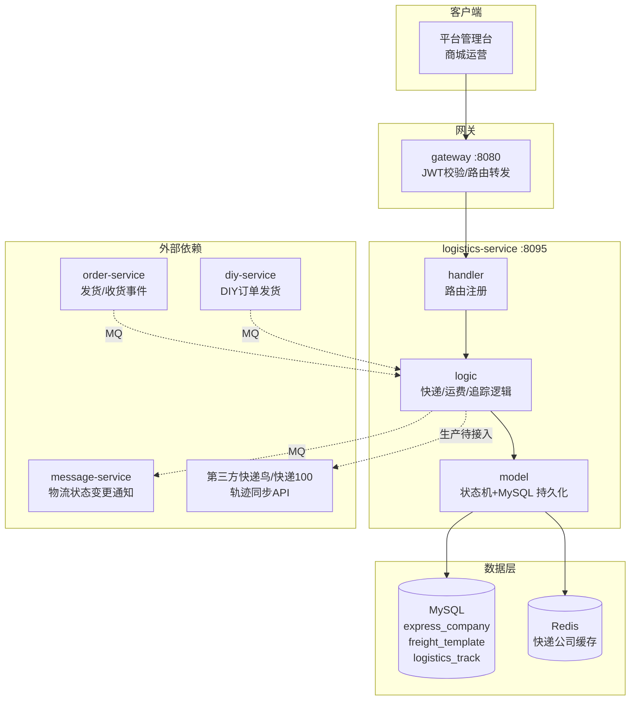
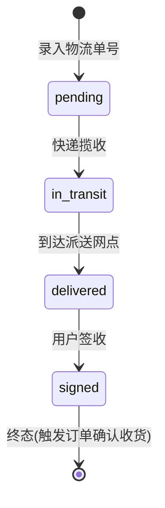

# logistics-service 物流服务设计文档

> **文档版本**: v1.0
> **创建日期**: 2026-07-01
> **服务端口**: 8095
> **业务域**: 平台支撑域
> **关联文档**: [技术架构](../技术架构.md) | [状态机](../状态机.md) | [业务流程](../业务流程.md) | [API规范](../API规范.md) | [管理端架构](../../product/管理端架构.md)

---

## 1. 服务职责

logistics-service 是问玄东方平台的物流管理中枢，为商城订单/DIY订单提供统一的快递配置、运费计算与物流追踪能力。核心职责包括：

- **快递公司配置**：维护平台支持的快递公司（顺丰、中通、圆通、EMS 等），含编码、客服电话、状态
- **运费模板管理**：按地区/重量/件数维度配置运费规则，支持包邮模板
- **物流追踪**：根据物流单号查询物流轨迹；当前批量同步为本地模拟 Provider
- **发货联动**：订单发货时录入物流单号，触发物流追踪任务

详细业务说明参见 [管理端架构 3.4.6 物流管理](../../product/管理端架构.md)。

---

## 2. 架构图

---

## 3. 数据表设计

### 3.1 express_company（快递公司）

| 字段 | 类型 | 说明 |
|------|------|------|
| id | bigint PK | 主键 |
| code | varchar(32) | 快递公司编码（如 SF/ZTO/YTO/EMS），用于对接第三方 |
| name | varchar(64) | 快递公司名称 |
| logo_url | varchar(256) | LOGO URL |
| customer_service | varchar(32) | 客服电话 |
| sort | int | 排序值（越小越靠前） |
| status | varchar(16) | 状态：enabled/disabled |
| create_time | datetime | 创建时间 |
| update_time | datetime | 更新时间 |

### 3.2 freight_template（运费模板）

| 字段 | 类型 | 说明 |
|------|------|------|
| id | bigint PK | 主键 |
| name | varchar(64) | 模板名称（如"全国包邮"/"偏远地区加价"） |
| type | varchar(16) | 计费方式：by_weight/by_piece |
| free_shipping | tinyint | 是否包邮：0否 1是 |
| config | json | 计费规则配置（首重/续重/首件/续件/各地区规则） |
| status | varchar(16) | 状态：enabled/disabled |
| create_time | datetime | 创建时间 |
| update_time | datetime | 更新时间 |

### 3.3 logistics_track（物流追踪）

| 字段 | 类型 | 说明 |
|------|------|------|
| id | bigint PK | 主键 |
| tracking_no | varchar(64) | 物流单号 |
| express_code | varchar(32) | 快递公司编码 |
| biz_type | varchar(16) | 业务类型：order/diy |
| biz_no | varchar(32) | 业务单号（订单号/DIY订单号） |
| status | varchar(16) | 物流状态：pending/in_transit/delivered/signed |
| traces | json | 物流轨迹（JSON数组，含时间/描述） |
| last_sync_time | datetime | 最后同步时间 |
| create_time | datetime | 创建时间 |
| update_time | datetime | 更新时间 |

---

## 4. 接口清单

| # | 方法 | 路径 | 说明 |
|---|------|------|------|
| 1 | GET | /api/v1/admin/logistics/express | 快递公司列表（含筛选+分页） |
| 2 | POST | /api/v1/admin/logistics/express | 新增快递公司 |
| 3 | PUT | /api/v1/admin/logistics/express/:id | 更新快递公司（含启停） |
| 4 | GET | /api/v1/admin/logistics/freight-templates | 运费模板列表 |
| 5 | POST | /api/v1/admin/logistics/freight-templates | 新增运费模板 |
| 6 | PUT | /api/v1/admin/logistics/freight-templates/:id | 更新运费模板 |
| 7 | GET | /api/v1/admin/logistics/tracks/:trackingNo | 按物流单号查询轨迹 |
| 8 | POST | /api/v1/admin/logistics/tracks/batch-sync | 批量同步物流轨迹 |

---

## 5. 状态机

物流轨迹状态详见 [状态机.md 第4节 商城订单状态机](../状态机.md#4-商城订单状态机order-service) 中的发货/收货联动，本服务扩展物流轨迹自身的状态流转：

### 5.1 物流轨迹状态

| 状态值 | 中文名 | 说明 |
|--------|--------|------|
| `pending` | 待揽收 | 已生成物流单号，等待快递揽收 |
| `in_transit` | 运输中 | 快递已揽收，运输中 |
| `delivered` | 已派送 | 已到达派送网点 |
| `signed` | 已签收 | 用户已签收（终态） |

### 5.2 状态转换规则

| 当前状态 | 允许操作 | 目标状态 | 触发方 |
|---------|---------|---------|--------|
| pending | 快递揽收 | in_transit | 第三方轨迹同步 |
| in_transit | 到达派送 | delivered | 第三方轨迹同步 |
| delivered | 用户签收 | signed | 第三方轨迹同步 |

> 状态为终态 `signed` 时，通过 MQ 通知 order-service/diy-service 触发"自动确认收货"流程。

---

## 6. 业务逻辑

### 6.1 快递公司管理

1. 商城运营维护平台支持的快递公司列表（编码/名称/客服电话/排序/启停）
2. 快递公司编码用于对接第三方物流API（快递鸟/快递100）与物流单号绑定
3. 启用的快递公司在发货时可选；禁用的快递公司不可再选

### 6.2 运费模板管理

1. 商城运营按业务需要创建运费模板
2. 计费方式分两类：
   - `by_weight`：按重量计费（首重+续重）
   - `by_piece`：按件数计费（首件+续件）
3. 支持包邮模板（`free_shipping=1`）
4. 模板内 `config` 字段存放地区差异化计费规则（JSON）

### 6.3 物流追踪

1. 订单发货时由 order-service/diy-service 调用本服务录入物流单号，创建 `logistics_track` 记录（status=pending）
2. 查询轨迹：按 `tracking_no` 查询，返回 `traces` 轨迹数组
3. 批量同步：当前本地 Provider 按状态机生成明确的模拟轨迹；生产接入第三方 API 后才可作为真实物流数据
4. 状态变为 `signed` 时发 MQ 通知 order-service/diy-service，触发自动确认收货

### 6.4 批量同步

1. 查询所有非终态（pending/in_transit/delivered）的物流记录
2. 调用第三方快递API批量查询轨迹
3. 更新 traces / status / last_sync_time
4. 返回本次同步的成功/失败数

---

## 7. 依赖关系

| 依赖类型 | 依赖服务 | 用途 |
|---------|---------|------|
| MQ消费 | order-service | 接收 order.shipped 发货事件，创建物流记录 |
| MQ消费 | diy-service | 接收 diy.shipped 发货事件，创建物流记录 |
| MQ生产 | message-service | 发送 logistics.signed 物流签收通知 |
| HTTP | 第三方快递API（快递鸟/快递100） | 拉取物流轨迹 |
| 数据库 | MySQL | express_company/freight_template/logistics_track |
| 缓存 | Redis | 启用的快递公司列表缓存 |

---

## 版本记录

| 版本 | 日期 | 说明 |
|------|------|------|
| v1.0 | 2026-07-01 | 初始版本：物流服务设计 |
