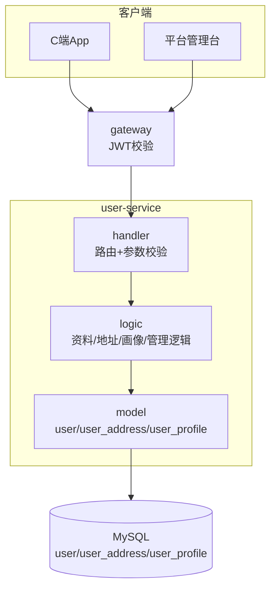
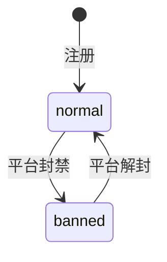

# user-service 用户服务设计文档

> **文档版本**: v1.0
> **创建日期**: 2026-07-01
> **服务端口**: 8082
> **业务域**: 核心业务域
> **关联文档**: [技术架构](../技术架构.md) | [API规范](../API规范.md) | [状态机](../状态机.md) | [业务流程](../业务流程.md) | [管理端架构](../../product/管理端架构.md)

---

## 1. 服务职责

user-service 负责 C 端用户资料、收货地址、用户画像与平台用户管理：

- 用户注册（手机号+验证码）
- 用户资料查询/更新
- 收货地址管理（CRUD + 默认地址切换）
- 用户画像（偏好标签 / 订单统计 / 活跃度）
- 平台用户管理（列表 / 详情含画像 / 封禁解封）

---

## 2. 架构图

---

## 3. 数据表设计

### 3.1 user_address（收货地址表）

| 字段 | 类型 | 说明 |
|------|------|------|
| id | BIGINT AUTO_INCREMENT | 主键 |
| user_id | BIGINT | 用户 ID |
| name | VARCHAR(64) | 收货人姓名 |
| phone | VARCHAR(20) | 收货人手机号 |
| province | VARCHAR(64) | 省 |
| city | VARCHAR(64) | 市 |
| district | VARCHAR(64) | 区/县 |
| detail | VARCHAR(256) | 详细地址 |
| is_default | TINYINT(1) | 是否默认地址（0/1） |
| create_time | DATETIME | 创建时间 |

### 3.2 user_profile（用户画像表）

| 字段 | 类型 | 说明 |
|------|------|------|
| id | BIGINT AUTO_INCREMENT | 主键 |
| user_id | BIGINT | 用户 ID |
| preference_tags | JSON | 偏好标签（如 ["祈福","开光"]） |
| total_orders | INT | 累计订单数 |
| total_spent | DECIMAL(10,2) | 累计消费金额 |
| last_active_time | DATETIME | 最后活跃时间 |

### 3.3 user（已有用户表）

沿用现有 user model，新增 status 字段支持封禁（normal/banned）。

---

## 4. 接口清单

### 4.1 C端接口（需用户JWT）

| 方法 | 路径 | 说明 | 请求 | 响应 | 角色 |
|------|------|------|------|------|------|
| POST | /api/v1/users/register | 注册 | RegisterReq | RegisterResp | 公开 |
| GET | /api/v1/users/profile | 查询资料 | - | UserProfile | customer |
| PUT | /api/v1/users/profile | 更新资料 | UpdateProfileReq | UserProfile | customer |
| GET | /api/v1/users/addresses | 地址列表 | - | AddressListResp | customer |
| POST | /api/v1/users/addresses | 添加地址 | AddressCreateReq | AddressCreateResp | customer |
| PUT | /api/v1/users/addresses/:id | 更新地址 | AddressUpdateReq | UserAddress | customer |
| DELETE | /api/v1/users/addresses/:id | 删除地址 | AddressDeleteReq | - | customer |

### 4.2 平台管理台接口（需JWT + 平台超管）

| 方法 | 路径 | 说明 | 请求 | 响应 | 角色 |
|------|------|------|------|------|------|
| GET | /api/v1/admin/users | 用户列表（支持搜索） | AdminUserListReq | AdminUserListResp | platform_super |
| GET | /api/v1/admin/users/:id | 用户详情（含画像） | AdminUserDetailReq | AdminUserDetailResp | platform_super |
| PUT | /api/v1/admin/users/:id/status | 封禁/解封 | AdminUserStatusReq | AdminUserStatusResp | platform_super |

---

## 5. 状态机

user 账号状态机：

| 状态 | 中文名 | 说明 |
|------|--------|------|
| normal | 正常 | 可正常使用 |
| banned | 已封禁 | 不可登录下单 |

> 地址无状态机，is_default 为布尔标记，新增默认地址时自动取消旧默认。

---

## 6. 业务逻辑要点

1. **地址默认切换**：设置某地址为默认时，自动将该用户其他地址 is_default 置 0
2. **地址上限**：单用户最多 20 个收货地址
3. **用户画像**：由订单完成事件异步更新 total_orders / total_spent
4. **封禁联动**：banned 用户登录由 auth-service 拒绝（需读取 user status）
5. **数据脱敏**：平台列表用户手机号脱敏（138****0000）
6. **搜索**：平台用户列表支持按手机号/昵称模糊搜索

---

## 7. 依赖关系

| 依赖类型 | 依赖 | 说明 |
|---------|------|------|
| MySQL | user/user_address/user_profile | 用户数据持久化 |
| MQ | order-service | 订单完成事件更新画像（异步） |
| auth-service | 登录校验 | 封禁状态同步 |

---

## 版本记录

| 版本 | 日期 | 说明 |
|------|------|------|
| v1.0 | 2026-07-01 | 扩展：地址管理 + 用户画像 + 平台用户管理 |
