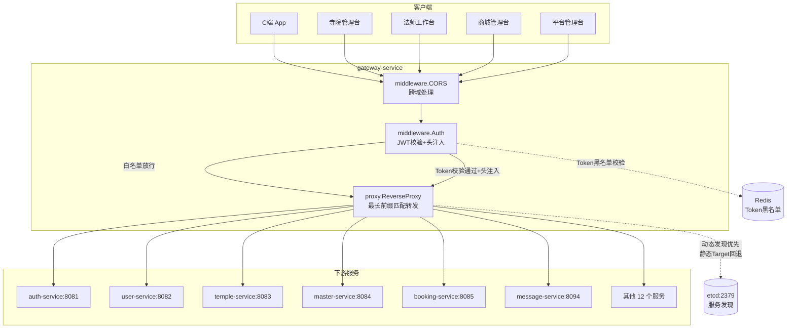

# gateway-service 网关服务设计文档

> **文档版本**: v1.0
> **创建日期**: 2026-07-02
> **服务端口**: 8080
> **业务域**: 平台域
> **关联文档**: [技术架构](../技术架构.md) | [API规范](../API规范.md) | [认证服务](认证服务.md)

---

## 1. 服务职责

gateway-service 是全平台唯一对外入口，承担路由转发、JWT 鉴权、CORS 跨域、请求头注入四类职责：

- **反向代理**：按 URL 前缀最长匹配，将请求转发到对应下游微服务（19 条 C 端业务路由 + 1 条 OpenIM 透传路由 + 21 条管理台路由）
- **JWT 鉴权**：全局中间件校验 Access Token，白名单路径直接放行，`/api/v1/admin/*` 路径额外校验管理台/法师工作台角色
- **请求头注入**：Token 校验通过后，将 userId/mobile/userType/roles/clientId/templeId/masterId 注入 `X-User-*` 请求头透传下游
- **CORS 跨域**：统一配置跨域响应头，避免各下游服务重复配置
- **错误降级**：下游服务不可用时返回统一 JSON 错误（502/404），不暴露内部错误

> MVP-1 阶段每条路由同时配置 `ServiceName` 与静态 `Target`：网关优先使用 etcd 动态发现实例，发现失败时回退到静态 Target。

---

## 2. 架构图

---

## 3. 路由设计

### 3.1 C 端业务路由（19 条）+ OpenIM 透传（1 条）

| 前缀 | 转发目标 | 说明 |
|------|----------|------|
| /api/v1/auth | localhost:8081 | 认证服务（登录/续期/登出） |
| /api/v1/users | localhost:8082 | 用户服务（注册/资料/地址） |
| /api/v1/temples | localhost:8083 | 寺院服务 |
| /api/v1/beliefs | localhost:8083 | 一级流派资料 |
| /api/v1/masters | localhost:8084 | 法师服务 |
| /api/v1/bookings | localhost:8085 | 预约服务 |
| /api/v1/messages | localhost:8094 | 消息服务 |
| /api/v1/announcements | localhost:8094 | 公告服务 |
| /api/v1/files | localhost:8097 | 文件服务 |
| /api/v1/products | localhost:8086 | 商品服务 |
| /api/v1/intentions | localhost:8086 | product-service（寺院/大师服务聚合） |
| /api/v1/diy | localhost:8088 | DIY 服务 |
| /api/v1/orders | localhost:8089 | 订单服务 |
| /api/v1/payments | localhost:8090 | 支付服务 |
| /api/v1/logistics | localhost:8095 | 物流服务 |
| /api/v1/reviews | localhost:8092 | 评价服务 |
| /api/v1/audit | localhost:8093 | 审核服务 |
| /api/v1/finance | localhost:8091 | 财务服务 |
| /api/v1/marketing | localhost:8096 | 营销服务 |
| /api/v1/ai | localhost:8098 | AI 问事服务 |
| /api/v1/community | localhost:8099 | 大师广场公开与互动接口 |
| /api/v1/admin/masters/community | localhost:8099 | 法师内容管理 |
| /api/v1/admin/platform/community | localhost:8099 | 平台帖子/评论审核 |
| /api/v1/media、/api/v1/live | localhost:8100 | 媒体与直播服务 |
| /api/v1/im | localhost:10002 | OpenIM REST API |
| /openim | localhost:8094 | OpenIM webhook 回调透传 |

### 3.2 管理台路由（21 条，前缀 /api/v1/admin/）

| 前缀 | 转发目标 | 说明 |
|------|----------|------|
| /api/v1/admin/auth | localhost:8081 | 认证管理（账号/角色/权限） |
| /api/v1/admin/users | localhost:8082 | 用户管理 |
| /api/v1/admin/temples/masters | localhost:8084 | 寺院下法师管理（最长前缀优先） |
| /api/v1/admin/temples | localhost:8083 | 寺院管理 |
| /api/v1/admin/platform/temples | localhost:8083 | 平台审核寺院 |
| /api/v1/admin/masters/bookings | localhost:8085 | 法师视角预约管理（最长前缀优先于 /admin/masters） |
| /api/v1/admin/masters | localhost:8084 | 法师管理 |
| /api/v1/admin/platform/masters | localhost:8084 | 平台审核法师 |
| /api/v1/admin/bookings | localhost:8085 | 预约管理 |
| /api/v1/admin/messages | localhost:8094 | 消息管理 |
| /api/v1/admin/announcements | localhost:8094 | 公告管理 |
| /api/v1/admin/products | localhost:8086 | 商品管理 |
| /api/v1/admin/diy | localhost:8088 | DIY 管理 |
| /api/v1/admin/orders | localhost:8089 | 订单管理 |
| /api/v1/admin/finance | localhost:8091 | 财务管理 |
| /api/v1/admin/platform/reviews | localhost:8092 | 平台审核评价 |
| /api/v1/admin/reviews | localhost:8092 | 评价管理 |
| /api/v1/admin/masters/reviews | localhost:8092 | 法师工作台评价管理 |
| /api/v1/admin/audit | localhost:8093 | 审核管理 |
| /api/v1/admin/logistics | localhost:8095 | 物流管理 |
| /api/v1/admin/marketing | localhost:8096 | 营销管理 |

> 路由匹配规则：按前缀长度降序排列，最长前缀优先匹配（保证 `/admin/temples/masters` 优先于 `/admin/temples`）。

---

## 4. 鉴权白名单

以下路径不需要 JWT Token，直接放行（与 `gateway.yaml:NoAuthPaths` 一致，共 16 条）：

| 路径 | 方法 | 说明 |
|------|------|------|
| /api/v1/auth/login | POST | C 端登录 |
| /api/v1/auth/refresh | POST | Token 续期 |
| /api/v1/auth/admin/login | POST | 管理台登录（temple_admin / master / shop_admin / platform_admin） |
| /api/v1/users/register | POST | 用户注册 |
| /api/v1/payments/callback/wechat | POST | 微信支付回调 |
| /api/v1/payments/callback/alipay | POST | 支付宝支付回调 |
| /api/v1/temples* | GET | C 端浏览寺院列表/详情（前缀匹配） |
| /api/v1/masters* | GET | C 端浏览法师列表/详情（前缀匹配） |
| /api/v1/products* | GET | C 端浏览商品列表/详情/分类（前缀匹配） |
| /api/v1/marketing/banners* | GET | Banner 列表（前缀匹配） |
| /api/v1/announcements* | GET | 公告列表（前缀匹配） |
| /api/v1/diy/designs* | GET | DIY 设计广场（前缀匹配） |
| /api/v1/diy/materials* | GET | DIY 材料库（前缀匹配） |
| /api/v1/health | GET | 网关健康检查 |
| /api/v1/im* | 多方法 | OpenIM REST 透传，由 OpenIM 自身鉴权 |
| /openim/webhook | POST | 已废弃的 OpenIM 兼容空操作，无 JWT；真实预约回调不经公网网关 |

> **匹配规则**：GET 请求前缀匹配（`path == prefix` 或 `path 以 prefix+"/" 开头`，支持 `/temples/T001` 等详情页）；非 GET 请求精确匹配。

---

## 5. 请求头透传

JWT 校验通过后，网关将用户信息注入以下请求头，下游服务通过 `X-User-*` 头获取用户身份：

| 请求头 | 来源字段 | 说明 |
|--------|----------|------|
| X-User-Id | claims.UserId | 用户ID（int64） |
| X-User-Mobile | claims.Mobile | 手机号 |
| X-User-Type | claims.UserType | 用户类型（user/master/admin） |
| X-User-Roles | claims.Roles | 角色列表（逗号分隔） |
| X-Client-Id | claims.ClientID | 端标识 |
| X-Temple-Id | claims.TempleID | 寺院ID（temple_admin 专用） |
| X-Master-Id | claims.MasterID | 法师ID（master 专用） |

---

## 6. 业务逻辑要点

1. **最长前缀匹配**：路由表按前缀长度降序排列，保证 `/api/v1/admin/temples/masters`（22 字符）优先于 `/api/v1/admin/temples`（15 字符）匹配
2. **管理台/工作台角色校验**：`/api/v1/admin/*` 路径除 JWT 校验外，额外检查 `claims.IsAdmin()` 或 `claims.HasRole("master")`；管理后台角色与法师工作台共用该前缀，不满足返回 `ErrRoleForbidden`
3. **Refresh Token 拒绝**：网关层拒绝 Refresh Token 访问业务接口（`claims.IsRefreshToken()` → `ErrTokenInvalid`），Refresh Token 仅用于 `/api/v1/auth/refresh`
4. **错误降级**：下游不可用时返回 `{"code":5000,"message":"下游服务不可用"}`（HTTP 502）；无匹配路由返回 `{"code":4004,"message":"路由不存在"}`（HTTP 404）
5. **CORS 处理**：`middleware.CORS` 统一设置 `Access-Control-Allow-Origin`、`Access-Control-Allow-Methods`、`Access-Control-Allow-Headers`，处理 OPTIONS 预检请求
6. **服务发现回退**：配置中包含 `Etcd.Hosts` 与每条 Upstream 的 `ServiceName`；网关启动 discovery watch，优先使用动态实例，未发现实例时回退到静态 `Target`

---

## 7. 依赖关系

| 依赖类型 | 依赖 | 说明 |
|---------|------|------|
| etcd | localhost:2379 | 服务发现（动态实例优先，静态 Target 回退） |
| Redis | localhost:6379 | Token 黑名单校验（由 auth-service 写入，gateway 读取） |
| 下游服务 | 19 个微服务 + OpenIM | 反向代理转发目标 |
| common | 公共包 | JWT 解析（ParseToken）/ 错误码 / 响应封装 |

---

## 8. 错误码

网关自身返回的错误码：

| HTTP 状态 | code | 说明 |
|-----------|------|------|
| 401 | 40101 | 未登录或登录已过期（ErrUnauthorized） |
| 401 | 40102 | token 无效（ErrTokenInvalid） |
| 403 | 40304 | 角色权限不足（ErrRoleForbidden，管理台/工作台路径非允许角色） |
| 404 | 4004 | 路由不存在（网关自定义） |
| 502 | 5000 | 下游服务不可用（网关自定义） |

> 正常业务错误码由下游服务返回，网关透传响应体。

---

## 版本记录

| 版本 | 日期 | 说明 |
|------|------|------|
| v1.0 | 2026-07-02 | 初始版本：路由转发 + JWT 鉴权 + CORS + 请求头注入 |
