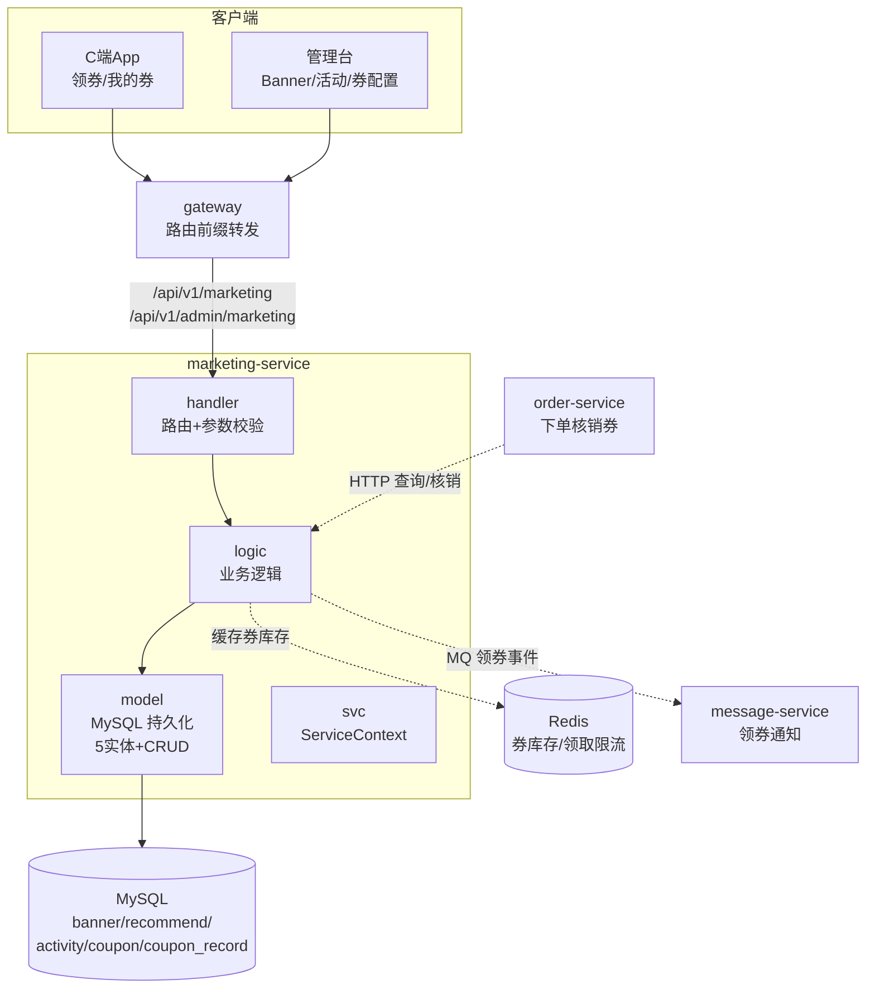

# marketing-service 营销服务设计文档

> **文档版本**: v1.0
> **创建日期**: 2026-07-01
> **服务端口**: 8096
> **业务域**: 营销 + AI 域
> **关联文档**: [技术架构](../技术架构.md) | [API规范](../API规范.md) | [状态机](../状态机.md) | [业务流程](../业务流程.md)

---

## 1. 服务职责

marketing-service 负责全平台营销运营能力，包括：
- **Banner 首页轮播**：C 端展示 + 管理台 CRUD
- **推荐位**：寺院 / 法师 / 商品 推荐位管理
- **营销活动**：限时折扣 / 节日活动 / 寺院法会 三类活动
- **优惠券**：满减 / 折扣 / 新人专享 / 品类券 四类券
- **优惠券领取记录**：C 端用户领券、我的券列表、核销状态管理

> 当前 Banner、推荐位、活动、优惠券和领取记录均使用 MySQL 持久化；领取操作由事务和唯一键保证同一用户不重复领同一张券。

---

## 2. 架构图

---

## 3. 数据表设计

### 3.1 banner（首页轮播表）

| 字段 | 类型 | 说明 |
|------|------|------|
| id | BIGINT AUTO_INCREMENT | 主键 |
| title | VARCHAR(64) | 标题 |
| image_url | VARCHAR(256) | 图片地址（MinIO 对象名） |
| link_type | VARCHAR(16) | temple/master/product/diy/ad_landing |
| link_value | VARCHAR(64) | 跳转目标 ID 或路径 |
| sort | INT | 排序（升序） |
| status | VARCHAR(8) | enabled/disabled |
| start_time | DATETIME | 生效时间 |
| end_time | DATETIME | 失效时间 |
| created_at | DATETIME | 创建时间 |

### 3.2 recommend（推荐位表）

| 字段 | 类型 | 说明 |
|------|------|------|
| id | BIGINT AUTO_INCREMENT | 主键 |
| type | VARCHAR(16) | temple/master/product |
| target_id | VARCHAR(32) | 关联资源 ID（寺院号/法师号/商品号） |
| sort | INT | 排序 |
| status | VARCHAR(8) | enabled/disabled |
| created_at | DATETIME | 创建时间 |

### 3.3 activity（营销活动表）

| 字段 | 类型 | 说明 |
|------|------|------|
| id | BIGINT AUTO_INCREMENT | 主键 |
| name | VARCHAR(64) | 活动名 |
| type | VARCHAR(16) | limited_discount/festival/temple_event |
| start_time | DATETIME | 开始时间 |
| end_time | DATETIME | 结束时间 |
| config | TEXT | 活动配置（JSON，如 `{"discount":0.9}` / `{"templeId":"T001"}`） |
| status | VARCHAR(8) | enabled/disabled |
| created_at | DATETIME | 创建时间 |

### 3.4 coupon（优惠券表）

| 字段 | 类型 | 说明 |
|------|------|------|
| id | BIGINT AUTO_INCREMENT | 主键 |
| coupon_no | VARCHAR(32) | 券号（`C` + yyyyMM + 5位序号） |
| name | VARCHAR(64) | 券名 |
| type | VARCHAR(16) | full_reduce/discount/new_user/category |
| value | DECIMAL(10,2) | 满减金额 / 折扣率（0~1） |
| min_amount | DECIMAL(10,2) | 最低消费门槛 |
| category_id | VARCHAR(32) | 品类 ID（品类券适用） |
| start_time | DATETIME | 生效时间 |
| end_time | DATETIME | 失效时间 |
| total_count | INT | 总发放量 |
| received_count | INT | 已领取数（库存减项） |
| status | VARCHAR(8) | enabled/disabled |
| created_at | DATETIME | 创建时间 |

### 3.5 coupon_record（优惠券领取记录表）

| 字段 | 类型 | 说明 |
|------|------|------|
| id | BIGINT AUTO_INCREMENT | 主键 |
| coupon_id | BIGINT | 优惠券 ID |
| coupon_no | VARCHAR(32) | 优惠券号（冗余） |
| user_id | VARCHAR(32) | 领取用户 ID |
| status | VARCHAR(8) | unused/used/expired |
| order_no | VARCHAR(32) | 核销订单号 |
| use_time | DATETIME | 核销时间 |
| created_at | DATETIME | 领取时间 |

---

## 4. 接口清单

### 4.1 C 端接口（前缀 `/api/v1/marketing`）

| 方法 | 路径 | 说明 | 角色 |
|------|------|------|------|
| GET | /banners | Banner 列表（按 sort 升序，仅返回 enabled） | customer |
| GET | /recommends | 推荐位列表 | customer |
| GET | /activities | 活动列表 | customer |
| GET | /coupons | 可领取优惠券列表 | customer |
| POST | /coupons/:id/receive | 领取优惠券（库存 -1，写领取记录） | customer |
| GET | /my-coupons | 我的优惠券列表（按 status 过滤） | customer |

### 4.2 管理台接口（前缀 `/api/v1/admin/marketing`）

| 方法 | 路径 | 说明 | 角色 |
|------|------|------|------|
| GET | /coupons | 优惠券列表 | admin |
| POST | /coupons | 创建优惠券 | admin |
| PUT | /coupons/:id | 更新优惠券 | admin |
| GET | /activities | 活动列表 | admin |
| POST | /activities | 创建活动 | admin |
| PUT | /activities/:id | 更新活动 | admin |
| GET | /banners | Banner 列表 | admin |
| POST | /banners | 创建 Banner | admin |
| PUT | /banners/:id | 更新 Banner | admin |
| GET | /recommends | 推荐位列表 | admin |
| PUT | /recommends/:id | 更新推荐位 | admin |

> 共 **17 个路由**：C 端 6 + 管理台 11。

---

## 5. 业务逻辑要点

1. **券号生成**：格式 `C` + `yyyyMMdd` 月份 + 5 位序号，例如 `C20260700001`
2. **领券库存校验**：`received_count >= total_count` 返回"已领完"；`status != enabled` 返回"已下架"
3. **领券原子操作**：MySQL 事务内条件更新领取数量并写领取记录，`coupon_id + user_id` 唯一键防重复领取
4. **券状态机**：`unused` → `used`（核销）/ `expired`（过期），由 order-service 核销或定时任务扫描
5. **Banner 时效**：查询时可选按 `status=enabled` 过滤；前端展示按 `sort` 升序
6. **活动配置**：`config` 为 JSON 字符串，不同 `type` 字段含义不同（折扣率 / 寺院 ID）
7. **推荐位排序**：按 `sort` 升序，仅返回 `enabled` 项
8. **C 端与管理台分离**：C 端只读 + 领券动作；管理台 CRUD 不暴露给 C 端
9. **空实现约定**：当前 logic 全部返回 `common.ErrNotImplemented`（Code 50002），后续逐步落地

---

## 6. 依赖关系

| 依赖类型 | 依赖服务 | 说明 |
|---------|---------|------|
| HTTP → | order-service | 下单时核销优惠券（未来） |
| MQ → | message-service | 领券成功通知（未来） |
| HTTP → | file-service | Banner 图片存储（通过 MinIO） |
| MySQL | askxuan_marketing 库 | banner/recommend/activity/coupon/coupon_record |
| Redis | 本地 | 券库存缓存 / 领取限流 |
| etcd | 服务注册 | 服务发现 |
| common | 公共包 | BizError / Ok / JsonError / 中间件 |

---

## 7. 错误码区间

营销服务使用 `common/errorcode.go` 中的统一错误码（范围 40001-50299），不单独定义错误码区间：

| 区间 | 用途 |
|------|------|
| 40001-40099 | 参数校验错误 |
| 40401-40499 | 资源不存在（如 ErrCouponNotFound=40410 / ErrActivityNotFound=40411） |
| 40901-40999 | 业务冲突（如券已领完/活动已结束） |
| 50001-50099 | 系统内部错误（ErrSystem=50001 / ErrNotImplemented=50002） |

---

## 版本记录

| 版本 | 日期 | 说明 |
|------|------|------|
| v1.0 | 2026-07-01 | 初始版本：Banner/推荐位/活动/优惠券 5 实体 + 17 路由骨架 |

## 积分活动扩展（2026-09-10）

营销服务新增独立的 `internal/rewards` 模块和四表：`reward_campaign`（活动规则、预算、数量、截止时间、开奖公告）、`reward_entry`（一期一用户唯一参与码及结果）、`reward_order`（实物履约）、`reward_audit`（不可通过业务接口删除的操作留档）。复用支付库已有积分账户和流水；同一 MySQL 事务扣积分并登记参与，不访问现金订单或功德成长。

- 大奖池使用 crypto/rand 均匀随机整数与局部 Fisher–Yates 无放回抽样。参与事务先锁活动行，再检查一期一用户唯一键及容量、确认积分价格，再锁积分账户行扣减并写流水；开奖事务锁同一活动行，冻结码集、抽样、写中奖结果、创建订单与公告同时提交。多人并发或多实例定时任务不会重复开奖。
- 转盘从剩余名额中抽取一个均匀随机数，若落入剩余奖品数量区间则中奖。每期每用户一次，无重抽和积分付费加次。剩余奖品/剩余名额为下一次概率，客户端动画不参与结果判定。
- 应用启动及每 15 秒扫描到期的 published 活动；后台每轮有超时，进程重启后继续补偿。满额只停止参与，到期照常结束，无人参与和不足奖品数量均有明确定义。
- 新路由由营销服务再次验证 access JWT 和精确角色。顾客仅访问自己参与和领奖记录；平台超管负责预算、活动配置、公告审计和发货。开奖详情采用一致性读事务，避免人数与中奖码来自不同提交时刻。
- 生命周期：草稿 → 已发布（未开始/参与中/满额/等待开奖为计算阶段）→ 已结束；无人参与可取消并留原因。已发布活动不改规则、预算、数量或期限；调整活动须新建一期。
- 实物履约：awaiting_address → pending → shipped → completed；用户填地址，平台登记物流，用户确认收货。重复同内容请求幂等，不覆盖已提交地址和运单。保留完整时间与操作者记录，领奖阶段不再重复扣积分。

预算单位为分，须至少覆盖奖品参考价值总额；它是运营预算声明，不是已执行资金划拨。上线不自动生成对公众开放的测试活动，运营应准备实际奖品与包邮预算后发布。

接口、字段和迁移说明见 [API Reference](../../../API-REFERENCE.md#积分转盘大奖池与实物履约2026-09-10)。本地验证入口：`bash scripts/test-free-rewards.sh`，独立 MySQL 临时容器，结束自动清理。

积分参与字段 `points_cost`、参与快照 `points_spent` 与请求 `expectedPoints` 为本次新增。所有新活动必须配置正整数积分，发布后冻结。余额不足不参与，事务失败不扣分；同一期重试不重复扣。参与成功后，未中奖不退款。新迁移保留历史零积分记录。
