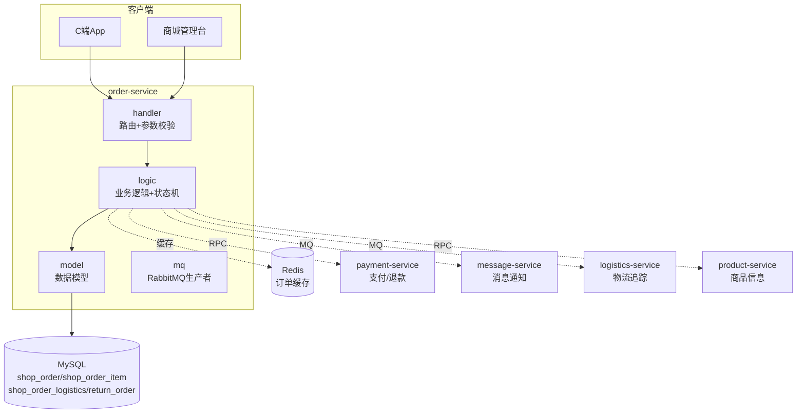
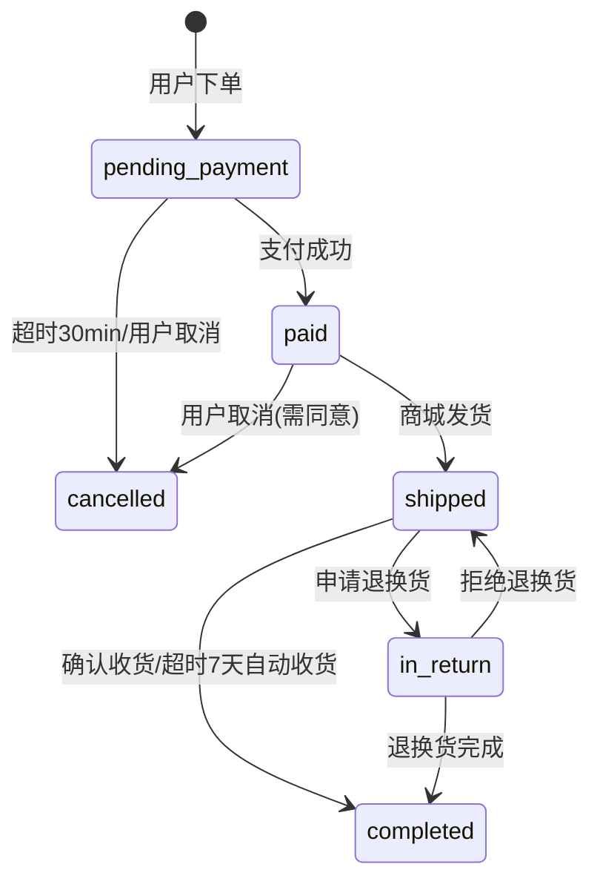
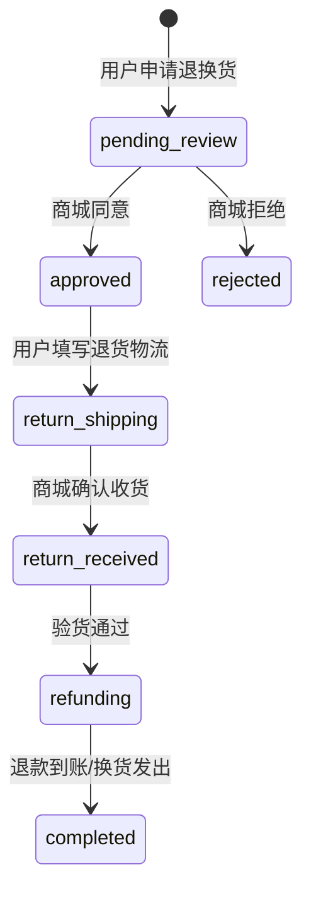

# order-service 商城订单服务设计文档

> **文档版本**: v1.0
> **创建日期**: 2026-07-01
> **服务端口**: 8089
> **业务域**: 商城业务域
> **关联文档**: [技术架构](../技术架构.md) | [API规范](../API规范.md) | [状态机](../状态机.md) | [业务流程](../业务流程.md)

---

## 1. 服务职责

order-service 负责商城普通商品订单全生命周期管理，包括：
- 商城订单 CRUD（创建/列表/详情/确认收货）
- 物流信息管理（发货/物流单号）
- 退换货管理（申请/审核/退款）
- 订单状态流转（参照商城订单状态机）
- 退换货状态流转（参照退换货状态机）
- MQ 通知（订单状态变更 → message-service / payment-service / finance-service）

---

## 2. 架构图

---

## 3. 数据表设计

### 3.1 shop_order（商城订单表）

| 字段 | 类型 | 说明 |
|------|------|------|
| id | BIGINT AUTO_INCREMENT | 主键 |
| order_no | VARCHAR(32) | 订单编号 |
| user_id | VARCHAR(32) | 用户ID |
| total_amount | DECIMAL(10,2) | 订单总额 |
| pay_amount | DECIMAL(10,2) | 实付金额 |
| status | VARCHAR(32) | 见状态机 |
| address_id | BIGINT | 收货地址ID |
| note | VARCHAR(256) | 订单备注 |
| create_time | DATETIME | 创建时间 |

### 3.2 shop_order_item（订单明细表）

| 字段 | 类型 | 说明 |
|------|------|------|
| id | BIGINT AUTO_INCREMENT | 主键 |
| order_id | BIGINT | 订单ID |
| product_id | BIGINT | 商品ID |
| sku_id | BIGINT | SKU ID |
| product_name | VARCHAR(128) | 商品名称 |
| sku_spec | VARCHAR(128) | 规格描述 |
| price | DECIMAL(10,2) | 单价 |
| quantity | INT | 数量 |
| image | VARCHAR(512) | 商品图片 |

### 3.3 shop_order_logistics（订单物流表）

| 字段 | 类型 | 说明 |
|------|------|------|
| id | BIGINT AUTO_INCREMENT | 主键 |
| order_id | BIGINT | 订单ID |
| express_company | VARCHAR(64) | 快递公司 |
| tracking_no | VARCHAR(64) | 物流单号 |
| ship_time | DATETIME | 发货时间 |

### 3.4 return_order（退换货表）

| 字段 | 类型 | 说明 |
|------|------|------|
| id | BIGINT AUTO_INCREMENT | 主键 |
| return_no | VARCHAR(32) | 退换货编号 |
| order_id | BIGINT | 原订单ID |
| type | VARCHAR(16) | return/exchange |
| reason | VARCHAR(512) | 退换货原因 |
| status | VARCHAR(32) | 见退换货状态机 |
| refund_amount | DECIMAL(10,2) | 退款金额 |
| create_time | DATETIME | 创建时间 |

---

## 4. 接口清单

### 4.1 C端接口

| 方法 | 路径 | 说明 | 角色 |
|------|------|------|------|
| POST | /api/v1/orders | 创建订单 | customer |
| GET | /api/v1/orders | 我的订单 | customer |
| GET | /api/v1/orders/:id | 订单详情 | customer |
| PUT | /api/v1/orders/:id/confirm | 确认收货 | customer |
| POST | /api/v1/orders/:id/return | 申请退换货 | customer |

### 4.2 商城台接口（需鉴权）

| 方法 | 路径 | 说明 | 角色 |
|------|------|------|------|
| GET | /api/v1/admin/orders | 订单管理列表 | shop_admin |
| GET | /api/v1/admin/orders/:id | 订单详情 | shop_admin |
| PUT | /api/v1/admin/orders/:id/ship | 发货 | shop_admin |
| GET | /api/v1/admin/orders/returns | 退换货列表 | shop_admin |
| PUT | /api/v1/admin/orders/returns/:id/review | 审核退换货 | shop_admin |
| PUT | /api/v1/admin/orders/returns/:id/refund | 退款 | shop_admin |

---

## 5. 状态机

### 5.1 商城订单状态机

详见 [状态机.md 第4节](../状态机.md#4-商城订单状态机order-service)

### 5.2 退换货状态机

详见 [状态机.md 第5节](../状态机.md#5-退换货状态机order-service)

---

## 6. 业务逻辑要点

1. **订单编号生成**：格式 `O` + `yyyyMMdd` + 6位序号
2. **创建订单**：status=pending_payment，扣减库存
3. **超时取消**：pending_payment 超过30分钟自动 cancelled
4. **支付回调**：payment-service MQ通知 → status=paid
5. **发货**：填物流单号 → status=shipped → MQ通知用户
6. **确认收货**：用户确认或超7天自动 → status=completed → MQ触发财务结算
7. **退换货**：shipped/completed 状态可申请退换货 → status=in_return
8. **退款流程**：return_received → refunding → 调 payment-service 退款 → completed
9. **取消退款**：cancelled 状态触发 payment-service 退款

---

## 7. 依赖关系

| 依赖类型 | 依赖服务 | 说明 |
|---------|---------|------|
| MQ → | message-service | order.status 状态通知 |
| MQ → | payment-service | 触发退款 |
| MQ → | finance-service | 触发结算 |
| MQ ← | payment-service | payment.notify 支付成功通知 |
| RPC | product-service | 查商品/SKU信息 |
| RPC | logistics-service | 查物流追踪 |
| MySQL | askxuan_shop 库 | shop_order/shop_order_item/shop_order_logistics/return_order |
| Redis | 本地 | 订单缓存 |
| etcd | 服务注册 | 服务发现 |

---

## 版本记录

| 版本 | 日期 | 说明 |
|------|------|------|
| v1.0 | 2026-07-01 | 初始版本：商城订单/物流/退换货 骨架设计 |
