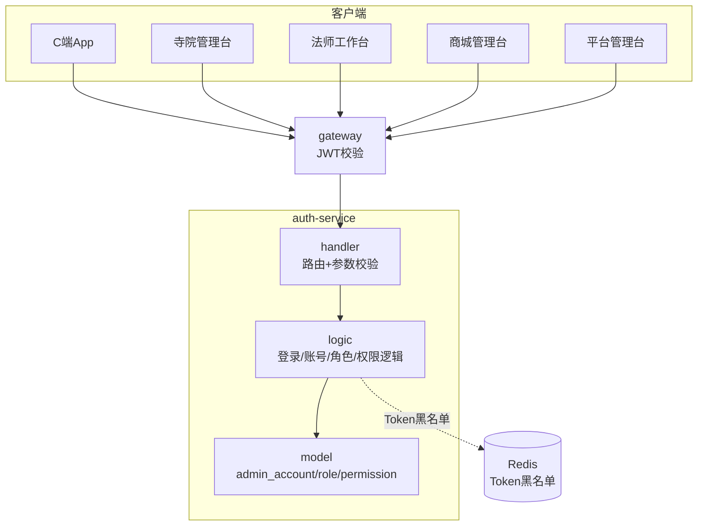
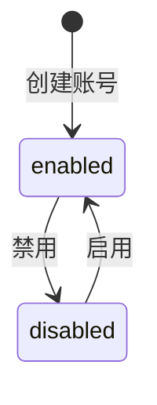

# auth-service 认证服务设计文档

> **文档版本**: v1.0
> **创建日期**: 2026-07-01
> **服务端口**: 8081
> **业务域**: 核心业务域
> **关联文档**: [技术架构](../技术架构.md) | [API规范](../API规范.md) | [状态机](../状态机.md) | [业务流程](../业务流程.md) | [管理端架构](../../product/管理端架构.md)

---

## 1. 服务职责

auth-service 负责全平台认证鉴权，覆盖 5 端登录与权限管理：

- C 端 / 法师端 / 管理台多端登录（手机号+验证码 / 账号+密码）
- Access Token 签发（2h）与 Refresh Token 续期（7d）
- 登出与 Token 失效
- 管理台账号管理（admin_account）：创建/启停/编辑
- 角色管理（role）：RBAC 角色定义
- 权限管理（permission）：资源+动作粒度的权限项
- 角色与权限的映射（role_permission）
- **OpenIM 集成**（best-effort）：C 端用户登录时同步注册并获取 IMToken。iOS 已集成 SDK；服务实际可用性由运行时健康检查确认

---

## 2. 架构图

---

## 3. 数据表设计

### 3.1 admin_account（管理台账号表）

| 字段 | 类型 | 说明 |
|------|------|------|
| id | BIGINT AUTO_INCREMENT | 主键 |
| account | VARCHAR(64) | 登录账号（唯一） |
| password | VARCHAR(128) | 当前兼容存量明文；生产迁移目标为 bcrypt/Argon2id |
| name | VARCHAR(64) | 姓名 |
| role_id | BIGINT | 角色 ID |
| temple_id | VARCHAR(16) | 绑定寺院编码（寺院管理员必填） |
| master_id | VARCHAR(16) | 绑定法师编码（法师账号必填） |
| shop_id | BIGINT | 绑定商城 ID（商城运营） |
| status | VARCHAR(16) | 状态：enabled/disabled |
| last_login_time | DATETIME | 最后登录时间 |
| create_time | DATETIME | 创建时间 |

### 3.2 role（角色表）

| 字段 | 类型 | 说明 |
|------|------|------|
| id | BIGINT AUTO_INCREMENT | 主键 |
| name | VARCHAR(64) | 角色名称 |
| code | VARCHAR(64) | 角色编码（如 temple_admin/master/platform_super） |
| description | VARCHAR(256) | 描述 |
| create_time | DATETIME | 创建时间 |

### 3.3 permission（权限表）

| 字段 | 类型 | 说明 |
|------|------|------|
| id | BIGINT AUTO_INCREMENT | 主键 |
| code | VARCHAR(128) | 权限编码（如 temple:create） |
| name | VARCHAR(64) | 权限名称 |
| resource | VARCHAR(64) | 资源（如 temple/master/booking） |
| action | VARCHAR(32) | 动作（create/read/update/delete） |
| create_time | DATETIME | 创建时间 |

### 3.4 role_permission（角色权限关联表）

| 字段 | 类型 | 说明 |
|------|------|------|
| id | BIGINT AUTO_INCREMENT | 主键 |
| role_id | BIGINT | 角色 ID |
| permission_id | BIGINT | 权限 ID |

---

## 4. 接口清单

### 4.1 C端/通用认证接口（公开或需JWT）

| 方法 | 路径 | 说明 | 请求 | 响应 | 角色 |
|------|------|------|------|------|------|
| POST | /api/v1/auth/login | 登录（手机号+验证码/账号+密码） | LoginReq | LoginResp | 公开 |
| POST | /api/v1/auth/refresh | 续期 Token | RefreshReq | RefreshResp | 公开 |
| POST | /api/v1/auth/logout | 登出 | LogoutReq | LogoutResp | 已登录 |
| POST | /api/v1/auth/admin/login | 管理台登录（account+password） | AdminLoginReq | LoginResp | 公开 |

### 4.2 管理台账号接口（平台超管）

| 方法 | 路径 | 说明 | 请求 | 响应 | 角色 |
|------|------|------|------|------|------|
| GET | /api/v1/admin/auth/accounts | 账号列表 | AdminAccountListReq | AdminAccountListResp | platform_super |
| POST | /api/v1/admin/auth/accounts | 创建账号 | AdminAccountCreateReq | AdminAccountCreateResp | platform_super |
| PUT | /api/v1/admin/auth/accounts/:id | 更新账号 | AdminAccountUpdateReq | AdminAccount | platform_super |
| PUT | /api/v1/admin/auth/accounts/:id/status | 启停账号 | AdminAccountStatusReq | AdminAccountStatusResp | platform_super |

寺院管理员账号必须绑定真实 `templeId`。账号创建、角色/寺院改绑与 `askxuan_temple.temple_admin` 关系在同一数据库事务完成；`auth_user` 仅获该关系表的查询、插入和删除权限，不拥有寺院业务表写权限。待审核或封禁寺院的账号自动保持停用，平台不能通过账号启用接口绕过寺院审核状态；登录时还会实时复核寺院状态，防止寺院封禁后旧账号继续登录。演示数据为每座寺院预置一个独立账号，生产环境不得沿用演示密码。

Master App 账号由平台管理台统一分发，并绑定唯一 `masterId`；同一大师不能重复绑定主账号。创建、启用和登录都会复核大师认证状态、平台状态及所属寺院状态。寺院管理台只负责大师资料建档和日常维护，大师本人只使用已分配账号，不参与账号创建或分发。初始化数据为 10 位虚构演示大师各预置一个独立账号，其中待审核的 M005 账号保持停用。

### 4.3 角色与权限接口

| 方法 | 路径 | 说明 | 请求 | 响应 | 角色 |
|------|------|------|------|------|------|
| GET | /api/v1/admin/auth/roles | 角色列表 | - | RoleListResp | platform_super |
| POST | /api/v1/admin/auth/roles | 创建角色 | RoleCreateReq | RoleCreateResp | platform_super |
| PUT | /api/v1/admin/auth/roles/:id | 更新角色 | RoleUpdateReq | Role | platform_super |
| GET | /api/v1/admin/auth/permissions | 权限列表 | - | PermissionListResp | platform_super |

---

## 5. 状态机

admin_account 账号状态机：

| 状态 | 中文名 | 说明 |
|------|--------|------|
| enabled | 启用 | 可登录 |
| disabled | 禁用 | 不可登录 |

> 角色 / 权限为静态配置数据，无状态机。多端登录鉴权引用 [API规范 3.1 JWT Token](../API规范.md)。

---

## 6. 业务逻辑要点

1. **多端登录**：C 端走 `/auth/login`，管理台走 `/auth/admin/login`，均签发 JWT
2. **当前开发凭证**：C 端登录验证码固定为 `1234`；C 端注册不发送或校验真实短信，注册成功后客户端自动登录。存量用户/管理账号存在明文密码兼容；这不是生产实现
3. **生产阻断**：短信 Provider、Redis 验证码生命周期、频控/防爆破和密码哈希迁移完成前禁止生产发布
4. **角色绑定**：创建账号时绑定 role_id，寺院管理员须填 temple_id，法师账号须填 master_id
5. **数据隔离**：temple_admin 仅本寺院数据，master 仅本人数据，platform_super 全平台
6. **登出**：将 Access Token 加入 Redis 黑名单至过期
7. **账号启停**：disabled 状态账号登录直接拒绝（ErrUserDisabled）
8. **OpenIM best-effort 集成**：C 端用户登录成功后调用 `RegisterUser` + `GetUserToken`；OpenIM 不可用时 IMToken 为空且登录仍成功。运行状态必须由全栈健康检查确认，不能由配置文件推断

---

## 7. 依赖关系

| 依赖类型 | 依赖 | 说明 |
|---------|------|------|
| Redis | Token 黑名单 | 登出失效；验证码存储尚未接入 |
| MySQL | askxuan_auth.admin_account/role/permission + askxuan.user | 账号与权限持久化（跨库查询） |
| OpenIM | IM 服务（REST API :10002） | 用户同步注册 + 获取 IMToken（best-effort，不可用时降级） |
| gateway | JWT 校验 | 网关层统一校验 Access Token |

---

## 版本记录

| 版本 | 日期 | 说明 |
|------|------|------|
| v1.0 | 2026-07-01 | 扩展管理端：管理台登录/账号/角色/权限 |
| v1.2 | 2026-07-18 | 如实标注固定开发验证码与明文密码迁移阻断项 |
| v1.1 | 2026-07-02 | 补充 OpenIM best-effort 集成说明 + 跨库表名前缀（askxuan_auth） |
