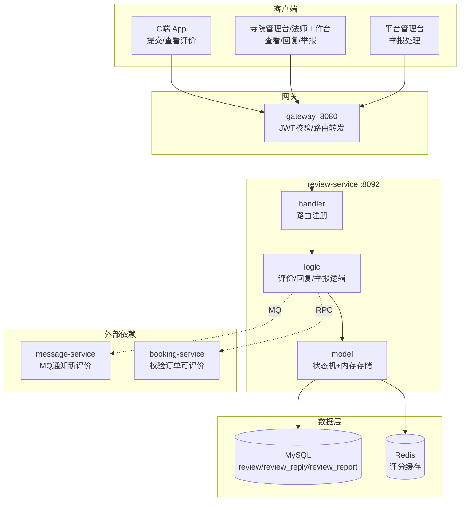

# review-service 评价服务设计文档

> **文档版本**: v1.0
> **创建日期**: 2026-07-01
> **服务端口**: 8092
> **业务域**: 平台支撑域
> **关联文档**: [技术架构](../技术架构.md) | [状态机](../状态机.md) | [业务流程](../业务流程.md) | [API规范](../API规范.md) | [管理端架构](../../product/管理端架构.md)

---

## 1. 服务职责

review-service 是问玄东方平台的评价管理中枢，支撑用户评价、商户回复、举报处理的全链路。核心职责包括：

- **评价提交**：C端用户对预约订单/DIY订单/商城订单提交评价（1-5星评分 + 文字 + 图片）
- **评价展示**：C端按目标对象（寺院/法师/商品）查询评价列表
- **评价回复**：寺院管理员/法师/平台客服回复用户评价
- **评价举报**：寺院/法师对不当评价发起举报，提交平台处理
- **举报处理**：平台客服/超管处理举报工单（通过/驳回/隐藏评价）
- **评价隐藏**：平台可隐藏违规评价，对用户不可见

---

## 2. 架构图



---

## 3. 数据表设计

### 3.1 review（评价）

| 字段 | 类型 | 说明 |
|------|------|------|
| id | bigint PK | 主键 |
| review_no | varchar(32) | 评价单号 RV20260701001 |
| user_id | varchar(16) | 用户ID |
| target_type | varchar(16) | 评价目标类型：booking/diy_order/shop_order |
| target_id | varchar(32) | 目标ID（预约单号/订单号） |
| rating | int | 评分 1-5 |
| content | text | 评价内容 |
| images | json | 图片URL数组 |
| status | varchar(16) | 状态：normal/hidden |
| create_time | datetime | 创建时间 |

### 3.2 review_reply（评价回复）

| 字段 | 类型 | 说明 |
|------|------|------|
| id | bigint PK | 主键 |
| review_id | bigint | 关联评价ID |
| replier_type | varchar(16) | 回复者类型：temple_admin/master/platform |
| replier_id | varchar(16) | 回复者ID |
| content | text | 回复内容 |
| create_time | datetime | 创建时间 |

### 3.3 review_report（评价举报）

| 字段 | 类型 | 说明 |
|------|------|------|
| id | bigint PK | 主键 |
| review_id | bigint | 关联评价ID |
| reporter_id | varchar(16) | 举报人ID |
| reason | varchar(256) | 举报原因 |
| status | varchar(16) | 状态：pending/handled/rejected |
| handle_result | varchar(256) | 处理结果说明 |
| create_time | datetime | 创建时间 |

---

## 4. 接口清单

### C端接口

| # | 方法 | 路径 | 说明 |
|---|------|------|------|
| 1 | POST | /api/v1/reviews | 提交评价 |
| 2 | GET | /api/v1/reviews | 评价列表（按target查询） |
| 3 | GET | /api/v1/reviews/:id | 评价详情 |

### 寺院台/法师台接口

| # | 方法 | 路径 | 说明 |
|---|------|------|------|
| 4 | GET | /api/v1/admin/reviews | 评价管理列表 |
| 5 | GET | /api/v1/admin/reviews/:id | 评价详情 |
| 6 | POST | /api/v1/admin/reviews/:id/reply | 回复评价 |
| 7 | POST | /api/v1/admin/reviews/:id/report | 举报评价 |

### 平台台接口

| # | 方法 | 路径 | 说明 |
|---|------|------|------|
| 8 | GET | /api/v1/admin/platform/reviews/reports | 举报列表 |
| 9 | PUT | /api/v1/admin/platform/reviews/reports/:id/handle | 处理举报 |

---

## 5. 状态机

### 5.1 评价状态

```
normal ←→ hidden（平台隐藏/恢复）
```

| 当前状态 | 允许操作 | 目标状态 | 操作角色 |
|---------|---------|---------|---------|
| normal | 隐藏评价 | hidden | 平台超管/客服 |
| hidden | 恢复显示 | normal | 平台超管 |

### 5.2 举报状态

```
pending → handled（处理完成，可隐藏评价）
       → rejected（驳回举报，评价保持正常）
```

| 当前状态 | 允许操作 | 目标状态 | 操作角色 |
|---------|---------|---------|---------|
| pending | 处理举报 | handled | 平台客服 |
| pending | 驳回举报 | rejected | 平台客服 |

---

## 6. 业务逻辑

### 6.1 评价提交流程

1. 用户完成订单后（预约reviewed / 商城completed），7天内可评价
2. 校验订单状态与评价期限
3. 写入 review 记录（status=normal）
4. 发送 MQ review.notify 通知寺院/法师
5. 更新订单关联评价状态

### 6.2 评价回复流程

1. 寺院管理员/法师查看本寺院/本人相关评价
2. 填写回复内容，写入 review_reply
3. 回复后用户端可见

### 6.3 举报处理流程

1. 寺院/法师对不当评价发起举报（status=pending）
2. 平台客服查看举报列表
3. 处理举报：handled（隐藏评价）或 rejected（驳回，评价保持正常）
4. 记录处理结果说明

---

## 7. 依赖关系

| 依赖类型 | 依赖服务 | 用途 |
|---------|---------|------|
| RPC | booking-service | 校验预约订单可评价状态 |
| MQ生产 | message-service | 发送 review.notify 新评价通知 |
| 数据库 | MySQL | review/review_reply/review_report |
| 缓存 | Redis | 寺院/法师评分缓存 |

---

## 版本记录

| 版本 | 日期 | 说明 |
|------|------|------|
| v1.0 | 2026-07-01 | 初始版本：评价服务设计 |
