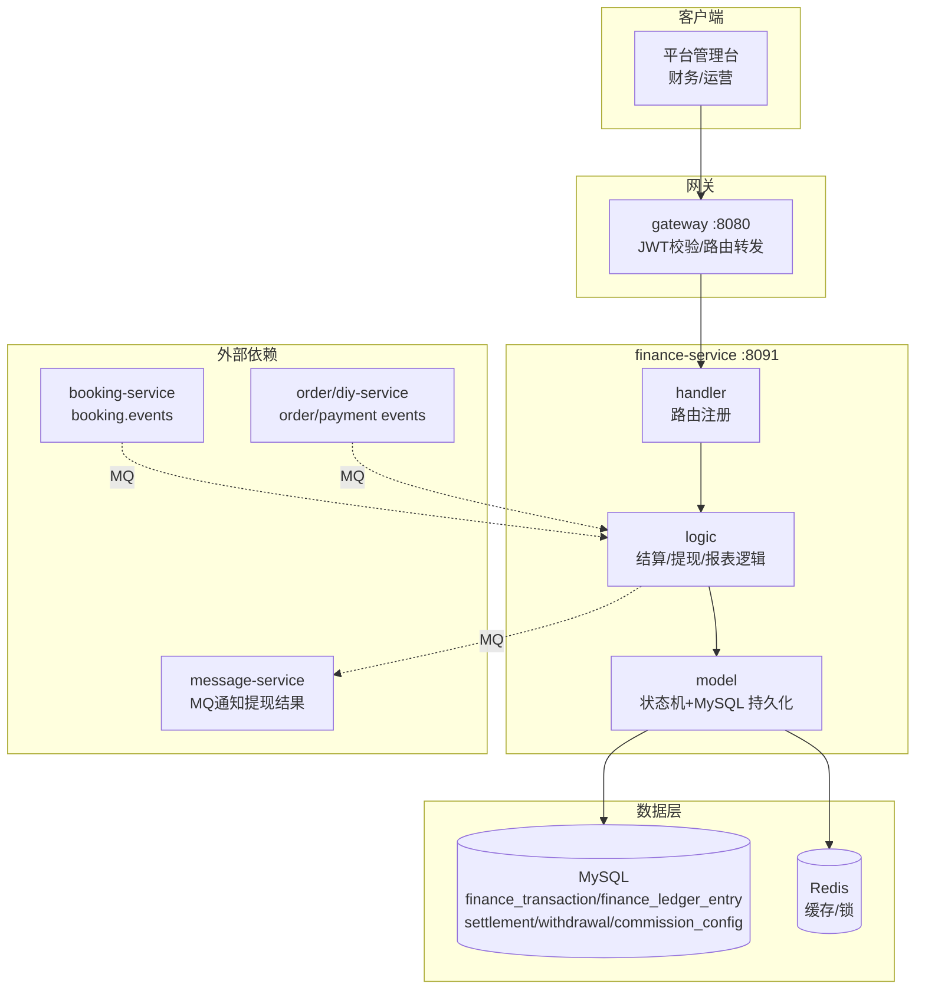

# finance-service 财务服务设计文档

> **文档版本**: v1.0
> **创建日期**: 2026-07-01
> **服务端口**: 8091
> **业务域**: 平台支撑域
> **关联文档**: [技术架构](../技术架构.md) | [状态机](../状态机.md) | [业务流程](../业务流程.md) | [API规范](../API规范.md) | [管理端架构](../../product/管理端架构.md)

---

## 1. 服务职责

finance-service 是问玄东方平台的财务结算中枢，负责全平台资金流转的核算与管理。核心职责包括：

- **寺院结算**：按月汇总寺院预约订单收入，计算平台抽成与寺院实得金额
- **法师结算**：按月汇总法师服务收入与加持收入，计算分账
- **商城结算**：按月汇总商城商品/DIY订单收入，计算商城运营实得
- **提现管理**：处理寺院/法师/商城的提现申请，走审核→打款流程
- **平台抽成配置**：按业务类型（预约/DIY/商城）配置抽成比例
- **财务报表**：提供收入总览、结算明细、时间段报表

详细业务说明参见 [管理端架构 3.4.6 财务管理](../../product/管理端架构.md)。

---

## 2. 架构图



---

## 3. 数据表设计

### 3.1 settlement（结算单）

| 字段 | 类型 | 说明 |
|------|------|------|
| id | bigint PK | 主键 |
| settlement_no | varchar(32) | 结算单号 SET20260701001 |
| settle_type | varchar(16) | 结算类型：temple/master/shop |
| target_id | varchar(16) | 结算对象ID（寺院ID/法师ID/商城ID） |
| target_name | varchar(64) | 结算对象名称 |
| period_start | datetime | 结算周期开始 |
| period_end | datetime | 结算周期结束 |
| order_count | int | 订单数量 |
| total_amount | decimal(12,2) | 订单总金额 |
| commission_rate | decimal(5,4) | 平台抽成比例 |
| commission_amount | decimal(12,2) | 平台抽成金额 |
| settle_amount | decimal(12,2) | 实结金额 |
| status | varchar(16) | 状态：pending/confirmed/paid |
| source_type | varchar(32) | 来源业务类型 |
| source_no | varchar(64) | 来源业务单号 |
| create_time | datetime | 创建时间 |

### 3.2 withdrawal（提现申请）

| 字段 | 类型 | 说明 |
|------|------|------|
| id | bigint PK | 主键 |
| withdrawal_no | varchar(32) | 提现单号 WD20260701001 |
| applicant_type | varchar(16) | 申请方类型：temple/master/shop |
| applicant_id | varchar(16) | 申请方ID |
| amount | decimal(12,2) | 提现金额 |
| bank_card | varchar(32) | 收款银行卡号 |
| status | varchar(16) | 状态：pending/approved/processing/success/failed/rejected |
| audit_time | datetime | 审核时间 |
| process_time | datetime | 打款时间 |
| create_time | datetime | 创建时间 |

### 3.3 commission_config（抽成配置）

| 字段 | 类型 | 说明 |
|------|------|------|
| id | bigint PK | 主键 |
| biz_type | varchar(16) | 业务类型：booking/diy_blessing/diy_material/shop_order |
| rate | decimal(5,4) | 抽成比例（如0.15表示15%） |
| description | varchar(128) | 描述 |
| update_time | datetime | 更新时间 |

### 3.4 finance_log（财务流水）

| 字段 | 类型 | 说明 |
|------|------|------|
| id | bigint PK | 主键 |
| settlement_id | bigint | 关联结算单ID |
| amount | decimal(12,2) | 金额 |
| type | varchar(8) | 类型：income/expense |
| description | varchar(128) | 描述 |
| create_time | datetime | 创建时间 |

### 3.5 finance_transaction / finance_ledger_entry（平台总账）

`finance_transaction` 以业务来源和事件类型记录支付收款、预约分账等不可变事务；`finance_ledger_entry` 保存每个事务的借贷科目、目标对象和金额。任何已入账事务都必须借贷平衡，且通过业务来源唯一键防止重复收款或重复分账。

---

## 4. 接口清单

| # | 方法 | 路径 | 说明 | 角色 |
|---|------|------|------|------|
| 1 | GET | /api/v1/admin/finance/overview | 收入总览 | 平台超管 |
| 2 | GET | /api/v1/admin/finance/settlements | 结算列表（按类型筛选） | 平台超管 |
| 3 | GET | /api/v1/admin/finance/settlements/:id | 结算详情 | 平台超管 |
| 4 | POST | /api/v1/admin/finance/settlements/confirm/:id | 确认结算 | 平台超管 |
| 5 | GET | /api/v1/admin/finance/withdrawals | 提现申请列表 | 平台超管 |
| 6 | PUT | /api/v1/admin/finance/withdrawals/:id/audit | 审核提现（approve/reject） | 平台超管 |
| 7 | PUT | /api/v1/admin/finance/withdrawals/:id/process | 打款 | 平台超管 |
| 8 | GET | /api/v1/admin/finance/commission-config | 抽成配置列表 | 平台超管 |
| 9 | PUT | /api/v1/admin/finance/commission-config/:id | 修改抽成比例 | 平台超管 |
| 10 | GET | /api/v1/admin/finance/reports | 财务报表（支持时间范围） | 平台超管 |

> 财务报表以 `finance_transaction` 平台总账为收退款事实源，净收入 = 已入账收款 - 已入账退款；结算以 `settlement.settle_amount` 统计，提现仅统计 `success` 且以 `process_time` 归期。商品排行属于订单域，由 `/api/v1/admin/orders/report` 返回，财务服务不再伪造商品数据。

---

## 5. 状态机

### 5.1 提现状态机

详见 [状态机.md 第6节 提现状态机](../状态机.md#6-提现状态机finance-service)。

```
pending → approved → processing → success
   │                      │
   └→ rejected      failed → processing(重试)
```

| 当前状态 | 允许操作 | 目标状态 | 操作角色 |
|---------|---------|---------|---------|
| pending | 审核通过 | approved | 平台超管 |
| pending | 审核拒绝 | rejected | 平台超管 |
| approved | 发起打款 | processing | 平台财务 |
| processing | 打款成功 | success | 系统 |
| processing | 打款失败 | failed | 系统 |
| failed | 重新打款 | processing | 平台财务 |

### 5.2 结算单状态

```
pending → confirmed → paid
```

| 当前状态 | 允许操作 | 目标状态 |
|---------|---------|---------|
| pending | 确认结算 | confirmed |
| confirmed | 打款完成 | paid |

---

## 6. 业务逻辑

### 6.1 结算流程

1. payment-service 支付成功后，finance-service 先将全额记入平台总账：借记 `platform_cash`、贷记 `customer_funds_held`
2. 预约付款阶段只形成平台托管资金，不直接写入大师收益
3. 预约进入 `reviewed` 后，finance-service 读取预约不可变价格快照和 `commission_config`
4. 服务费扣除平台抽成后形成大师应付；功德金扣除平台抽成后形成寺院应付；平台抽成、两方应付之和必须等于付款总额
5. 同一事务写入平衡的 `finance_transaction` / `finance_ledger_entry` 和幂等 `settlement`，再通知大师工作台记录净分成
6. 平台超管确认结算（status: pending → confirmed），提现打款完成后更新为 paid

付款、分账均以 `source_type + source_no + event_type` 保证幂等。支付金额与预约价格快照不一致、总账未收到付款或借贷不平衡时，禁止生成结算单。

### 6.2 DIY订单复杂分账

DIY订单总额 = 材料费 + 加持费，分账规则：
- 材料费 → 商城运营收入（扣除平台抽成）
- 加持费 → 寺院/法师收入（扣除平台抽成15%）
- 平台抽成 → 按各 biz_type 的 commission_config 比例

### 6.3 提现流程

1. 寺院/法师/商城发起提现申请（status=pending）
2. 平台超管审核（approve → approved / reject → rejected）
3. 财务发起打款（approved → processing）
4. 当前本地 Provider 模拟打款结果；生产必须接银行/代付 Provider 和回调后才能进入 success / failed
5. failed 可重新打款（failed → processing）

---

## 7. 依赖关系

| 依赖类型 | 依赖服务 | 用途 |
|---------|---------|------|
| MQ消费 | booking-service | 消费 booking.status 事件触发结算 |
| MQ消费 | payment-service | 消费 payment.notify 事件 |
| MQ生产 | message-service | 发送 withdrawal.notify 提现结果通知 |
| 数据库 | MySQL | settlement/withdrawal/commission_config/finance_log |
| 缓存 | Redis | 抽成配置缓存、提现分布式锁 |

---

## 版本记录

| 版本 | 日期 | 说明 |
|------|------|------|
| v1.1 | 2026-07-18 | 对齐 MySQL 持久化和事件驱动，标注报表读模型与生产代付 Provider 缺口 |
| v1.0 | 2026-07-01 | 初始版本：财务服务设计 |
