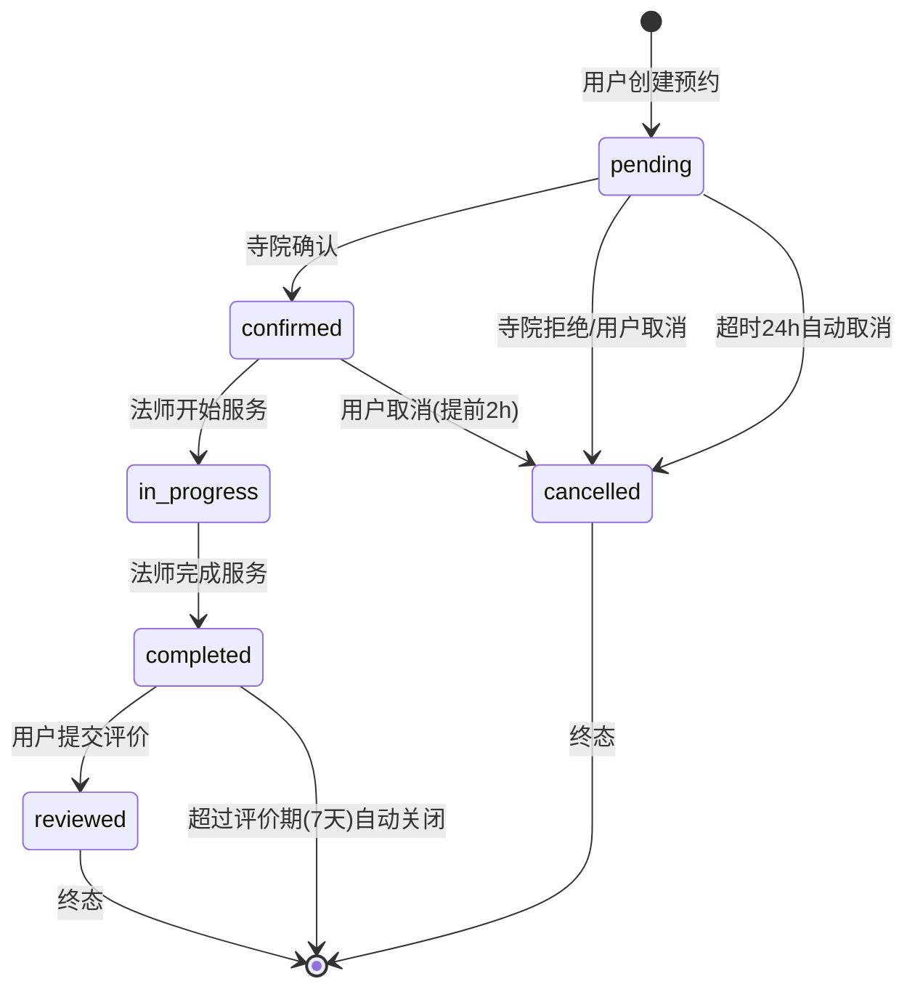

# booking-service 预约服务设计文档

> **文档版本**: v1.0
> **创建日期**: 2026-07-01
> **服务端口**: 8085
> **业务域**: 核心业务域
> **关联文档**: [技术架构](../技术架构.md) | [API规范](../API规范.md) | [状态机](../状态机.md) | [业务流程](../业务流程.md) | [管理端架构](../../product/管理端架构.md)

---

## 1. 服务职责

booking-service 负责预约全生命周期管理：

- C 端预约创建/列表/详情/状态查询
- C 端预约评价提交与查看
- 寺院管理台：预约列表、确认/取消/完成、状态变更日志
- 超时自动取消（pending 超时未确认）
- MQ 通知 message-service

---

## 2. 架构图

```mermaid
graph TB
    subgraph 客户端
        C1[C端App]
        C2[寺院管理台]
    end

    subgraph booking-service
        HANDLER[handler<br/>路由+参数校验]
        LOGIC[logic<br/>预约/评价/状态流转]
        MODEL[model<br/>booking/booking_review/booking_status_log]
        MQ[mq<br/>通知生产者]
    end

    GW[gateway]
    TEMPLE[temple-service<br/>时段/服务校验]
    MASTER[master-service<br/>法师校验]
    MSG[message-service<br/>站内消息]

    C1 --> GW
    C2 --> GW
    GW --> HANDLER
    HANDLER --> LOGIC
    LOGIC --> MODEL
    LOGIC -.RPC.-> TEMPLE
    LOGIC -.RPC.-> MASTER
    LOGIC -.booking.notify MQ.-> MSG
```

---

## 3. 数据表设计

### 3.1 booking（预约表，已有）

| 字段 | 类型 | 说明 |
|------|------|------|
| id | VARCHAR(32) | 预约单号 B+yyyyMMdd+序号 |
| user_id | VARCHAR(16) | 用户ID |
| temple_id | VARCHAR(16) | 寺院编码 |
| master_id | VARCHAR(16) | 法师编码 |
| service_id | VARCHAR(16) | 服务编码 |
| booking_date | DATE | 预约日期 |
| time_slot | VARCHAR(32) | 时段 |
| merit_money | DECIMAL(10,2) | 功德金 |
| status | VARCHAR(16) | pending/confirmed/in_progress/completed/cancelled/reviewed |
| note | TEXT | 备注 |
| created_at | DATETIME | 创建时间 |

### 3.2 booking_review（预约评价表）

| 字段 | 类型 | 说明 |
|------|------|------|
| id | BIGINT AUTO_INCREMENT | 主键 |
| booking_id | VARCHAR(32) | 预约单号 |
| user_id | VARCHAR(16) | 用户ID |
| rating | INT | 评分 1-5 |
| content | TEXT | 评价内容 |
| images | JSON | 评价图片URL数组 |
| master_reply | TEXT | 法师回复 |
| create_time | DATETIME | 创建时间 |

### 3.3 booking_status_log（状态变更日志表）

| 字段 | 类型 | 说明 |
|------|------|------|
| id | BIGINT AUTO_INCREMENT | 主键 |
| booking_id | VARCHAR(32) | 预约单号 |
| from_status | VARCHAR(16) | 原状态 |
| to_status | VARCHAR(16) | 新状态 |
| operator_id | VARCHAR(16) | 操作人ID |
| operator_type | VARCHAR(16) | 操作人类型 user/temple_admin/system |
| remark | VARCHAR(256) | 备注 |
| create_time | DATETIME | 变更时间 |

---

## 4. 接口清单

### 4.1 C端接口

| 方法 | 路径 | 说明 | 请求 | 响应 | 角色 |
|------|------|------|------|------|------|
| POST | /api/v1/booking | 创建预约 | CreateReq | CreateResp | customer |
| GET | /api/v1/booking | 预约列表 | ListReq | ListResp | customer |
| GET | /api/v1/booking/:id | 预约详情 | DetailReq | Booking | customer |
| PUT | /api/v1/booking/:id/status | 状态流转 | StatusReq | StatusResp | customer |
| POST | /api/v1/booking/:id/review | 提交评价 | ReviewCreateReq | ReviewCreateResp | customer |
| GET | /api/v1/booking/:id/review | 查看评价 | ReviewDetailReq | BookingReview | customer |

### 4.2 寺院管理台接口（需JWT + 寺院管理员）

| 方法 | 路径 | 说明 | 请求 | 响应 | 角色 |
|------|------|------|------|------|------|
| GET | /api/v1/admin/bookings | 预约列表（寺院维度） | AdminBookingListReq | AdminBookingListResp | temple_admin |
| GET | /api/v1/admin/bookings/:id | 预约详情 | DetailReq | Booking | temple_admin |
| PUT | /api/v1/admin/bookings/:id/confirm | 确认预约 | AdminBookingActionReq | StatusResp | temple_admin |
| PUT | /api/v1/admin/bookings/:id/complete | 完成预约 | AdminBookingActionReq | StatusResp | temple_admin |
| PUT | /api/v1/admin/bookings/:id/cancel | 取消预约 | AdminBookingActionReq | StatusResp | temple_admin |
| PUT | /api/v1/admin/bookings/:id/timeout-cancel | 超时取消 | AdminBookingActionReq | StatusResp | temple_admin |
| GET | /api/v1/admin/bookings/:id/status-log | 状态变更日志 | StatusLogReq | StatusLogResp | temple_admin |
| PUT | /api/v1/admin/bookings/:id/review/reply | 法师回复评价 | ReviewReplyReq | BookingReview | temple_admin |

---

## 5. 状态机

### 5.1 预约状态机（引用 状态机.md 1）



> 状态流转前校验 `model.CanTransit`，每次流转写入 `booking_status_log`。

---

## 6. 业务逻辑要点

1. **创建预约**：校验寺院/法师/服务存在性，时段可用性，生成单号，status=pending
2. **确认预约**：寺院管理台确认 pending → confirmed
3. **完成预约**：法师标记 in_progress → completed
4. **取消预约**：用户/寺院均可取消，pending/confirmed → cancelled
5. **超时取消**：系统定时任务扫描 pending 超时（24小时未确认）自动取消
6. **评价**：仅 completed 状态可评价，每单仅可评价一次，评价期限 7 天，超期自动关闭
7. **法师回复**：寺院管理台可回复用户评价
8. **状态日志**：每次状态流转记录操作人、前后状态、备注
9. **MQ通知**：创建/确认/完成/取消均发 booking.notify 事件

---

## 7. 依赖关系

| 依赖类型 | 依赖 | 说明 |
|---------|------|------|
| RPC | temple-service | 校验寺院/服务/时段 |
| RPC | master-service | 校验法师归属 |
| MQ | message-service | 发送 booking.notify 站内消息 |
| MySQL | booking/booking_review/booking_status_log | 预约域数据 |

---

## 版本记录

| 版本 | 日期 | 说明 |
|------|------|------|
| v1.0 | 2026-07-01 | 扩展管理端 + 评价/状态日志/超时取消 |
