# 问玄东方 - 业务流程图设计文档

> **文档版本**: v1.0
> **创建日期**: 2026-07-01
> **关联文档**: [技术架构](./技术架构.md) | [状态机](./状态机.md) | [统一数据字典](../standards/统一数据字典.md)

---

## 1. 预约祈福完整流程（核心业务线 1）

### 1.1 端到端流程图

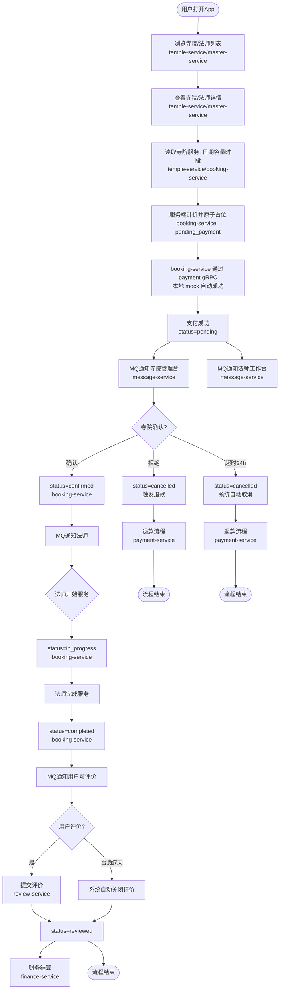

### 1.2 时序图

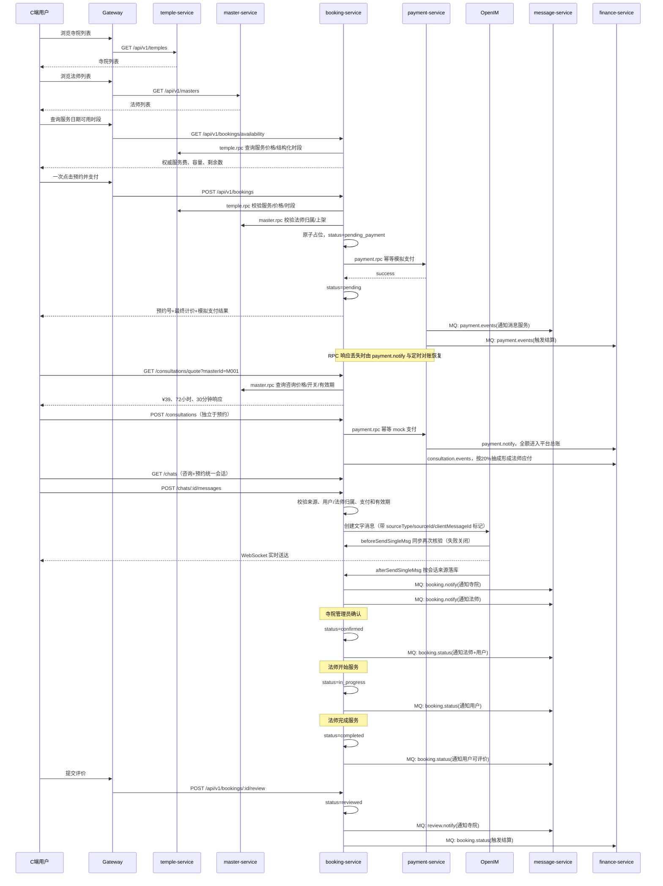

---

## 2. DIY 手串完整流程（核心业务线 2）

### 2.1 端到端流程图


### 2.2 加持任务协同时序图

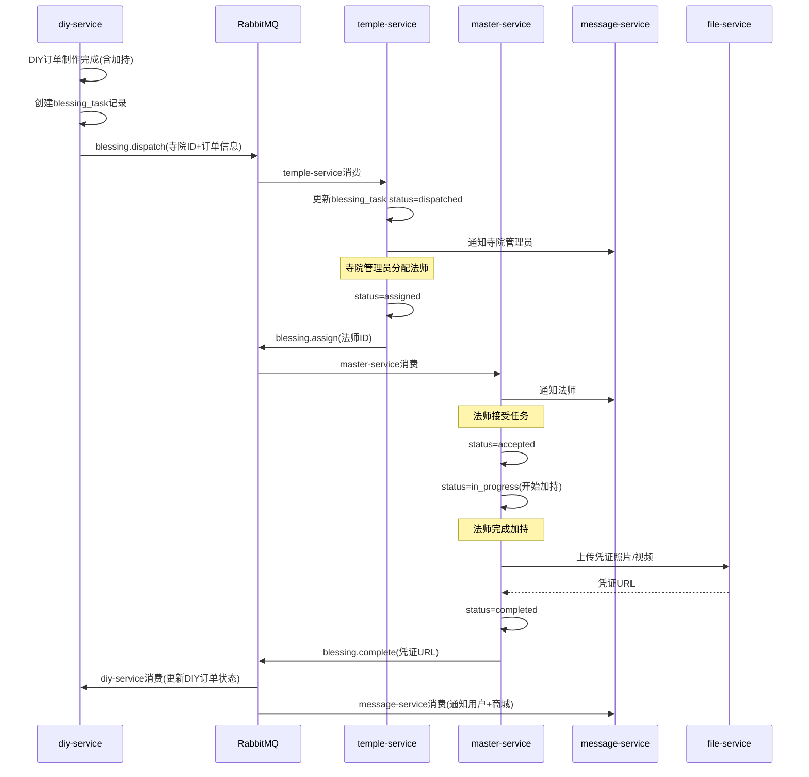

---

## 3. 普通商品购买流程（业务线 3）

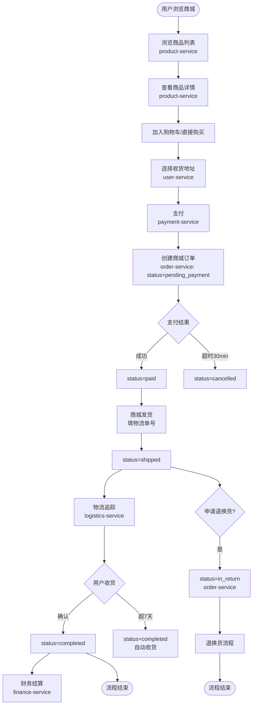

---

## 4. 寺院/法师入驻、上架与账号分配流程（主数据线）

### 4.1 端到端流程图

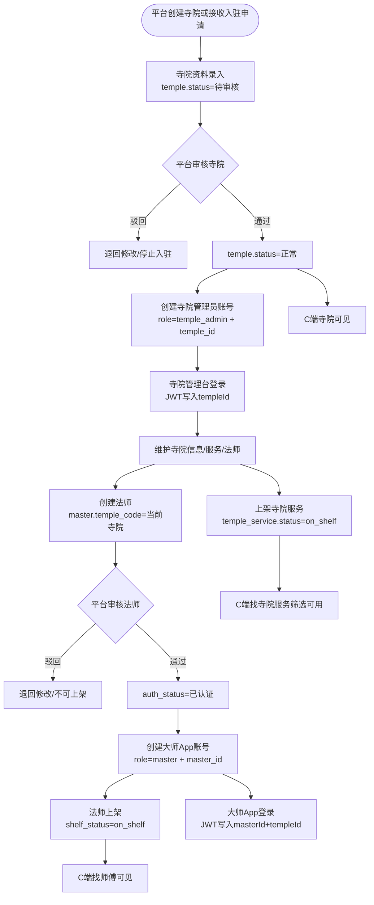

### 4.2 权责边界

| 动作 | 执行端 | 关键约束 |
|------|--------|----------|
| 创建/审核/封禁寺院 | 平台管理台 | 寺院是平台主数据；仅正常状态进入 C端 |
| 创建寺院管理员账号 | 平台管理台 | 账号角色为 `temple_admin`，必须绑定 `temple_id` |
| 维护寺院资料和服务 | 寺院管理台 | 只能操作 JWT 中 `templeId` 对应的寺院 |
| 创建法师 | 寺院管理台 | `master.temple_code` 固定为当前寺院，不允许创建无寺院法师 |
| 审核/封禁法师 | 平台管理台 | 法师审核通过后才能上架 |
| 创建大师 App 账号 | 平台管理台 | 账号角色为 `master`，必须绑定 `master_id`；系统校验该法师所属寺院 |
| C端展示寺院 | C端 App | 只读取后端 `/temples` 的正常寺院和 `serviceTags` |
| C端展示法师 | C端 App | 只读取已认证、已上架、未封禁法师 |

### 4.3 账号登录上下文

管理账号登录成功后，auth-service 根据角色把绑定对象写入 JWT：

| 角色 | JWT上下文 | 使用方 |
|------|-----------|--------|
| `platform_super` | 平台角色 | 平台管理台 |
| `temple_admin` | `templeId` | 寺院管理台、寺院服务、预约服务 |
| `master` | `masterId` + 所属 `templeId` | 大师 App、法师工作台、加持任务、预约服务 |
| `shop_admin` | `shopId` | 商城管理台 |

任何管理端都不得通过前端传参切换管理对象；后端必须以 JWT 中的绑定对象作为数据权限边界。

---

## 5. 寺院入驻审核流程（业务线 4）


---

## 6. 法师入驻认证流程（业务线 5）

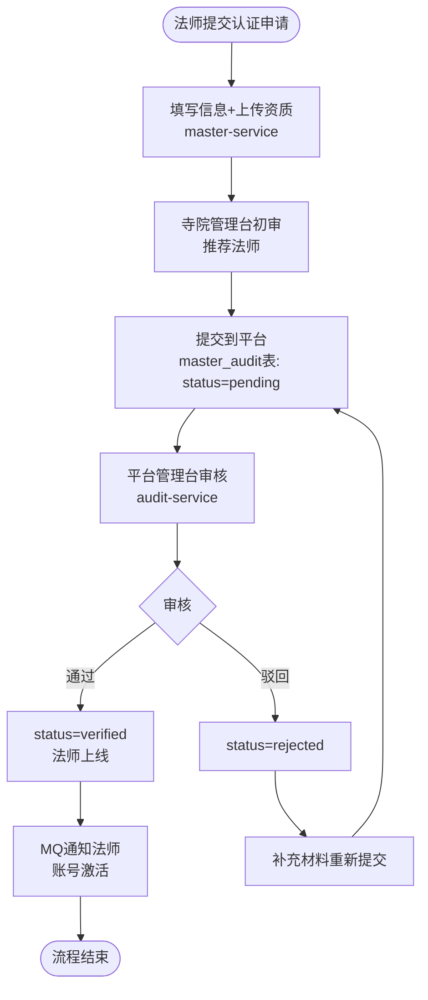

---

## 7. 财务结算流程（业务线 6）

### 7.1 预约订单结算

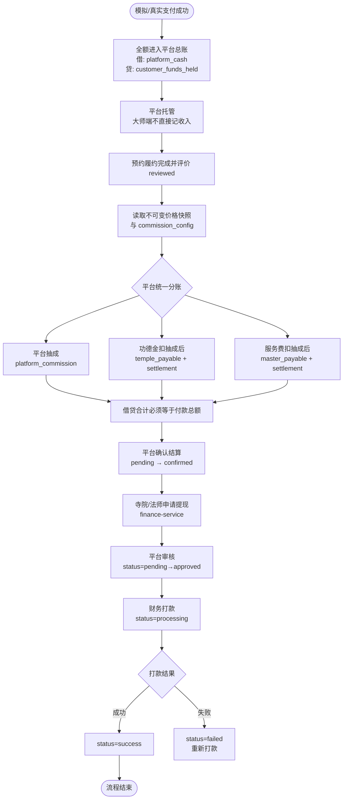

### 7.2 DIY 手串订单结算（复杂分账）

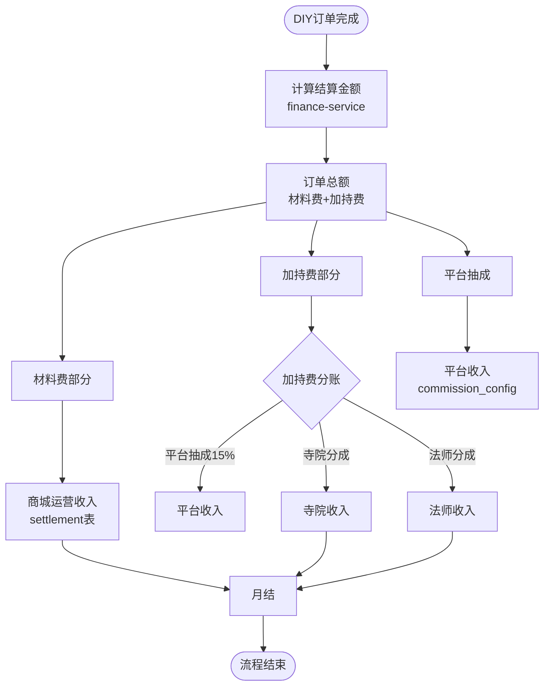

---

## 8. AI 问事流程（业务线 7）

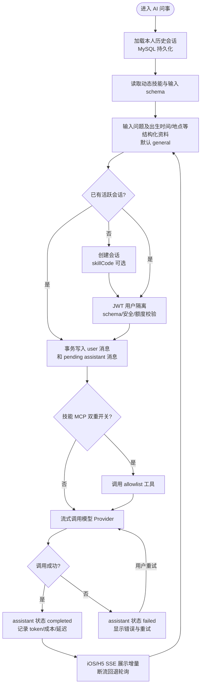

---

## 9. 短视频与直播流程（业务线 8）

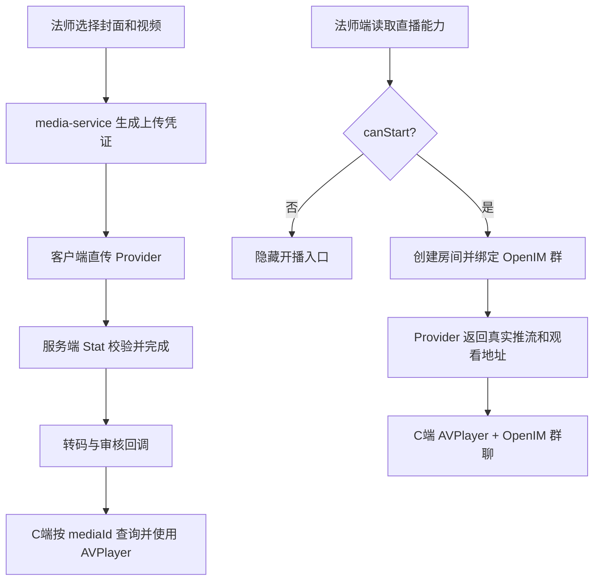

媒体与直播通过可替换 Provider 隔离。首版本地媒体使用 MinIO；生产直播默认关闭，在云账号、密钥、回调域名和 Provider 均配置完成前不展示开播入口。

---

## 10. 大师广场流程（业务线 9）

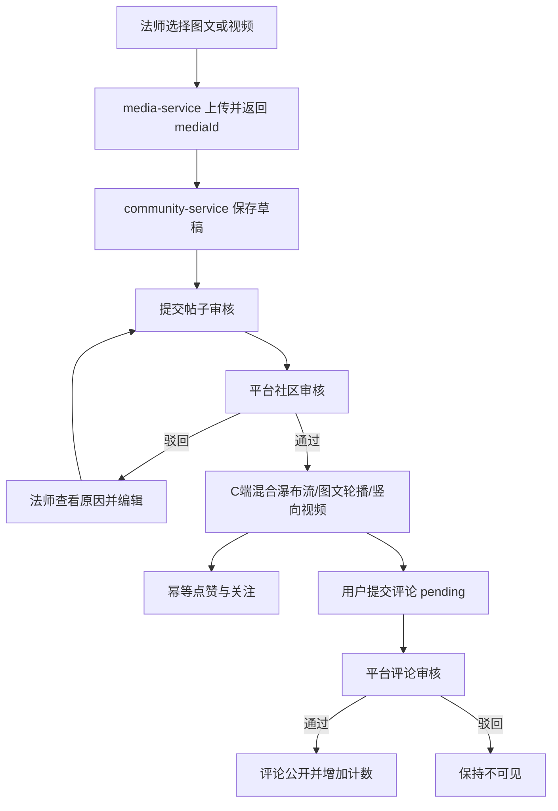

帖子与评论审核由 community-service 作为业务状态的唯一写入口，同时写入 Audit Service 队列和日志。平台管理台不得绕过社区审核接口直接改变通用队列状态。

---

## 版本记录

| 版本 | 日期 | 说明 |
|------|------|------|
| v1.0 | 2026-07-01 | 初始版本：7条核心业务流程图 |
| v1.1 | 2026-07-13 | 新增短视频真实上传、播放与直播能力门禁流程 |
| v1.2 | 2026-07-13 | 新增大师广场发布、审核、互动与评论先审后显闭环 |

---

## 11. 野生大师服务流程（2026-08-16 新增）

```
用户 → 找师傅专栏（仅野生大师，manageBy=platform）
  → 大师详情（服务标签 S001-S013 + 价格 + 一级流派标签）
  → 付费咨询（咨询费，72h 有效）
  → 预约服务（POST /master-bookings，校验已付费咨询 + 标签上架）
  → 模拟支付 → 待大师确认（status=pending）
  → 完成评价 → 平台总账分账（平台 10% / 大师 90%，可配置）
```
寺庙绑定大师直约路径一致，差别在于其同时可从寺院详情页进入（寺庙服务可选指定大师执行）。
