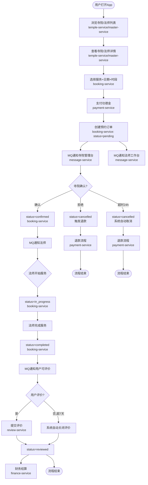
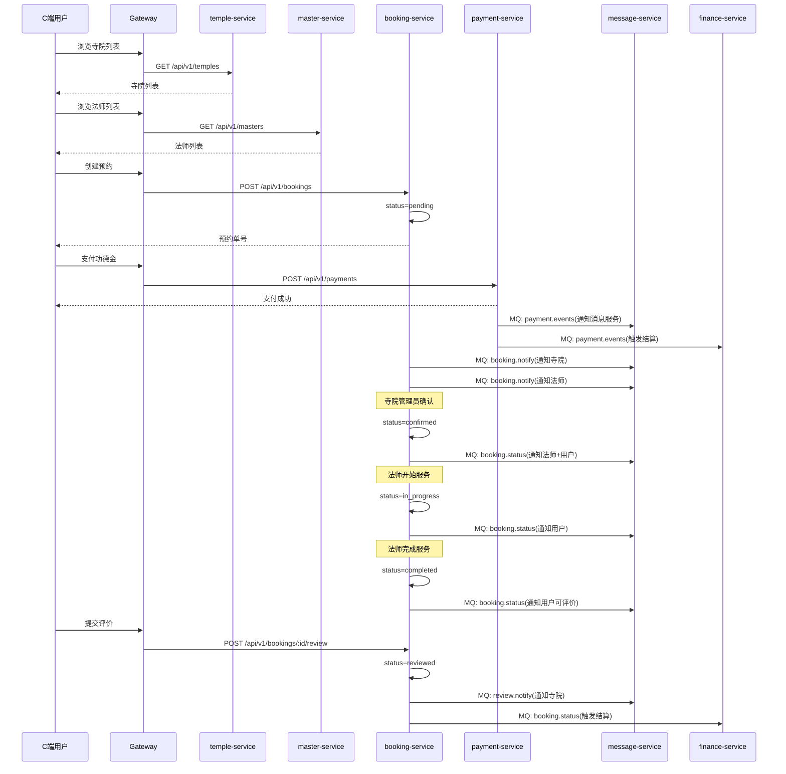
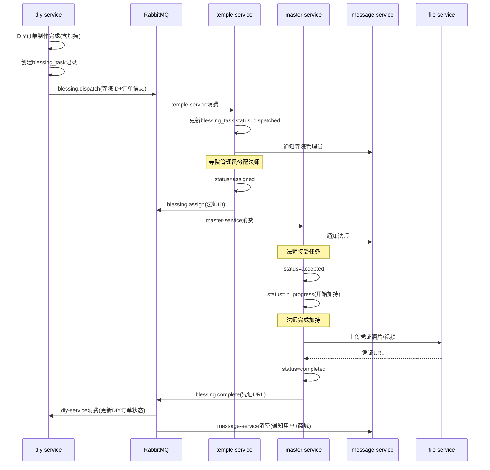
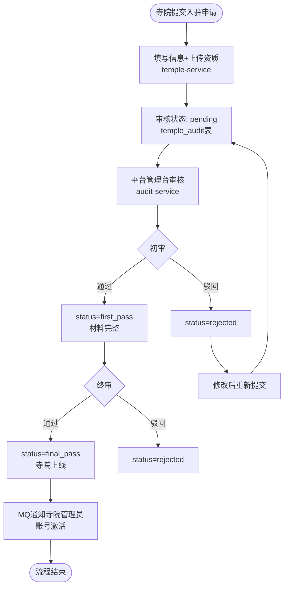
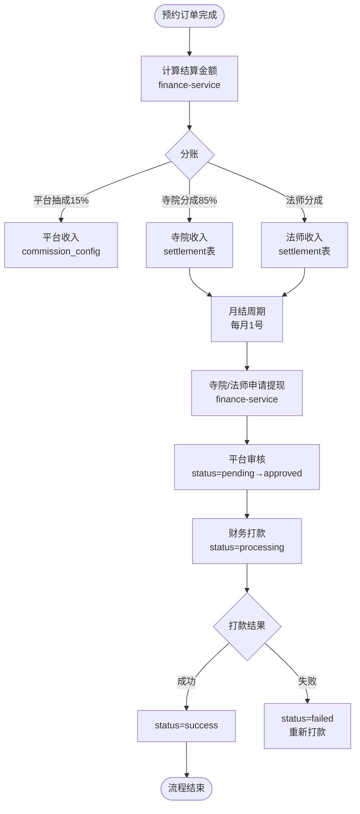
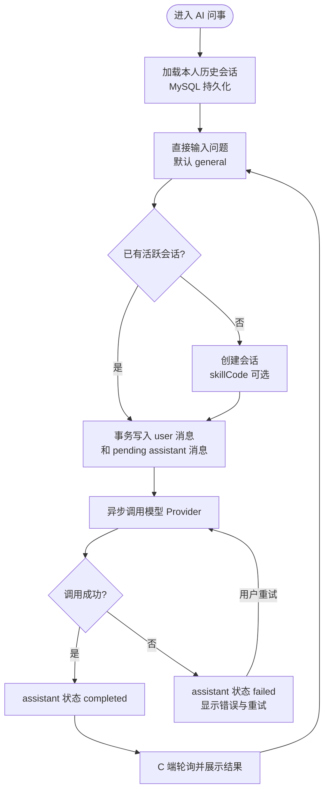

# 问玄东方 - 业务流程图设计文档

> **文档版本**: v1.0
> **创建日期**: 2026-07-01
> **关联文档**: [技术架构](./技术架构.md) | [状态机](./状态机.md) | [统一数据字典](../standards/统一数据字典.md)

---

## 1. 预约祈福完整流程（核心业务线 1）

### 1.1 端到端流程图

### 1.2 时序图

---

## 2. DIY 手串完整流程（核心业务线 2）

### 2.1 端到端流程图

```mermaid
flowchart TD
    Start([用户打开DIY页面]) --> Browse[浏览设计广场<br/>diy-service]
    Browse --> Design[自主设计手串<br/>选材料/配饰/佛头]
    Design --> Preview[实时预览+价格计算<br/>diy-service]
    Preview --> Reprice[提交订单<br/>服务端锁定材料/SKU并重定价]
    Reprice -->|下架/库存不足| Design
    Reprice --> Snapshot[同事务保存订单/明细/库存扣减<br/>设计与计价快照]
    Snapshot --> ChooseBlessing{选择加持服务?}
    Snapshot -->|商城审核驳回| ReleaseStock[订单取消<br/>同事务归还材料/SKU库存]
    ChooseBlessing -->|是| SelectBlessing[选4项加持之一<br/>灵隐/白云/少林/大昭寺]
    ChooseBlessing -->|否| SkipBlessing[跳过加持]

    SelectBlessing --> Pay[支付<br/>校验订单所属与最终金额]
    SkipBlessing --> Pay
    Pay --> CreateOrder[支付成功<br/>订单仍为pending_review<br/>生成待结算作者收益]
    CreateOrder --> NotifyShop[MQ通知商城管理台]

    NotifyShop --> ShopReview{商城审核设计}
    ShopReview -->|通过| StatusMaking[status=in_making<br/>商城开始制作]
    ShopReview -->|不通过| StatusCancelled1[status=cancelled<br/>退款]

    StatusMaking --> MakingDone{制作完成}
    MakingDone -->|含加持| BlessingBranch[进入加持分支]
    MakingDone -->|无加持| StatusAwaitingShip1[status=awaiting_shipment]

    BlessingBranch --> StatusAwaitingBlessing[status=awaiting_blessing<br/>发MQ派单到寺院]
    StatusAwaitingBlessing --> TempleReceive[寺院管理台接收加持任务<br/>temple-service]
    TempleReceive --> AssignMaster[寺院分配法师<br/>发MQ到法师工作台]
    AssignMaster --> MasterAccept[法师接受任务<br/>master-service]
    MasterAccept --> StatusBlessingProgress[status=blessing_in_progress]
    StatusBlessingProgress --> MasterBlessing[法师执行加持仪式]
    MasterBlessing --> UploadProof[上传凭证照片/视频<br/>file-service]
    UploadProof --> StatusBlessingDone[status=blessing_completed<br/>发MQ通知商城+用户]
    StatusBlessingDone --> StatusAwaitingShip2[status=awaiting_shipment]

    StatusAwaitingShip1 --> Ship[商城发货<br/>填物流单号]
    StatusAwaitingShip2 --> Ship
    Ship --> StatusShipped[status=shipped<br/>发MQ通知用户]
    StatusShipped --> Logistics[物流追踪<br/>logistics-service]
    Logistics --> UserReceive{用户收货}
    UserReceive -->|确认| StatusCompleted1[status=completed]
    UserReceive -->|超7天| StatusCompleted2[status=completed<br/>系统自动收货]

    StatusCompleted1 --> Finance[财务结算<br/>材料费归商城+加持费归寺院/法师]
    StatusCompleted2 --> Finance
    Finance --> End1([流程结束])

    StatusCancelled1 --> Refund[退款]
    Refund --> End2([流程结束])
```

### 2.2 加持任务协同时序图

---

## 3. 普通商品购买流程（业务线 3）

---

## 4. 寺院/法师入驻、上架与账号分配流程（主数据线）

### 4.1 端到端流程图

### 4.2 权责边界

| 动作 | 执行端 | 关键约束 |
|------|--------|----------|
| 创建/审核/封禁寺院 | 平台管理台 | 寺院是平台主数据；仅正常状态进入 C端 |
| 创建寺院管理员账号 | 平台管理台 | 账号角色为 `temple_admin`，必须绑定 `temple_id` |
| 维护寺院资料和服务 | 寺院管理台 | 只能操作 JWT 中 `templeId` 对应的寺院 |
| 创建法师 | 寺院管理台 | `master.temple_code` 固定为当前寺院，不允许创建无寺院法师 |
| 审核/封禁法师 | 平台管理台 | 法师审核通过后才能上架 |
| 创建大师 App 账号 | 平台管理台 | 账号角色为 `master`，必须绑定 `master_id`；系统校验该法师所属寺院 |
| C端展示寺院 | C端 App | 只读取后端 `/temples` 的正常寺院和 `serviceTags` |
| C端展示法师 | C端 App | 只读取已认证、已上架、未封禁法师 |

### 4.3 账号登录上下文

管理账号登录成功后，auth-service 根据角色把绑定对象写入 JWT：

| 角色 | JWT上下文 | 使用方 |
|------|-----------|--------|
| `platform_super` | 平台角色 | 平台管理台 |
| `temple_admin` | `templeId` | 寺院管理台、寺院服务、预约服务 |
| `master` | `masterId` + 所属 `templeId` | 大师 App、法师工作台、加持任务、预约服务 |
| `shop_admin` | `shopId` | 商城管理台 |

任何管理端都不得通过前端传参切换管理对象；后端必须以 JWT 中的绑定对象作为数据权限边界。

---

## 5. 寺院入驻审核流程（业务线 4）

---

## 6. 法师入驻认证流程（业务线 5）

---

## 7. 财务结算流程（业务线 6）

### 7.1 预约订单结算

### 7.2 DIY 手串订单结算（复杂分账）

---

## 8. AI 问事流程（业务线 7）

---

## 版本记录

| 版本 | 日期 | 说明 |
|------|------|------|
| v1.0 | 2026-07-01 | 初始版本：7条核心业务流程图 |
