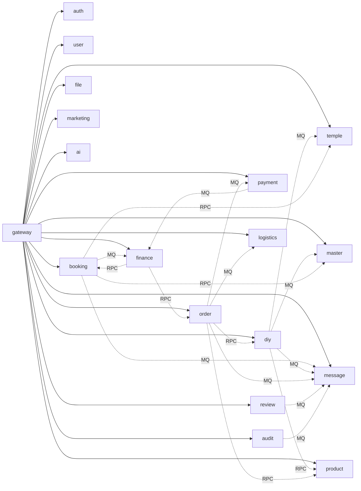

# 问玄东方全栈项目 - 技术架构总览

> 本架构已于 2026-06 从 Java/Spring Boot 迁移至 Go/go-zero。

> 本文档为问玄东方项目的工程技术架构总览，覆盖多端产品矩阵、技术选型、微服务拆分、统一网关、SSO 用户体系、数据库设计、消息队列设计与开发分期规划。
>
> 配套文档：
> - 业务架构与角色权限：见根目录 `管理端架构.md`（第 5 节为本文档输入源）
> - 工程搭建规范：见 `.trae/specs/scaffold-dongfang-fullstack/spec.md`
> - iOS 开发入门：见 `askXuan-docs/docs/guides/iOS入门指南.md`
> - 统一数据字典：见根目录 `统一数据字典.md`
> - 基础设施一键启动：见根目录 `docker-compose.yml`

| 版本 | 日期 | 作者 | 说明 |
| ---- | ---- | ---- | ---- |
| v1.0 | 2026-06-30 | 工程团队 | 初始版本：技术架构总览 |
| v1.1 | 2026-06-30 | 工程团队 | 后端技术栈由 Java/Spring Boot 迁移至 Go 1.22 + go-zero，注册中心由 Nacos 改为 etcd |

---

## 1. 项目产品矩阵

问玄东方项目覆盖 **5 端产品**，所有端共享同一套后端微服务、同一套用户体系（SSO）与统一 API 网关，确保业务数据互通与角色协同。

| 编号 | 产品名称 | 端类型 | 用户角色 | 目录 | 核心场景 |
| ---- | -------- | ------ | -------- | ---- | -------- |
| **P01** | 问玄东方 App（C 端） | iOS App | C 端用户 | `问玄东方App/` → `askXuan-frontend/apps/ios-customer/` | 浏览寺院/法师、预约祈福、AI 问事、商城购物、DIY 手串 |
| **P02** | 寺院管理台 | Web 后台 | 寺院管理员 | `问玄东方-寺院管理/` → `askXuan-frontend/apps/web-temple-admin/` | 寺院信息、法师管理、服务管理、预约接单、评价管理 |
| **P03** | 法师工作台 | iOS App | 法师 | `问玄东方-法师工作台/` → `askXuan-frontend/apps/ios-master/` | 工作台首页、日历排班、预约确认、加持派单、收入提现 |
| **P04** | 商城管理台 | Web 后台 | 商城运营 | `问玄东方-商城管理/` → `askXuan-frontend/apps/web-shop-admin/` | 商品 SKU、DIY 订单、材料库、额外服务、物流管理 |
| **P05** | 平台管理台 | Web 后台 | 平台管理 | `问玄东方-平台管理/` → `askXuan-frontend/apps/web-platform-admin/` | 数据大盘、入驻审核、内容审核、财务结算、营销、系统设置 |

**多端协同关系**：

```
                          ┌────────────────────┐
                          │   C 端用户 (P01)    │
                          │  预约 / 购物 / DIY   │
                          └─────────┬──────────┘
                                    │ 下单
            ┌───────────────────────┼───────────────────────┐
            ▼                       ▼                       ▼
   ┌──────────────────┐    ┌──────────────────┐    ┌──────────────────┐
   │ 寺院管理台 (P02)  │◄──►│ 法师工作台 (P03)  │    │ 商城管理台 (P04)  │
   │ 接单 / 派法师     │    │ 确认 / 加持完成   │    │ 发货 / 物流       │
   └────────┬─────────┘    └────────┬─────────┘    └────────┬─────────┘
            │                       │                       │
            └───────────────────────┼───────────────────────┘
                                    ▼
                          ┌────────────────────┐
                          │ 平台管理台 (P05)    │
                          │ 审核 / 财务 / 营销  │
                          └────────────────────┘
```

除上述 5 端外，项目在四期补充：
- **H5 网页**（`askXuan-frontend/apps/h5-customer/`）：复用 C 端核心浏览与预约流程，适配浏览器与微信内置浏览器
- **微信小程序**（`askXuan-frontend/apps/mp-customer/`）：uni-app 编译产物，覆盖 C 端核心流程

---

## 2. 整体技术栈

| 层级 | 技术选型 | 版本 | 选型理由 |
| ---- | -------- | ---- | -------- |
| C 端 App | 原生 Swift + SwiftUI | Swift 5.9 / SwiftUI (iOS 16+) | 原生开发，性能与体验最优；直接对接 Apple 生态与系统能力 |
| 法师工作台 | 原生 Swift + SwiftUI | 同上 | 与 C 端共用架构与组件库 |
| Web 管理后台 ×3 | Vue 3 + TypeScript + Vite + Element Plus | Vue 3.4 / Vite 5 / Element Plus 2.6 | 设计稿为 Tailwind 风格，Vue 生态契合；Element Plus 表单/表格能力强 |
| H5 网页 | Vue 3 + TypeScript + Vant | Vant 4 | 移动端组件库，复用 Web 端工具链 |
| 微信小程序 | uni-app（Vue 3 语法） | uni-app 3.x | 一套代码多端编译；Vue 语法降低学习成本 |
| 后端服务 | Go + go-zero | Go 1.22 / go-zero | 微服务框架原生支持网关/限流/熔断；编译为单二进制部署轻量；并发性能优 |
| 数据访问 | go-zero sqlx | 内置 | 轻量 SQL 封装，与 go-zero 工程结构契合；连接池内置 |
| API 网关 | go-zero gateway | 内置 | 与 go-zero 生态无缝集成；路由由 goctl 生成 |
| 注册中心 / 配置中心 | etcd | 3.5.15 | 轻量强一致 KV；go-zero 原生服务发现支持 |
| 鉴权 | go-zero middleware + golang-jwt | - | 网关层 JWT 校验中间件 + 业务层角色鉴权 |
| 代码生成 | goctl | latest | 由 .api 文件一键生成 handler/router/logic/types 骨架 |
| 数据库 | MySQL | 8.0 | 主数据库 |
| 缓存 | Redis | 7.0 | 缓存 / 分布式锁 / 排行榜 |
| 消息队列 | RabbitMQ | 3.13 | 业务消息可靠投递；管理界面友好 |
| 对象存储 | MinIO（自建）/ 阿里云 OSS（生产） | - | 图片 / 视频 / 凭证存储 |
| 容器化 | Docker + Docker Compose | - | 本地开发一键起基础设施 |
| 监控 | Prometheus + Grafana | - | 服务指标监控 |
| 日志 | ELK | - | 集中式日志（二期） |
| CI/CD | GitHub Actions | - | 自动构建 / 测试 / 部署 |

> 说明：本地开发基础设施一键启动方式见根目录 `docker-compose.yml`，执行 `docker compose up -d` 即可拉起 MySQL / Redis / RabbitMQ / MinIO / etcd / Zookeeper / Kafka / MongoDB 共 8 个容器。

---

## 3. 微服务拆分

后端依据业务域拆分为 **16 个核心服务 + 3 个扩展服务（ai / file / media）**，全部基于 go-zero 实现，通过 etcd 注册并被 go-zero gateway 路由。各服务独立监听，对外统一由网关 `http://localhost:8080` 暴露。

**系统架构图（按 5 业务域分组）**：

```mermaid
graph TB
    subgraph 客户端["客户端层（5端）"]
        C1["C端 App<br/>Swift/SwiftUI"]
        C2["寺院管理台<br/>Vue3+ElementPlus"]
        C3["法师工作台<br/>Swift/SwiftUI"]
        C4["商城管理台<br/>Vue3+ElementPlus"]
        C5["平台管理台<br/>Vue3+ElementPlus"]
    end

    subgraph 平台域["① 平台域（3服务）"]
        GW["gateway-service<br/>:8080<br/>JWT校验/路由/限流/CORS"]
        AUTH["auth-service<br/>:8081<br/>认证/角色/权限"]
        USER["user-service<br/>:8082<br/>用户/地址/画像"]
    end

    subgraph 内容域["② 内容域（5服务）"]
        TEMPLE["temple-service<br/>:8083<br/>寺院/图片/入驻"]
        MASTER["master-service<br/>:8084<br/>法师/排班/资质"]
        BOOKING["booking-service<br/>:8085<br/>预约/评价/时段"]
        REVIEW["review-service<br/>:8092<br/>评价/回复/举报"]
        COMMUNITY["community-service<br/>:8099<br/>大师广场/互动/审核"]
    end

    subgraph 商城域["③ 商城域（4服务）"]
        PROD["product-service<br/>:8086<br/>商品/SKU/分类"]
        DIY["diy-service<br/>:8088<br/>DIY设计/材料/加持任务"]
        ORDER["order-service<br/>:8089<br/>商城订单/物流"]
        PAY["payment-service<br/>:8090<br/>支付/退款"]
    end

    subgraph 运营域["④ 运营域（4服务）"]
        FIN["finance-service<br/>:8091<br/>结算/提现/抽成"]
        AUDIT["audit-service<br/>:8093<br/>内容审核/举报"]
        LOGISTICS["logistics-service<br/>:8095<br/>快递/运费/追踪"]
        MKT["marketing-service<br/>:8096<br/>优惠券/活动/Banner"]
    end

    subgraph 基础设施域["⑤ 基础设施域（4服务）"]
        MSG["message-service<br/>:8094<br/>站内消息/推送"]
        FILE["file-service<br/>:8097<br/>MinIO文件"]
        AI["ai-service<br/>:8098<br/>AI直接对话/Provider"]
        MEDIA["media-service<br/>:8100<br/>媒体/直播Provider"]
    end

    COMMON["common<br/>公共中间件/JWT/错误码"]

    subgraph 基础设施["基础设施层"]
        MySQL[("MySQL 8.0<br/>:3306")]
        Redis[("Redis 7.0<br/>:6379")]
        MQ[("RabbitMQ 3.13<br/>:5672")]
        MinIO[("MinIO<br/>:9000")]
        Etcd[("etcd<br/>:2379")]
    end

    C1 & C2 & C3 & C4 & C5 --> GW
    GW --> AUTH & USER
    GW --> TEMPLE & MASTER & BOOKING & REVIEW & COMMUNITY
    GW --> PROD & DIY & ORDER & PAY
    GW --> FIN & AUDIT & LOGISTICS & MKT
    GW --> MSG & FILE & AI & MEDIA

    AUTH & USER & TEMPLE & MASTER & BOOKING & REVIEW & COMMUNITY --> MySQL & Redis & MQ
    PROD & DIY & ORDER & PAY --> MySQL & Redis & MQ
    FIN & AUDIT & LOGISTICS & MKT --> MySQL & Redis
    MSG & FILE & AI & MEDIA --> MySQL & Redis
    FILE & MEDIA --> MinIO

    AUTH & USER & TEMPLE & MASTER & BOOKING & REVIEW & COMMUNITY & PROD & DIY & ORDER & PAY & FIN & AUDIT & LOGISTICS & MKT & MSG & FILE & AI & MEDIA -.-> Etcd

    COMMON -.-> AUTH & USER & TEMPLE & MASTER & BOOKING & REVIEW & COMMUNITY & PROD & DIY & ORDER & PAY & FIN & AUDIT & LOGISTICS & MKT & MSG & FILE & AI & MEDIA
```



| 序号 | 服务 | 端口 | 职责 | 主要数据表 | 状态 |
| ---- | ---- | ---- | ---- | ---------- | ---- |
| 1 | **gateway-service** | 8080 | API 网关：路由 / 限流 / 鉴权前置 | - | ✅ 骨架已有 |
| 2 | **auth-service** | 8081 | SSO 认证中心：JWT 签发 / 续期 / 登出 | `admin_account` | 🟡 需扩展 |
| 3 | **user-service** | 8082 | 用户注册 / 资料 / 角色绑定 | `user`, `user_profile` | 🟡 需扩展 |
| 4 | **temple-service** | 8083 | 寺院信息 / 图片 / 管理员 | `temple`, `temple_image`, `temple_admin` | 🟡 需扩展 |
| 5 | **master-service** | 8084 | 法师信息 / 资质 / 排班 | `master`, `master_credential`, `master_schedule` | 🟡 需扩展 |
| 6 | **booking-service** | 8085 | 预约订单 / 状态流转 | `booking`, `booking_status_log` | 🟡 需扩展 |
| 7 | **product-service** | 8086 | 商品 / SKU / 分类 | `product`, `product_sku`, `product_category` | 🆕 新建 |
| 8 | **diy-service** | 8088 | DIY 设计 / 材料库 | `diy_design`, `diy_order`, `material`, `material_sku` | 🆕 新建 |
| 9 | **order-service** | 8089 | 商城订单 / 物流 | `shop_order`, `shop_order_item`, `shop_order_logistics` | 🆕 新建 |
| 10 | **payment-service** | 8090 | 支付 / 退款 | 对接支付宝 / 微信支付 | 🆕 新建 |
| 11 | **logistics-service** | 8095 | 物流追踪 / 运费模板 | `logistics_track`, `freight_template` | 🆕 新建 |
| 12 | **review-service** | 8092 | 评价 / 举报 | `review`, `report` | 🆕 新建 |
| 13 | **audit-service** | 8093 | 设计广场 / 评论审核 | `audit_queue`, `audit_log` | 🆕 新建 |
| 14 | **finance-service** | 8091 | 结算 / 提现 / 抽成 | `settlement`, `withdrawal`, `commission_config` | 🆕 新建 |
| 15 | **message-service** | 8094 | 站内消息 / Push / 短信 | `message`, `message_template` | 🟡 需扩展 |
| 16 | **marketing-service** | 8096 | 优惠券 / 活动 / Banner | `coupon`, `activity`, `banner` | 🆕 新建 |
| - | **ai-service** | 8098 | AI 问事（对接大模型） | `ai_session`, `ai_message` | 🆕 新建 |
| - | **file-service** | 8097 | 文件上传 / 鉴权 | - | ✅ 基本够用 |
| - | **media-service** | 8100 | 媒体处理 / 直播房间 / Provider | `media_asset`, `live_room` | ✅ 本地媒体可用，生产直播关闭 |
| - | **community-service** | 8099 | 大师广场 / 点赞评论 / 审核 | `post`, `post_asset`, `post_like`, `post_comment` | ✅ 已实现 |

> 状态标记：✅ 骨架已有 / 🟡 需扩展 / 🆕 新建

**工程目录映射**（`askXuan-backend/` 下，按 5 大业务域分组）：

```
askXuan-backend/
├── common/                         # 公共模块（JWT/错误码/响应封装/中间件）
├── services/
│   ├── platform/                   # ① 平台域
│   │   ├── gateway-service/        #   1. API 网关
│   │   ├── auth-service/           #   2. SSO 认证中心
│   │   └── user-service/           #   3. 用户服务
│   ├── content/                    # ② 内容域
│   │   ├── temple-service/         #   4. 寺院服务
│   │   ├── master-service/         #   5. 法师服务
│   │   ├── booking-service/        #   6. 预约服务
│   │   ├── review-service/         #   12. 评价服务
│   │   └── community-service/      #   扩展：大师广场
│   ├── commerce/                   # ③ 商城域
│   │   ├── product-service/        #   7. 商品服务
│   │   ├── diy-service/            #   8. DIY 手串服务
│   │   ├── order-service/          #   9. 订单服务
│   │   └── payment-service/        #   10. 支付服务
│   ├── operation/                  # ④ 运营域
│   │   ├── finance-service/        #   14. 财务结算服务
│   │   ├── audit-service/          #   13. 内容审核服务
│   │   ├── logistics-service/      #   11. 物流服务
│   │   └── marketing-service/      #   16. 营销服务
│   └── infrastructure/             # ⑤ 基础设施域
│       ├── message-service/        #   15. 消息服务
│       ├── file-service/           #   扩展：文件服务
│       ├── ai-service/             #   扩展：AI 问事服务
│       └── media-service/          #   扩展：媒体与直播
├── build/docker/Dockerfile         # 多阶段构建通用 Dockerfile
├── scripts/                        # 运维脚本（部署/批量构建/迁移）
├── envs/                           # 环境配置（dev/prod）
└── db/init.sql                     # 数据库初始化（85 表 / 18 库）
```

**部署形态**：MVP 阶段所有服务共享同一 MySQL 实例（按租户 ID 隔离，见 §6），通过 etcd 服务发现 + go-zero gateway 路由对外提供统一入口 `http://localhost:8080`。

**模块依赖图**：



**依赖说明**：
- **实线 HTTP**：网关转发请求到各服务
- **虚线 MQ**：服务间异步消息（解耦）
- **虚线 RPC**：服务间同步调用（go-zero zRPC，查关联数据）

### 3.1 goctl 代码生成规范

go-zero 全栈采用 **goctl** 脚手架从 `.api` 描述文件一键生成服务骨架，统一工程结构与编码风格，`.api` 文件即接口契约的唯一事实源。

**.api 文件示例**（以 auth 服务为例）：

```api
syntax = "v1"

info (
    title:   "auth"
    desc:    "SSO 认证中心"
    author:  "工程团队"
    version: "v1"
)

type (
    LoginReq {
        Phone      string `json:"phone"`
        VerifyCode string `json:"verify_code"`
        ClientId   string `json:"client_id"`
    }
    LoginResp {
        AccessToken  string `json:"access_token"`
        RefreshToken string `json:"refresh_token"`
    }
)

@server (
    group: auth
    prefix: /api/v1/auth
)
service auth {
    @handler login
    post /login (LoginReq) returns (LoginResp)

    @handler refresh
    post /refresh (RefreshReq) returns (LoginResp)

    @handler logout
    post /logout returns (EmptyResp)
}
```

**生成命令**：

```bash
goctl api go -api auth.api -dir . --style=goZero
```

**生成产物**：

| 产物 | 说明 |
| ---- | ---- |
| `handler/` | HTTP handler，按路由分组，仅做参数解析与 logic 调用 |
| `routes.go` | 路由注册，由 goctl 自动生成，勿手改 |
| `logic/` | 业务逻辑层，每个接口一个文件，承载核心业务 |
| `types/types.go` | 请求/响应结构体，由 .api 中的 type 定义生成 |
| `svc/servicecontext.go` | 服务上下文，注入 MySQL/Redis/RabbitMQ 等依赖 |
| `etc/*.yaml` | 服务配置（端口/etcd/DB/Redis 地址） |
| `auth.go` | 服务入口，`go run auth.go -f etc/auth.yaml` 启动（位于 auth-service/ 目录下） |

> 规范：新增/修改接口后重新执行 goctl 生成；handler 与 logic 已有内容增量保留，routes.go 与 types.go 全量覆盖。

> **重要**：手动编辑 types.go 时，必须保留 .api 中声明的 `,optional` 限定符。go-zero 的 httpx.Parse 会将缺少 `,optional` 的字段视为必填，导致合法请求被拒绝（返回 40001 ErrParam）。

---

## 4. 统一 API 网关设计

所有端流量通过 **go-zero gateway** 统一入口，承担路由、鉴权、限流、日志四类职责。

| 方面 | 设计 | 说明 |
| ---- | ---- | ---- |
| 网关选型 | go-zero gateway | 与 go-zero 生态无缝集成；路由与中间件由 goctl 生成 |
| 版本管理 | URL 路径版本号 `/api/v1/` | 兼容多版本并行 |
| 鉴权方式 | JWT Token + golang-jwt | 统一认证；Token 自动续期；白名单接口（登录 / 验证码 / 公开浏览）跳过鉴权 |
| 路由策略 | 按业务域分组路由 | 清晰的接口边界 |
| 限流策略 | 按端 / 按用户 / 按接口分级限流 | 保护后端稳定性；基于 Redis + 令牌桶 |
| 熔断降级 | go-zero 自带熔断器 | 后端服务异常时网关层熔断 |
| 日志采集 | 网关层全量请求日志 | 便于问题排查和数据分析 |
| 跨域处理 | 网关统一配置 CORS | 避免各服务重复配置 |

**路由分组（核心）**：

| 路由前缀 | 转发目标服务 | 鉴权 |
| -------- | ------------ | ---- |
| `/api/v1/auth/**` | auth-service | 白名单（登录 / 验证码） |
| `/api/v1/users/**` | user-service | 需 Token |
| `/api/v1/temples/**` | temple-service | 公开浏览白名单 / 管理操作需 Token |
| `/api/v1/masters/**` | master-service | 公开浏览白名单 / 管理操作需 Token |
| `/api/v1/bookings/**` | booking-service | 需 Token |
| `/api/v1/products/**` | product-service | 公开浏览白名单 / 管理操作需 Token |
| `/api/v1/diy/**` | diy-service | 需 Token |
| `/api/v1/orders/**` | order-service | 需 Token |
| `/api/v1/payments/**` | payment-service | 需 Token + 端校验 |
| `/api/v1/logistics/**` | logistics-service | 需 Token |
| `/api/v1/reviews/**` | review-service | 需 Token |
| `/api/v1/finance/**` | finance-service | 需 Token + 角色权限 |
| `/api/v1/messages/**` | message-service | 需 Token |
| `/api/v1/marketing/**` | marketing-service | 需 Token |
| `/api/v1/ai/**` | ai-service | 需 Token |
| `/api/v1/files/**` | file-service | 需 Token |
| `/api/v1/admin/**` | audit-service + 各服务管理接口 | 需 Token + 管理员角色 |

**网关鉴权流程**：

```
请求 ──► 网关
        │
        ├─ 白名单？──► 是 ──► 直接转发
        │
        └─ 否 ──► 解析 Authorization: Bearer <JWT>
                  │
                  ├─ Token 无效/过期 ──► 401 Unauthorized
                  │
                  └─ Token 有效 ──► 注入 X-User-Id / X-User-Roles 头 ──► 转发到下游服务
                                                                          │
                                                                          └─ 下游服务做角色级权限校验
```

---

## 5. SSO 统一用户体系

所有端共用同一套用户体系，通过 **手机号唯一标识**，同一账号可绑定多个角色，按角色进入对应产品端。

### 5.1 核心设计

| 设计要点 | 说明 |
| -------- | ---- |
| 统一用户中心 | 所有端共用同一套用户体系，通过手机号唯一标识 |
| 登录方式 | 手机号 + 验证码 / 微信授权 / Apple ID（iOS 端） |
| Token 机制 | JWT Access Token（**2 小时**）+ Refresh Token（**7 天**） |
| 角色切换 | 同一账号可绑定多个角色（如既是法师又是商城运营） |
| 端标识 | 每个端分配独立的 `client_id`，网关按端校验权限 |
| 登出机制 | 统一登出接口，清除所有端 Token |

### 5.2 角色绑定关系

```
用户账号 (手机号 138****1234)
├── 角色: C 端用户   ────► P01 问玄东方 App
├── 角色: 寺院管理员 ───► P02 寺院管理台  (需绑定寺院 ID)
├── 角色: 法师       ────► P03 法师工作台  (需通过资质审核)
├── 角色: 商城运营   ────► P04 商城管理台  (需平台授权)
└── 角色: 平台管理   ────► P05 平台总管理台 (需超管授权)
```

### 5.3 Token 流转

- **登录**：`POST /api/v1/auth/login` → 返回 `access_token`（2h）+ `refresh_token`（7d）
- **续期**：`POST /api/v1/auth/refresh`（携带 `refresh_token`）→ 换发新的 `access_token`
- **登出**：`POST /api/v1/auth/logout` → 服务端将 Token 加入 Redis 黑名单至过期

### 5.4 JWT Payload 结构

```json
{
  "userId": 10001,                 // 用户ID（int64）
  "mobile": "138****1234",         // 手机号
  "userType": "user",              // 用户类型：user / master / admin
  "roles": ["customer"],           // 角色列表：customer/temple_admin/master/shop_admin/platform_super/platform_service
  "clientId": "customer",          // 端标识：customer/temple-admin/master/shop-admin/platform-admin
  "templeId": 0,                   // 寺院ID（temple_admin 专用，int64）
  "masterId": 0,                   // 法师ID（master 专用，int64）
  "type": "access",                // token 类型：access / refresh
  "sub": "access",                 // 标准字段，同 type（access/refresh）
  "iat": 1719700000,
  "exp": 1719707200                // 2 小时后
}
```

> 注：字段命名统一使用 camelCase（与代码 `common/jwt.go` 的 `CustomClaims` JSON tag 一致）。Refresh Token 仅携带 `userId` + `type`，其余字段为空。

---

## 6. 数据库设计

### 6.1 隔离方案

**推荐方案：共享数据库 + 租户 ID 隔离**

| 方案 | 优点 | 缺点 | 适用场景 |
| ---- | ---- | ---- | -------- |
| **共享库 + 租户 ID 隔离** | 统一管理、数据互通、运维简单 | 数据量大时需分区 | ✅ 推荐：业务互通需求强 |
| 独立数据库 | 完全隔离、安全性高 | 运维复杂、数据互通困难 | 数据安全要求极高 |
| 分库分表 | 水平扩展能力强 | 开发复杂度高 | 数据量极大时 |

理由：问玄东方业务互通需求强（C 端用户既可预约也可购物，法师既要排班也要结算），共享库避免跨库联表复杂度。

### 6.2 核心数据表清单

> 与 `askXuan-backend/db/init.sql`（70 表 / 16 库）对齐。

| 数据域 | 核心表 | 说明 |
| ------ | ------ | ---- |
| 用户域 | `user` / `user_address` / `user_profile` | 用户基本信息、地址、画像 |
| 认证域 | `admin_account` / `role` / `permission` / `role_permission` | 管理台账号、角色、权限 |
| 寺院域 | `temple` / `temple_image` / `temple_admin` / `temple_audit` | 寺院信息、图片、管理员绑定、入驻审核 |
| 法师域 | `master` / `master_credential` / `master_schedule` / `master_audit` | 法师信息、资质、排班、资质审核 |
| 服务域 | `service_type` / `temple_service` / `service_schedule` | 服务类型、寺院服务项目、时段 |
| 预约域 | `booking` / `booking_status_log` / `booking_review` | 预约订单、状态流转记录、评价 |
| 消息域 | `message` / `message_template` / `push_log` | 站内消息、模板、推送日志 |
| 商品域 | `product` / `product_sku` / `product_category` / `product_image` | 商品、SKU、分类、商品图片 |
| DIY 域 | `diy_design` / `diy_order` / `diy_order_item` / `material` / `material_sku` / `blessing_task` | 设计、订单、订单项、材料库、材料 SKU、加持任务 |
| 订单域 | `shop_order` / `shop_order_item` / `shop_order_logistics` / `return_order` | 商城订单、订单项、订单物流、退换货 |
| 支付域 | `payment` / `payment_log` / `refund` | 支付单、支付日志、退款 |
| 财务域 | `settlement` / `withdrawal` / `commission_config` / `finance_log` | 结算、提现、抽成配置、财务日志 |
| 评价域 | `review` / `review_reply` / `review_report` | 评价、回复、举报 |
| 审核域 | `audit_queue` / `audit_log` / `report` / `sensitive_word` | 审核队列、审核日志、举报、敏感词 |
| 物流域 | `express_company` / `freight_template` / `logistics_track` | 快递公司、运费模板、物流追踪 |
| 营销域 | `coupon` / `coupon_record` / `activity` / `banner` / `recommend` | 优惠券、领取记录、活动、Banner、推荐位 |
| AI 域 | `ai_session` / `ai_message` / `ai_skill` | AI 会话、消息、技能 |
| 系统域 | `operation_log` / `dictionary` / `system_config` | 操作日志、字典、系统配置 |

### 6.3 数据隔离策略

| 数据类型 | 隔离策略 |
| -------- | -------- |
| 寺院数据 | 通过 `temple_id` 隔离，寺院管理员仅可查询本寺院数据 |
| 法师数据 | 通过 `master_id` 隔离，法师仅可查询本人数据 |
| 商城数据 | 商城运营仅可管理商品域和 DIY 域数据 |
| 平台数据 | 超管可访问全量数据；客服仅可访问投诉 / 举报相关数据 |

> 实现方式：go-zero sqlx + 角色上下文中间件，按当前激活角色自动注入租户 ID 过滤条件。

---

## 7. 消息队列设计

采用 **RabbitMQ 3.13** 作为业务消息中间件，所有业务消息开启持久化 + 消费手动 ACK + 死信队列。

### 7.1 Exchange 清单

| 消息场景 | Exchange | 类型 | 生产者 | 消费者 | 说明 |
| -------- | -------- | ---- | ------ | ------ | ---- |
| 预约事件 | `booking.events` | fanout | booking-service | message-service, finance-service | 预约下单/状态变更通知 |
| 加持事件 | `blessing.events` | fanout | diy-service, temple-service, master-service | temple-service, master-service, diy-service, message-service | 加持任务派发/分配/完成 |
| 商城订单事件 | `order.events` | fanout | order-service | message-service, finance-service | 订单状态变更 |
| 支付事件 | `payment.events` | fanout | payment-service | order-service, finance-service | 支付成功/退款通知 |
| 物流事件 | `logistics.events` | fanout | logistics-service | order-service, message-service | 物流状态变更 |
| 评价事件 | `review.events` | fanout | review-service | message-service, temple-service | 新评价通知 |
| 审核事件 | `audit.events` | fanout | audit-service | message-service | 审核结果通知 |
| 财务事件 | `finance.events` | fanout | finance-service | message-service | 提现审核结果 |

> **设计说明**：采用域级 fanout Exchange 聚合同业务域事件，而非细粒度语义化 Topic。一个 Exchange 内的多个事件（如 booking.notify 和 booking.status）通过消息体的 event_type 字段区分。fanout 类型广播所有消息到所有绑定的队列，消费者按需处理。

### 7.2 消息可靠性保障

1. **消息持久化**：所有业务消息开启持久化存储（`delivery_mode = 2`）
2. **消费确认**：消费端手动 ACK，处理失败进入死信队列
3. **消息重试**：失败消息按指数退避重试，最多 3 次
4. **死信处理**：超过重试次数的消息进入死信队列（`*.dlq`），人工介入
5. **幂等设计**：消费端通过 `message_id` 去重，保证幂等，避免重复消费

### 7.3 典型流程示例：预约通知

```
C 端用户下单
  │
  ▼
booking-service 写库
  │
  ├─ 同步返回订单号给客户端
  │
  └─ 异步发送 booking.events ──► RabbitMQ (fanout) ──┬─► message-service
                                                     │     ├─ 站内消息（寺院管理台 + 法师工作台）
                                                     │     ├─ 短信通知法师
                                                     │     └─ Push 通知
                                                     │
                                                     └─► finance-service
                                                           └─ 记账 / 对账
```

> 同一 Exchange 内的多种事件（如预约下单 `booking.notify`、预约状态变更 `booking.status`）通过消息体的 `event_type` 字段区分，消费者按需解析处理。fanout 类型会将消息广播到所有绑定的队列，各消费者独立 ACK。

---

## 8. 开发分期规划

依据 `管理端架构.md` 第 7 节，MVP 优先打通「预约祈福」闭环，逐期补齐商城、平台管理、营销与 AI。统一为 4 个阶段（MVP-1 / MVP-2 / MVP-3 / MVP-4）。

| 阶段 | 交付物 | 后端服务范围 | 客户端 | 关键里程碑 |
| ---- | ------ | ---- | ---- | ---------- |
| **MVP-1** | 预约祈福闭环 | gateway/auth/user/temple/master/booking/message/file | C端App（首页/寺院/法师/预约） | C端下单→寺院接单→法师确认→完成→评价 |
| **MVP-2** | DIY手串闭环 | product/diy/order/payment/logistics | 商城管理台 + C端（DIY+商城） | C端设计→商城审核→制作→加持→发货 |
| **MVP-3** | 财务+审核 | finance/review/audit | 平台管理台 | 入驻审核/内容审核/结算提现 |
| **MVP-4** | 营销+AI | marketing/ai | 全端 | 优惠券/活动/AI问事 |

### 8.1 各阶段交付对应

| 阶段 | 后端服务 | 客户端 |
| ---- | -------- | ------ |
| MVP-1 | gateway-service / auth-service / user-service / temple-service / master-service / booking-service / message-service / file-service | C端App（首页 / 寺院 / 法师 / 预约） |
| MVP-2 | product-service / diy-service / order-service / payment-service / logistics-service | 商城管理台 + C端App（DIY + 商城） |
| MVP-3 | finance-service / review-service / audit-service | 平台管理台 |
| MVP-4 | marketing-service / ai-service | 全端（营销活动 + AI 问事） |

> 说明：message-service 从 MVP-2 提前到 MVP-1（预约通知需要）；ai-service 归入 MVP-4。

---

## 9. 项目目录结构

```
DongFang/
├── 问玄东方App/                    # 保留：C 端设计稿基准（不动）
├── 问玄东方-寺院管理/               # 保留：寺院管理台设计稿基准
├── 问玄东方-法师工作台/             # 保留：法师工作台设计稿基准
├── 问玄东方-商城管理/               # 保留：商城管理台设计稿基准
├── 问玄东方-平台管理/               # 保留：平台管理台设计稿基准
├── askXuan-backend/                 # 后端微服务（go-zero，见 §3）
├── askXuan-frontend/                # 前端工程（apps + packages）
│   ├── apps/                        # 各端应用工程
│   │   ├── ios-customer/            # C 端 App (原生 Swift/SwiftUI)
│   │   ├── ios-master/              # 法师工作台 (原生 Swift/SwiftUI)
│   │   ├── web-temple-admin/        # 寺院管理台 (Vue3 + Element Plus)
│   │   ├── web-shop-admin/          # 商城管理台 (Vue3 + Element Plus)
│   │   ├── web-platform-admin/      # 平台管理台 (Vue3 + Element Plus)
│   │   ├── h5-customer/             # C 端 H5 (Vue3 + Vant)
│   │   └── mp-customer/             # C 端小程序 (uni-app)
│   └── packages/                    # 跨端共享包
│       ├── design-tokens/           # 统一 Design Token (JSON)
│       ├── api-client/              # TS API 客户端 (Web/H5 共用)
│       └── mock-server/             # Mock 数据服务
├── askXuan-docs/                    # 工程文档（docs + .trae）
│   └── docs/                        # 工程文档
│       ├── architecture/            # 架构文档
│       └── guides/                  # 开发入门指南
├── docker-compose.yml              # 基础设施一键启动
├── .editorconfig                   # 跨端跨语言编码规范
├── .gitignore                      # Git 忽略规则
├── 管理端架构.md                    # 业务架构与角色权限（输入源）
├── 统一数据字典.md                  # 统一数据字典
└── README.md                       # 项目说明
```

---

## 10. 关键决策记录

| 决策 | 理由 |
| ---- | ---- |
| iOS 端采用原生 Swift + SwiftUI 而非 Expo/React Native | 原生开发性能与体验最优；SwiftUI 声明式 UI 开发效率高；直接对接 Apple 生态与系统能力 |
| 小程序采用 uni-app 而非原生 | 一套代码可同时输出微信 / 支付宝小程序；Vue 语法与 Web 后台统一 |
| 后端由 Java/Spring Boot 迁移至 Go + go-zero | go-zero 原生支持微服务/网关/服务发现，单二进制部署轻量、并发性能优；etcd 替代 Nacos 简化基础设施 |
| Web 后台采用 Vue3 而非 React | 设计稿基于 Tailwind，Vue 上手快；Element Plus 表单能力强，契合管理后台密集表单场景 |
| 共享数据库 + 租户 ID 隔离 | 业务互通需求强，避免跨库联表复杂度 |
| RabbitMQ 而非 Kafka | 业务消息量级不大，RabbitMQ 管理界面友好，可靠投递够用 |
| Design Token 跨端共享 | 确保视觉一致性的唯一可行方式；避免各端手动同步色值导致漂移 |
| 现有 HTML 设计稿不作为生产代码 | 依赖 CDN、无工程化、无状态管理；仅作视觉参照 |
