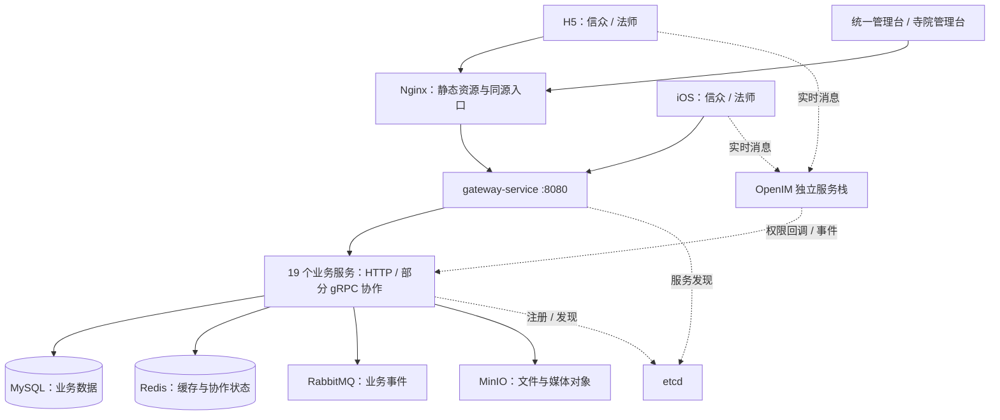

# 问玄东方技术架构 · 0.0.1

本文描述产品 **0.0.1** 的当前工程结构、业务边界和运行方式。产品版本不改变 Go / npm 依赖版本、API 路径中的 `v1`、数据库迁移编号或 iOS 构建号。构建通过、源码发布、服务器运行、真机安装和真实交易分别验收。

产品流程见[产品使用手册](../guides/产品使用手册.md)，端差异与待验收项目见[产品现状与能力边界](../product/产品现状与能力边界.md)，完整 HTTP 契约见 [API Reference](../../API-REFERENCE.md)。

## 1. 客户端与业务角色

信众、法师、寺院、商城和平台是业务角色。当前有一个 H5 工程、两个原生 iOS 工程和三个管理 Web 构建包，其中商城包承担兼容跳转。

| 角色 / 入口 | 当前工程 | 技术与职责 |
| --- | --- | --- |
| 信众 H5 `/c/*` | `apps/web-h5` | React、TypeScript、React Router；发现、预约、咨询、社区、商城、DIY、积分活动与个人中心 |
| 法师 H5 `/m/*` | 同一 H5 工程 | 工作台、预约履约、排班、聊天、加持、内容与收益 |
| 信众 iOS | `apps/ios-customer` | Swift / SwiftUI；原生导航、业务页面、DIY 与聊天接入 |
| 法师 iOS | `apps/ios-master` | Swift / SwiftUI；原生法师工作台与聊天接入 |
| 统一管理台 `/admin/*` | `apps/web-platform-admin` | Vue 3、TypeScript、Vite、Element Plus；平台运营和 `/commerce/*` 商城运营模块 |
| 寺院管理台 `/temple/*` | `apps/web-temple-admin` | Vue 3 管理界面；寺院资料、服务、法师、预约、加持、评价与报表 |
| 商城兼容入口 `/shop/*` | `apps/web-shop-admin` | 映射到统一管理台，保留详情路径、查询和 hash；不赋予商城账号平台权限 |

H5 是独立 Git 仓库，位于前端仓的 `apps/web-h5`。父仓与 H5 的提交和发布需分别记录。

## 2. 总体结构



网关使用 Go `net/http` 与 `httputil.ReverseProxy`，按最长路径前缀匹配；优先使用 etcd 发现的实例，无可用实例时回退配置中的静态 Target。网关承担 JWT 校验、身份传递、角色入口限制与 CORS，业务服务继续校验资源归属和状态，不能以客户端菜单隐藏代替授权。下游服务不应绕过网关直接暴露到公网。

后端业务服务使用 Go 1.22、go-zero v1.7.2 与 sqlx。`common` 集中维护 JWT、错误码、响应、中间件和公共设施；19 个业务服务、网关与 `common` 合计 21 个 Go module，由 `go.work` 组织。依赖精确版本以各工程锁文件和 `go.mod` 为准。

## 3. 服务边界

| 业务域 | 服务与 HTTP 端口 | 职责 |
| --- | --- | --- |
| 平台 | gateway 8080；auth 8081；user 8082 | 统一接入、认证续期、管理账号与角色、用户资料和地址 |
| 内容 | temple 8083；master 8084；booking 8085；review 8092；community 8099 | 寺院与法师、服务供给、预约与咨询权益、评价、内容与互动 |
| 商城 | product 8086；diy 8088；order 8089；payment 8090 | 商品与 SKU、DIY 材料和设计、各类订单、支付退款及积分账户 |
| 运营 | finance 8091；audit 8093；logistics 8095；marketing 8096 | 财务账务、内容审核、物流、首页投放、优惠券及积分奖励活动 |
| 基础设施 | message 8094；file 8097；ai 8098；media 8100 | 站内消息与 OpenIM 接入、文件、AI 模型和报告、媒体与直播能力 |

表中服务名均带 `-service` 后缀。部分业务通过 gRPC 协作，例如预约调用寺院、法师及支付服务；RPC 端口与目标以各服务 `etc/*.yaml` 和后端 Makefile 为准，HTTP 端口不代表 RPC 端口。

服务明细从[网关服务](services/网关服务.md)、[预约服务](services/预约服务.md)、[DIY 手串服务](services/DIY手串服务.md)、[支付服务](services/支付服务.md)、[AI 问事服务](services/AI问事服务.md)、[消息服务](services/消息服务.md)进入。

## 4. API 与会话

19 个业务服务当前注册 **383 个唯一 HTTP 契约**，按 HTTP 方法与完整路径去重；不计网关 health 与 OpenIM 透传。实际 handler 注册同时包含显式路由和数据驱动路由，不能仅凭 `.api` 文件推算覆盖率或访问权限。

在文档仓执行：

```bash
node scripts/audit-api-contracts.mjs ../askXuan-backend
```

该检查比较运行时注册源码与 API 文档中的方法和路径，不能证明请求字段、授权、业务流程或支付均已通过真实环境验收。`.api` 和 goctl 可用于维护接口定义与工程骨架；重新生成前需检查自定义 handler、logic 和数据驱动注册，不能直接覆盖现有实现。

客户端携带 access JWT，网关解析身份并向业务服务传递用户、角色及绑定主体；业务服务按用户、法师、寺院或管理权限限制操作。Token 有效期由运行配置决定。身份字段不得仅以用户提交的 URL 或请求体为准。

| 客户端 | 当前会话失效策略 |
| --- | --- |
| H5 | 受保护请求的 HTTP 401 或业务 `40101/40102/40103` 清理当前会话，按角色回 `/c/login` 或 `/m/login`；并发失败只触发一次切换 |
| 两个 iOS | 对可恢复的 access token 合并刷新并受控重试；确认失效后清理凭据，切换应用根视图至登录 |
| 管理界面 | 共享会话策略合并刷新与失效跳转，回当前管理登录入口 |
| 共同边界 | 请求绑定发起时的会话；旧请求不能清理新登录或以新身份重放写请求。403、错误登录凭证、临时网络错误与取消请求不等同于当前会话失效 |

这是一套共享后端身份与角色体系，不意味着不同客户端自动共享本地凭据，也不意味着一次客户端退出会清除所有设备会话。原生内嵌聊天通过桥接同步处理业务 JWT 失效；OpenIM 断线本身不触发业务登出。

## 5. 数据、一致性与交易边界

业务数据按服务域组织 MySQL 数据库和表，由 sqlx 访问；状态变更由对应服务负责。跨服务协作使用 HTTP、gRPC 和消息事件，事务与幂等范围需以具体业务实现为准，不能将所有操作视为一个全局事务。

价格、库存、可预约容量和订单归属由服务端校验。创建预约、结算、积分兑换、消息发送等路径使用各自稳定请求键；重试应复用同一次意图的键与内容。金额明细及材料快照按成交记录展示，不用当前商品价格重算交易记录。

| 体系 | 数据与职责边界 |
| --- | --- |
| 商城 / 预约 / DIY | 各自订单模型与状态；支付服务记录支付和退款，财务服务承接账务；模拟 Provider 成功不证明真实资金已划转 |
| 普通商城售后 | 申请、审核、退货物流、收货及退款有独立状态；确认退货收货与执行退款是不同动作 |
| DIY 履约 | 设计、材料、审核、加持、发货及确认收货；用户取消、退货退款尚不能按普通商城售后链路宣称完整支持 |
| 消费积分 / 积分兑换 | 独立账户、流水、积分商品与兑换订单；退款按积分规则处理，不复用现金商品库存 |
| 积分转盘 / 奖池 | 当前参与消耗服务端确认的积分，平台承担奖品预算；参与、中奖及奖品履约使用独立记录 |
| 功德值 / 体验内容 | 不等于现金或积分。页面体验成功不能自动形成支付、积分或功德增长结论 |

积分活动当前依赖同一 MySQL 实例中的跨库 InnoDB 事务，将积分余额、流水与参与结果共同提交；拆分营销库与支付库到不同实例前必须重新设计这部分事务边界。平台承担奖品预算不等于用户免费参与。

RabbitMQ 用于业务事件协作；可靠投递、消费者幂等与补偿按实际 outbox 和消费者实现维护。监控和故障演练见 [MQ 可靠投递指南](../guides/MQ可靠投递监控与故障演练.md)，不将尚未演练的故障场景当作已验收保证。

## 6. 聊天、AI 与媒体

聊天业务会话、咨询权益及消息记录以业务 API 为准，OpenIM 负责实时消息事件和在线连接。发送权限还受服务端回调限制，持有 IM Token 不能绕过业务权益；附件上传完成也不等于消息发送完成。原生 App 可通过 `packages/chat-native` 内嵌聊天页面，并与原生认证状态协作。

AI 服务提供模型目录、供应商配置、直接对话、专题报告和追问等能力。模型是否可选、报告是否解锁及操作权限由服务端决定；Provider 密钥仅用于服务端调用，管理界面读取脱敏状态。AI 输出属于信息参考，内容审核、用户权益和积分解锁按相应业务流程执行。

文件与媒体通过服务端上传及对象存储管理；私有聊天附件按参与者和消息引用校验访问。直播房间和通话接口的存在不等于生产能力开启：公网音视频需要 TURN 等配置与跨网络验证，APNs 需要签名、凭据和真机通知验证，生产直播需单独开通与验收。详见[聊天发布与验收](../deployment/CHAT.md)及[媒体与直播服务](services/媒体与直播服务.md)。

## 7. 品牌、排版与交互共享

品牌资产由前端 `packages/brand` 维护，`packages/design-tokens` 维护色彩、字体与动效规则，`packages/admin-ui` 维护管理界面的共享主题、导航与会话组件。Web 和 iOS 消费适合各自运行环境的资源与语义样式，不把原生组件改造成完全相同的网页布局。

浅色使用米白、松绿与暖金，深色使用深棕、朱砂与暖金；各端支持浅色、深色及跟随系统。品牌标题使用 AskXuan Serif，正文和控件使用易读的无衬线或原生系统字体。短时反馈、加载、导航和弹层尊重减少动态效果设置；iOS 同时保留原生手势与动态字体适配。

H5 DIY 使用 React Konva 进行 2D 编辑、React Three Fiber / Three.js 提供 3D 预览；原生信众端使用 SceneKit 展示 3D。H5 采用纵向分类与独立五行筛选，iOS 当前使用分类和关键词筛选。两端都围绕实际材料、设计与订单操作，不以展示相似代替业务一致性验证。维护规则见[视觉设计与交互手册](../guides/视觉设计与交互手册.md)。

## 8. 目录与运行入口

```text
DongFang/
├── askXuan-backend/
│   ├── VERSION / go.work / Makefile
│   ├── common/
│   ├── services/{platform,content,commerce,operation,infrastructure}/
│   ├── db/init.sql / scripts/db/
│   ├── scripts/{dev,ci,ops}/
│   ├── deploy/nginx/
│   └── docker-compose*.yml
├── askXuan-frontend/
│   ├── apps/ios-customer/
│   ├── apps/ios-master/
│   ├── apps/web-h5/                 # 独立 Git 仓库
│   ├── apps/web-platform-admin/
│   ├── apps/web-temple-admin/
│   ├── apps/web-shop-admin/         # 兼容跳转包
│   └── packages/                    # 品牌、样式、管理组件与业务共享包
└── askXuan-docs/
    ├── API-REFERENCE.md
    ├── docs/{architecture,guides,deployment,standards}/
    └── scripts/                    # 文档生成与契约核验
```

后端 Makefile 提供本地栈的预检、启停、编译和检查入口。基础 Compose 包含 MySQL、Redis、RabbitMQ、MinIO、etcd，完整配置叠加 20 个 Go 服务 / 网关；OpenIM 使用独立脚本和 Compose。具体命令以[后端 README](https://github.com/askxuan-dongfang/askxuan-backend/blob/main/README.md)和[Go 后端指南](../guides/Go后端指南.md)为准。

后端 `.local/openim` 含持久数据和运行配置，`logs/pids` 被进程启停脚本读取；这些目录不能仅按“生成文件”整体清空。数据库初始化和本地栈脚本包含种子数据，不可直接作为生产升级命令。维护边界见[本地项目目录与维护](../guides/本地项目目录与维护.md)。

GitHub Actions 分别构建后端、管理 Web 与 H5 发布包；ECS 接收器校验来源、包内容和清单，再按发布流程切换与健康检查。配置、数据库迁移和密钥不随静态资源包任意覆盖，发布与回滚以[GitHub Actions 与 ECS 发布](../deployment/GITHUB-ACTIONS.md)为准。Nginx 对 HTML 和品牌清单使用明确缓存规则，Web Manifest 返回 `application/manifest+json`，缺失清单返回 404，不能回退成 SPA 页面。

iOS 编译与 Git 发布不等于已签名安装或 App Store 上架。0.0.1 的源码、构建、Web / ECS 发布、原生设备验证及真实支付验收应分别记录，当前结论见[产品现状与能力边界](../product/产品现状与能力边界.md)。
