# 问玄东方 - 状态机设计文档

> **文档版本**: v1.0
> **创建日期**: 2026-07-01
> **关联文档**: [技术架构](./技术架构.md) | [业务流程](./业务流程.md) | [统一数据字典](../standards/统一数据字典.md)

---

## 1. 预约订单状态机（booking-service）

### 1.1 状态定义

| 状态值 | 中文名 | 说明 |
|--------|--------|------|
| `pending_payment` | 待支付 | 已完成服务端计价和时段占位，等待支付；15 分钟超时取消并释放时段 |
| `pending` | 待确认 | 用户刚下单，等待寺院确认 |
| `confirmed` | 已确认 | 寺院已接单，等待服务开始 |
| `in_progress` | 进行中 | 法师已开始服务 |
| `completed` | 已完成 | 服务完成，用户可评价 |
| `cancelled` | 已取消 | 用户取消或寺院拒绝 |
| `reviewed` | 已评价 | 用户已提交评价（终态） |

### 1.2 状态流转图

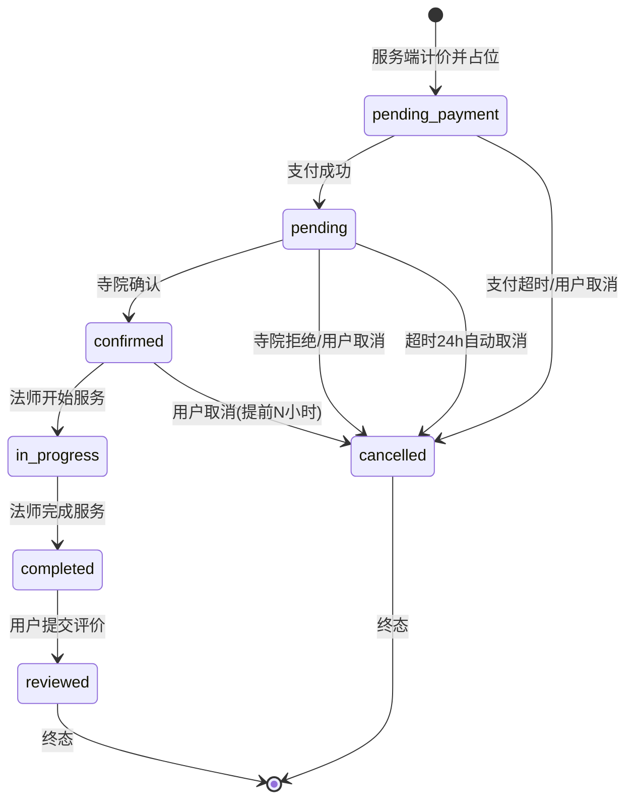
```mermaid
stateDiagram-v2
	[*] --> pending_payment: 服务端计价并占位
	pending_payment --> pending: 支付成功
	pending_payment --> cancelled: 支付超时/用户取消
    pending --> confirmed: 寺院确认
    pending --> cancelled: 寺院拒绝/用户取消
    pending --> cancelled: 超时24h自动取消
    confirmed --> in_progress: 法师开始服务
    confirmed --> cancelled: 用户取消(提前N小时)
    in_progress --> completed: 法师完成服务
    completed --> reviewed: 用户提交评价
    reviewed --> [*]: 终态
    cancelled --> [*]: 终态
```

### 1.3 状态转换规则

| 当前状态 | 允许操作 | 目标状态 | 操作角色 | 副作用 |
|---------|---------|---------|---------|--------|
| pending_payment | 支付成功 | pending | payment-service / 对账任务 | 写支付快照，通知寺院 |
| pending_payment | 超时取消 | cancelled | 系统(15分钟) | 原子释放时段容量 |
| pending | 确认预约 | confirmed | 寺院管理员 | 发MQ通知法师+用户 |
| pending | 拒绝预约 | cancelled | 寺院管理员 | 发MQ通知用户，触发退款 |
| pending | 用户取消 | cancelled | 用户 | 发MQ通知寺院 |
| pending | 超时(24h) | cancelled | 系统(定时任务) | 发MQ通知用户+寺院 |
| confirmed | 开始服务 | in_progress | 法师 | 发MQ通知用户 |
| confirmed | 用户取消 | cancelled | 用户(需提前2h) | 发MQ通知寺院，触发退款 |
| in_progress | 完成服务 | completed | 法师 | 发MQ通知用户可评价 |
| in_progress | 取消服务 | cancelled | 用户/系统 | 发MQ通知，触发退款 |
| completed | 提交评价 | reviewed | 用户 | 发MQ通知寺院 |

### 1.4 业务规则

1. **支付超时取消**：pending_payment 状态超过 15 分钟未支付，系统自动取消并且只释放一次时段容量
2. **取消限制**：confirmed 状态下用户需提前 2 小时取消，否则不可取消
3. **退款触发**：cancelled 状态触发 payment-service 退款流程
4. **状态日志**：每次状态变更写入 `booking_status_log` 表；历史预约保留 `payment_status=legacy`

---

## 2. DIY 手串订单状态机（diy-service）

### 2.1 状态定义

| 状态值 | 中文名 | 说明 |
|--------|--------|------|
| `pending_review` | 待审核 | 服务端完成重定价并创建订单；支付成功不越过商城审核改变此状态 |
| `in_making` | 制作中 | 商城审核通过，开始制作 |
| `awaiting_blessing` | 等待加持 | 制作完成，等待寺院/法师加持（仅含加持订单） |
| `blessing_in_progress` | 加持中 | 法师正在执行加持仪式 |
| `blessing_completed` | 加持完成 | 加持完成，可进入发货（仅含加持订单） |
| `awaiting_shipment` | 待发货 | 制作完成（无加持）或加持完成，等待发货 |
| `shipped` | 已发货 | 商城已发货 |
| `completed` | 已完成 | 用户确认收货 |
| `cancelled` | 已取消 | 用户取消或审核不通过 |
| `in_return` | 售后中 | 用户发起退换货 |

### 2.2 状态流转图

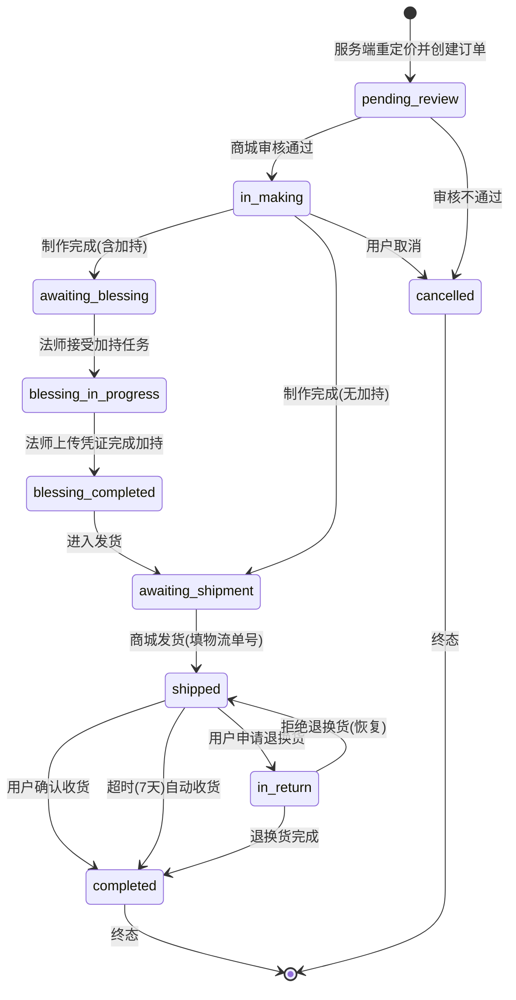
```mermaid
stateDiagram-v2
    [*] --> pending_review: 服务端重定价并创建订单
    pending_review --> in_making: 商城审核通过
    pending_review --> cancelled: 审核不通过

    in_making --> awaiting_blessing: 制作完成(含加持)
    in_making --> awaiting_shipment: 制作完成(无加持)
    in_making --> cancelled: 用户取消

    awaiting_blessing --> blessing_in_progress: 法师接受加持任务
    blessing_in_progress --> blessing_completed: 法师上传凭证完成加持
    blessing_completed --> awaiting_shipment: 进入发货

    awaiting_shipment --> shipped: 商城发货(填物流单号)
    shipped --> completed: 用户确认收货
    shipped --> completed: 超时(7天)自动收货
    shipped --> in_return: 用户申请退换货

    in_return --> completed: 退换货完成
    in_return --> shipped: 拒绝退换货(恢复)

    completed --> [*]: 终态
    cancelled --> [*]: 终态
```

### 2.3 状态转换规则

| 当前状态 | 允许操作 | 目标状态 | 操作角色 | 副作用 |
|---------|---------|---------|---------|--------|
| pending_review | 审核通过 | in_making | 商城运营 | 发MQ通知用户 |
| pending_review | 审核不通过 | cancelled | 商城运营 | 同事务归还材料/SKU库存；已支付订单进入退款流程 |
| pending_review | 用户取消 | cancelled | 用户 | 发MQ通知商城，触发退款 |
| in_making | 制作完成(含加持) | awaiting_blessing | 商城运营 | 发MQ派加持任务到寺院 |
| in_making | 制作完成(无加持) | awaiting_shipment | 商城运营 | - |
| in_making | 用户取消 | cancelled | 用户 | 需商城同意，触发退款 |
| awaiting_blessing | 法师接受 | blessing_in_progress | 法师 | 发MQ通知商城+用户 |
| blessing_in_progress | 完成加持 | blessing_completed | 法师 | 上传凭证，发MQ通知商城 |
| blessing_completed | 进入发货 | awaiting_shipment | 系统(自动) | - |
| awaiting_shipment | 发货 | shipped | 商城运营 | 填物流单号，发MQ通知用户 |
| shipped | 确认收货 | completed | 用户 | 发MQ触发财务结算 |
| shipped | 超时(7天) | completed | 系统(定时任务) | 自动收货，触发结算 |
| shipped | 申请退换货 | in_return | 用户 | 发MQ通知商城 |
| in_return | 退换货完成 | completed | 商城运营 | 发MQ触发退款/补发 |
| in_return | 拒绝退换货 | shipped | 商城运营 | 发MQ通知用户 |

### 2.4 业务规则

1. **加持分支判断**：订单含加持服务 → 走 `awaiting_blessing` 分支；否则直接 `awaiting_shipment`
2. **加持任务派发**：`in_making → awaiting_blessing` 时自动创建 `blessing_task` 记录，发MQ到对应寺院
3. **凭证上传**：法师完成加持需上传照片/视频凭证（调 file-service）
4. **自动收货**：shipped 状态超过 7 天自动确认收货
5. **退换货期限**：completed 后 7 天内可申请退换货

---

## 3. 加持任务状态机（diy-service / temple-service / master-service 协同）

### 3.1 状态定义

| 状态值 | 中文名 | 说明 |
|--------|--------|------|
| `dispatched` | 已派单 | 商城派单到寺院，等待寺院接收 |
| `assigned` | 已分配法师 | 寺院分配了执行法师 |
| `accepted` | 法师已接受 | 法师接受任务 |
| `in_progress` | 加持中 | 法师开始执行加持 |
| `completed` | 已完成 | 法师完成加持并上传凭证 |
| `rejected` | 已拒绝 | 法师拒绝任务 |

### 3.2 状态流转图

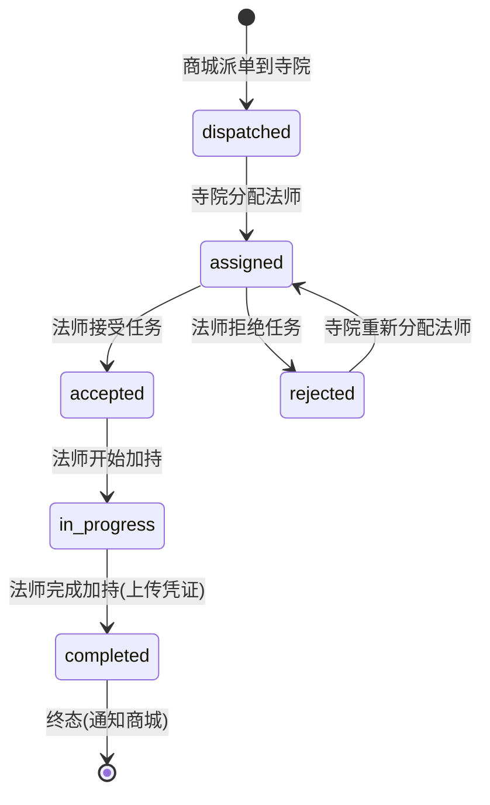
```mermaid
stateDiagram-v2
    [*] --> dispatched: 商城派单到寺院
    dispatched --> assigned: 寺院分配法师
    assigned --> accepted: 法师接受任务
    assigned --> rejected: 法师拒绝任务
    rejected --> assigned: 寺院重新分配法师
    accepted --> in_progress: 法师开始加持
    in_progress --> completed: 法师完成加持(上传凭证)
    completed --> [*]: 终态(通知商城)
```

### 3.3 协同流程

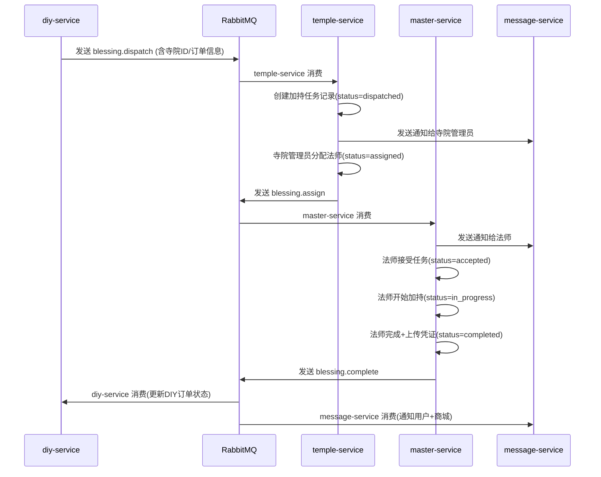
```mermaid
sequenceDiagram
    participant DIY as diy-service
    participant MQ as RabbitMQ
    participant T as temple-service
    participant M as master-service
    participant MSG as message-service

    DIY->>MQ: 发送 blessing.dispatch (含寺院ID/订单信息)
    MQ->>T: temple-service 消费

    T->>T: 创建加持任务记录(status=dispatched)
    T->>MSG: 发送通知给寺院管理员

    T->>T: 寺院管理员分配法师(status=assigned)
    T->>MQ: 发送 blessing.assign
    MQ->>M: master-service 消费

    M->>MSG: 发送通知给法师
    M->>M: 法师接受任务(status=accepted)
    M->>M: 法师开始加持(status=in_progress)
    M->>M: 法师完成+上传凭证(status=completed)

    M->>MQ: 发送 blessing.complete
    MQ->>DIY: diy-service 消费(更新DIY订单状态)
    MQ->>MSG: message-service 消费(通知用户+商城)
```

---

## 4. 寺院与法师入驻/可见状态机

### 4.1 寺院状态机

| 状态值 | 中文名 | 用户端可见 | 说明 |
|--------|--------|------------|------|
| `待审核` | 待审核 | 否 | 平台已创建或收到入驻申请，等待审核 |
| `正常` | 正常/已上架 | 是 | 审核通过且允许 C端展示 |
| `推荐` | 平台推荐 | 是 | 已通过审核并在 C端展示，可用于后续推荐排序 |
| `封禁` | 已封禁 | 否 | 平台封禁，不允许登录管理端业务操作，不允许 C端展示 |

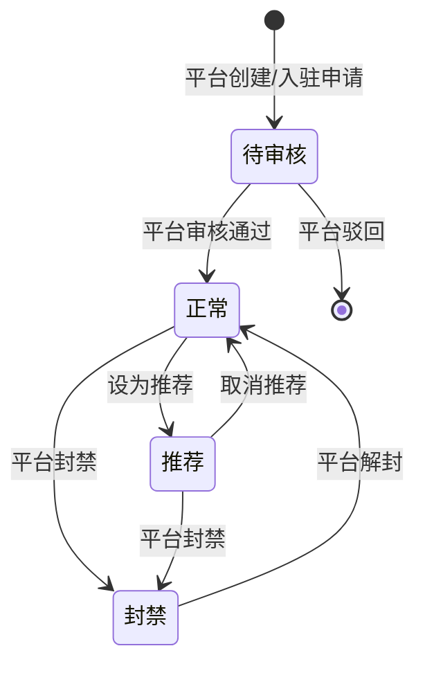
```mermaid
stateDiagram-v2
    [*] --> 待审核: 平台创建/入驻申请
    待审核 --> 正常: 平台审核通过
    待审核 --> [*]: 平台驳回
	正常 --> 推荐: 设为推荐
	推荐 --> 正常: 取消推荐
	正常 --> 封禁: 平台封禁
	推荐 --> 封禁: 平台封禁
	封禁 --> 正常: 平台解封
```

`待审核` 是入驻流程状态，必须按 `pending -> first_pass -> final_pass` 完成初审和终审；“设为正常/推荐/封禁”只是已进入运营阶段后的状态管理，不代替审核。

### 4.2 法师状态机

法师可见性由三个字段共同决定：

| 字段 | 可见条件 | 说明 |
|------|----------|------|
| `auth_status` | `已认证` | 平台审核通过 |
| `shelf_status` | `on_shelf` | 已上架 |
| `platform_status` | `normal` | 未被平台封禁 |

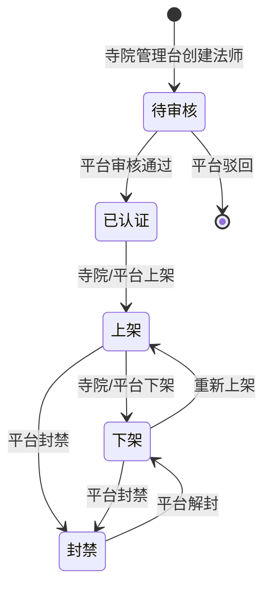
```mermaid
stateDiagram-v2
    [*] --> 待审核: 寺院管理台创建法师
    待审核 --> 已认证: 平台审核通过
    待审核 --> [*]: 平台驳回
    已认证 --> 上架: 寺院/平台上架
    上架 --> 下架: 寺院/平台下架
    下架 --> 上架: 重新上架
    上架 --> 封禁: 平台封禁
    下架 --> 封禁: 平台封禁
    封禁 --> 下架: 平台解封
```

### 4.3 管理账号状态机

| 状态值 | 中文名 | 可登录 | 说明 |
|--------|--------|--------|------|
| `enabled` | 启用 | 是 | 可登录对应管理端 |
| `disabled` | 禁用 | 否 | 禁止登录 |

账号创建时必须满足角色绑定：

| 角色 | 必填绑定 | 校验 |
|------|----------|------|
| `temple_admin` | `temple_id` | 寺院必须存在 |
| `master` | `master_id` | 法师必须存在，且系统派生其所属 `temple_id` |
| `shop_admin` | `shop_id` | 当前必须为非 0；后续补商铺主表后加存在性校验 |
| `platform_super`/`platform_service` | 无 | 不绑定业务对象 |

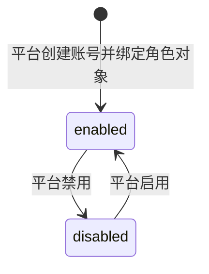
```mermaid
stateDiagram-v2
    [*] --> enabled: 平台创建账号并绑定角色对象
    enabled --> disabled: 平台禁用
    disabled --> enabled: 平台启用
```

---

## 5. 商城订单状态机（order-service）

### 4.1 状态定义

| 状态值 | 中文名 | 说明 |
|--------|--------|------|
| `pending_payment` | 待付款 | 用户下单未支付 |
| `paid` | 已支付 | 支付成功，待发货 |
| `shipped` | 已发货 | 商城已发货 |
| `completed` | 已完成 | 用户确认收货 |
| `cancelled` | 已取消 | 用户取消/超时未支付 |
| `in_return` | 售后中 | 用户申请退换货 |

### 4.2 状态流转图

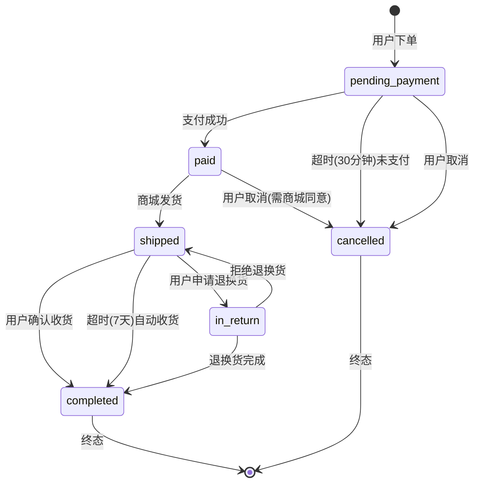
```mermaid
stateDiagram-v2
    [*] --> pending_payment: 用户下单
    pending_payment --> paid: 支付成功
    pending_payment --> cancelled: 超时(30分钟)未支付
    pending_payment --> cancelled: 用户取消

    paid --> shipped: 商城发货
    paid --> cancelled: 用户取消(需商城同意)

    shipped --> completed: 用户确认收货
    shipped --> completed: 超时(7天)自动收货
    shipped --> in_return: 用户申请退换货

    in_return --> completed: 退换货完成
    in_return --> shipped: 拒绝退换货

    completed --> [*]: 终态
    cancelled --> [*]: 终态
```

### 4.3 状态转换规则

| 当前状态 | 允许操作 | 目标状态 | 操作角色 | 副作用 |
|---------|---------|---------|---------|--------|
| pending_payment | 支付成功 | paid | 系统(支付回调) | 发MQ触发财务 |
| pending_payment | 超时(30min) | cancelled | 系统(定时任务) | - |
| pending_payment | 用户取消 | cancelled | 用户 | - |
| paid | 发货 | shipped | 商城运营 | 填物流单号，发MQ通知用户 |
| paid | 用户取消 | cancelled | 用户(需同意) | 触发退款 |
| shipped | 确认收货 | completed | 用户 | 发MQ触发结算 |
| shipped | 超时(7天) | completed | 系统(定时任务) | 自动收货 |
| shipped | 申请退换货 | in_return | 用户 | 发MQ通知商城 |
| in_return | 退换货完成 | completed | 商城运营 | 触发退款/补发 |
| in_return | 拒绝退换货 | shipped | 商城运营 | 发MQ通知用户 |

---

## 5. 退换货状态机（order-service）

### 5.1 状态定义

| 状态值 | 中文名 | 说明 |
|--------|--------|------|
| `pending_review` | 待审核 | 用户申请，等待商城审核 |
| `approved` | 已同意 | 商城同意退换货 |
| `return_shipping` | 退货运输中 | 用户寄回商品 |
| `return_received` | 已收货 | 商城收到退货 |
| `refunding` | 退款中 | 发起退款 |
| `completed` | 已完成 | 退款到账/换货发出 |
| `rejected` | 已拒绝 | 商城拒绝退换货 |

### 5.2 状态流转图

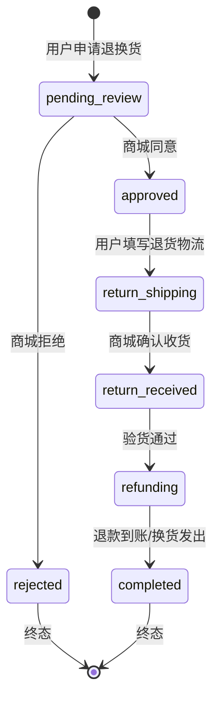
```mermaid
stateDiagram-v2
    [*] --> pending_review: 用户申请退换货
    pending_review --> approved: 商城同意
    pending_review --> rejected: 商城拒绝

    approved --> return_shipping: 用户填写退货物流
    return_shipping --> return_received: 商城确认收货
    return_received --> refunding: 验货通过

    refunding --> completed: 退款到账/换货发出
    rejected --> [*]: 终态
    completed --> [*]: 终态
```

---

## 6. 提现状态机（finance-service）

### 6.1 状态定义

| 状态值 | 中文名 | 说明 |
|--------|--------|------|
| `pending` | 待审核 | 寺院/法师/商城申请提现 |
| `approved` | 已审核 | 平台审核通过 |
| `processing` | 打款中 | 财务发起打款 |
| `success` | 打款成功 | 资金到账 |
| `failed` | 打款失败 | 打款失败 |
| `rejected` | 已拒绝 | 平台拒绝提现申请 |

### 6.2 状态流转图

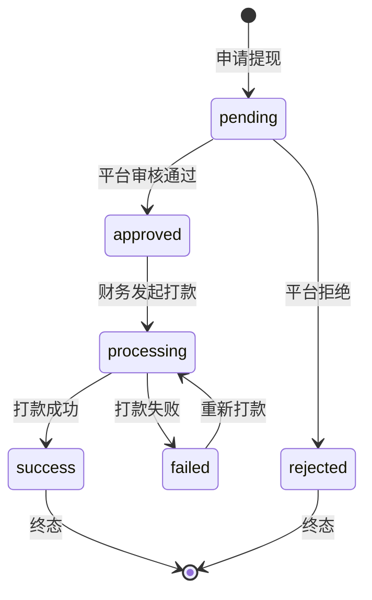
```mermaid
stateDiagram-v2
    [*] --> pending: 申请提现
    pending --> approved: 平台审核通过
    pending --> rejected: 平台拒绝

    approved --> processing: 财务发起打款
    processing --> success: 打款成功
    processing --> failed: 打款失败

    failed --> processing: 重新打款
    success --> [*]: 终态
    rejected --> [*]: 终态
```

---

## 7. 审核状态机（audit-service）

### 7.1 设计广场审核

| 状态值 | 中文名 |
|--------|--------|
| `pending` | 待审核 |
| `approved` | 审核通过 |
| `rejected` | 审核驳回 |

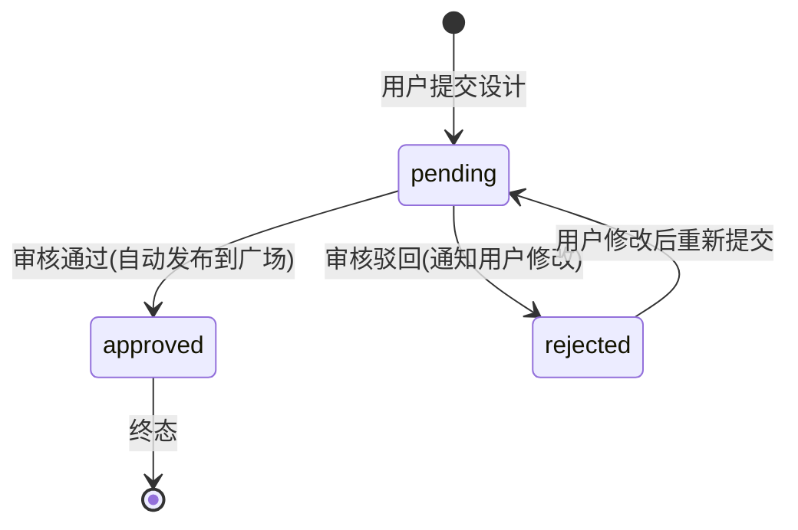
```mermaid
stateDiagram-v2
    [*] --> pending: 用户提交设计
    pending --> approved: 审核通过(自动发布到广场)
    pending --> rejected: 审核驳回(通知用户修改)
    rejected --> pending: 用户修改后重新提交
    approved --> [*]: 终态
```

### 7.2 寺院入驻审核

| 状态值 | 中文名 |
|--------|--------|
| `pending` | 待审核 |
| `first_pass` | 初审通过 |
| `final_pass` | 终审通过(上线) |
| `rejected` | 审核驳回 |

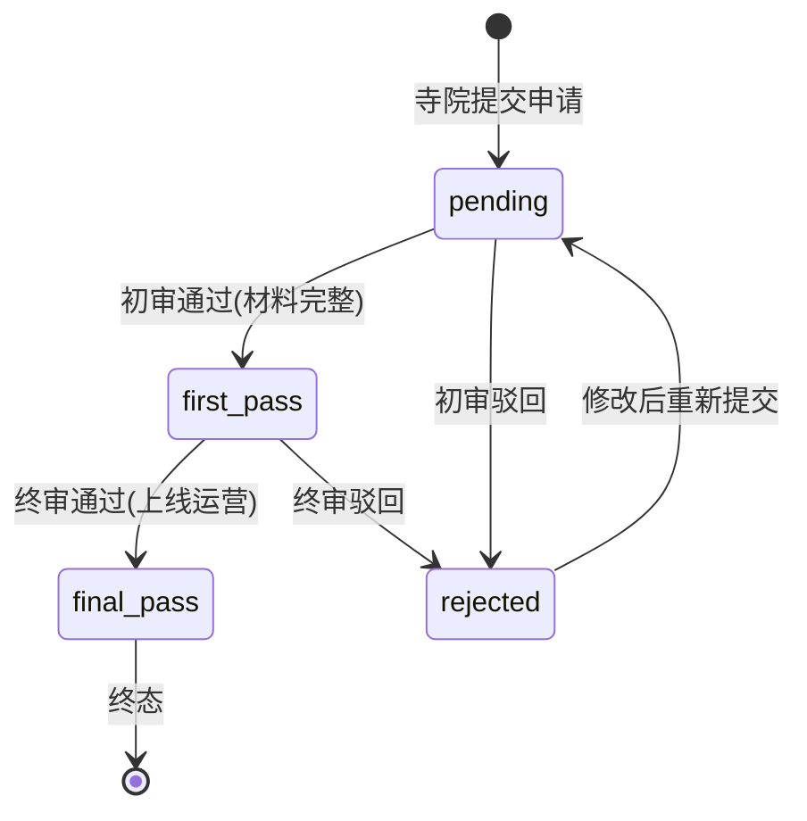
```mermaid
stateDiagram-v2
    [*] --> pending: 寺院提交申请
    pending --> first_pass: 初审通过(材料完整)
    pending --> rejected: 初审驳回
    first_pass --> final_pass: 终审通过(上线运营)
    first_pass --> rejected: 终审驳回
    rejected --> pending: 修改后重新提交
    final_pass --> [*]: 终态
```

### 7.3 法师资质审核

| 状态值 | 中文名 |
|--------|--------|
| `pending` | 待审核 |
| `pass` | 已认证 |
| `rejected` | 审核驳回 |

> **状态值说明**：master-service `master_audit.go:13-17` 定义法师审核状态常量为 `pending`/`pass`/`rejected`（`pass` 而非 `verified`）。audit-service 统一审核队列 `audit_queue.go:8-15` 另有 `AuditStatusVerified = "verified"` 用于 audit_queue 表的混合审核状态，两者不冲突——master_audit 表用 `pass`，audit_queue 表用 `verified`。

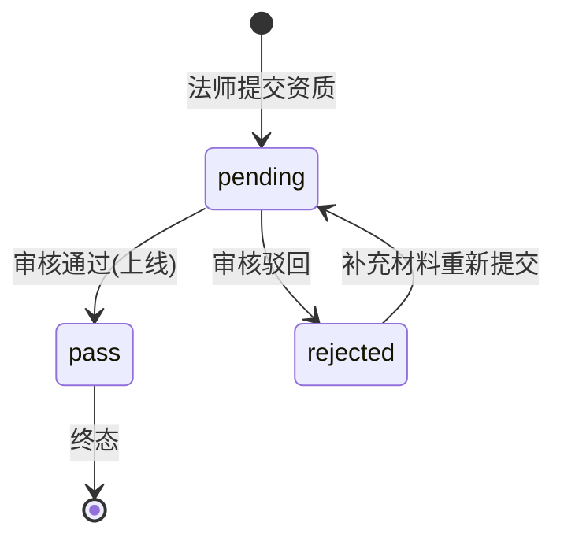
```mermaid
stateDiagram-v2
    [*] --> pending: 法师提交资质
    pending --> pass: 审核通过(上线)
    pending --> rejected: 审核驳回
    rejected --> pending: 补充材料重新提交
    pass --> [*]: 终态
```

---

## 8. 支付状态机（payment-service）

### 8.1 状态定义

| 状态值 | 中文名 | 说明 |
|--------|--------|------|
| `pending` | 待支付 | 订单已创建，等待用户支付 |
| `success` | 支付成功 | 第三方回调确认 |
| `failed` | 支付失败 | 支付异常 |
| `refunding` | 退款中 | 发起退款 |
| `refunded` | 已退款 | 退款到账 |
| `closed` | 已关闭 | 超时未支付关闭 |

### 8.2 状态流转图

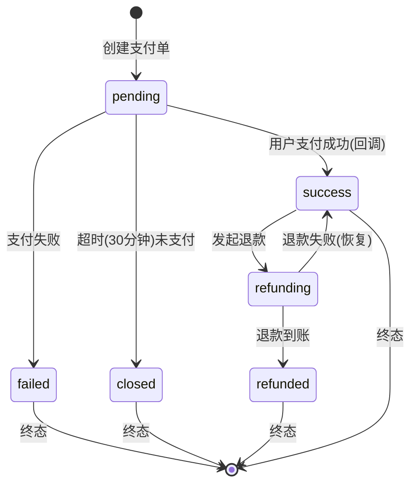
```mermaid
stateDiagram-v2
    [*] --> pending: 创建支付单
    pending --> success: 用户支付成功(回调)
    pending --> failed: 支付失败
    pending --> closed: 超时(30分钟)未支付

    success --> refunding: 发起退款
    refunding --> refunded: 退款到账
    refunding --> success: 退款失败(恢复)

    failed --> [*]: 终态
    closed --> [*]: 终态
    refunded --> [*]: 终态
    success --> [*]: 终态
```

---

## 9. 结算状态机（finance-service）

### 9.1 状态定义

| 状态值 | 中文名 | 说明 |
|--------|--------|------|
| `pending` | 待确认 | 结算单已生成，等待平台确认 |
| `confirmed` | 已确认 | 平台管理员确认结算单 |
| `paid` | 已打款 | 平台管理员处理打款，资金到账 |

### 9.2 状态流转图

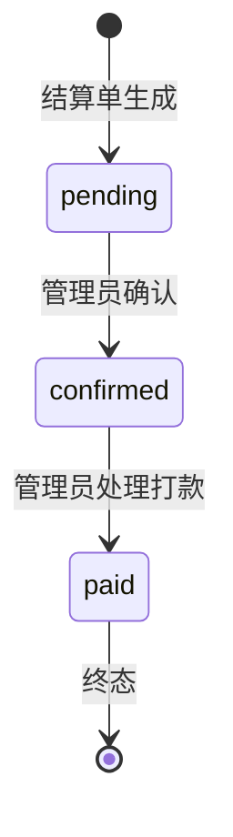
```mermaid
stateDiagram-v2
    [*] --> pending: 结算单生成
    pending --> confirmed: 管理员确认
    confirmed --> paid: 管理员处理打款
    paid --> [*]: 终态
```

### 9.3 状态转换规则

| 当前状态 | 允许操作 | 目标状态 | 操作角色 | 副作用 |
|---------|---------|---------|---------|--------|
| pending | 确认结算 | confirmed | 平台管理员 | 发MQ通知相关方 |
| confirmed | 处理打款 | paid | 平台管理员 | 发MQ通知提现/结算到账 |

---

## 10. 媒体与直播状态机（media-service）

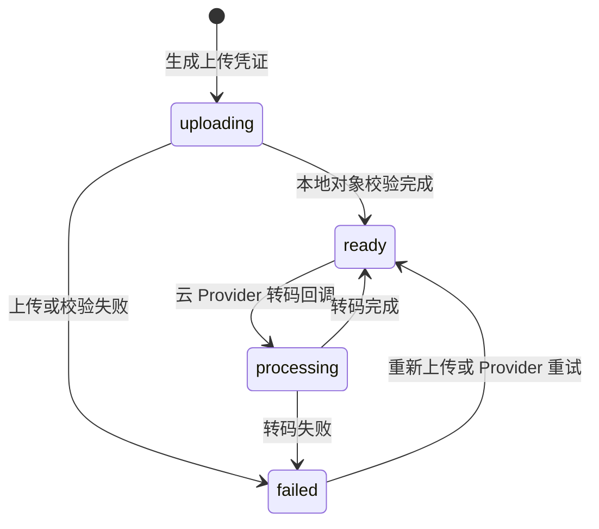
```mermaid
stateDiagram-v2
    [*] --> uploading: 生成上传凭证
    uploading --> ready: 本地对象校验完成
    uploading --> failed: 上传或校验失败
    ready --> processing: 云 Provider 转码回调
    processing --> ready: 转码完成
    processing --> failed: 转码失败
    failed --> ready: 重新上传或 Provider 重试
```

媒体审核独立使用 `pending -> approved/rejected`，转码与审核回调允许重放。回调中省略的 URL、任务号和时长保留原值。

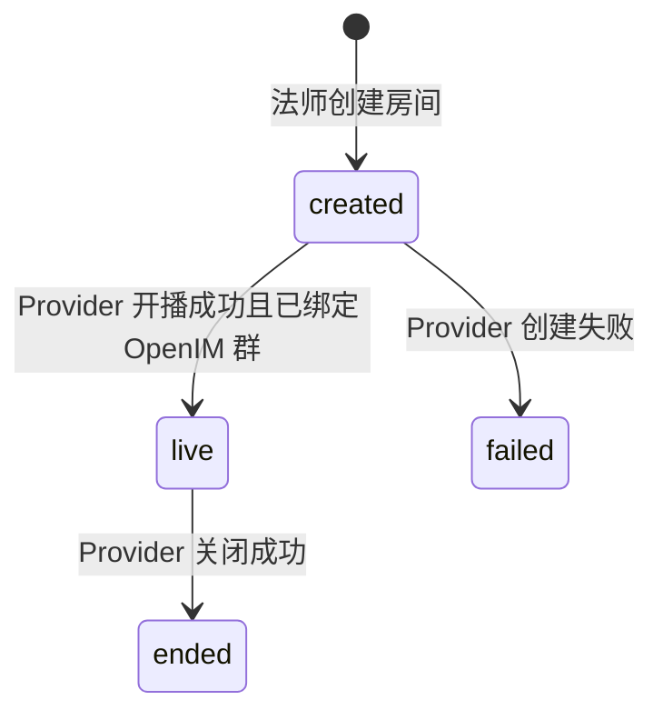
```mermaid
stateDiagram-v2
    [*] --> created: 法师创建房间
    created --> live: Provider 开播成功且已绑定 OpenIM 群
    live --> ended: Provider 关闭成功
    created --> failed: Provider 创建失败
```

当 `LIVE_ENABLED=false` 或 Provider 未配置时，`created -> live` 不可执行，房间保持 `created` 且不产生推流地址。

---

## 11. 大师广场状态机（community-service）

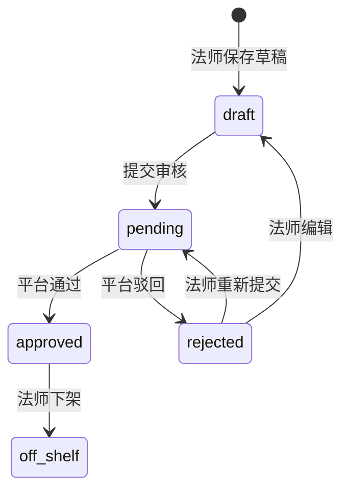
```mermaid
stateDiagram-v2
    [*] --> draft: 法师保存草稿
    draft --> pending: 提交审核
    pending --> approved: 平台通过
    pending --> rejected: 平台驳回
    rejected --> draft: 法师编辑
    rejected --> pending: 法师重新提交
    approved --> off_shelf: 法师下架
```

帖子只有 `approved` 可被 C 端读取。编辑仅允许 `draft/rejected`，已发布内容必须先下架，不允许绕过审核直接修改。

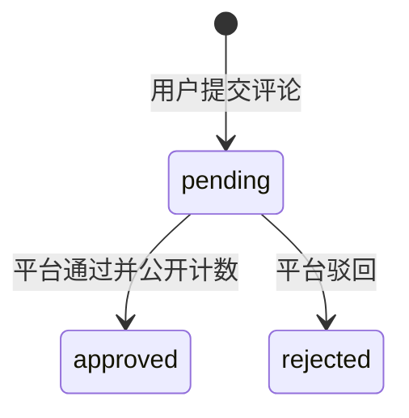
```mermaid
stateDiagram-v2
    [*] --> pending: 用户提交评论
    pending --> approved: 平台通过并公开计数
    pending --> rejected: 平台驳回
```

评论先审后显；重复审核不重复增加 `comment_count`。点赞与关注分别依赖复合主键实现幂等。

## 12. 即时咨询状态机（booking-service）

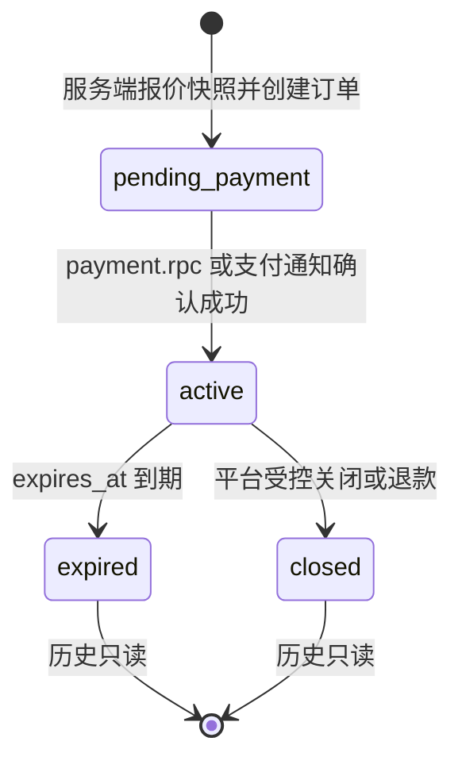
```mermaid
stateDiagram-v2
    [*] --> pending_payment: 服务端报价快照并创建订单
    pending_payment --> active: payment.rpc 或支付通知确认成功
    active --> expired: expires_at 到期
    active --> closed: 平台受控关闭或退款
    expired --> [*]: 历史只读
    closed --> [*]: 历史只读
```

`active` 才允许发送文字；`expired/closed` 仍可读取历史。重复创建使用 `user_id + request_id` 幂等，支付使用 `consultation:<orderNo>` 幂等。

---

## 版本记录

| 版本 | 日期 | 说明 |
|------|------|------|
| v1.0 | 2026-07-01 | 初始版本：8类状态机（预约/DIY/加持/商城订单/退换货/提现/审核/支付） |
| v1.1 | 2026-07-02 | 新增结算状态机；修正预约状态机终态（completed 非终态，终态为 reviewed/cancelled） |
| v1.2 | 2026-07-13 | 新增媒体处理、审核与直播房间状态机 |
| v1.3 | 2026-07-13 | 新增大师广场帖子、评论审核状态机和幂等约束 |
| v1.4 | 2026-08-14 | 新增独立即时咨询订单、有效期和只读历史状态机 |
