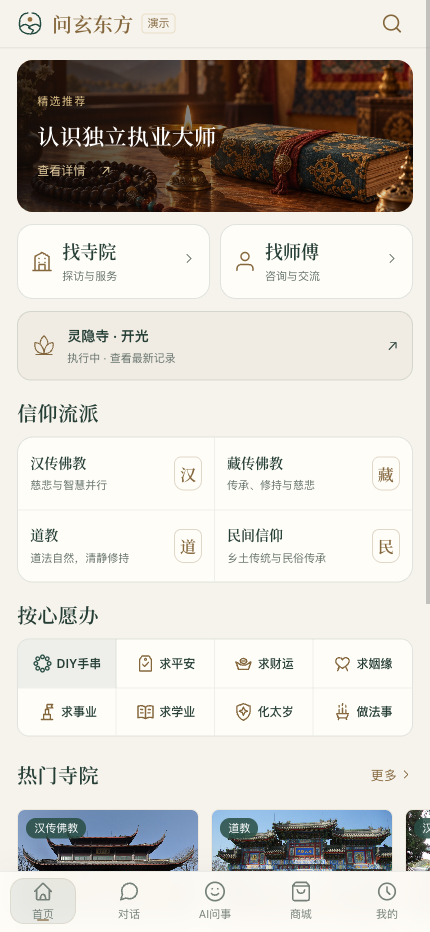
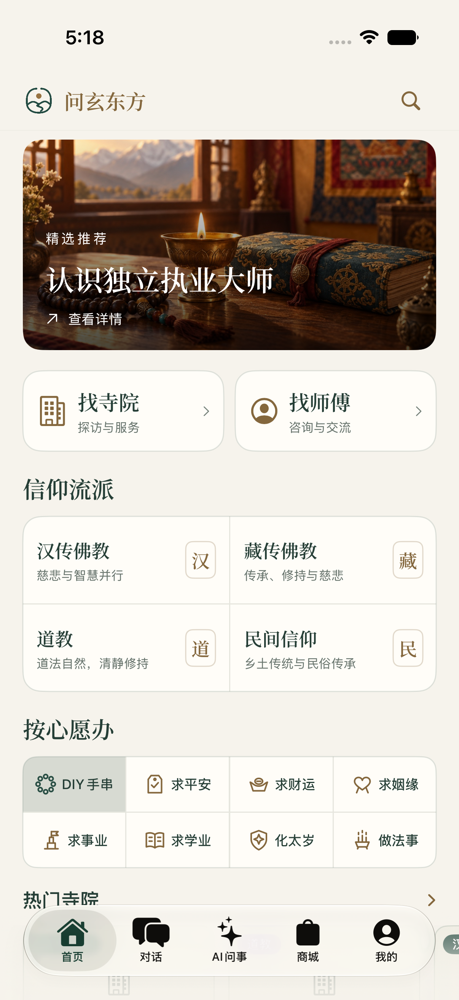

# 产品交付与上手指南

交付基线：0.0.1 / 2026-09-16。读者：产品负责人、需求提出方、业务试用人员与培训人员。

本册回答第一次打开如何使用、每个角色负责什么、什么结果代表任务完成。配套《全平台测试与验收手册》用于执行测试，《需求范围与追踪矩阵》用于确认范围，《投资侧产品与验证说明》用于产品和商业讨论。四册是本次新增交付文件，原有四册手册作为参考资料随包交付。

> 当前适合受控演示和验收准备。普通订单的支付渠道仍为模拟；真实收付款、退款、完整原生业务、APNs 和公网音视频尚不能据此宣布验收通过。本文不是测试通过证书。

## 1. 产品解决什么问题

问玄东方将文化内容与 AI 参考、寺院及大师发现、服务预约与记录、商品和手串定制组织在一个产品中。信众可以先了解内容和供给，再决定是否预约或创作；执行方通过接单、执行、媒体回执和用户确认交接服务结果。

主要价值是让入口、执行责任和后续进度可见。仪式感来自用户自愿填写心愿、查看阶段记录、主动核对回执与保存档案。动画不替代履约，也不暗示现实功效。

| 业务 | 用户任务 | 可观察的完成结果 |
| --- | --- | --- |
| 发现与内容 | 找到合适寺院、大师或文章 | 搜索筛选有效，详情及素材可读 |
| AI 参考 | 提问、阅读摘要或完整报告 | 回答或报告有明确结果；扣分与阅读权限可核对 |
| 服务预约 | 选服务和时间，跟踪执行 | 执行方提交回执，信众核对并确认完成 |
| DIY | 选材、编排、保存、定制 | 服务端生成订单快照，按实际制作和物流交付 |
| 商城与权益 | 下单、收货、兑换或参加积分活动 | 订单、资金、积分、物流分别有记录 |

## 2. 交付入口与使用准备

当前站点基址为 `https://101.96.228.71`。这是交付记录中的环境地址，接收方开始验收前应确认负责人提供的最新地址、版本和可用账号；本次编制文档没有重新检查站点在线状态。不要将旧本机端口当作长期测试服务。

| 角色 | 入口 | 需要准备 |
| --- | --- | --- |
| 信众 | `/c`；信众原生 iOS | 本人邮箱，或分配的测试用户名 |
| 独立大师 / 纳管大师 | `/m`；大师原生 iOS | 已审核或已激活的大师身份 |
| 寺院经办人 / 管理员 | `/temple/` | 申请人身份或本寺管理权限 |
| 平台和商城运营 | `/admin/` | 内部分配账号及对应业务权限 |
| 旧商城书签 | `/shop/` | 迁移到统一管理台，保留权限范围 |

测试负责人通过独立私密渠道分发账号。本套文件不附密码、邮件密钥、身份证件或完整生产账号清单。不能收信的占位邮箱账号只用于用户名登录；邮件注册与找回需专用可收信地址。测试账号必须能关联受控寺院、大师和服务，不能只创建一个登录用户便开始履约验收。

原生信众最新版本地补丁为 `ebd931d`，安装记录存在，完整真机登录业务仍待验收；大师端目前有构建证据。接收方若只拿到网页地址，不能视为已收到两款 iOS 应用。原生工程、签名条件、安装包和测试设备由技术交付人另行登记，本次文件包不包含源码或安装包。

## 3. 首页与角色导航

信众底部为首页、对话、AI问事、商城、我的。首页优先提供找寺院、找师傅、信仰流派、八项心愿和 DIY；服务进度在有进行中预约时显示动态入口，在“我的”中保留固定入口。订单详情中的流程继续保留。

图 1：两图登录状态不同，用于识别入口和视觉布局；不证明同一账号已完成跨端业务。iOS 保留系统导航和边缘右滑，产品一致性以功能、数据和状态语义为主。

大师底部为工作台、预约、消息、我的。寺院人员使用本寺资料、服务、法师、预约与履约工作台。平台人员在总管理台处理审核和运营；商城已并入其中，寺院管理台独立存在。

## 4. 第一次注册和登录

普通信众从登录页进入注册，填写用户名、邮箱和密码，按要求完成图片与邮件验证。收到的平台注册邮件只用于当前注册，不把邮箱本身的登录验证码填入平台。提交成功后以用户名或邮箱、密码、图片验证码登录。

独立大师从大师端注册申请人，提交资质，等待平台审核；寺院从寺院平台注册经办人并提交机构资料。审核前只能使用申请范围，不能先接单。退回后按理由补充再提交。

寺院纳管大师由本寺管理员建立档案和分配账号，本人在大师端验证邮箱、设置密码并激活。纳管大师和独立大师共用登录入口，管理归属不同。寺院不能分配其他寺院或独立大师的权限。

忘记密码时使用已绑定且可收信的邮箱重置。改密后需要重新登录。图片不清晰可刷新；发送邮件失败应保留提示并检查收件地址、垃圾箱和发送间隔。不要反复提交或共享 admin 密码。

## 5. 信众服务预约：从选择到完成

1. 找到寺院或大师，打开服务详情，确认提供者、执行方式、说明、费用和可预约时段。选择“全院执行”时，承接者为寺院，不是空名称大师。
2. 选时间、填写必要信息并核对金额，提交后记下预约号。当前支付为模拟，以对应环境说明为准；结果不明先查询原订单。
3. 到“我的 → 服务进度”查看待确认状态。待确认或待执行时可选填心愿，不填也能继续；修改保留原留言记录。
4. 执行方接单后变为待执行，开始后变为执行中。查看阶段说明、时间和媒体；没有记录时不假定已经执行。
5. 执行方提交最终回执后，打开图片或播放视频，核对服务、日期、内容和说明。视频需要主动播放。
6. 内容不足时要求补充，订单回到执行处理并保留历史版本；收到新回执后重新核对。
7. 符合实际交付后确认完成，查看档案与原订单。完成反馈只出现一次，不自动循环。需要评价时按已完成订单入口操作。

| 状态 | 谁负责下一步 | 用户应看到 |
| --- | --- | --- |
| 待确认 pending | 寺院或大师 | 已提交预约、等待接单 |
| 待执行 confirmed | 执行方 | 已接单、尚未执行 |
| 执行中 in_progress | 执行方 | 开始记录及阶段信息 |
| 待确认回执 pending_receipt | 信众 | 最终回执、补充与确认入口 |
| 已完成 completed | 进入归档 | 用户确认结果、可追溯历史 |

这条主路径不包含取消等终止分支。预约取消与款项退款分别核对。全院执行以订单及服务进度沟通交付，不会自动创建大师私聊；有大师的预约按有效沟通资格提供会话。SHA-256 用于文件完整性，当前没有区块链存证。

## 6. 寺院、大师和平台如何协作

寺院管理员先维护本寺资料、服务、排班与纳管大师，检查上架后的信众展示。处理全院预约时，核对订单和时段，再依次接单、开始执行、发布阶段记录、提交说明及图片或视频回执。信众要求补充时在原单处理，不能用新单替代历史。

大师在工作台或预约中打开本人订单，按相同状态推进。独立大师的资质由平台审核；纳管大师账号由寺院管理。休息日设置不自动取消已存在的预约，需单独查看并处理。

平台负责审核申请、配置供给、审核公开内容和处理运营问题。商城运营负责材料、商品、订单审核、制作与物流。接单、发货、完成、退款申请等不同动作必须由对应权限方执行，后台能看到订单不等于可以替代信众确认回执。

## 7. DIY 与商城上手

游客可从首页进入 DIY，选择材料、调整珠序和尺寸、撤销重做，并在支持时切换 2D / 3D。保存到账号、打开个人作品或下单时再登录；跨登录恢复需纳入原生实机验收。

H5 有分类、关键词及五行筛选；原生已有分类与关键词，目前无独立五行控件。3D 出错时应能回到保留设计的 2D。保存成功后再发布；公开设计再次编辑保存会转为私密，需重新发布。

定制下单必须经过服务端可用性和计价检查。缺货、下架、金额变化时重新核对，不按旧截图承诺成交。订单生成后材料、规格和金额取订单快照。后台审核和制作后，若选择加持则按相应任务交接，再登记物流；已发货且实际收到后确认收货。

普通商城从商品、规格、购物车、地址到订单；体验商品与普通商品分开结算。普通商城具备按状态申请售后的入口，DIY 尚无完整同类自助退货链；DIY 问题用订单号交运营处理，不让用户寻找不存在的按钮。

## 8. AI、内容、消息和积分

AI 自由聊天可选择开放模型，切换影响下次提问；含图片时需支持图片的模型。专题报告先生成免费摘要，解锁前确认积分；生成失败按原记录重试。内容供文化参考，不能把界面图案当真实排盘或现实功效保证。

大师广场可浏览发现、图文、视频；关注、点赞、评论等按登录要求操作。大师内容保存草稿、提交审核、公开展示是三个结果。素材无法播放时应登记问题，不能把占位图当作验收通过。

“我的 → 消息”处理系统通知，“对话”处理私聊。未读、已读、发送成功、对方收到、业务完成分别核对。失败消息使用原条重试，断网或暂未连接不应把有效账号踢到登录页。

积分商城兑换确定权益，转盘和奖池按本期规则扣积分参与；平台承担奖品不代表免费。功德值属于成长记录，不是现金余额。当前模拟支付、积分活动和运营收入不能混用口径。

## 9. 演示顺序与常见问题

建议一次完整演示按以下顺序进行，预计时长由讲解与网络情况调整，不作为性能承诺：先展示游客首页和 DIY，再以信众登录预约；切换寺院接单并执行；回到信众查看媒体、要求补充、确认并归档；最后展示独立大师与纳管大师区别、后台审核和消息边界。只在受控数据上推进模拟业务。

| 情况 | 下一步 |
| --- | --- |
| 验证码没收到 | 核对是否可收信地址及邮件用途；查看垃圾箱和错误提示 |
| 付款后无私聊 | 全院执行看服务进度；大师预约核对实际沟通资格 |
| 确认预约后仍未完成 | 等待执行、回执与信众确认，这是正常主路径 |
| 上传失败或提交结果不明 | 先保留编号、查原记录，再按原操作重试 |
| 登录后入口缺少 | 核对端、角色、审核状态和版本 |
| 网络错误跳登录 | 记录端、时间和错误；应检查鉴权与普通网络错误是否混淆 |
| 图片视频不可读 | 登记原订单及文件类型，核对权限、文件响应和实际播放 |

## 10. 接收与支持交接

接收方先核对文件清单和版本，再确认环境、账号角色、安装渠道、测试资料和问题负责人。用配套验收手册执行用例，按需求编号记录结果。所有新用例初始为未执行；已有测试结果只在证据目录中引用。

工单至少填写端与版本、发生时间、前提、步骤、预期、实际、业务编号、截图或脱敏日志、负责人和复验结果。测试结束退出账号，按约定回收夹具；在途订单及历史凭证不直接删除。

依据：配套《产品使用手册》《运营与合作手册》《产品现状与能力边界》，以及 2026-09-16 文档同步和履约、iOS 交付记录。本套统一索引为交付包根目录“开始阅读.md”。
