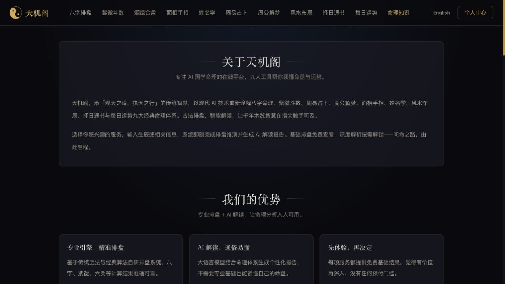

# 竞品研究与产品决策手册

> 问玄东方 · 产品、设计与商业决策参考｜整理与公开核验：2026-09-13（北京时间）
>
> 本手册归并五份旧研究，区分当日公开可见内容、2026-09-08—09 的历史观察和模型假设。没有进行注册、充值、购买、提现或私人资料提交；不提供竞品当前结算价、预测准确率、营收或盈利保证。问玄东方的实施状态以[产品现状与能力边界](../product/产品现状与能力边界.md)为准。

## 1. 本次更新解决什么问题

原资料包含一份 9 页战略备忘录、一份 19 页详细分析，以及图文、青绿简约、字体更新三份 30 页版本。它们不是五次独立调研：9 页稿记录 9 月 8 日公开访问，19 页稿补充 9 月 9 日功能与获授权登录态规则；三份 30 页稿在后者基础上加入机制图和截图，再做视觉排版调整。去掉页眉、页码和空白后，两份青绿稿正文完全一致；图文稿与青绿稿的实质差异仅在封面标识。重复结论不应被当作多份独立证据。

本次按“产品是什么—用户如何完成任务—费用和权益如何流转—问玄东方取舍什么”重组内容。历史截图仍可说明当时界面，不能通过换封面日期变成最新现场证据。新核验优先使用原产品官方页面；公开页面文字说明功能和承诺，实际报告质量、付款扣费、退款执行和资金到账仍是另一层证据。

阅读时使用四种状态：**页面复核**指本次读到了官方页面内容，并单独说明公开入口或既有会话访问条件；**历史观察**指只保留旧稿在指定日期的实访结果；**未复核**指登录、动态加载或工具可见性使本次无法确认；**模型假设**指用于判断机制的算术，不代表真实经营。搜索工具的抓取时间也不等于访问当天实时执行：天机阁每日运势页面标注缓存约五日前，择日页标注上月，其字段只能作为本次取得的公开页面快照。

本次先用公开网页抓取，佑愿域名在该工具中返回读取限制；随后通过独立浏览器打开官方分享页，确认产品入口仍公开呈现。因此，工具未读到网页不能被写成产品停运、下线或规则取消。更深的登录态条款继续分别标记，不能用首页可访问代替全部规则复核。

## 2. 先把品牌、功能和身份分清

| 名称 | 官方入口与研究对象 | 本手册的命名规则 |
|---|---|---|
| 天机阁 | [ai-tianji.com](https://www.ai-tianji.com/about)，基础文化工具与深度 AI 报告 | 不简称为佑愿天机，不推断与佑愿同主体 |
| 佑愿天机／天机 AI 推算大师 | [天机分享页](https://youyuan.qigefu.com/tianji/share.html)，旧稿对同域 AI 业务的称呼 | 保留页面实际业务名，“天机 AI”不能泛指天机阁 |
| 佑愿好物 | [同域商城](https://youyuan.qigefu.com/?page=1) | 指商品、菩提会员及商城账户场景，不能等同 AI 无限套餐 |
| 好运游戏 | [同域游戏大厅](https://youyuan.qigefu.com/games/hall.html) | 作为并行奖励场景分析，不与 AI 报告收入混算 |

域名和同站跳转足以定位产品入口，不足以确认完整运营主体、股权关系或全部服务资质。天机阁[联系页](https://www.ai-tianji.com/contact)本次可见客服与邮箱，也不能据此替代主体证明。没有一手证据证明两站是同一家公司。

天机阁当前“九大”宣传与十个服务导航仍有数量口径差异；佑愿旧宣传“十五大功能”包括十四个分析入口及“我的天机”记录入口。入口、子分支、报告类型和账户页应该分别计数，不能用十五比九来判断能力领先。问玄东方同样不能把五类业务角色、两个 iOS 工程、H5 两角色路由和三个管理构建包混成一个“端数量”。

## 3. 天机阁：用清晰交付解释付费价值

### 3.1 本次公开页面实际支持什么结论

天机阁[关于页](https://www.ai-tianji.com/about)和[常见问题](https://www.ai-tianji.com/faq)仍呈现基础体验与进一步解锁的产品结构。FAQ 可见基础排盘、摘要与积分解锁完整报告的区分。它表明产品如何组织收费，不证明全部摘要都能成功返回，也不证明报告具有预测效力。

*图 1｜天机阁公开关于页，2026-09-13 浏览器采集。展示品牌、导航与基础体验的介绍层次；仅用于观察信息组织，不证明算法准确性。来源：[官方关于页](https://www.ai-tianji.com/about)。*

| 场景 | 本次公开内容 | 对产品设计的价值与边界 |
|---|---|---|
| [八字](https://www.ai-tianji.com/bazi) | 公农历、出生时分、性别和真太阳时选项；页面解释基础盘与后续解读 | 参数与解释相邻，降低术语门槛；计算边界未重新实测 |
| [紫微](https://www.ai-tianji.com/ziwei) | 出生资料表单、十二宫及读盘顺序说明 | 把复杂结果分主题阅读；本次未生成命盘 |
| [合盘](https://www.ai-tianji.com/hehun) | 男女双方资料、三种关系状态；描述摘要与完整解读层次 | 付费前可理解内容差异；关系范围和指数含义需谨慎表达 |
| [姓名](https://www.ai-tianji.com/naming) | 评名与起名切换；生日为选填 | 简单体验与深入资料分开，生成候选不等于商标查重 |
| [面手相](https://www.ai-tianji.com/face-palm) | 两类图片入口，图片限制 15 MB | 上传规范明确；未上传照片，不评价识别质量 |
| [周易](https://www.ai-tianji.com/yijing) | 可选问题、120 字提示和六次起卦进度 | 分步操作可形成参与感；动画不能暗示结果更准确 |
| [解梦](https://www.ai-tianji.com/dream) | 500 字输入提示及摘要、延展阅读说明 | 低输入门槛便于理解；不能作为心理诊断 |
| [风水](https://www.ai-tianji.com/fengshui) | 朝向、年代、用途、年份及可选户型图 | 结构参数与补充图片分层；线上说明不能替代现场勘察 |
| [择日](https://www.ai-tianji.com/date-select) | 事项、日期范围与选填生辰 | 先完成一般查询，再选择个性化；所获页面为缓存快照 |
| [每日运势](https://www.ai-tianji.com/fortune) | 生肖、星座入口及结果说明 | 可作为浅体验入口；本次没有重新触发生成，页面有缓存边界 |

9 月 9 日旧实访曾看到八字历史人物示例、术语解释和大运至流年、流月的探索，也曾实际取得一次免费生肖结果。此处保留为历史交互证据，不能写成 9 月 13 日再次验收。历史人物示例展示的是交付形态，人物经历与文案吻合也不是预测准确率验证。

### 3.2 历史收费和推荐规则怎样保留

本次[个人中心](https://www.ai-tianji.com/profile)抓取只得到加载外壳，没有重新取得价目和推荐正文。以下均为 **2026-09-09 历史页面观察，现行规则未复核**：活动积分按服务分为 5、8、19.9、28.8、38；页面给出的单位换算范围为每积分约 0.6—1 元。旧活动名与划线价不应作为今天的优惠承诺，更不能证明过去按原价成交。

| 历史活动积分 | 当时对应服务 | 按旧换算范围重算的理论金额 |
|---|---|---|
| 5 | 解梦、择日 | 3—5 元 |
| 8 | 姓名、周易、面手相 | 4.80—8 元 |
| 19.9 | 八字、紫微 | 11.94—19.90 元 |
| 28.8 | 合盘 | 17.28—28.80 元 |
| 38 | 风水 | 22.80—38 元 |

这只是“积分数乘单位价格”的算术。最低充值包、赠分、余额有效期、退款和支付方式会改变实际支出；不能把理论最低值写成可直接购买价。旧推荐说明为好友实际付款的 20%、冷却 7 天后提现或转积分；“大于 10 元”与“满 10 元”同时出现，恰好 10 元的边界仍没有证据消除。充值积分与推荐佣金必须分开，未发现证据支持把该产品称为年费会员或积分交易市场。

真正值得问玄东方借鉴的是先解释结果价值、再说明付费边界。入口数量和低价只会扩大试用，如果摘要无法帮助用户判断完整内容、失败后费用不清，更多访问未必带来信任或正贡献。

## 4. 佑愿：场景丰富，身份与账户必须拆开

### 4.1 AI 场景与输入成本

本次独立浏览器打开[官方分享页](https://youyuan.qigefu.com/tianji/share.html)，可见十四个专题入口，以及天机测算、佑愿好物、菩提求购、好运游戏之间的导航。使用说明展示新用户两次免费、分享奖励和套餐解锁宣传。它只证明公开文案存在，不能把“购买套餐解锁全部功能”扩写成无限次数、终身使用或全部模块同价。

*图 2｜天机 AI 推算大师分享页，2026-09-13 浏览器采集。截图保留首屏专题卡和四类业务导航，没有展示全部十四个入口，也不包含账户数据。来源：[官方分享页](https://youyuan.qigefu.com/tianji/share.html)。*

9 月 9 日旧稿将十四类入口进一步拆开：看相含手相与面相；合不合含情侣、夫妻、伙伴和朋友；风水含住宅、办公和店铺；号码含手机与车牌；名称含个人与店名；择日覆盖七类事件。此外还有未来运程、八字、开运指南、成败预测、个人起名、公司起名、塔罗与星盘。子表单深度只在历史版本逐项查看，本次未逐份生成报告。

旧表单普遍要求姓名、性别、生辰和出生省市，部分还收照片、住址、面积、关系另一方资料。信息丰富可能增加定制感，也提高填写负担，不能直接推导内容质量更高。对问玄东方，较稳妥的做法是先说明输出和必要字段，让用户主动选择是否加入更多背景；未知时辰不能静默补成默认值，别人的出生信息不能为了省步骤自动复用。

### 4.2 AI 身份、免费次数和推荐：历史条款

以下来自 **2026-09-09 登录态实访**，旧 AI 规则标注 **2026-06-30**；入口是[个人中心设置](https://youyuan.qigefu.com/tianji/profile)。本次没有在既有会话中重新打开这组三份 AI 条款确认，不能作为现行优惠页。

未购买报告的注册用户称“问路人”；买过报告后称“有缘人”。这套身份与菩提年费会员不同。旧规则限定注册两次免费、30 天有效；有效邀请每人加一次、最多加三次，适用六类报告。首页宣传与具体适用列表应连在一起阅读，不能说十四个模块都可免费五次。

旧说明还涉及注册 72 小时优惠、分享重新计时；有缘人邀请好友首次购买，退还邀请人最早未退报告费用；好友第二次起按实付形成 50% 推荐奖金。首次奖励取决于邀请人的历史订单，未必等于新订单金额。合盘另有分享后对方注册触发退费的规则，文中 49.9 元是历史条款金额，不是现行报价。29.9、19.9、12.9、69.9 等旧示例同样只能用来解释计算。

旧用户协议写七日内申请不满意退款，并附同类重复生成、每月次数和分享被查看等限制；生成失败退费或保留重试。旧反滥用规则涉及同设备、IP、手机号及有效邀请判断。没有真实退款或邀请到账证据，不能据此承诺执行时效。尤其 AI 说明的“满 50 元提现”与商城钱包路径不同，不能自行替用户拼成统一结算政策。

### 4.3 菩提会员、兑换与求购：当日规则复核

**2026-09-13 在浏览器既有会话下**打开[佑愿官方站内“菩提获取规则”](https://youyuan.qigefu.com/)，读取通用规则正文，未发起新登录。页面标注更新时间 **2026-09-02、V1.0**；本次没有验证游客能否直接访问该弹窗。规则写 168 元年费或 20 颗菩提兑换；注册赠 3 颗、邀请每人 2 颗不限人数、购物确认收货后每满 50 元取整得 1 颗、每日分享满五次得 1 颗，有效期 24 个月，不可直接转账，全额退款扣回。这些是当日规则声明，未执行注册奖励、购买或退款核验；会员宣传不等于 AI 无限使用。

| 持有量 | 当日读到的开通规则 | 对应求购与分析意义 |
|---|---|---|
| 至少 20 颗 | 扣 20 颗，无现金 | 使用积分兑换权益，仍有会员履约成本 |
| 10—19 颗 | 扣 10 颗、付 84 元 | 形成 10 颗求购，现金和积分不能重复记收入 |
| 0—9 颗 | 保留已有积分、付 168 元 | 形成 20 颗求购，部分积分需求由开通会员产生 |

当日规则称求购发起即生效会员，36 小时未完成由平台自动出让；出让要求会员、注册满七天、足量积分，每日最多五次。所得全部进入奖金账户；奖金满 100 可转喜呗并扣 20%。通用规则复核不等于游客访问或出让收款验收，转换是否仅接受 100 的整数倍仍沿用历史观察，没有在本次该规则页确认。自动出让的供给主体、资金归属、撮合真实性和实际完成率未核验。看到求购数字或挂牌金额，不能证明市场深度。

商品消耗也不能只看规则示例。旧专区抽样价为 15、16、25 颗，而规则示例有 2—3 颗的低门槛物品。这说明当日样本与规则示例不一致，不说明低价商品永久不存在。新品、热销、助力数和滚动购买提示是页面表现，不能当作销量、真实用户数量或商品效果证明。

### 4.4 六种余额与游戏为什么不合并

| 名称 | 9 月 9 日历史用途 | 需要单独理解的限制 |
|---|---|---|
| AI 免费次数 | 指定报告体验 | 30 天、模块范围和邀请次数限制 |
| 菩提 | 商品、会员与出让 | 有效期、资格、供需、退款回收；本次规则复核见上节 |
| 福豆 | 游戏消耗 | 充值与非充值来源不同，不能直接提现 |
| 待解锁奖金 | 某些游戏奖励进度 | 历史说明为满 100 解锁，月末清零 |
| 奖金余额 | 出让所得或已解锁奖励 | 转换按 100 整数倍、20% 费用、180 天期限 |
| 喜呗 | 站内消费或申请提现 | 提现按 100 整数倍、1.2% 费用及审核 |

旧规则对菩提出让允许直接进奖金余额，但转换仍有门槛；部分游戏先经历待解锁阶段；AI 推荐另有规则。不能把所有奖励都说成先满一百，也不能把“待解锁清零”推广到所有钱包。商城的预计到账时间只是条款声明，旧稿没有提交提现。

[福豆规则页](https://youyuan.qigefu.com/games/recharge/fuyuan-rules.html)历史记载一元一福豆，非充值每自然月上限 80；注册 40、签到、邀请、购物、分享分别发放。旧大厅展示五种游戏、每局三福豆，以及西个游七关 198 元宣传和看广告取道具。实际概率、通关难度、广告单价、奖励审核均未知，不据游戏名字判断业务性质，更不计算玩家稳赚路径。

## 5. 经济测算：重算规则，不制造营收

本节全部为假设模型。菩提获取和会员置换等参数已于本次既有会话下复核；天机阁价目、AI 推荐、商城两次整数门槛及二次提现费仍来自历史观察。计算检验规则与原稿内部一致性，不是执行验收。充值现金流、确认收入、商品成交总额、奖励面值、可申请金额和最终到账必须分开。

### 5.1 数字报告的贡献模型

为避免“有效支付”已经扣退款又再扣一次的歧义，设 `P` 为当期实际收到、尚未扣退款的报告相关款，`R` 为退款，`F` 为支付手续费，`I` 为最终适用返佣的金额基数，`C` 为生成与交付成本，`A` 为免费试用及获客成本，`S` 为客服。按旧 20% 比例，订单贡献模型为：

`贡献 = P − R − F − 0.20 × I − C − A − S`

假设 P 为 100 元且没有退款，全部归属邀请时佣金 20 元，余 80 元覆盖其他成本；一半归属邀请时佣金 10 元，余 90 元。这不是客单价数据，也没有扣固定研发、行政和税务等开支。若 I 随退款冲销，必须统一归因期；若充值尚未交付报告，还要另列未履约余额，不能把沉淀余额直接算净利润。

佑愿旧首次推荐若新订单为 P、退还邀请人旧订单 T，则此次新增贡献近似 `P − T − 交付及支付成本`。例如纯假设 P=19.9、T=29.9，未扣其他成本已经是 −10 元；不能用“新用户付费了”判定活动盈利。后续 50% 奖金先按全额责任压力测试，不假定余额门槛会永久阻止兑付。合盘若收 49.9 再全额退 49.9，直接净收为零，生成费用依然存在。

### 5.2 两次整数门槛的完整公式

假设 B 是已解锁、仍有效的商城奖金，没有其他喜呗余额，全部转换申请与提现审核均通过，手续费从申请金额扣除；不增加充值补齐。按历史规则补足本次未复核的整数倍和二次提现条件后：

`可转换奖金 Q = 100 × floor(B ÷ 100)`

`转换所得 X = 0.80 × Q`

`可申请提现 W = 100 × floor(X ÷ 100)`

`假设到账 N = 0.988 × W`

| 假设奖金 B | 可转换 Q | 所得喜呗 X | 提现申请 W | 假设到账 N | 留存奖金／喜呗 |
|---|---|---|---|---|---|
| 100 | 100 | 80 | 0 | 0 | 0／80 |
| 168 | 100 | 80 | 0 | 0 | 68／80 |
| 200 | 200 | 160 | 100 | 98.80 | 0／60 |
| 500 | 500 | 400 | 400 | 395.20 | 0／0 |

因此，`0.8 × 0.988 = 79.04%` 只是在金额恰好可完整处理时的费率乘积，既不消除整数余数，也不消除有效期、资格和审核。尤其 168 元奖金不能直接写成可拿到 132.7872 元；在上述无其他余额条件下，此轮可申请提现为零。该公式不适用于 AI 另行声明的 50 元门槛。

### 5.3 菩提和会员的量价关系

168÷20=8.4，是本次再次读到的会员置换对应的标称换算，不是每颗现金保底。8.4÷50=16.8%，只表示所读通用规则中购物奖励对应的名义比例。再乘 79.04% 得每颗 6.63936 元、每 50 元名义比例 13.27872%，仍是假设长期充分聚合、成功出让、完整转换且审核通过的计算，未含会员成本、等待、撮合失败和余额余数，不能宣传购物返现率。

注册三颗后达到二十颗，邀请人数应为 `ceil((20−3)÷2)=9`，余额二十一颗；达到十五颗要六人。只按每天一颗奖励，则分别需要十七天、十二天。购物八十八、二百八十六、二百九十八、二百六十八、一百七十八元，按五十取整分别为 1、5、5、5、3 颗；金额是历史售价样本，不是实际订单。福豆四十除以每局三，最多十三局余一；八十最多二十六局余二。这些算式验证规则边界，不是邀请、充值或游戏建议。

新会员支付 168 元、用户出让二十颗并获 168 元奖金面值时，平台不能同时把全部会员款当毛利、又省略奖金义务。转换手续费可能形成收费，但应与会员服务成本、退款和账户余额责任一起核算；平台自动出让也不能凭空变成无成本利润。

### 5.4 建立能对账的账本

积分期末余额应等于期初加注册、邀请、分享和购物发行，减商品兑换、会员消耗、退款扣回和到期。用户之间转移只是持有人变化，不能再算一次系统销毁；用于会员开通的积分在消费时记一次。商品奖励若同时发菩提和福豆，两者预期履约成本都要纳入。

自营商城关注实付减商品、运费、支付、售后退款与奖励成本；撮合业务关注佣金净收入，不能将全部成交额当平台收入。游戏充值和广告另建模型，缺少实际返奖与广告数据就保持空白。固定成本之外，还要按月检查未履约积分、奖金账龄和退款冲回，避免用注册量、流水或奖励失效替代持续利润。

## 6. UI 与交互：吸收结构，不复刻压力

### 6.1 入口、表单与结果的三层组织

两站提供了两种有效的组织思路：天机阁按文化工具与解释层次组织，佑愿按用户正在问的问题组织。问玄东方可在首页用清楚的任务语言，在详情保持稳定的业务名，在结果页提供可定位的章节。入口图标、标题、表单和订单应指向同一项交付；若只是同一模型的不同提示，不应包装成已经验证的独立专业能力。

结果先给简明概要，再给材料、依据和细节；可展开的知识解释应允许键盘操作与返回原阅读位置。公开示例使用虚构或脱敏资料并明确标识，避免用户为了看成品被迫先提交自己的照片和出生信息。示例和真实生成必须有可识别边界，生成中不能预先显示假的“已完成”。

对于表单，给出合理示例、必填理由和错误定位比更多装饰更有效。公历农历切换需要明确显示当前模式；未知资料有显式分支；上传应说明格式、大小与删除对象。网络失败后保留用户已填内容，重试前解释是否扣费，敏感信息不写进分享链接。

### 6.2 传统色调里的现代动效

问玄东方已选择浅色奶油白、墨绿、柔金与深色深棕、朱砂、暖金。竞品启发应落在信息层次与反馈上，保留东方珠作已有布局气质。品牌标题可用有文化感的宋体，正文保持清楚的无衬线，金额与状态采用稳定层级；长条款不使用过细金字、低对比底色或整段书法字体。

导航选中、材料加入、撤销恢复和订单状态变化需要明确反馈；弹层进出与焦点返回应连贯。骨架保持内容尺寸，加载按钮说明正在进行的操作，完成消息不堆叠。动画服务于“发生了什么”，不以不断闪烁、循环倒计时或跳动奖金制造紧迫感。减少动态效果时，功能与状态仍应完整可辨。

长内容可分段展开但不能把价格、有效期、手续费和退出条件藏在默认折叠末尾。移动端固定分类、底部操作和弹层互不遮挡；深处切换分类后让首条结果进入可见区；没有结果时直接提供清除筛选。桌面表格固定列保持实底，键盘焦点可见，状态不能只靠颜色。这些也是问玄东方现有 DIY 和管理交互继续验收的重点。

### 6.3 分享与价格应减少误解

历史佑愿页面曾同时出现过期文案、剩余倒计时及条款 72 小时口径，具体状态本次未重现。对应设计原则是由同一个生效时间驱动标签和倒计时，清楚解释分享是否延长、延长到何时、旧订单适用什么规则。未实际优惠不显示划线价，不把用户个人剩余额度写成所有人统一权益。

分享预览默认隐藏姓名、出生资料、照片和订单信息，让用户确认具体内容。关系场景可以自然邀请第二人，但访问者应先知道看到的是谁授权公开的内容；不以不透明退费条件诱导传播。商品推荐说明材质、工艺、设计与文化寓意，避免把购买与改变现实结果绑定。

## 7. 问玄东方的决策与实施边界

当前底座已有 H5 两角色、iOS 两工程、平台与寺院管理业务；商城旧包兼容跳转至平台商城模块。双主题、统一字体动效和六种品牌标识已有源码与发布记录。H5、iOS DIY 都有真 3D 与确认收货：H5 材料支持分类、五行和关键词组合；iOS 目前是分类、材质及规格关键词，没有独立五行控件。不能以旧研究中的建议反向宣称这些功能仍全部缺失。

同时，源码和构建不等于所有业务完成真实验收。当前 H5 与管理 Web 已发布，iOS 两工程有无签名构建记录；完整真机安装、图形性能、真实支付退款与快递仍不能据此宣布通过。具体来源和证据见[产品与文档核验](../reports/2026-09-13-产品与文档核验.md)。

| 决策方向 | 本次建议 | 需要形成的具体交付 |
|---|---|---|
| 优先保留 | 东方珠作气质、双主题和品牌家族；清楚的结果与订单结构 | 页面之间称谓、费用、状态和错误恢复一致 |
| 优先补齐 | 核心 AI 场景的示例、输入说明、交付边界和失败恢复 | 一套可追溯的正常、失败、重试及退款样本 |
| 持续验证 | 内容到 DIY 灵感、设计、下单和收货的连接 | 推荐理由、材料快照、服务端金额和履约凭证 |
| 受控试验 | 试用额度、分享回流、固定权益兑换 | 成本预算、去重用户、净支付和退款冲回 |
| 暂不照搬 | 会员求购、层层余额、50% 持续推荐和付费游戏 | 没有真实收益与结算证据前不作为增长承诺 |

积分建议必须使用问玄东方当前语义。旧初稿引用“每满一百发一分”等历史设计文本，不能跳过现行配置与后端校验直接对外承诺。当前转盘与奖池是消耗积分的活动，`pointsCost >= 1`，用户参与扣真实积分账本；平台承担奖品预算并不等于免费参与。确定权益兑换、积分随机活动、现金订单与功德成长值是不同体系，不能借竞品研究合并它们。

在 DIY 中优先显示服务端确认的订单总额及历史材料快照，缺失信息要诚实降级，不用当前价格重算旧订单，也不把未知材料费显示为零。确认收货已有入口，下一阶段目标应是验证实际履约与异常恢复，而不是重复立项一个订单中心。登录过期应按角色返回登录并去重提示；网络错误、权限不足与有效会话不能一起清除。

## 8. 怎样验证建议产生了价值

先完成可核验的小闭环，再讨论规模。核心 AI 至少记录入口、填写开始、提交、成功取得结果、失败、重试、解锁和退款；明确分母，成功率按真实请求计，不能把页面打开量当报告交付量。不同场景、渠道和新老用户分开，避免奖励吸引的短期访问覆盖自然需求变化。

商品侧记录设计查看、编辑完成、可下单校验、实际支付、发货、收货、售后及复购。付费转化应扣除退款，配送异常和材料不可用要能回到订单原因。DIY 3D 的验收包含真实设备首开、贴图加载、前后台、弱网和退回 2D 后设计保留，不用一张静态截图评价性能。

邀请试验同时看有效新用户与奖励后净贡献；免费次数同时看真实交付成本和后续自发使用。会员若不能解释独立权益，不应只靠出让资格促成付费。积分库存不足、奖励版本变化或退款回收失败时，应暂停相应承诺并修复状态一致性，而不是改一个宣传数字。

下一次竞品复核只需补原核心事实：官方现行条款、生效日期与旧单适用方式；获授权后的脱敏报告、扣费和退款样本；奖励产生、转换和到账凭证；商品真实履约。运营方若不能提供月度净实收、退款、成本、账龄与留存，就继续保持模型假设，不形成估值、盈利率或融资回报判断。

## 9. 来源、变化与后续维护

本次只使用两站官方页面、既有会话内的通用规则及团队保存的原始实访资料，没有用搜索摘要、转载或第三方评价补齐结算规则。天机阁关于、FAQ、表单、联系内容本次可读取；每日运势和择日存在抓取缓存边界；个人中心动态价目未取得。佑愿分享页通过浏览器读取公开内容；菩提规则则在浏览器既有会话下从站内打开，版本为 2026-09-02、V1.0，未验证游客直达；深层 AI 登录条款及二次提现仍保留历史状态。页面声明不是后台执行证明，本次重新看到的菩提核心规则与历史记录相符，没有足够证据宣布收费或提现规则已经改变。公开分享页保留无私人信息的截图；规则页与账户区域混排，未保留整页截图，也未记录账户数据。

原五份 PDF 的归并关系如下，保留文件名与原日期便于追溯；本手册是更新后的阅读入口，不覆盖旧研究及其截图。

| 原文件 | 日期与页数 | 本次使用方式 |
|---|---|---|
| 天机AI与佑愿好物_产品调研与战略建议.pdf | 2026-09-08，9 页 | 保留最初公开研究及问题范围；后续证据补足身份、钱包和政策 |
| 天机阁与佑愿天机_详细产品与商业模式分析报告.pdf | 2026-09-09，19 页 | 历史规则和经济模型主要依据；明确登录态观察边界 |
| 天机阁与佑愿天机_产品与商业模式分析报告_图文版.pdf | 2026-09-09，30 页 | 保留图解与当时截图的证据含义 |
| 天机阁与佑愿天机_产品与商业模式分析报告_青绿简约版.pdf | 2026-09-09，30 页 | 排版版本，不增加独立研究权重 |
| 天机阁与佑愿天机_产品与商业模式分析报告_青绿字体更新版.pdf | 2026-09-09，30 页 | 字体版本，正文与青绿简约版去空白后相同 |

旧稿存在两项应保留的证据进展：9 页初稿未核实喜呗终点，9 月 9 日稿后来读到商城提现规则，但仍未实际到账；初稿只看商城通用隐私，后稿补充 AI 政策，报告保存至删除、日志六个月等仍只是当时条款。不能把较晚补证写成平台一夜新增能力，也不能用早稿的“尚未看见”覆盖后稿证据。

历史冲突继续保留：AI 身份与会员资格、AI 五十元与商城百元整数提现、优惠状态、输入删除与报告保存、游戏保护期适用范围、低门槛兑换示例及天机阁十元比较符。只有本次实际再次读到的项目才标页面复核并说明访问条件，未复现项不写“仍然存在”。旧报告中的法规参考不在本次重新判定具体业务性质；需要合规结论时另做针对主体、资金和实际经营的核查。

维护时为每条关键事实记录“原来源—页面位置—观察日期—规则生效日期—可见状态—证据文件”。若换版本，新增变化记录而不静默改旧日期。所有模型的参数、取整方式、费用顺序和账户前提随规则一起更新，任何经营判断都要能回到真实账本，而不是回到一张促销截图。
