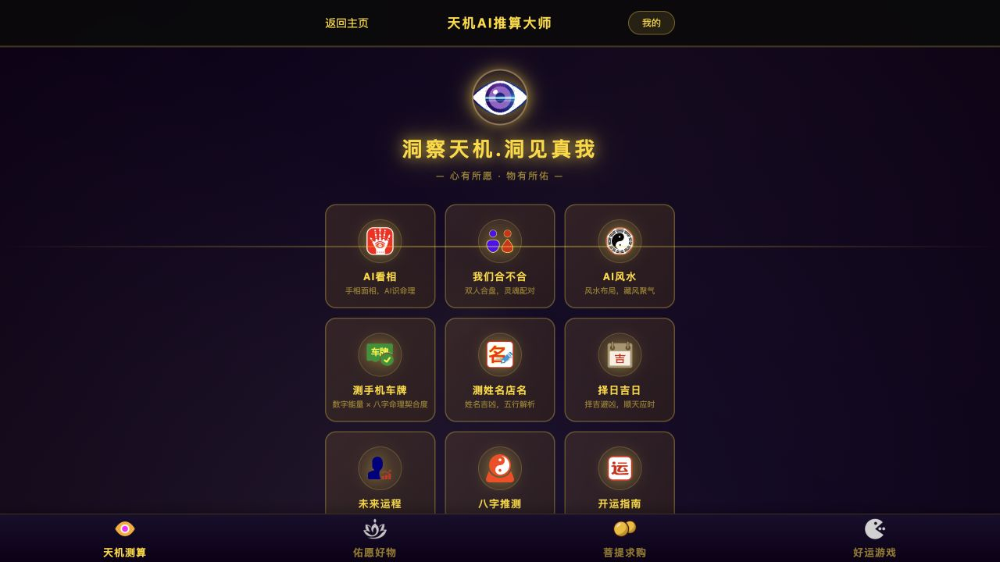

# 竞品研究与产品决策手册

产品版本：**0.0.1**。

> 问玄东方 · 产品、设计与商业决策参考｜整理与公开核验：2026-09-13（北京时间）
>
> 本手册区分当日官方页面可见内容、未核验边界和情景模型。没有进行注册、充值、购买、提现或私人资料提交；不提供竞品当前结算价、预测准确率、营收或盈利保证。问玄东方的实施状态以[产品现状与能力边界](../product/产品现状与能力边界.md)为准。

## 1. 研究范围与证据边界

本手册围绕“产品是什么、用户如何完成任务、费用和权益如何流转、问玄东方采用哪些设计”组织信息。产品观察来自 2026-09-13 取得的官方页面和通用规则；没有验证交易执行、报告质量、退款到账或实际经营结果。产品版本 0.0.1 是本册所属问玄东方的版本，不是竞品的产品版本。

阅读时区分三种状态：**页面复核**表示当日读到官方内容，另行说明公开入口或既有会话访问条件；**未核验**表示动态页面、登录条件或本次范围使其无法确认，正文不列旧价目冒充现行规则；**模型假设**表示用于比较机制的算术，参数不代表竞品实际经营。

网页缓存有时间边界：天机阁每日运势所获页面标注缓存约五日前，择日标注上月，其字段只能视为本次取得的公开页面快照。佑愿分享页由浏览器取得，菩提规则从既有会话下站内打开。工具未读取到某页不说明产品停运或规则取消。

## 2. 先把品牌、功能和身份分清

| 名称 | 官方入口与研究对象 | 本手册的命名规则 |
|---|---|---|
| 天机阁 | [ai-tianji.com](https://www.ai-tianji.com/about)，基础文化工具与深度 AI 报告 | 不简称为佑愿天机，不推断与佑愿同主体 |
| 佑愿天机／天机 AI 推算大师 | [天机分享页](https://youyuan.qigefu.com/tianji/share.html)，同域 AI 分析业务 | 保留页面实际业务名，“天机 AI”不能泛指天机阁 |
| 佑愿好物 | [同域商城](https://youyuan.qigefu.com/?page=1) | 指商品、菩提会员及商城账户场景，不能等同 AI 无限套餐 |
| 好运游戏 | [同域游戏大厅](https://youyuan.qigefu.com/games/hall.html) | 作为并行奖励场景分析，不与 AI 报告收入混算 |

域名和同站跳转足以定位产品入口，不足以确认完整运营主体、股权关系或全部服务资质。天机阁[联系页](https://www.ai-tianji.com/contact)本次可见客服与邮箱，也不能据此替代主体证明。没有一手证据证明两站是同一家公司。

天机阁当前“九大”宣传与十个服务导航仍有数量口径差异；佑愿分享页可见十四个专题入口。入口、子分支、报告类型和账户页应该分别计数，不能仅比较入口数量来判断能力领先。问玄东方同样不能把五类业务角色、两个 iOS 工程、H5 两角色路由和三个管理构建包混成一个“端数量”。

## 3. 天机阁：用清晰交付解释付费价值

### 3.1 本次公开页面实际支持什么结论

天机阁[关于页](https://www.ai-tianji.com/about)和[常见问题](https://www.ai-tianji.com/faq)仍呈现基础体验与进一步解锁的产品结构。FAQ 可见基础排盘、摘要与积分解锁完整报告的区分。它表明产品如何组织收费，不证明全部摘要都能成功返回，也不证明报告具有预测效力。

*图 1｜天机阁公开关于页，2026-09-13 浏览器采集。展示品牌、导航与基础体验的介绍层次；仅用于观察信息组织，不证明算法准确性。来源：[官方关于页](https://www.ai-tianji.com/about)。*

| 场景 | 本次公开内容 | 对产品设计的价值与边界 |
|---|---|---|
| [八字](https://www.ai-tianji.com/bazi) | 公农历、出生时分、性别和真太阳时选项；页面解释基础盘与后续解读 | 参数与解释相邻，降低术语门槛；计算边界未重新实测 |
| [紫微](https://www.ai-tianji.com/ziwei) | 出生资料表单、十二宫及读盘顺序说明 | 把复杂结果分主题阅读；本次未生成命盘 |
| [合盘](https://www.ai-tianji.com/hehun) | 男女双方资料、三种关系状态；描述摘要与完整解读层次 | 付费前可理解内容差异；关系范围和指数含义需谨慎表达 |
| [姓名](https://www.ai-tianji.com/naming) | 评名与起名切换；生日为选填 | 简单体验与深入资料分开，生成候选不等于商标查重 |
| [面手相](https://www.ai-tianji.com/face-palm) | 两类图片入口，图片限制 15 MB | 上传规范明确；未上传照片，不评价识别质量 |
| [周易](https://www.ai-tianji.com/yijing) | 可选问题、120 字提示和六次起卦进度 | 分步操作可形成参与感；动画不能暗示结果更准确 |
| [解梦](https://www.ai-tianji.com/dream) | 500 字输入提示及摘要、延展阅读说明 | 低输入门槛便于理解；不能作为心理诊断 |
| [风水](https://www.ai-tianji.com/fengshui) | 朝向、年代、用途、年份及可选户型图 | 结构参数与补充图片分层；线上说明不能替代现场勘察 |
| [择日](https://www.ai-tianji.com/date-select) | 事项、日期范围与选填生辰 | 先完成一般查询，再选择个性化；所获页面为缓存快照 |
| [每日运势](https://www.ai-tianji.com/fortune) | 生肖、星座入口及结果说明 | 可作为浅体验入口；本次没有重新触发生成，页面有缓存边界 |

### 3.2 付费结构与未核验边界

[FAQ](https://www.ai-tianji.com/faq)可见基础内容与积分解锁报告的层次；本次[个人中心](https://www.ai-tianji.com/profile)只取得加载外壳，无法核定现行价目、充值包、积分有效期、退款、推荐佣金和提现条件。因此本册不列具体售价或推荐比例作为天机阁当前规则，也不将其描述为年费会员或积分交易市场。

对问玄东方，值得借鉴的是在付费前解释交付内容、失败处理和权益范围。报告摘要应帮助用户判断是否需要完整内容；支付按钮旁应呈现本次实际费用与生效权益。积分单价、最低充值额、赠分和退款条件需共同呈现，不能把折算后的理论单价当成用户可直接购买价。

## 4. 佑愿：场景丰富，身份与账户必须拆开

### 4.1 AI 场景与输入成本

本次独立浏览器打开[官方分享页](https://youyuan.qigefu.com/tianji/share.html)，可见十四个专题入口，以及天机测算、佑愿好物、菩提求购、好运游戏之间的导航。使用说明展示新用户两次免费、分享奖励和套餐解锁宣传。它只证明公开文案存在，不能把“购买套餐解锁全部功能”扩写成无限次数、终身使用或全部模块同价。

*图 2｜天机 AI 推算大师分享页，2026-09-13 浏览器采集。截图保留首屏专题卡和四类业务导航，没有展示全部十四个入口，也不包含账户数据。来源：[官方分享页](https://youyuan.qigefu.com/tianji/share.html)。*

专题入口展示了按问题组织内容的方式，但本次未逐项填写、上传照片或生成完整报告，不能把入口数量当作已验证报告深度。

对于需要生辰、照片、住址或关系另一方资料的场景，问玄东方应先说明交付与必要字段，再让用户选择补充背景。资料更多可能提高填写成本，不能直接推导内容更准确。未知时辰不能静默补默认值，另一人的资料需要其授权。

### 4.2 免费体验和权益说明

公开分享页展示“新用户两次免费”、分享奖励及套餐解锁说明，但本次未重新取得[AI 个人中心](https://youyuan.qigefu.com/tianji/profile)完整权益条款。免费额度适用模块、有效期、邀请上限、退款条件、推荐结算及套餐次数均不在当前确认范围内。不能把首页宣传扩写成十四个模块各免费两次、无限次数或终身服务。

产品设计应把体验次数、已购报告、会员资格、推荐奖励分开显示。用户提交前应知道将使用哪种权益；额度不足时解释购买后能得到什么。退款申请、审核和到账使用不同状态，不能用一次界面成功代表款项已到账。

### 4.3 菩提会员、兑换与求购：当日规则复核

**2026-09-13 在浏览器既有会话下**打开[佑愿官方站内“菩提获取规则”](https://youyuan.qigefu.com/)，读取通用规则正文，未发起新登录。页面标注更新时间 **2026-09-02、V1.0**；本次没有验证游客能否直接访问该弹窗。规则写 168 元年费或 20 颗菩提兑换；注册赠 3 颗、邀请每人 2 颗不限人数、购物确认收货后每满 50 元取整得 1 颗、每日分享满五次得 1 颗，有效期 24 个月，不可直接转账，全额退款扣回。这些是当日规则声明，未执行注册奖励、购买或退款核验；会员宣传不等于 AI 无限使用。

| 持有量 | 当日读到的开通规则 | 对应求购与分析意义 |
|---|---|---|
| 至少 20 颗 | 扣 20 颗，无现金 | 使用积分兑换权益，仍有会员履约成本 |
| 10—19 颗 | 扣 10 颗、付 84 元 | 形成 10 颗求购，现金和积分不能重复记收入 |
| 0—9 颗 | 保留已有积分、付 168 元 | 形成 20 颗求购，部分积分需求由开通会员产生 |

当日规则称求购发起即生效会员，36 小时未完成由平台自动出让；出让要求会员、注册满七天、足量积分，每日最多五次。所得全部进入奖金账户；奖金满 100 可转喜呗并扣 20%。通用规则复核不等于游客访问或出让收款验收，转换是否仅接受 100 的整数倍、喜呗再次提现的条件及费用未在本次规则页确认。自动出让的供给主体、资金归属、撮合真实性和实际完成率未核验。看到求购数字或挂牌金额，不能证明市场深度。

商品上架数量、兑换标价、助力数和滚动购买提示会随业务变化，不能据此推断销量或真实用户数量。规则示例不是库存承诺；需要兑换或交易时，应重新核对当前商品、资格、期限与订单条件。

### 4.4 分开的账户与业务场景

当日已读规则明确涉及菩提、奖金和喜呗：菩提用于会员置换并受有效期等约束，出让所得进入奖金，奖金达到条件后转换为喜呗。页面还有 AI 与[好运游戏](https://youyuan.qigefu.com/games/hall.html)入口，但游戏消耗、充值、待解锁奖励和提现的全部现行条款未在本次确认。

研究中应按“获得什么、可在哪里使用、何时失效、怎样退出”逐账户核对。不能从一个账户的门槛推出另一个账户也有相同规则，也不能把站内余额与已到账现金混用。未取得实际概率、通关难度、广告收入和奖励审核证据时，不测算玩家收益或平台游戏利润。

## 5. 经济测算：重算规则，不制造营收

本节为决策情景模型。菩提获取与会员置换参数采用本次读到的通用规则；20% 推荐比例、50% 奖励、两次百元整数门槛和 1.2% 二次费用均仅作为压力测试参数，不是已确认的现行竞品条款。计算检验机制和取整，不是执行验收。充值现金流、确认收入、商品成交总额、奖励面值、可申请金额和最终到账必须分开。

### 5.1 数字报告的贡献模型

为避免“有效支付”已经扣退款又再扣一次的歧义，设 `P` 为当期实际收到、尚未扣退款的报告相关款，`R` 为退款，`F` 为支付手续费，`I` 为最终适用返佣的金额基数，`C` 为生成与交付成本，`A` 为免费试用及获客成本，`S` 为客服。假设推荐比例为 20%，订单贡献模型为：

`贡献 = P − R − F − 0.20 × I − C − A − S`

假设 P 为 100 元且没有退款，全部归属邀请时佣金 20 元，余 80 元覆盖其他成本；一半归属邀请时佣金 10 元，余 90 元。这不是客单价数据，也没有扣固定研发、行政和税务等开支。若 I 随退款冲销，必须统一归因期；若充值尚未交付报告，还要另列未履约余额，不能把沉淀余额直接算净利润。

若某推荐活动采用“新用户付款、退还邀请人一笔已购订单”的机制，新订单为 P、退还邀请人旧订单 T，则此次新增贡献近似 `P − T − 交付及支付成本`。例如纯假设 P=19.9、T=29.9，未扣其他成本已经是 −10 元；不能用“新用户付费了”判定活动盈利。假设后续奖金比例为 50%，先按全额责任压力测试，不假定余额门槛会永久阻止兑付。某报告若收 49.9 再全额退 49.9，直接净收为零，生成费用依然存在。

### 5.2 两次整数门槛的完整公式

假设 B 是已解锁、仍有效的商城奖金，没有其他喜呗余额，全部转换申请与提现审核均通过，手续费从申请金额扣除；不增加充值补齐。纯粹假设每次只能处理 100 的整数倍，第一次扣 20%，第二次扣 1.2%；其中 20% 转换费用在当日菩提规则可见，其余条件未复核，不能当作竞品提现操作指引：

`可转换奖金 Q = 100 × floor(B ÷ 100)`

`转换所得 X = 0.80 × Q`

`可申请提现 W = 100 × floor(X ÷ 100)`

`假设到账 N = 0.988 × W`

| 假设奖金 B | 可转换 Q | 所得喜呗 X | 提现申请 W | 假设到账 N | 留存奖金／喜呗 |
|---|---|---|---|---|---|
| 100 | 100 | 80 | 0 | 0 | 0／80 |
| 168 | 100 | 80 | 0 | 0 | 68／80 |
| 200 | 200 | 160 | 100 | 98.80 | 0／60 |
| 500 | 500 | 400 | 400 | 395.20 | 0／0 |

因此，`0.8 × 0.988 = 79.04%` 只是在金额恰好可完整处理时的费率乘积，既不消除整数余数，也不消除有效期、资格和审核。尤其 168 元奖金不能直接写成可拿到 132.7872 元；在上述无其他余额条件下，此轮可申请提现为零。该公式只适用于本段假设，不能跨账户或跨产品直接套用。

### 5.3 菩提和会员的量价关系

168÷20=8.4，是本次再次读到的会员置换对应的标称换算，不是每颗现金保底。8.4÷50=16.8%，只表示所读通用规则中购物奖励对应的名义比例。再乘 79.04% 得每颗 6.63936 元、每 50 元名义比例 13.27872%，仍是假设长期充分聚合、成功出让、完整转换且审核通过的计算，未含会员成本、等待、撮合失败和余额余数，不能宣传购物返现率。

注册三颗后达到二十颗，邀请人数应为 `ceil((20−3)÷2)=9`，余额二十一颗；达到十五颗要六人。只按每天一颗奖励，则分别需要十七天、十二天。购物八十八、二百八十六、二百九十八、二百六十八、一百七十八元，按五十取整分别为 1、5、5、5、3 颗；金额是取整演算样本，不是实际订单或当前商品价格。这些算式验证规则边界，不是邀请、充值或游戏建议。

新会员支付 168 元、用户出让二十颗并获 168 元奖金面值时，平台不能同时把全部会员款当毛利、又省略奖金义务。转换手续费可能形成收费，但应与会员服务成本、退款和账户余额责任一起核算；平台自动出让也不能凭空变成无成本利润。

### 5.4 建立能对账的账本

积分期末余额应等于期初加注册、邀请、分享和购物发行，减商品兑换、会员消耗、退款扣回和到期。用户之间转移只是持有人变化，不能再算一次系统销毁；用于会员开通的积分在消费时记一次。商品若同时发放多种权益，各项预期履约成本都要纳入。

自营商城关注实付减商品、运费、支付、售后退款与奖励成本；撮合业务关注佣金净收入，不能将全部成交额当平台收入。游戏充值和广告另建模型，缺少实际返奖与广告数据就保持空白。固定成本之外，还要按月检查未履约积分、奖金账龄和退款冲回，避免用注册量、流水或奖励失效替代持续利润。

## 6. UI 与交互：吸收结构，不复刻压力

### 6.1 入口、表单与结果的三层组织

两站提供了两种有效的组织思路：天机阁按文化工具与解释层次组织，佑愿按用户正在问的问题组织。问玄东方可在首页用清楚的任务语言，在详情保持稳定的业务名，在结果页提供可定位的章节。入口图标、标题、表单和订单应指向同一项交付；若只是同一模型的不同提示，不应包装成已经验证的独立专业能力。

结果先给简明概要，再给材料、依据和细节；可展开的知识解释应允许键盘操作与返回原阅读位置。公开示例使用虚构或脱敏资料并明确标识，避免用户为了看成品被迫先提交自己的照片和出生信息。示例和真实生成必须有可识别边界，生成中不能预先显示假的“已完成”。

对于表单，给出合理示例、必填理由和错误定位比更多装饰更有效。公历农历切换需要明确显示当前模式；未知资料有显式分支；上传应说明格式、大小与删除对象。网络失败后保留用户已填内容，重试前解释是否扣费，敏感信息不写进分享链接。

### 6.2 传统色调里的现代动效

问玄东方已选择浅色奶油白、墨绿、柔金与深色深棕、朱砂、暖金。竞品启发应落在信息层次与反馈上，保留东方珠作已有布局气质。品牌标题可用有文化感的宋体，正文保持清楚的无衬线，金额与状态采用稳定层级；长条款不使用过细金字、低对比底色或整段书法字体。

导航选中、材料加入、撤销恢复和订单状态变化需要明确反馈；弹层进出与焦点返回应连贯。骨架保持内容尺寸，加载按钮说明正在进行的操作，完成消息不堆叠。动画服务于“发生了什么”，不以不断闪烁、循环倒计时或跳动奖金制造紧迫感。减少动态效果时，功能与状态仍应完整可辨。

长内容可分段展开但不能把价格、有效期、手续费和退出条件藏在默认折叠末尾。移动端固定分类、底部操作和弹层互不遮挡；深处切换分类后让首条结果进入可见区；没有结果时直接提供清除筛选。桌面表格固定列保持实底，键盘焦点可见，状态不能只靠颜色。这些也是问玄东方现有 DIY 和管理交互继续验收的重点。

### 6.3 分享与价格应减少误解

优惠展示应由同一个生效时间驱动标签和倒计时，清楚解释分享是否延长、延长到何时、旧订单适用什么规则。未实际优惠不显示划线价，不把用户个人剩余额度写成所有人统一权益。

分享预览默认隐藏姓名、出生资料、照片和订单信息，让用户确认具体内容。关系场景可以自然邀请第二人，但访问者应先知道看到的是谁授权公开的内容；不以不透明退费条件诱导传播。商品推荐说明材质、工艺、设计与文化寓意，避免把购买与改变现实结果绑定。

## 7. 问玄东方的决策与实施边界

当前底座已有 H5 两角色、iOS 两工程、平台与寺院管理业务；商城旧包兼容跳转至平台商城模块。双主题、统一字体动效和六种品牌标识已有源码与发布记录。H5、iOS DIY 都有真 3D 与确认收货：H5 材料支持分类、五行和关键词组合；iOS 目前是分类、材质及规格关键词，没有独立五行控件。这些是已实现能力，后续工作应验证体验与履约，而非重复立项。

同时，源码和构建不等于所有业务完成真实验收。当前 H5 与管理 Web 已发布，iOS 两工程有无签名构建记录；完整真机安装、图形性能、真实支付退款与快递仍不能据此宣布通过。具体来源和证据见[产品与文档核验](../reports/0.0.1-核验.md)。

| 决策方向 | 本次建议 | 需要形成的具体交付 |
|---|---|---|
| 优先保留 | 东方珠作气质、双主题和品牌家族；清楚的结果与订单结构 | 页面之间称谓、费用、状态和错误恢复一致 |
| 优先补齐 | 核心 AI 场景的示例、输入说明、交付边界和失败恢复 | 一套可追溯的正常、失败、重试及退款样本 |
| 持续验证 | 内容到 DIY 灵感、设计、下单和收货的连接 | 推荐理由、材料快照、服务端金额和履约凭证 |
| 受控试验 | 试用额度、分享回流、固定权益兑换 | 成本预算、去重用户、净支付和退款冲回 |
| 暂不照搬 | 会员求购、多层余额、高比例持续推荐和付费游戏 | 没有真实收益与结算证据前不作为增长承诺 |

积分建议必须使用问玄东方当前语义。积分获取和扣除须以现行配置与后端校验为准。当前转盘与奖池是消耗积分的活动，`pointsCost >= 1`，用户参与扣真实积分账本；平台承担奖品预算并不等于免费参与。确定权益兑换、积分随机活动、现金订单与功德成长值是不同体系，不能借竞品研究合并它们。

在 DIY 中优先显示服务端确认的订单总额及历史材料快照，缺失信息要诚实降级，不用当前价格重算旧订单，也不把未知材料费显示为零。确认收货已有入口，下一阶段目标应是验证实际履约与异常恢复，而不是重复立项一个订单中心。登录过期应按角色返回登录并去重提示；网络错误、权限不足与有效会话不能一起清除。

## 8. 怎样验证建议产生了价值

先完成可核验的小闭环，再讨论规模。核心 AI 至少记录入口、填写开始、提交、成功取得结果、失败、重试、解锁和退款；明确分母，成功率按真实请求计，不能把页面打开量当报告交付量。不同场景、渠道和新老用户分开，避免奖励吸引的短期访问覆盖自然需求变化。

商品侧记录设计查看、编辑完成、可下单校验、实际支付、发货、收货、售后及复购。付费转化应扣除退款，配送异常和材料不可用要能回到订单原因。DIY 3D 的验收包含真实设备首开、贴图加载、前后台、弱网和退回 2D 后设计保留，不用一张静态截图评价性能。

邀请试验同时看有效新用户与奖励后净贡献；免费次数同时看真实交付成本和后续自发使用。会员若不能解释独立权益，不应只靠出让资格促成付费。积分库存不足、奖励版本变化或退款回收失败时，应暂停相应承诺并修复状态一致性，而不是改一个宣传数字。

下一次竞品复核只需补原核心事实：官方现行条款、生效日期与旧单适用方式；获授权后的脱敏报告、扣费和退款样本；奖励产生、转换和到账凭证；商品真实履约。运营方若不能提供月度净实收、退款、成本、账龄与留存，就继续保持模型假设，不形成估值、盈利率或融资回报判断。

## 9. 当前来源与维护

核验日期：**2026-09-13（北京时间）**。来源仅采用产品官方页面，不以转载、搜索摘要或第三方评价补齐结算规则。公开页面说明是产品声明，不能替代执行和经营证明。

| 官方来源 | 本次可见范围 | 未核验边界 |
| --- | --- | --- |
| [天机阁关于](https://www.ai-tianji.com/about)、[FAQ](https://www.ai-tianji.com/faq) | 公开品牌、工具说明、基础体验与报告解锁结构 | 预测效力、真实交付与付费执行 |
| 本册 3.1 的十类天机阁表单 | 本次取得字段与内容说明；择日、每日运势有缓存边界 | 未逐一生成结果，不代表全部实时页面已实测 |
| [天机阁个人中心](https://www.ai-tianji.com/profile) | 仅加载外壳 | 价目、充值、推荐、退款及提现条款 |
| [佑愿分享页](https://youyuan.qigefu.com/tianji/share.html) | 浏览器公开页、十四专题与四类业务导航、使用说明 | 免费额度详细适用条件和付费套餐次数 |
| [佑愿站内菩提获取规则](https://youyuan.qigefu.com/) | 既有会话下打开通用正文；标注 2026-09-02、V1.0，未发起新登录 | 游客直达、奖励执行、出让撮合、实际到账和二次提现 |
| [佑愿 AI 个人中心](https://youyuan.qigefu.com/tianji/profile)、[游戏大厅](https://youyuan.qigefu.com/games/hall.html) | 作为待核对的官方入口 | 本册不把未读到的详细条款写成当前规则 |

两张公开截图保留原始观察日期与来源。菩提规则页与账户区域混排，未保存整页截图或账户资料；本册只记录通用正文。当前未确认事项保留为研究限制，不附旧 PDF、旧价目或旧报告映射。

维护时记录官方 URL、页面位置、观察日期、规则生效日期和访问条件。模型同时记录参数、取整、手续费顺序与账户前提。只有再次取得一手内容，才能更新现行规则结论；任何经营判断必须回到真实账本和履约证据。
