# 问玄东方视觉设计与交互手册

**版本：2026-09-13。** 本手册供产品、设计、前端及测试交付查阅。当前规则以 frontend `8df1557`、独立 H5 仓 `9e3a845` 为基准；覆盖 H5 信众与法师、两款原生 iOS 应用、统一运营管理台、寺院管理台和商城兼容入口。颜色与字体按共同角色组织，页面密度、原生导航及业务控件按端保留差异。备用 Expo、旧原型和归档应用不作为当前视觉基准。

实际操作路径见[产品使用手册](产品使用手册.md)，功能范围与限制见[产品现状与能力边界](../product/产品现状与能力边界.md)。本文中的“应”表示交付规则；尺寸表中的“现有”表示源码已采用的值。构建、浏览器截图与原生设备操作是不同证据，不互相替代。

## 1. 视觉方向与使用顺序

界面保留东方珠作的留白、细线、衬线标题和材质陈列方式。浅色使用米白、松绿、古金；深色使用深棕、朱砂和暖金。装饰负责建立气质，按钮、状态和数据负责解释任务。页面先让人看清“在哪里、当前状态、下一步”，再呈现图案和细节。

新页面按四步选型：先确认身份和任务，再选主题语义色，然后使用对应端的文字与组件，最后增加必要的状态过渡。不得从截图吸色替代令牌，不因页面主题切换而改订单状态或数据含义。照片、头像、真实材料纹理不随主题整体染色。

外观设置均提供“浅色、深色、跟随系统”。Web 将偏好保存在 `askxuan-theme`，实际结果落在 `html[data-theme]`；同源标签页可同步。后台还同步 `color-scheme` 和组件库深色类。iOS 使用 `askxuan.appearance` 与动态颜色，由应用外观和系统特征共同解析；用户选定浅色后，不能再只根据系统深色切换页内标识。

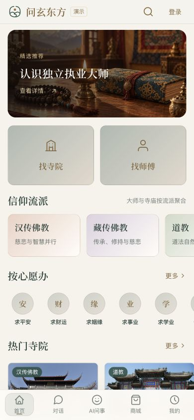
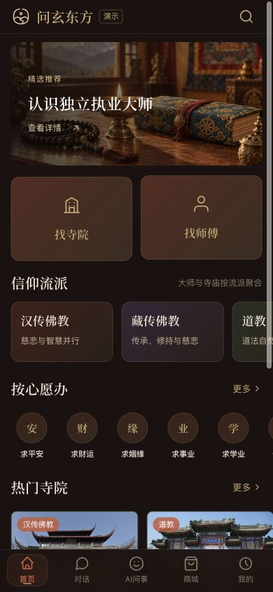

图 1：2026-09-13 已部署 H5 首页实访，390×844。浅深外观共享相同任务结构；截图仅记录当时页面显示，不表示业务流程已完成。

## 2. 双主题语义颜色

下表是共同颜色源的完整语义清单。Web 的品牌默认值映射主按钮与主要选择状态；古金、暖金用于强调和细节。相邻表面以层级区分，不把每张卡片做成独立的高对比色块。

| 语义 | 浅色 | 深色 | 使用位置 |
|---|---|---|---|
| 页面底 `bg.primary` | `#F6F3EC` | `#1C1210` | 页面、根导航背景 |
| 主表面 `bg.secondary` | `#FFFDF8` | `#2A1E1A` | 卡片、弹层、表格主体 |
| 次表面 `bg.tertiary` | `#EFEDE3` | `#3A2C25` | 输入区、分段底、表头 |
| 提升表面 `bg.elevated` | `#E7E7DA` | `#44342C` | 悬停、局部层次 |
| 品牌 `brand.default` | `#284D43` | `#C45A3C` | 主操作、选中项 |
| 品牌亮 `brand.light` | `#426A59` | `#D4735A` | 悬停、渐变终点 |
| 品牌深 `brand.dark` | `#1E3C34` | `#A64830` | 渐变或深一级强调 |
| 点缀 `accent.default` | `#84673D` | `#C8A96E` | 金色细线、强调、焦点 |
| 点缀亮 `accent.light` | `#896B40` | `#D4BC8A` | 局部强调文字 |
| 点缀深 `accent.dark` | `#72562F` | `#A88A50` | 点缀的较深层次 |
| 朱砂 `cinnabar.default` | `#A04B3A` | `#B5453A` | 专门的朱砂装饰角色 |
| 朱砂亮 `cinnabar.light` | `#B5614D` | `#CC5A4F` | 朱砂的辅助层次 |
| 主文字 `text.primary` | `#253E36` | `#F0E6DA` | 标题、主要内容 |
| 次文字 `text.secondary` | `#66736C` | `#C5B097` | 说明、标签、次要数据 |
| 弱文字 `text.tertiary` | `#748078` | `#8A7A6A` | 占位、低优先级说明 |
| 品牌上文字 `text.onBrand` | `#FFFFFF` | `#FFFFFF` | 主按钮文字 |
| 点缀上文字 `text.onAccent` | `#FFFFFF` | `#1C1210` | 点缀实底上的文字 |
| 成功 `state.success` | `#357052` | `#5B8C5A` | 成功、完成状态 |
| 警告 `state.warning` | `#906D37` | `#D4A843` | 待处理、需关注 |
| 错误 `state.error` | `#A04B3A` | `#C45A3C` | 错误、失败、危险说明 |
| 信息 `state.info` | `#426A89` | `#8FAECB` | 中性信息 |
| 普通边框 `border.default` | `rgba(40,77,67,.14)` | `rgba(200,169,110,.15)` | 卡片和控件边界 |
| 强边框 `border.strong` | `rgba(40,77,67,.30)` | `rgba(200,169,110,.30)` | 较强分界、次操作 |
| 分隔线 `border.divider` | `rgba(40,77,67,.08)` | `rgba(200,169,110,.08)` | 行、段落之间 |

带透明度的色值按源文件的 RGBA 使用；若工具只接受八位 HEX，三种浅色边框依次为 `#284D4324`、`#284D434D`、`#284D4314`，深色为 `#C8A96E26`、`#C8A96E4D`、`#C8A96E14`。这是 alpha 的量化表示，实际叠加色仍取决于下方表面。

H5 为深色成功文字另提供 `#86B985`，浅色为 `#357052`，避免用较暗的成功填色直接排小字。阴影在浅色以 `37,62,54` 为底、深色以黑色为底；透明导航和玻璃表面从当前主题生成。后台 Element Plus 的文字、边框、遮罩、选择器和 ECharts 图表均映射这些角色，不能只更换页面底色。

状态还须有文字或图形。付款成功、已收货、积分扣减和功德值不能因为采用同一绿色便合并为一种业务状态。预览中的五行色点用于材料分类；它们不替代可读的“金、木、水、火、土”，也不是功效证明。

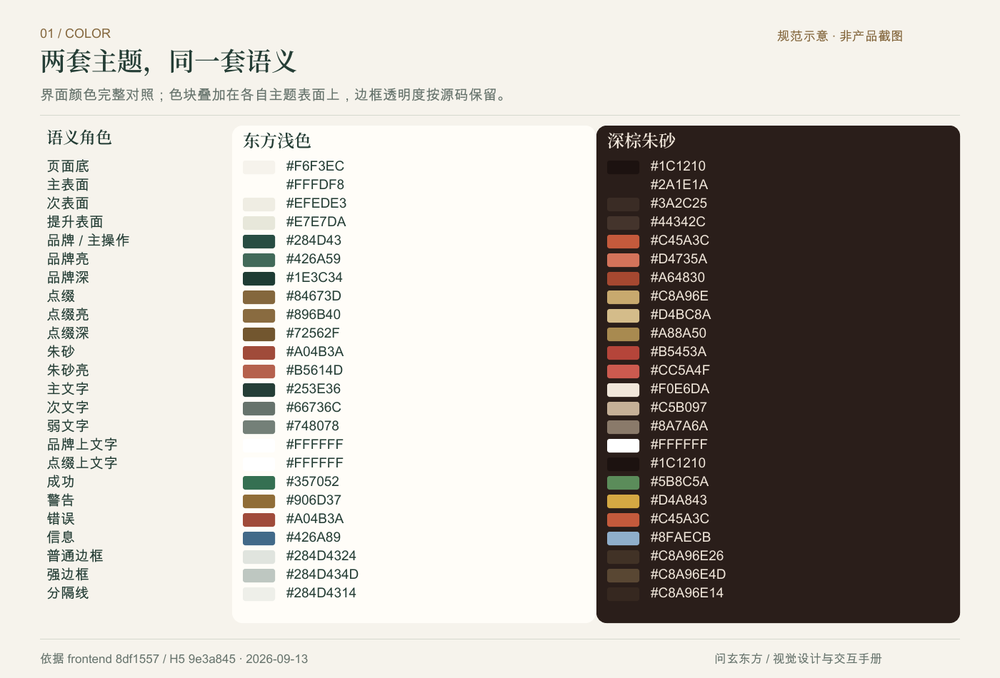

图 2：根据当前 `tokens.json` 生成的完整语义色板，属于规范图。带透明度边框使用八位 HEX 标记；Logo 专用色见下一章。

## 3. 六枚品牌标识与资源规格

六种身份共用圆融的外框、圆点与线条结构；辨认由内部图形和名称完成。正式图形是同源 SVG，图内不嵌入缩小后无法阅读的中文。中文名称继续由产品衬线字体排版。

| 文件身份 | 显示名称 | 图形主题 | 当前应用 |
|---|---|---|---|
| `customer` | 问玄东方 | 日出山川 | 信众 H5、信众 iOS、母品牌 |
| `master` | 法师工作台 | 一灯明心 | 法师 H5、法师 iOS |
| `temple` | 寺院管理台 | 檐下安宁 | 寺院后台 |
| `shop` | 商城管理台 | 相遇成环 | 商城身份资产、旧入口资源 |
| `platform` | 统一运营管理台 | 四方有序 | 统一运营后台及其中商城作业 |
| `atelier` | 东方珠作 | 一珠一念 | H5 DIY 广场、编辑和相关页面 |

页内浅版使用松绿 `#244C43`、古金 `#987342`；深版使用暖金 `#E5CCA3`、陶朱 `#D98B70`。这是图形专用色，和主按钮的 `#284D43`、`#C45A3C` 有意分开，不能用 CSS 滤镜强行改成按钮色。品牌展示板的深底 `#241A17` 也不替代应用页面底 `#1C1210`。

页面优先引用 `logo-{身份}-{light|dark}.svg`，原始视框为 96×96。透明 PNG 是 512×512 备用资源。保持等比、完整透明区域及镂空，用 `contain`；不要裁圆、拉伸、添加第二圈边框或再套一个有底色的图标壳。独立标识提供名称；紧邻同名文字时作为装饰隐藏，避免屏幕阅读器重复朗读。

现有 H5 通用标识默认 32px、登录标识 88px、东方珠作导航图形 27px；后台侧栏图形 36px；原生信众登录为 104pt、法师登录为 96pt。页面按这些槽位排版，无需把透明图案放大到挤满外框。设计稿可以选择更大展示尺寸，但交付时须写明图形盒尺寸和周围留白，不只标图案可见边缘。

应用图标使用完整、不透明的 1024px 方图，由系统裁出轮廓。信众浅版底色为 `#244C43`，法师为 `#A94132`，深色图标为 `#241A17`；应用内的主题设置不等于切换系统桌面图标。图形按生成器的 90% 光学盒放置，保留 maskable 安全区。Apple touch 图标为 180px；H5 信众与法师另有 192/512px 安装图标。

favicon 是单独的 SVG 资源，在 16、24、32px 下核对轮廓。它取消应用图标的额外缩放留白，不能拿 1024px 图标简单替代；其内部外观规则跟随浏览器系统媒体查询，页内 Logo 则跟随应用实际 `data-theme`。后台图标 URL 保留 `/admin/`、`/temple/`、`/shop/` 的部署基路径。

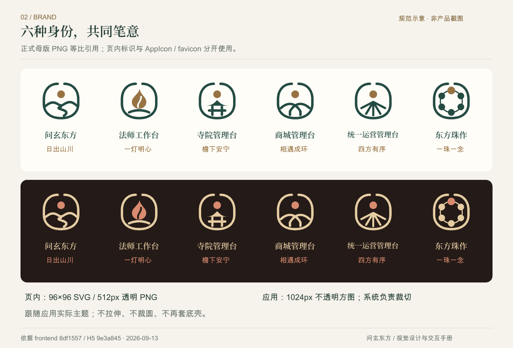

图 3：直接引用正式母包透明 PNG 的品牌规范图。概念探索图不作为正式资产；商城兼容入口转入统一后台，不另造独立首页。

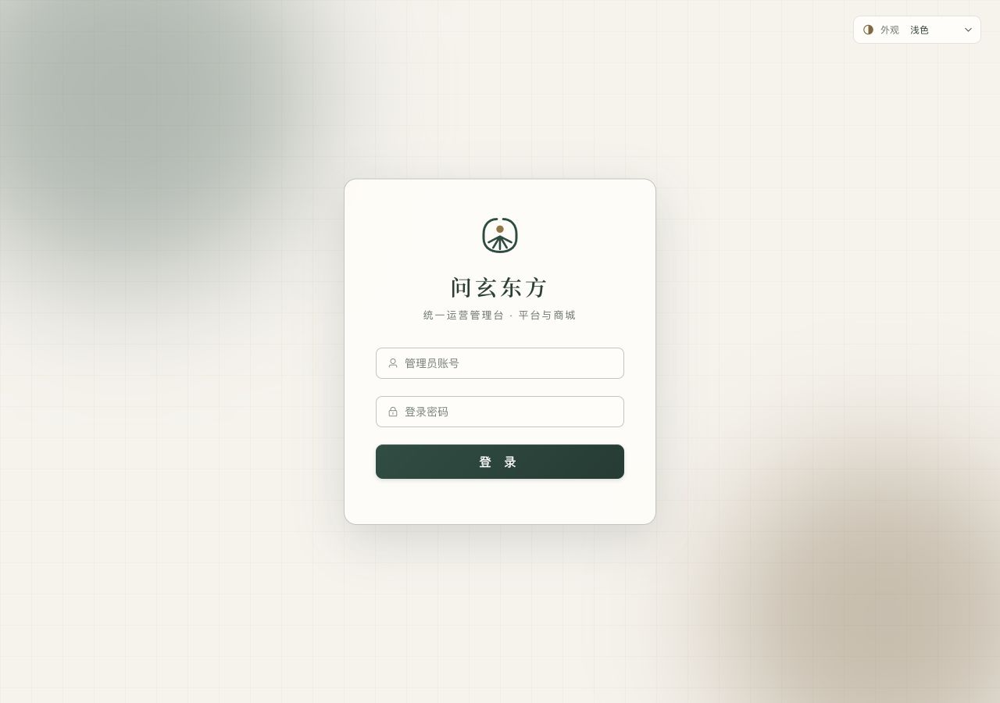
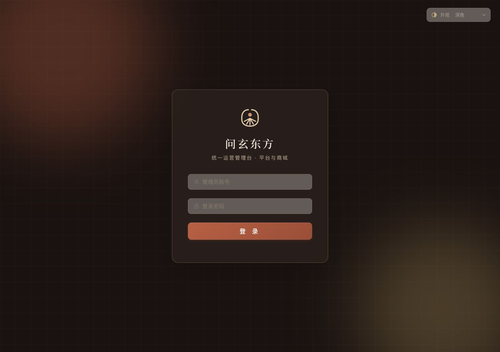

图 4：2026-09-13 统一后台登录页实访，1280×900。页内 Logo 跟随应用实际主题，登录表单保留相同结构。

## 4. 字体、字号与数字

标题使用 AskXuan Serif 半粗字形，保留宋体的东方气质；正文、说明、按钮和输入使用系统无衬线。Web 标题回退序列为 AskXuan Serif、Noto Serif SC、Songti SC、STSong、SimSun；正文优先 Apple 系统字体，后续为 PingFang SC、Noto Sans SC、Microsoft YaHei。代码才使用 SFMono-Regular、Consolas 等等宽字体。

| 文字角色 | Web 基准字号 | 典型位置 |
|---|---:|---|
| micro / caption / label | 11 / 12 / 13px | 小标签、说明、字段标签 |
| body / control / reading | 14 / 15 / 16px | 正文、按钮输入、阅读内容 |
| nav / card / section | 17 / 18 / 20px | 导航、卡片标题、区块标题 |
| page / hero / display | 24 / 28 / 32px | 页面标题、主视觉标题 |
| metric / largeMetric | 36 / 48px | 重点统计，须有单位和名称 |

共同字重为 400 常规、500 中等、600 半粗。标题通常 600，正文 400，控件依组件为 500 或 600；不再逐页混用 700、800 制造层级。标题行高 1.5，正文 1.7，长阅读 1.9，控件 1.5。H5 普通标题字距约 `.02em`，DIY 导航等品牌位置可有专门字距；价格、表格与表单不加装饰性字距。

标题不伪造粗体。Web 字体以 `unicode-range` 分片按需加载，主片承载当前界面用字，其余汉字按文本实际需要请求；不要预加载全部分片，也不要删去动态用户内容可能需要的字符。字体文件受 OFL 许可约束，交付资产应保留许可文件。

价格、余额、积分、计数和表格数据用无衬线及 `tabular-nums lining-nums`，稳定每位数字宽度；代码编号可按可读性使用等宽字体，普通金额不改成代码样式。价格显示小数位、数量单位与币种分开核对，不能以视觉统一为理由改变四舍五入或金额来源。

iOS 使用相同的标题角色，但正文是原生语义字体：默认 subheadline 约 15pt、阅读 body 约 17pt、辅助 footnote 约 13pt、caption 约 12pt、caption2 约 11pt。标题通过 `relativeTo`，导航通过 `UIFontMetrics` 随 Dynamic Type 缩放；数字通过 `@ScaledMetric` 和 `monospacedDigit` 放大。Web px 与原生 pt 不按一比一截图尺寸强行对齐。

输入在 H5 粗指针设备上至少采用 16px 阅读字号，避免 iOS 浏览器聚焦时放大。标题、长姓名、物流单号及订单名称允许换行或在明确摘要位省略；完整信息须在详情可读。大字号验收应检查按钮可增长、标签能换行、单位未被裁掉。

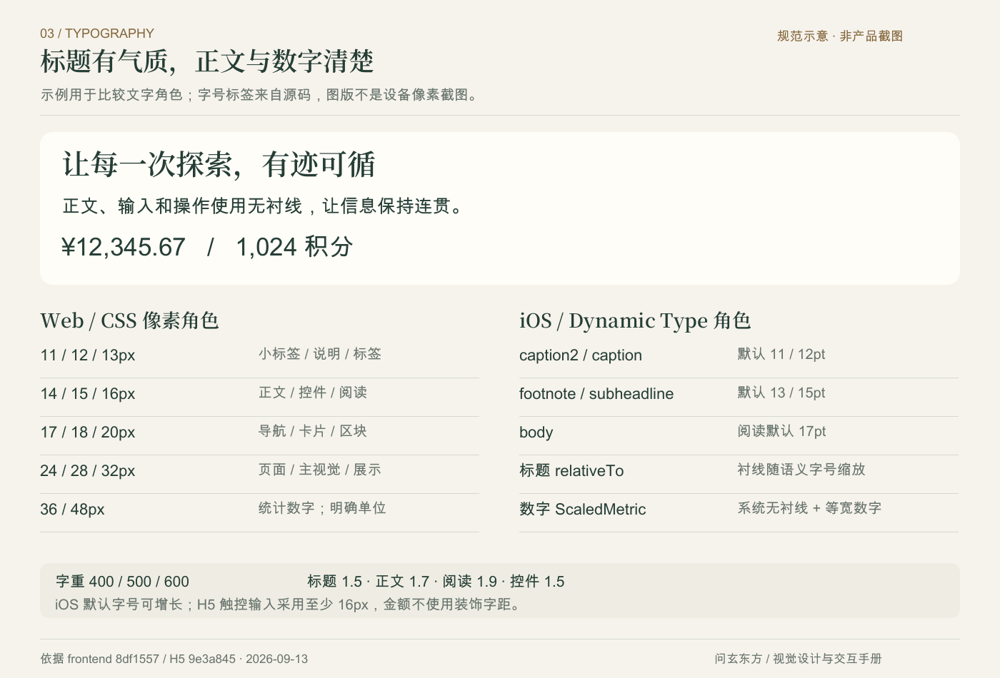

图 5：字体角色规范示意，使用正式品牌字体与无衬线排版。iOS 数值为默认字号档，动态字体可继续增长；本图不是原生应用截图。

## 5. 间距、圆角与响应式结构

使用 4、8、12、16、24、32 的间距节奏安排图文和区块。iOS 已将这些值定义为 AppSpacing；Web 按组件使用相近节奏，不存在覆盖每个局部间距的单一全局间距变量。紧密关系靠较小间距，章节靠较大间距；不要以多层大阴影代替分组。

| 层次 | 当前尺寸与适用差异 |
|---|---|
| 基础圆角源 / iOS | 4、8、12、16；普通原生卡片常用连续 12pt 圆角 |
| H5 角色圆角 | 6、10、14、20px，另有 4/6/8/12px 紧凑别名；通用主按钮和输入为 10px |
| 后台 | 基础 8px、小 6px、大 12px；当前按钮 9px、下拉 11px、对话框 16px |
| 专用展示 | DIY 台面 22px、材料板 20px、订单卡 18px；原生统一 sheet 表面 28pt |

以上差异属于现有设计，不应仅为了令牌名相同而批量替换。胶囊用于分类或状态，圆形用于头像和小型图形；正文卡片保持矩形阅读边界。普通表面以细边框和浅阴影分层，弹层才使用较强投影。

H5 普通页面最大宽度 768px，居中展示；页面左右留白为 `clamp(12px,4vw,32px)`。顶部返回导航为 48px，左右保留 44px 控件槽；底部导航、购买操作条加安全区和内容占位，不能盖住最后一行。首页搜索仅在信众首页提供，全站导航不重复塞入搜索按钮。

DIY 编辑器单独解除普通壳宽度限制，工作区最大 1280px。1000px 起左右两栏，编排区可保持在视野内并独立滚动；999px 及以下转上下顺序。手机简化介绍与留白，但不裁掉作品。DIY 订单内部样式设 920px 上限，实际仍受普通 768px 壳约束；760px 视口起两列卡片，小屏单列。其他页面不跟着编辑器放宽。

后台内容最大 1680px，桌面侧栏 232px、折叠 72px，顶部 64px。992–1199px 自动紧凑侧栏；991px 以下变抽屉导航，内容不再保留左边距；767px 以下顶部降到 56px，次要面包屑和元信息可隐藏。表格在自己的容器横向滚动，不能把整个页面撑宽。手机仍需可到达筛选、分页和关键操作，不能只缩小桌面字体。

## 6. 导航、按钮和表单

H5 信众根导航依次为首页、对话、AI问事、商城、我的；法师为工作台、预约、消息、我的。选中状态同时有文字、图标和轻底色指示，使用 `aria-current`。指示层移动，导航壳不随路由重新挂载；页面内容懒加载时导航保留。浏览器后退使用原生返回感，不叠加新页面入场。

主操作采用品牌实底与白字；次操作使用当前表面、细边框和点缀文字。一个动作区域应有清晰的主次，不以多个同等醒目的按钮竞争。删除、取消和提交的名称要说明对象；对不可逆操作保留原业务确认。不能把卡片装饰误做成可点击入口，亦不能只有手势而没有可见替代操作。

通用 H5 主次按钮最低 44px，iOS 当前主次按钮最低 48pt。加载时保留原标签占位，再叠加“处理中…”和进度，防止按钮宽高跳变；同时禁用并阻止重复提交。成功后再呈现真实结果，不能先显示完成动画再等待接口。后台使用 Element Plus 的 loading/disabled，并维持表单提交状态。

输入有永久可辨认的名称，placeholder 只作示例。聚焦使用边框和柔和焦点环，错误使用错误文字、图标或辅助说明，并关联到字段。后台错误框有错误色描边与轻底色；H5 可用 `aria-invalid`，局部错误采用 `role=alert`。错误不能挤走用户已填内容，也不应仅以短暂 toast 传达必须修正的信息。

选择组必须写明是单选、多选还是导航。现有 DIY 五行和分类是 `button` 加 `aria-pressed` 的选择组，不伪装成需要特殊方向键行为的 tabs。清除关键词只清关键词；“清除筛选”才同时复位组合条件。折叠区用 `aria-expanded`、`aria-controls` 关联内容，不以箭头方向作为唯一状态。

## 7. 表格、图表与业务状态

后台先提供标题和说明，再放筛选、操作、结果与分页。数据表使用稳定的 row key，默认每页 20 条，可选 10/20/50/100；改变每页条数回到第一页。表头与正文通过表面及字重区分，数字等宽对齐，操作列在横滚时使用不透明主题底，避免下方文字透出。

初次加载没有数据时显示五行静态骨架；已有数据刷新时保留数据并覆盖“正在更新列表”，使用 `aria-busy` 和礼貌播报。分页在加载中禁用，避免快速切页导致状态混乱。空列表说明没有记录或可以调整筛选，接口错误要提供重试或解释，不能把请求失败显示成“0 条”或“收入 0”。

图表轴线、图例、提示框、文字、背景和数据颜色随主题一起更新。Canvas 图表须解析颜色和字号的实际值，不能把 `var(...)` 原样交给绘图引擎。切换主题保留数据、筛选与图例选择，不重置业务视图。图表首次 280ms、数据更新 200ms，减少动态效果时关闭图表动画；其 easing 使用 ECharts 的 `cubicOut`，不是 CSS 曲线字符串。

状态标签按业务域解释：订单、支付、加持各自显示对应状态；未知状态不能自作推断。模拟支付在按钮与结果中明确写“模拟”。积分、现金、免费奖励和功德值分开排版、标明单位，统计卡不暗示不同账户可互换。

## 8. 弹层、加载与空错反馈

H5 的 ShopSheet、AiDialog、媒体预览和 DIY 保存弹层优先使用原生 `dialog.showModal()`，保留顶层与焦点限制。弹层打开后锁定底层滚动；多层弹窗各持有自己的锁，关闭子弹层不能释放父弹层的滚动限制。关闭时先完成局部退场，再调用原生 close 并返回触发位置，不能动画一开始就卸载内容。

Escape、关闭按钮及背景点击通过同一关闭入口。后台提交或 DIY 保存忙碌时，不能因 Escape 绕过禁用状态。背景关闭须确认按下和完成都发生在背景，避免从图片或输入区拖出后误关闭。重复关闭请求只完成一次；强制卸载清除计时器、弹层与滚动锁。媒体内容可交互，图片或视频内部点击不等于点背景。

后台采用 Element Plus 的 dialog、drawer、message box；移动导航另有焦点管理、背景 inert、滚动锁与 Escape 关闭。原生 iOS 保留系统 sheet、拖动指示、detents、键盘避让和侧滑返回，不能照抄 Web 的固定遮罩或人为规定系统退场时长。

加载态只在真实等待期间运动。H5 通用加载使用品牌小标、转环、说明和静态线条；iOS 使用系统 ProgressView 与静态卡片占位。空态有图形、明确标题、必要说明及可执行操作。首次无内容、筛选无结果、网络失败和已到底分别表达；刷新失败可保留仍可用的原数据，并提示未更新。

认证失效属于全局会话状态：后台和原生可续期的会话保留一次受保护的续期；无续期凭证或续期失败则清理失效会话并回到登录。H5 当前失效后直接回登录，不新增自动刷新流程。避免每张卡各报一次错误；错误密码仍留在登录表单，权限不足不当作登录过期。动画不能延迟鉴权跳转或继续显示上一账号的数据。

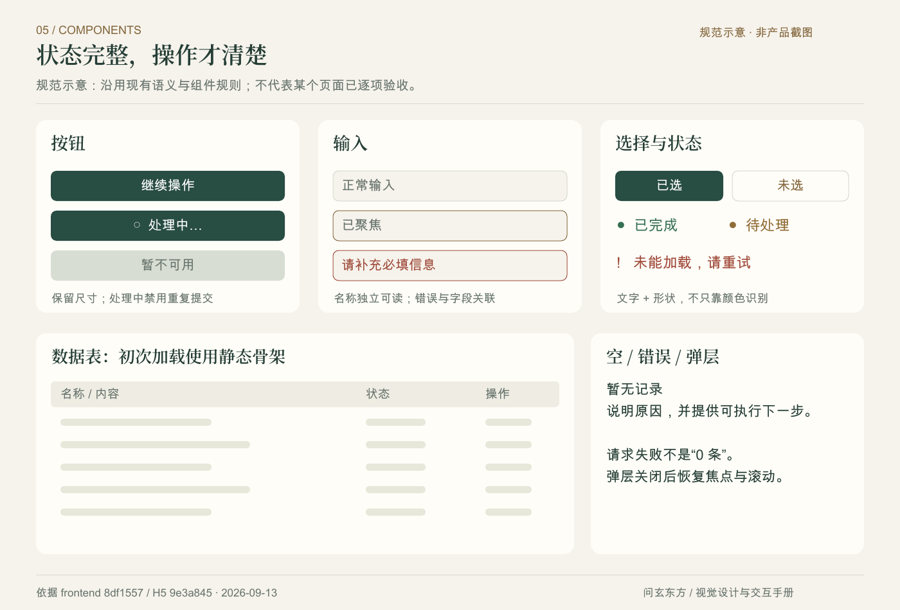

图 6：组件状态规范示意，依据现有组件语义重新排版；静态骨架、错误和禁用的含义各自独立。本图不是某个业务页面截图。

## 9. 动效节奏与减少动态效果

| Web 令牌 | 时长 | 现有用途 |
|---|---:|---|
| fast | 120ms | 按下反馈、表格行底色、后台页面短退场 |
| standard | 200ms | 色彩、输入聚焦、局部状态、页面淡入 |
| enter | 280ms | 弹层入场、底部导航指示、首次展示 |
| exit | 160ms | 弹层、下拉及抽屉退出 |

Web 主曲线为 `cubic-bezier(.2,.7,.2,1)`，落稳曲线为 `cubic-bezier(.22,1,.36,1)`。H5 普通页面入场仅从透明度 .72 到 1，不给整个内容祖先加 transform；因此内部 fixed 操作条仍以视口定位。主按钮和卡片按下可缩至 .985，桌面悬停只在支持 hover 的设备上增加轻微高度或阴影反馈。

iOS 当前按压、选择、首次呈现分别为 120/200/280ms，曲线为 `(.2,.8,.2,1)`。主按钮按下 .975、普通卡片 .985，并轻沉 1pt；首次局部内容从 8pt 下方淡入，组间延迟 35ms、最多 140ms。数字变化使用原生 numericText。原生导航和 sheet 由系统控制，未实现统一的 160ms 原生退出令牌。

动效要说明变化，不反复吸引注意。后台整页只短淡入，悬浮层不缩放文字；H5 下拉和面板小幅退场，3D、转盘等有任务含义的运动保留自身逻辑。不使用覆盖所有属性的 `transition: all`，不让布局宽高、滚动和弹层定位无意加入过渡。常驻装饰离开页面或屏幕时暂停。

Web 的 `prefers-reduced-motion` 将通用动画与过渡缩短至 .01ms、取消延迟和重复、恢复自动滚动；具体弹层和 DIY 同时停用位移/旋转，关闭可立即完成。iOS 读取 `accessibilityReduceMotion`，根事务禁动画，保留即时明暗反馈、选中状态和操作结果。减少运动不等于取消必要的加载说明或让按钮失去反馈。

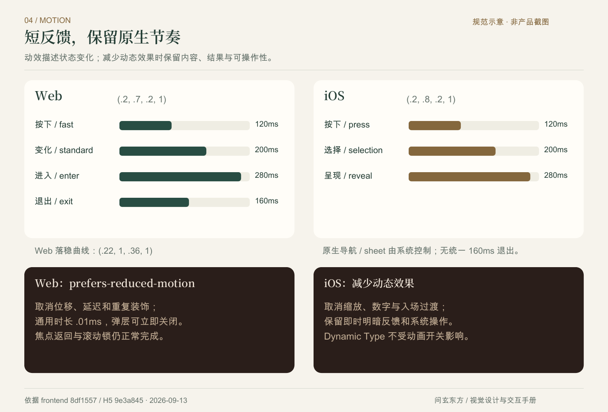

图 7：按当前源码绘制的时间轴规范图。Web 四种时长与 iOS 三种局部反馈分列；原生系统导航和 sheet 不套用 Web 的退出时长。

## 10. 东方珠作：编辑、筛选和订单

### 10.1 工作台与画布

顶部展示东方珠作标识和返回操作，不另放可跳转的“设计广场”文字入口。保留编辑、撤销重做、台面、尺寸、选材与底部确认的分区。文案简洁，选择过程聚焦作品；材料区不再保留“45 款材料，慢慢遇见喜欢”和“五行 不限属性”两行装饰摘要。

2D SVG 内部坐标为 400×320，呈现盒保持 5:4，宽度 100%、高度自动。台面随容器铺开，手串及圆珠保持比例；不得恢复手机固定 228px 高度、不得用非等比拉伸或裁切掩盖白边。390px、557px 以及桌面都应以容器宽度推导高度。布局改变不得修改拖动排序、离台删除和缩放的坐标映射。

画布的拖动不是唯一操作：选中后可删除、向前移、向后移，并有撤销与重做。3D 用于查看材质、空间关系与旋转，不能让它改变已保存珠序；减少动态效果时遵循既有旋转开关。天然材料纹理仅作搭配预览，图片与显示器不能保证实际交付的纹理、尺寸或色差完全一致。

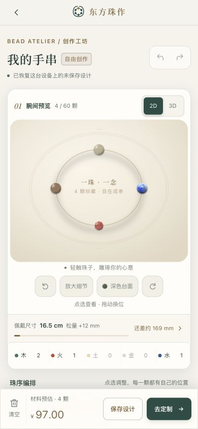
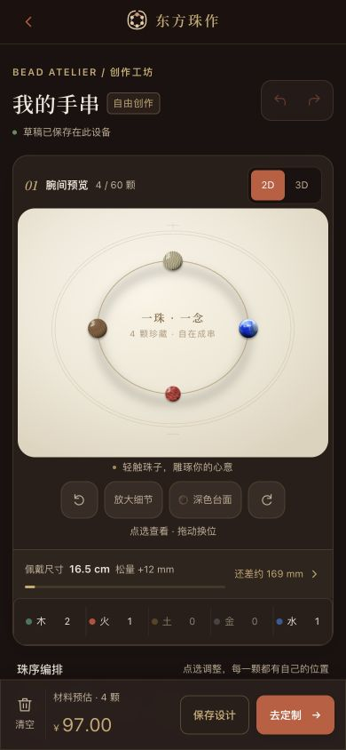

图 8：2026-09-13 当前 DIY 编辑器实访，390×844。展示顶部标识、台面和编排层次；557px 与桌面规则由源码说明，此处不以手机图冒充其验收截图。

### 10.2 材料筛选与折叠

展开时五行按钮位于搜索上方，六项“全部、金、木、水、火、土”等宽排布；极窄屏可分两行。分类是左侧竖栏，右侧为关键词搜索和材料网格。分类栏桌面基准 64px、449px 以下 56px，按钮至少 44px；右列使用可收缩网格，材料名、规格、单价和已选数量不能互相遮挡。

分类、五行、搜索是组合过滤。绳线不受五行过滤排除；库存不足或到珠数上限时禁用对应添加操作，并显示已选满等真实原因。分类变化只滚动材料结果到适当位置，不将整个页面弹回顶部。清除关键词和清除全部筛选是不同操作，界面必须保持区别。

收起材料库时，分类改用下拉选择，保留最多十个当前结果的快捷条；搜索和五行控件隐藏，但既有过滤条件不被偷偷重置。若组合条件导致无结果，仍显示“清除筛选”恢复入口。再次展开继续原选择。折叠状态、搜索词和材料数量的变化应可被辅助技术理解。

手机滚到选材区后可出现轻量作品缩略返回入口；点按回到预览，减少动态效果时不用平滑滚动。它与固定确认条、键盘和安全区必须互不覆盖。当前 2D/3D 与部分紧凑工具仍有 34–42px 局部尺寸，不能据通用按钮规则宣称所有 DIY 触点均已达 44px；设备验收应继续检查这些位置。

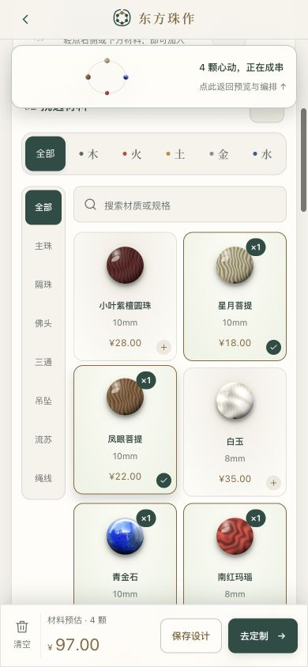
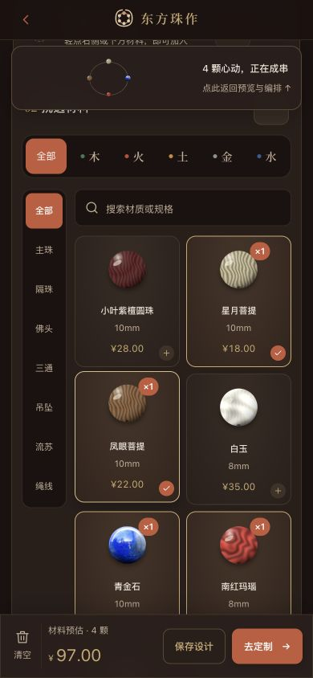

图 9：2026-09-13 当前选材区实访，390×844。五行位于搜索上方、分类位于左侧，关键词和分类共同过滤；图中材料数量以截图时接口数据为准。

### 10.3 我的 DIY 订单

订单列表采用作品卡片：首行订单编号和状态，中部作品名称、材料摘要、进度及可用物流，底部金额、详情及当前可执行操作。装饰串珠图仅标识“定制”，不伪装成该订单真实作品缩略图。长名称、长单号和多材料能换行，详细材料留在展开区，摘要不堆满卡片。

费用取订单字段，材料优先取成交 `items`，再取 `pricingSnapshot.items`；设计快照只用于名称和缺失时的无价材料说明。历史设计单价不能冒充成交价。合计材料数量含配件或绳线时写“件材料”，不写“颗珠”。空加持任务不显示虚构进度；缺物流不造占位单号，未知时间写暂无记录。

详情按钮关联展开区，完整显示订单、费用、支付、实际加持和材料明细。待支付才显示“继续模拟支付”，已发货才显示确认收到作品；操作中禁用并把错误放到对应订单。列表初次加载为静态骨架；首屏空态引导创作，翻页空态提供返回，不能把第二页没有记录误作没有任何订单。当前按每页 20 条处理，不根据一页数据虚构总数。

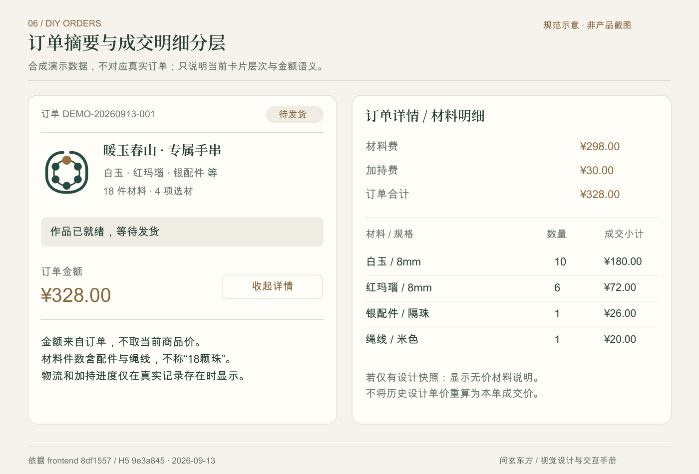

图 10：合成演示数据的订单规范示意，不是真实订单截图。材料费 298 元、加持费 30 元、合计 328 元；18 件材料含配件与绳线，不标成 18 颗珠。用以说明摘要、成交明细和金额来源，不能据图认定真实制作、加持、付款或发货已完成。

## 11. 各端交付差异与验收

| 端 | 保留的结构与重点 |
|---|---|
| H5 信众 | 移动优先、五项根导航、底部操作条、原生 dialog；DIY 为独立宽屏工作区 |
| H5 法师 | 工作台、预约、消息、我的；同主题文字体系，强调待办和服务进度，不能混用信众主导航 |
| 信众 iOS | 原生 TabView / NavigationStack，标题动态字体、系统 sheet；DIY 当前有分类与材质/规格搜索，没有独立五行筛选控件 |
| 法师 iOS | 四项原生根导航，消息与预约使用真实角标来源；工作台、日程、收益的数值反馈保持原生交互 |
| 统一运营后台 | 面向作业的侧栏、筛选、表格、统计和弹层，平台与商城业务在权限允许范围内分区 |
| 寺院后台 | 同一后台组件体系，机构信息、人员、服务、预约和加持围绕寺院任务组织 |
| 商城兼容入口 | `/shop/` 映射到 `/admin/commerce/...`，登录转统一登录；保留兼容 Logo/favicon 资产，不代表仍提供第三套独立作业体验 |

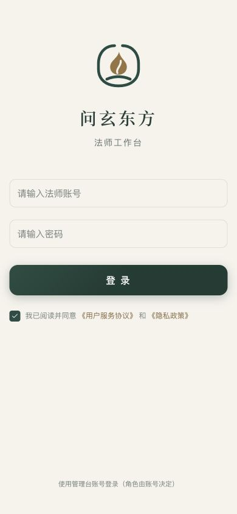

图 11：2026-09-13 法师 H5 实访，390×844，展示当前法师身份和浅色登录结构。这是 H5 页面，不能替代原生 iOS 实机图。

交付至少检查浅/深/跟随系统、首屏/加载/空/错、正常/长文本/大字号、键盘/触控。H5 采用 320、390、557、768 与桌面等代表宽度检查；后台另看 991/992、1199/1200 的模式边界；iOS 检查系统字号和安全区，不用浏览器缩放代替 Dynamic Type。

键盘验收从触发按钮进入弹层，Tab 不跑到底层，Escape 遵循忙碌限制，关闭后返回触发位置；打开父子弹层再逐层关闭，确认滚动锁正确恢复。触控验收检查点按、滑动、拖出、键盘弹出、返回侧滑。状态还需有文本和可读名称，色觉差异不能影响判断；图形装饰避免重复朗读。

当前源码和既有浏览器记录可支持 Web 主题、字体、部分响应式及弹层行为已做检查；不能把单页检查推广为全产品逐页验收。两 iOS 已有未签名构建、字体/资源及相关源码回归证据；品牌任务仅完成局部模拟器探针，未完成全部原生页面视觉和实机操作。真机流畅度、VoiceOver、所有动态字号、系统版本差异、推送与通话仍需独立设备验收，本文不作已通过承诺。

## 12. 设计与开发交付清单

设计稿至少包含：使用身份、浅深主题、页面层次、实际文案、长内容、控件状态、响应式变化及必要交互注释。动效标明触发、对象、时长、结束状态和减少动态效果后的行为。开发应优先引用现有组件及令牌，新增例外写清用途，避免复制一份颜色或字体后长期漂移。

图版以当前构建和真实组件为来源；假数据明确标注，照片来源保留说明。历史后台截图、旧 DIY 横向筛选或旧 Logo 不能作为当前交付样板；字体测试板仅用于字形对照，不能当成真实应用页面。正式 PNG/SVG 与文档/PDF 图版分开保存，便于以后更换截图而不改品牌母版。

源码查阅路径以下均相对 `askXuan-frontend`：共同色与字体见 `packages/design-tokens/tokens.json`、`typography.css`、`motion.css`；品牌母版见 `packages/brand/generate.mjs` 与 `assets/`；后台见 `packages/admin-ui/styles/`、`components/`、`navigation.ts` 和 `chart-theme.ts`；H5 见 `apps/web-h5/src/theme/`、`components/useModalMotion.ts`、`features/diy/editor.css`、`orders.css`；原生见两应用的 `DesignSystem/Tokens.swift`、`Components/GlassBackground.swift` 与实际 `App/MainTabView.swift`。

本手册图版分为当前页面实访、正式资产规范图和组件示意三类，图注分别标明来源。未取得的桌面 DIY、原生实机、大字号及完整业务状态截图不以历史图片替代；页面外观与交互验收仍按第 11 章逐项记录。
