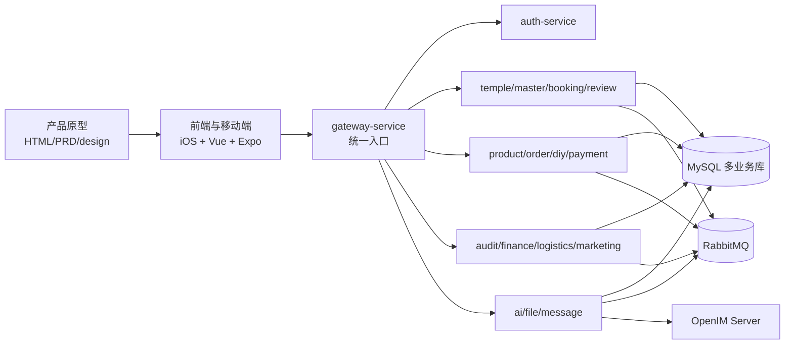
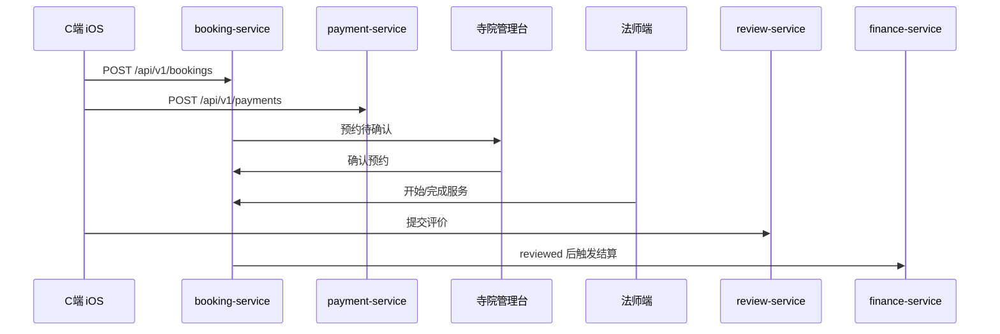
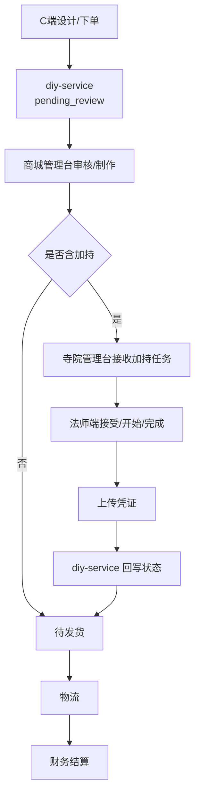

# 问玄东方平台 - 全端业务逻辑一致性审计报告

> 审计日期: 2026-07-07  
> 审计范围: 产品原型 / C端 iOS / 法师端 iOS / 寺院管理台 / 商城管理台 / 平台管理台 / 后端服务 / 数据库 / 脚本 / 架构文档  
> 结论等级: 局部不一致，主链路可闭环

---

## 1. 总体结论

当前项目已经从“原型页面为主”推进到“本地可验收的 MVP 闭环版”。核心业务线包括预约祈福、DIY 手串加持、普通商品交易、入驻审核、财务结算、AI 问事和消息通信，均能在原型、前端、后端服务、数据库表、状态机与闭环脚本中找到对应承载。

仍需注意：一致性不是“所有功能生产可用”。当前代码里仍有部分内存模型、mock 数据、原型静态页、归档代码和历史交付快照并存；因此本文按“真实实现已对齐 / 文档或表达需校准 / 功能仍有差距”区分。

---

## 2. 架构与依赖关系

主要依赖关系：

| 层级 | 当前承载 | 一致性判断 |
|------|----------|------------|
| 产品原型 | `产品原型/问玄东方App`、四个管理端 PRD 与静态页 | 页面覆盖较完整，近期有未提交修改，应作为当前原型基线继续核对 |
| C端 iOS | `apps/ios-customer` | 覆盖首页、寺院、法师、预约、AI、聊天、DIY、商城、我的 |
| 法师端 iOS | `apps/ios-master` | 覆盖工作台、预约、加持任务、消息、收益、资料 |
| Web 管理台 | `web-temple-admin`、`web-shop-admin`、`web-platform-admin` | 三端路由与原型大体一致 |
| 后端 | 20 个 go.work 服务模块 + common | 含 gateway、community-service 与 media-service，服务域与文档一致 |
| 数据库 | `db/init.sql` 约 70 张表 | 覆盖主数据、交易、消息、审核、财务、营销、系统配置 |
| 自动化脚本 | `scripts/test-mvp*.sh`、`test_full_stack.sh`、`test-communication-closed-loop.sh` | 能证明本地闭环意图，但需结合运行结果判断实际可用性 |

---

## 3. 核心数据流

### 3.1 预约祈福

一致性判断：状态机、后端路由、寺院管理台、法师端、C端原型总体一致。已清理文档中错误的单数 booking 接口写法，统一为真实后端的 `/api/v1/bookings`。

### 3.2 DIY 手串加持

一致性判断：旧报告中“寺院/法师/商城加持链路不存在”的结论已经过期。当前后端有 `blessing_task`、DIY 状态机、MQ 回传逻辑，寺院管理台和法师端也已有加持任务承载。

### 3.3 普通商品交易

用户浏览商品、创建商城订单、支付、商城发货、物流追踪、确认收货、售后退换货，对应 `product-service`、`order-service`、`payment-service`、`logistics-service`、`finance-service`。原型、商城管理台路由和后端路由基本一致。

---

## 4. 当前一致项

| 业务域 | 证据 | 结论 |
|--------|------|------|
| 服务域拆分 | `go.work`、`services/*/*-service`、架构服务文档 | 服务边界基本一致 |
| 预约状态 | `状态机.md`、`booking-service`、寺院/法师端页面 | 已对齐 |
| DIY 加持状态 | `diy_order.status`、`状态机.md`、`diy_order.go`、商城/寺院/法师端 | 已对齐 |
| 财务业务类型 | `booking/diy_blessing/diy_material/shop_order` | 当前代码与财务文档已对齐，旧报告中的下线/不存在服务收入构成已不再适用 |
| 入驻审核 | 平台管理台寺院/法师审核路由、后端 temple/master platform admin 路由 | 基本一致 |
| 消息通信 | `message-service`、OpenIM 接入、通信闭环脚本 | 方向一致，但仍依赖本地 OpenIM/容器运行状态 |
| 数据字典 | `字段字典.md` 与 `db/init.sql` | 大体一致，字段级仍需持续自动化校验 |

---

## 5. 差异报告

| 编号 | 风险 | 范围 | 差异 | 建议 |
|------|------|------|------|------|
| D1 | 中 | 文档/API | 部分教程和服务文档仍使用旧的单数 booking 接口前缀，真实后端为 `/api/v1/bookings` | 已在本次清理中修正关键文档；后续新增接口需以 `.api` 和 `routes.go` 为准 |
| D2 | 中 | 法师服务/预约 | “命理咨询”在法师端原型、收益、消息咨询中存在，但不是寺院 7 类标准预约服务之一 | 文档中应将其定义为法师个人咨询/IM 咨询能力，不应要求寺院服务列表补一项 |
| D3 | 中 | 前端实现 | Web 管理台和 iOS 已覆盖大量路由，但仍存在 mock/内存模型和静态原型并行 | 验收时按真实 API、mock server、静态原型三类分别标注，不混用为生产完成度 |
| D4 | 中 | 文档编号 | `业务流程.md` 曾出现重复章节编号 | 已在本次清理中修正 |
| D5 | 低 | 历史报告 | 根目录 `PROJECT-REPORT-2026-07-04.md` 与 `PROJECT-REPORT-2026-07-06.md` 是历史快照，部分结论会过期 | 保留为交付记录，不作为当前唯一事实源 |
| D6 | 低 | 归档代码 | `apps/_archive/ios-customer-swift` 仍保留旧 Swift C端实现 | 保留为归档参考；审计当前实现时不要纳入主线完成度 |

---

## 6. 已清理的过期逻辑表述

旧报告中的以下结论类别已过期，已从当前报告中移除或改写：

| 旧结论类别 | 当前判断 |
|--------|----------|
| 加持任务三端承载缺失 | 已过期；当前有寺院端、法师端、商城端与后端端点承载 |
| DIY 订单缺少加持状态 | 已过期；数据库、状态机、后端模型均已包含等待加持、加持中、加持完成等状态 |
| 财务收入构成引用下线/不存在服务项 | 原型和当前 Web 实现已调整为预约、DIY材料、加持、商品等维度 |
| DIY 加持主链路不可达 | 已过期；当前主要风险转为真实联调、运行验证和生产化程度 |

---

## 7. 后续验收重点

1. 运行 `askXuan-backend/scripts/test_full_stack.sh` 与 `test-mvp*.sh`，用真实结果更新本报告。
2. 把前端 API client 路径与后端 `routes.go` 做自动化比对，避免文档再次漂移。
3. 明确“命理咨询”的产品定位：法师个人咨询/即时通讯，还是标准寺院预约服务。
4. 对 `db/init.sql` 与 `字段字典.md` 增加字段级校验脚本。
5. 将历史交付报告移入归档目录或在 README 标注“历史快照”，避免被误当作当前事实源。
