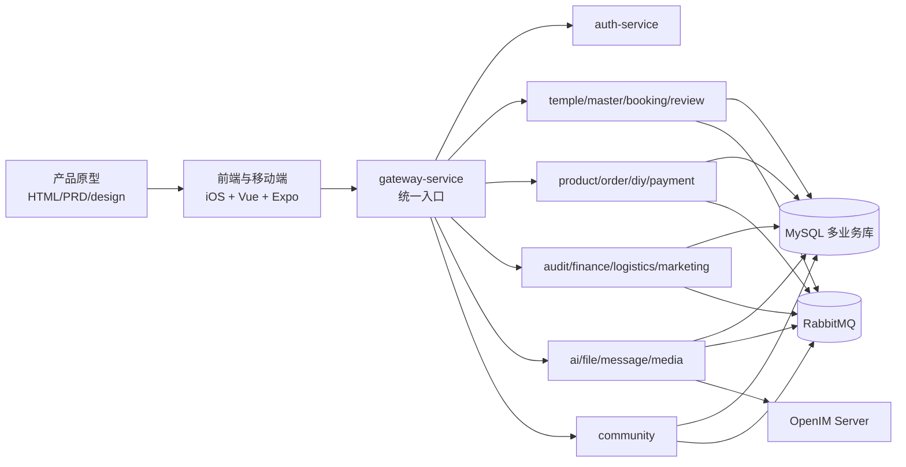
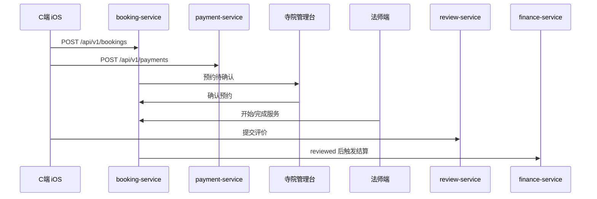
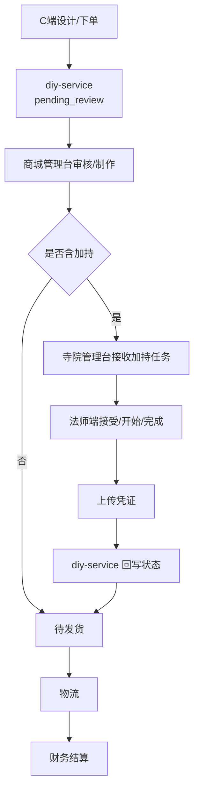

# 问玄东方平台 - 全端业务逻辑一致性审计报告

> 审计日期: 2026-07-14
> 审计范围: 产品原型 / C端 iOS / 法师端 iOS / 寺院管理台 / 商城管理台 / 平台管理台 / 后端服务 / 数据库 / 脚本 / 架构文档
> 结论等级: 六项改进与五个正式客户端已对齐，本地验收通过；生产外部 Provider 待配置

---

## 1. 总体结论

当前修改后原型、五个正式客户端、20 个 Go 服务、全量初始化/前向迁移、Mock 与文档已经按《需求文档-App改进》的六项需求对齐。信仰流派、诉求聚合、AI 问事、设计广场下单、媒体/直播基础、大师广场均有真实 API、MySQL 数据结构、正式客户端承载和可执行闭环脚本。

本地验收已通过六项新增闭环、既有 MVP 回归、20 个 Go module 测试、两个 iOS workspace 编译、三个 Web 管理台构建、Mock 构建及备用 `mobile-customer` TypeScript 检查。这里的“一致”不等于外部云能力已生产开通：AI 默认使用明确标识的 `mock` Provider，直播默认 `LIVE_ENABLED=false`；生产发布前仍需配置模型、VOD/直播账号、密钥和回调域名。

---

## 2. 架构与依赖关系

主要依赖关系：

| 层级 | 当前承载 | 一致性判断 |
|------|----------|------------|
| 产品原型 | `产品原型/问玄东方App`、PRD 与静态页 | 六项改进说明和交互落点已同步并提交 |
| C端 iOS | `apps/ios-customer` | 流派专题、诉求聚合、AI、DIY 计价、媒体播放、大师广场已接真实接口 |
| 法师端 iOS | `apps/ios-master` | 预约、加持、内容发布、媒体上传、直播能力开关已接真实接口 |
| Web 管理台 | `web-temple-admin`、`web-shop-admin`、`web-platform-admin` | 流派/诉求标签和社区审核已实现，三端构建通过 |
| 后端 | 20 个 go.work 服务模块 + common | 含 gateway、community-service 与 media-service，服务域与文档一致 |
| 数据库 | `db/init.sql` 21 个数据库、99 条建表声明 | 覆盖主数据、交易、消息、审核、财务、营销、媒体、社区与系统配置 |
| 自动化脚本 | `scripts/test-app*.sh`、`test-mvp*.sh`、通信/OpenIM 脚本 | 六项改进与既有核心回归均已实际执行通过 |

---

## 3. 核心数据流

### 3.1 预约祈福

一致性判断：状态机、后端路由、寺院管理台、法师端、C端原型总体一致。已清理文档中错误的单数 booking 接口写法，统一为真实后端的 `/api/v1/bookings`。

### 3.2 DIY 手串加持

一致性判断：旧报告中“寺院/法师/商城加持链路不存在”的结论已经过期。当前后端有 `blessing_task`、DIY 状态机、MQ 回传逻辑，寺院管理台和法师端也已有加持任务承载。

### 3.3 普通商品交易

用户浏览商品、创建商城订单、支付、商城发货、物流追踪、确认收货、售后退换货，对应 `product-service`、`order-service`、`payment-service`、`logistics-service`、`finance-service`。原型、商城管理台路由和后端路由基本一致。

---

## 4. 当前一致项

| 业务域 | 证据 | 结论 |
|--------|------|------|
| 服务域拆分 | `go.work`、`services/*/*-service`、架构服务文档 | 服务边界基本一致 |
| 预约状态 | `状态机.md`、`booking-service`、寺院/法师端页面 | 已对齐 |
| DIY 加持状态 | `diy_order.status`、`状态机.md`、`diy_order.go`、商城/寺院/法师端 | 已对齐 |
| 财务业务类型 | `booking/diy_blessing/diy_material/shop_order` | 当前代码与财务文档已对齐，旧报告中的下线/不存在服务收入构成已不再适用 |
| 入驻审核 | 平台管理台寺院/法师审核路由、后端 temple/master platform admin 路由 | 基本一致 |
| 消息通信 | `message-service`、OpenIM 接入、通信闭环脚本 | 方向一致，但仍依赖本地 OpenIM/容器运行状态 |
| 数据字典 | `字段字典.md` 与 `db/init.sql` | 大体一致，字段级仍需持续自动化校验 |
| 信仰流派 | `beliefCode`、流派详情、寺院/大师筛选、管理端编辑 | 已对齐；保留 `sect` 兼容具体宗派 |
| 诉求聚合 | `intent_tag` 映射、`/api/v1/intentions`、C端混排 | 已对齐；商品与寺院服务仍走原下单域 |
| AI 问事 | MySQL 会话/消息、Provider、C端历史与重试 | 已对齐；重启恢复与所有权校验通过 |
| 设计广场下单 | 服务端 SKU 计价、事务快照、支付后作者收益 | 已对齐；作者分成默认 0% |
| 媒体与直播 | media-service、MinIO、AVPlayer、直播能力开关 | 本地媒体闭环通过；生产直播 Provider 未启用 |
| 大师广场 | community-service、双 iOS 端、平台审核 | 已对齐；评论先审后显、点赞幂等 |

---

## 5. 差异报告

| 编号 | 风险 | 范围 | 差异 | 建议 |
|------|------|------|------|------|
| D1 | 中 | 生产配置 | AI 本地默认 `mock`，外部兼容模型需要 `AI_BASE_URL/AI_API_KEY/AI_MODEL` | 上线前配置并完成外部 Provider 验收 |
| D2 | 中 | 生产配置 | 直播接口和 UI 已完成，但默认关闭且未配置云直播/TRTC | 云账号、密钥、回调域名齐备后再开启 `LIVE_ENABLED` |
| D3 | 低 | 备用客户端 | `mobile-customer` 仍有刷新 token 等维护项 | 该项目不是五个正式客户端，仅保留回归，不阻断本次发布 |
| D4 | 低 | 历史报告 | 根目录历史交付报告是时间点快照，部分结论会过期 | 保留为交付记录，不作为当前唯一事实源 |
| D5 | 低 | 归档代码 | `apps/_archive/ios-customer-swift` 是旧 Swift C端归档 | 不纳入主线完成度和发布判断 |

---

## 6. 已清理的过期逻辑表述

旧报告中的以下结论类别已过期，已从当前报告中移除或改写：

| 旧结论类别 | 当前判断 |
|--------|----------|
| 加持任务三端承载缺失 | 已过期；当前有寺院端、法师端、商城端与后端端点承载 |
| DIY 订单缺少加持状态 | 已过期；数据库、状态机、后端模型均已包含等待加持、加持中、加持完成等状态 |
| 财务收入构成引用下线/不存在服务项 | 原型和当前 Web 实现已调整为预约、DIY材料、加持、商品等维度 |
| DIY 加持主链路不可达 | 已过期；当前主要风险转为真实联调、运行验证和生产化程度 |

---

## 7. 2026-07-14 验收记录

| 范围 | 结果 |
|------|------|
| 六项新增闭环 | 流派、诉求、AI、DIY、媒体/直播关闭态、社区全部通过 |
| 既有业务回归 | 预约、商城交易、评价、营销、财务、审核、通信、OpenIM 集成全部通过 |
| 后端 | 20 个 Go module `go test ./...` 通过；全部 askXuan 容器健康 |
| 数据库 | 全量初始化和幂等前向迁移可重复执行；历史缺表时安全跳过 |
| 正式客户端 | C端与法师端 iOS workspace 编译通过；三个 Web 管理台构建通过 |
| 配套客户端 | Mock 构建通过；备用 `mobile-customer` TypeScript 检查通过 |

发布前仅剩外部环境事项：配置生产 AI/媒体/直播 Provider，替换本地地址与密钥，并在生产回调域名上复验。代码、原型和文档不把这些待配置能力表述为已上线。
