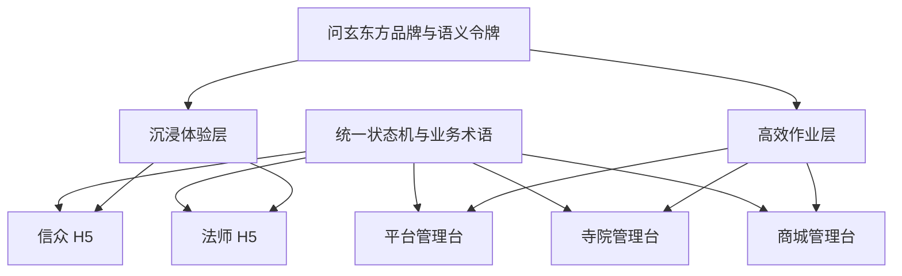

# 问玄东方五端 UI 重绘蓝图

> 文档版本：v1.1
> 编制日期：2026-09-04
> 文档性质：目标体验与实施指导；当前实现、测试与 ECS 发布状态见[五端视觉回归与业务闭环用例](./五端视觉回归与业务闭环用例.md)
> 覆盖范围：信众 H5、法师 H5、平台管理台、寺院管理台、商城管理台

## 1. 目标与边界

### 1.1 重绘目标

本轮重绘不是逐页更换颜色，而是统一五端的品牌表达、响应式布局、业务状态、页面模板和操作反馈，最终达到以下目标：

1. 五端看起来属于同一个产品体系，同时符合各自的使用场景。
2. 信众和法师 H5 在 320px 至 768px 宽度内无页面级横向滚动，兼容手机、平板和桌面预览。
3. 三个管理台在桌面、笔记本、平板和手机任务模式下均可完成核心操作。
4. 同一预约、订单、加持、审核和结算状态在五端使用相同的名称、颜色和时间线语义。
5. 空数据、加载失败、无权限、服务关闭和真实业务零值能够被明确区分。
6. 建立可复用的 React H5 组件层和 Vue 管理台组件层，降低后续五端并行维护成本。

### 1.2 产品边界

- H5 与 iOS 保持业务能力、数据来源、计价、状态机和权限一致，但不要求像素级一致。
- 本蓝图不改变现有后端服务职责、API 契约和角色权限边界。
- 支付、云直播、云媒体和外部 AI Provider 的未上线能力继续显示真实可用状态，不在 UI 中伪装为已开通。
- 动态信仰流派、心愿分类、服务目录、DIY 材料等继续由服务端主数据驱动，不在页面中新增硬编码字典。
- 当前业务数据已清空、仅保留账号数据，因此空态与首次使用引导是第一批验收内容。

### 1.3 事实基线

本蓝图基于以下现有事实制定：

- 信众和法师 H5 位于同一 React 工程，通过 `/c/*` 与 `/m/*` 两棵路由承载。
- 三个管理台均为 Vue 3 + Element Plus，但布局、主题和公共组件目前分别维护。
- 当前五端页面和导航闭环已经存在，重绘应保留现有业务能力，不以减少功能换取视觉整齐。
- 权威业务状态以[状态机](../architecture/状态机.md)为准，端能力以[功能对齐矩阵](./功能对齐矩阵.md)为准。
- 现有原型的页面连接完整性以[交互完整性审计报告](../../../产品原型/交互完整性审计报告.md)为参考。

## 2. 总体体验架构

### 2.1 一套品牌系统，两种界面模式



| 模式 | 使用端 | 视觉策略 | 交互策略 |
|---|---|---|---|
| 沉浸体验层 | 信众 H5、法师 H5 | 深檀背景、朱砂主操作、鎏金强调、有限文化纹样 | 单手操作、底部导航、卡片与底部抽屉、渐进披露 |
| 高效作业层 | 平台、寺院、商城管理台 | 暖白内容区、深色侧栏、低饱和状态色、清晰表格层级 | 待办驱动、批量处理、筛选保存、详情抽屉和快捷操作 |

### 2.2 统一体验原则

1. **先任务、后数据**：首页首先回答“现在需要处理什么”，再展示趋势和统计。
2. **一个状态、一个含义**：状态颜色表达语义，不用于装饰。
3. **一个页面、一个主操作**：每个页面只保留一个最高优先级 CTA。
4. **复杂度渐进披露**：列表显示决策所需摘要，完整字段进入详情或编辑页。
5. **跨端可追溯**：所有交易、审核和资金动作都能看到当前节点、责任角色和历史记录。
6. **真实反馈**：无数据、接口失败、服务关闭、权限不足分别呈现。
7. **文化感克制使用**：宋体、金色和纹样用于品牌与重点，不降低长文本和数据表可读性。

## 3. 设计系统蓝图

### 3.1 令牌分层

现有 `packages/design-tokens` 扩展为三层令牌：

```text
基础令牌 Primitive
├── 色板、字体、字号、间距、圆角、阴影、动效
语义令牌 Semantic
├── surface、text、border、action、status、focus、overlay
组件令牌 Component
└── button、card、table、dialog、navigation、timeline、chart
```

建议形成三个包：

| 包 | 职责 | 消费端 |
|---|---|---|
| `@askxuan/design-tokens` | 品牌、语义和响应式令牌 | 五端 |
| `@askxuan/h5-ui` | React 移动组件与业务展示组件 | 信众、法师 H5 |
| `@askxuan/admin-ui` | Vue 管理台壳层、表格、表单和审核组件 | 三个管理台 |

### 3.2 色彩系统

保留现有品牌色，并补齐浅色作业主题和中性色阶。

| 语义 | 沉浸主题 | 作业主题 | 使用规则 |
|---|---|---|---|
| 页面背景 | `#1C1210` | `#F6F2ED` | 页面最底层 |
| 卡片背景 | `#2A1E1A` | `#FFFFFF` | 内容卡片、表单分组 |
| 提升层 | `#44342C` | `#FFFCF8` | 弹层、悬浮区、选中区 |
| 主操作 | `#C45A3C` | `#C45A3C` | 每屏一个主 CTA |
| 品牌强调 | `#C8A96E` | `#A9823E` | 品牌标题、重点图标，不承载大段正文 |
| 成功 | `#5B8C5A` | `#3F7D52` | 已完成、已通过、正常 |
| 警告 | `#D4A843` | `#B98216` | 待处理、临期、风险 |
| 错误 | `#C45A3C` | `#B84632` | 失败、拒绝、删除、异常 |
| 信息 | `#6687A8` | `#416F9C` | 进行中、普通提示 |

约束：

- 金色不用于普通正文和大面积背景。
- 红色主按钮与危险操作必须通过文案、位置和二次确认区分。
- 状态不得只依赖颜色，必须同时展示文字或图标。
- 图表系列色与状态色分离，避免“绿色曲线”被误解为成功状态。

### 3.3 字体与信息层级

| 层级 | H5 | 管理台 | 用途 |
|---|---:|---:|---|
| 品牌标题 | 22–28px，宋体 | 20–24px，宋体 | 品牌、一级页标题 |
| 页面标题 | 20–24px | 20–24px | 页面任务名称 |
| 区块标题 | 16–18px | 16–18px | 卡片和分区标题 |
| 正文 | 15–16px | 14px | 主要内容 |
| 辅助文字 | 12–13px | 12–13px | 时间、说明、字段提示 |
| 数据数字 | 20–32px，等宽数字 | 22–32px，等宽数字 | 金额、数量、比率 |

法师 H5 默认正文使用 16px，关键操作字号不小于 16px；金额、订单号和时间使用等宽数字，减少跳动和误读。

### 3.4 间距、圆角和触控

- 基础间距采用 4px 网格：`4 / 8 / 12 / 16 / 20 / 24 / 32 / 40`。
- H5 页面水平边距：小屏 12px，常规手机 16px，宽屏/平板 24–32px。
- 管理台内容边距：紧凑 16px，标准 24px，宽屏 32px。
- H5 可点击区域不小于 44×44px；法师端关键操作不小于 48×48px。
- 管理台常规按钮高度 36px，关键表单按钮 40px。
- 卡片圆角统一使用 8px 或 12px；大型弹层使用 16px，避免同一页面混用过多圆角。

### 3.5 图标、图片和动效

- 使用统一线性图标库，导航图标保持同一线宽、视觉尺寸和圆角语言。
- 寺院、法师、商品图片固定比例并提供裁剪预览，避免列表跳动。
- 文化纹样只用于首页 Hero、登录页和空态插图，透明度控制在 4%–8%。
- 常规过渡 160–220ms；页面进入不做大幅位移。
- 支持 `prefers-reduced-motion`，关闭轮播自动移动、粒子和非必要缩放。

## 4. 响应式布局规范

### 4.1 H5 断点

| 宽度 | 布局策略 |
|---|---|
| 320–359px | 单列紧凑模式；筛选项可横滑；操作区允许换行；DIY 材料两列 |
| 360–399px | 标准手机模式；双列功能入口；底栏五项/四项等宽 |
| 400–599px | 大屏手机模式；卡片增加留白；详情摘要可双列 |
| 600–767px | 平板窄屏模式；列表与辅助筛选可形成 2:1 布局 |
| ≥768px | 居中应用壳，最大宽度 768px；不把手机卡片无限拉宽 |

H5 全局要求：

- 使用 `100dvh` 与安全区变量，兼容 Safari 地址栏和刘海屏。
- 固定底栏、聊天输入栏、底部操作栏共享同一个壳宽和安全区算法。
- 键盘弹起时输入框保持可见，聊天列表自动保留当前位置。
- 页面级禁止横向滚动；轮播、标签和素材列表的局部横滑必须有可发现提示。
- 图片、视频、Canvas 和 3D 预览均受容器尺寸约束。

### 4.2 管理台断点

| 宽度 | 侧栏 | 内容区 | 表格/表单策略 |
|---|---|---|---|
| ≥1440px | 240px 展开 | 12 栏 | 完整表格，详情可左右双栏 |
| 1200–1439px | 220px 展开 | 12 栏 | 次要字段进入列设置 |
| 992–1199px | 72px 图标栏 | 8–12 栏 | 筛选区折叠，详情改单栏/双栏自适应 |
| 768–991px | 抽屉侧栏 | 8 栏 | 表格保留关键列，其余进入行详情 |
| <768px | 顶部栏＋抽屉 | 单列 | 任务卡片替代表格，复杂编辑使用全屏步骤页 |

管理台全局要求：

- 任何断点下都不保留“固定宽侧栏＋固定宽内容”的组合。
- 窄屏列表默认展示对象、状态、金额/时间和主操作四类信息。
- 表格允许组件内部横向滚动，但页面本身不得横向滚动。
- 图表在窄屏切换为摘要数字、迷你趋势和“查看完整报表”入口。
- 批量操作仅在选中记录后出现，移动端使用底部操作条。

### 4.3 视觉回归尺寸矩阵

| 类型 | 必测尺寸 |
|---|---|
| H5 | 320×568、375×667、390×844、430×932、768×1024 |
| 管理台 | 390×844、768×1024、1024×768、1280×800、1440×1000 |

## 5. 全局导航蓝图

### 5.1 信众 H5

底部导航保持五项：

| Tab | 核心内容 | 二级入口 |
|---|---|---|
| 首页 | Banner、找寺院、找法师、按心愿办、热门推荐 | 寺院/法师/服务列表 |
| 对话 | 私聊、大师广场、收藏 | 会话详情、图文/视频详情、直播 |
| AI 问事 | 当前对话、方向选择 | 历史抽屉、新建对话、失败重试 |
| 商城 | 商品、DIY、活动 | 商品详情、购物车、订单、售后 |
| 我的 | 预约、订单、DIY、评价、资料 | 地址、优惠券、收藏、设置 |

导航调整要点：

- AI 作为中间主入口，但不使用夸张悬浮按钮破坏底栏稳定性。
- “对话”页顶部使用“私聊 / 大师广场”分段导航，避免会话和内容流混排。
- 首页首屏只保留一个主 Banner 和两个核心入口；低频内容下沉，减少入口竞争。
- 个人中心按“待办订单—资产权益—账号设置”分组。

### 5.2 法师 H5

底部导航保持四项：

| Tab | 核心内容 | 二级入口 |
|---|---|---|
| 工作台 | 今日安排、待确认预约、待接加持、未读消息、收入摘要 | 日历、加持、内容工作室 |
| 预约 | 待确认、已确认、进行中、历史 | 预约详情、履约操作 |
| 消息 | 用户咨询、系统通知 | 会话详情 |
| 我的 | 收益、提现、定价、专长、评价、设置 | 资料编辑、休息日、内容管理 |

导航调整要点：

- 工作台使用“下一件要做的事”排序，而不是平铺全部统计。
- 对待确认预约和未读消息显示数字徽标，并允许一键进入已筛选列表。
- 加持任务在工作台高优先级展示，不与普通历史记录混在一起。
- 法师端避免小字号、低对比和隐藏手势，关键动作必须有文字按钮。

### 5.3 平台管理台

| 一级导航 | 二级模块 |
|---|---|
| 平台总览 | 全局待办、风险预警、核心指标、服务状态 |
| 机构与人员 | 寺院、法师、用户、管理账号 |
| 审核中心 | 入驻审核、资质审核、评论、素材、举报 |
| 财务中心 | 财务概览、寺院结算、法师结算、对账、提现 |
| 增长运营 | Banner、活动、优惠券、首页分类 |
| 系统治理 | 角色权限、数据字典、操作日志、备份恢复 |

调整重点：把分散的审核入口聚合成统一队列；将“首页分类”从普通系统设置提升为运营主数据；高风险操作保留审计原因和影响范围提示。

### 5.4 寺院管理台

| 一级导航 | 二级模块 |
|---|---|
| 今日工作台 | 待确认预约、待分配加持、待回复评价、今日排班 |
| 寺院主页 | 基本信息、图册、营业状态 |
| 人员与服务 | 法师、服务、时段、容量 |
| 预约履约 | 预约列表、详情、状态记录 |
| 加持任务 | 待分配、执行中、已完成、异常 |
| 评价与报表 | 评价回复、经营报表 |
| 设置 | 通知、账号安全、操作日志 |

调整重点：把“寺院信息、图册”合并到寺院主页的页签中；法师和服务编辑使用统一步骤表单；工作台直接进入带筛选条件的任务列表。

### 5.5 商城管理台

| 一级导航 | 二级模块 |
|---|---|
| 今日工作台 | 待审核 DIY、待制作、待发货、库存预警、售后超时 |
| 商品中心 | 商品、SKU、分类 |
| DIY 中心 | DIY 订单、材料、加持服务、设计预览 |
| 履约中心 | 商城订单、物流、发货 |
| 售后中心 | 退换货、退款进度、异常订单 |
| 数据报表 | 销售、商品、DIY、售后 |

调整重点：导航围绕“商品—订单—履约—售后”组织；DIY 订单详情同时展示设计预览、BOM、制作、加持和物流时间线。

## 6. 页面模板体系

五端页面归并为 17 种模板，先设计模板，再批量迁移页面。

| 编号 | 模板 | 主要使用端 | 必备区域 |
|---|---|---|---|
| H01 | H5 Tab 首页 | 信众、法师 | 顶栏、首要任务、快捷入口、内容区、底栏 |
| H02 | 发现/聚合页 | 信众 | 主题摘要、资源分组、推荐理由、更多入口 |
| H03 | 列表与筛选 | 信众、法师 | 搜索、筛选抽屉、排序、结果卡、空态 |
| H04 | 实体详情 | 信众 | Hero、可信信息、服务/内容 Tab、底部 CTA |
| H05 | 交易步骤页 | 信众 | 步骤、服务选择、时间/对象、金额、确认 |
| H06 | 订单列表/详情 | 信众、法师 | 状态摘要、时间线、费用、凭证、可用操作 |
| H07 | 聊天 | 信众、法师 | 权益提示、历史消息、发送状态、重试、输入栏 |
| H08 | AI 对话 | 信众 | 技能选择、消息流、生成状态、引用/风险提示 |
| H09 | 内容流/直播 | 信众、法师 | 图文/视频卡、审核状态、播放/发布能力状态 |
| H10 | DIY 编辑器 | 信众 | 预览、材料、五行摘要、价格、撤销、保存/下单 |
| H11 | 我的/设置 | 信众、法师 | 身份摘要、任务入口、资产、设置、退出 |
| A01 | 管理台工作台 | 三管理台 | 关键待办、异常、指标、趋势、最近处理 |
| A02 | 筛选列表 | 三管理台 | 查询条件、保存视图、表格/卡片、批量操作 |
| A03 | 详情工作区 | 三管理台 | 摘要、状态线、关联对象、操作记录、侧边动作 |
| A04 | 复杂编辑 | 三管理台 | 步骤导航、分组表单、草稿、校验摘要 |
| A05 | 审核工作台 | 平台 | 材料对比、风险命中、审核历史、通过/驳回 |
| A06 | 财务与报表 | 平台、寺院、商城 | 口径说明、时间范围、指标、明细、导出状态 |

## 7. 首批重绘页面与优先级

### 7.1 P0：建立视觉与业务闭环基线

| 端 | 页面 |
|---|---|
| 信众 H5 | 首页、寺院详情、法师主页、预约下单、预约详情、对话列表、聊天详情、AI 问事、DIY 编辑器、DIY/商城订单详情 |
| 法师 H5 | 工作台、预约列表、预约详情、加持任务详情、聊天详情、收益 |
| 平台管理台 | 平台总览、统一审核工作台、财务概览、账号与权限 |
| 寺院管理台 | 今日工作台、预约列表/详情、加持任务列表/详情、服务编辑 |
| 商城管理台 | 今日工作台、商城订单详情、DIY 订单详情、商品编辑、退货详情 |

P0 页面负责确定导航、列表、详情、表单、聊天、交易、审核、财务和复杂编辑器等全部核心模板。

### 7.2 P1：高频经营与内容页面

- 信众 H5：寺院/法师列表、诉求聚合、商城首页、商品详情、大师广场、个人中心。
- 法师 H5：日历、内容工作室、定价、评价、个人资料。
- 平台管理台：寺院/法师/用户详情、内容与举报审核、结算与对账、首页分类。
- 寺院管理台：寺院主页、图册、法师管理、评价、报表。
- 商城管理台：商品与分类、材料与加持服务、物流、退货列表、报表。

### 7.3 P2：低频设置和辅助页面

- 登录、忘记密码能力说明、通知设置、数据字典、操作日志、备份恢复。
- 各类空态、失败态、无权限、服务关闭、维护中和降级页面。
- 营销活动、优惠券、Banner 等运营配置页。

登录页虽然排在 P2 迁移，但其视觉模板应在 P0 确定；生产未实现的找回密码不能绘制成可用入口。

## 8. 核心页面重绘规格

### 8.1 信众首页

页面顺序：

1. 品牌顶栏与搜索。
2. 单主 Banner，支持明确分页和手动切换。
3. “找寺院 / 找法师”双入口。
4. “按心愿办”动态入口，最多首屏展示 6–8 项。
5. 基于真实数据的推荐寺院和法师。
6. 大师广场内容预览。
7. 业务为空时的探索引导。

首页不同时展示多组相同权重的卡片；每个区块必须回答“为什么推荐”和“点击后去哪里”。

### 8.2 寺院/法师详情

- Hero 区显示名称、认证、归属、流派、位置/可约状态和主要 CTA。
- 内容区统一为“简介 / 服务 / 内容或评价”页签。
- 预约价格展示服务端计价说明，不用“起价”代替最终确认金额。
- 底部操作栏只保留收藏、咨询、预约三个以内动作。
- 未认证、已下架或服务暂停时，替换 CTA 为原因说明和可行下一步。

### 8.3 预约与订单详情

- 顶部先显示当前状态和下一步，不以订单字段表作为首屏。
- 中部显示服务对象、日期时段、地址/履约信息和费用快照。
- 底部统一时间线：创建、支付、确认、执行、完成、评价/退款。
- 只有当前角色允许的操作才显示；不可用操作说明原因，不用静默禁用。

### 8.4 法师工作台

首屏按优先级展示：

1. 超时风险或需要立即处理的预约。
2. 今日已确认预约和下一场服务。
3. 待接/执行中的加持任务。
4. 未读咨询。
5. 本月收入与可提现余额。

统计卡点击后进入对应筛选列表；“确认、开始、完成”使用清晰的大按钮和二次确认摘要。

### 8.5 管理台工作台

每个工作台由四层组成：

1. **告警层**：超时、失败、库存不足、服务异常。
2. **待办层**：待审核、待确认、待发货、待回复等可执行事项。
3. **经营层**：真实核心指标及口径说明。
4. **趋势层**：可切换时间范围的趋势与排行。

所有卡片必须可追溯到明细；接口失败显示失败态，不把失败解释为 0。

### 8.6 审核工作台

- 左侧/上方展示申请对象和材料目录，中间展示内容，右侧/下方展示历史与审核操作。
- 显示敏感词、重复内容、资质缺失等风险命中，但不替代人工结论。
- 驳回必须选择标准原因并允许补充说明；通过前展示影响范围。
- 批量审核只适用于低风险且规则一致的对象。
- 每次审核展示操作人、时间、原因、前后状态和关联业务 ID。

### 8.7 DIY 订单详情

统一为一条跨端时间线：


详情中固定展示：设计预览、BOM、费用快照、制作进度、加持进度、凭证、物流和售后；各角色只突出自己当前可执行的节点。

## 9. 跨端业务表达

### 9.1 预约闭环

| 阶段 | 信众 H5 | 法师 H5 | 寺院管理台 | 平台管理台 |
|---|---|---|---|---|
| 待支付 | 支付/取消 | 不展示 | 不进入待确认 | 支付异常可查 |
| 待确认 | 等待确认/取消 | 查看摘要 | 确认或拒绝 | 异常与投诉查看 |
| 已确认 | 查看安排/咨询 | 查看今日安排 | 查看履约状态 | 只读追踪 |
| 进行中 | 显示服务中 | 完成服务 | 监督与异常处理 | 只读追踪 |
| 已完成 | 评价 | 查看完成记录 | 查看评价 | 结算与审计 |
| 已取消 | 原因/退款进度 | 查看原因 | 查看原因 | 退款与审计 |

### 9.2 DIY 与加持闭环

| 阶段 | 信众 H5 | 法师 H5 | 寺院管理台 | 商城管理台 | 平台管理台 |
|---|---|---|---|---|---|
| 待审核 | 查看设计与费用 | - | - | 审核 | 异常审计 |
| 制作中 | 查看进度 | - | - | 更新制作 | 异常审计 |
| 等待加持 | 查看排队 | 待任务 | 分配法师 | 只读等待 | 异常审计 |
| 加持中 | 查看执行中 | 上传凭证/完成 | 查看进度 | 查看进度 | 内容与异常审计 |
| 待发货 | 查看准备中 | - | - | 发货 | 只读追踪 |
| 已发货 | 物流/收货 | - | - | 物流处理 | 售后审计 |
| 售后中 | 提交资料/查看进度 | - | - | 审核处理 | 投诉与退款审计 |

### 9.3 状态组件规范

所有端统一提供：

- `StatusBadge`：列表中的短状态。
- `StatusSummary`：详情首屏的状态、说明和下一步。
- `ProcessTimeline`：历史节点、操作角色、时间和备注。
- `ActionGuard`：操作前展示条件、影响和不可逆说明。
- `AuditTrail`：敏感动作的前后值和操作记录。

前端显示文案可以面向角色优化，但必须映射到同一个后端状态值，禁止各端自行推断或组合新的状态。

## 10. 数据、空态和错误反馈

### 10.1 页面状态矩阵

| 页面状态 | 表现 | 可用操作 |
|---|---|---|
| 首次加载 | 骨架屏，保留页面结构 | 可返回 |
| 局部刷新 | 当前数据保留，局部加载指示 | 可继续浏览 |
| 真正无数据 | 说明当前没有什么、为什么、如何创建 | 创建/探索/清除筛选 |
| 筛选无结果 | 显示当前筛选条件摘要 | 清除筛选 |
| 接口失败 | 错误说明、请求编号、重试 | 重试/反馈 |
| 无权限 | 所需角色和数据边界说明 | 返回/切换账号 |
| 能力关闭 | Provider 或功能未配置说明 | 返回/查看替代能力 |
| 数据过期 | 显示最后更新时间 | 刷新 |
| 部分成功 | 明确成功项与失败项 | 重试失败项 |

### 10.2 数据展示规则

- 禁止使用随机数据生成经营趋势。
- 不使用“0”掩盖接口失败或字段缺失。
- 金额必须显示币种、精度和统计口径。
- 时间显示用户/机构时区，并在必要时显示完整时间。
- 用户手机号、银行卡等敏感字段默认脱敏。
- C 端和法师端优先显示业务编号和友好名称，不直接暴露数据库 ID。
- 图表必须提供明细入口和无障碍文本摘要。

## 11. 表单、筛选和批量操作

### 11.1 表单规范

- 简单编辑：侧边抽屉或底部弹层。
- 复杂对象：独立步骤页，建议步骤为“基本信息—业务配置—素材—预览提交”。
- 自动保存草稿，并显示最后保存时间。
- 提交失败保留用户输入，不清空表单。
- 页面顶部显示错误汇总，字段位置显示具体修复建议。
- 离开未保存页面时提示，但不对只读页面制造无意义确认。

### 11.2 筛选规范

- 高频条件直接展示，低频条件进入“更多筛选”。
- 已选条件显示为可关闭标签。
- 管理台支持保存个人筛选视图和恢复默认视图。
- 进入详情再返回时保留页码、筛选、排序和滚动位置。

### 11.3 批量操作规范

- 只有选择记录后才出现批量操作条。
- 批量操作前显示目标数量和影响范围。
- 不允许把不同状态、不同处理规则的记录混合提交。
- 处理完成显示成功数、失败数和失败原因，可仅重试失败项。

## 12. 可访问性与易用性

- 正文与背景达到 WCAG 2.1 AA 对比度目标。
- 所有交互元素有可见焦点，管理台可使用键盘完成筛选、列表和弹窗操作。
- 图标按钮必须有可访问名称；不以 emoji 作为核心业务图标。
- 状态、风险和图表不只使用颜色表达。
- H5 支持系统字体缩放，200% 缩放下核心流程仍可操作。
- 法师端避免连续的小型开关和密集表格，优先使用卡片、明确分组和文字按钮。
- 表单错误通过文本说明并移动焦点到第一个错误字段。

## 13. 性能预算

### 13.1 H5

- 首屏应用壳 JavaScript 目标不超过 250KB gzip，不含按路由懒加载模块。
- OpenIM、3D、Canvas、视频播放和图表必须按需加载。
- 首屏非关键图片延迟加载，列表图片提供合适尺寸和现代格式。
- 目标环境下 LCP ≤2.5s、CLS ≤0.1、INP ≤200ms；未达到时记录设备与网络基线。
- DIY 编辑器在低端设备提供降低渲染质量选项，并保存未完成设计。

### 13.2 管理台

- 路由和大型图表按需加载。
- 超过 100 行使用服务端分页或虚拟列表，不一次拉取全量数据供前端筛选。
- 搜索输入防抖，重复请求可取消。
- 仪表盘刷新采用局部更新，保留用户当前查看状态。

## 14. 技术实施蓝图

### 14.1 建议目录

```text
askXuan-frontend/
├── packages/
│   ├── design-tokens/        # 基础、语义和组件令牌
│   ├── h5-ui/                # React H5 组件
│   ├── admin-ui/             # Vue 管理台组件
│   ├── domain-status/        # 状态值、显示文案、动作矩阵
│   └── frontend-observability/ # 错误与性能采集适配
└── apps/
    ├── web-h5/
    ├── web-platform-admin/
    ├── web-temple-admin/
    └── web-shop-admin/
```

### 14.2 组件迁移策略

1. 先扩展设计令牌，并生成 React CSS、Vue CSS 和图表主题。
2. 抽取三个管理台重复的壳层、请求反馈、页面头、表格、状态标签、统计卡和上传组件。
3. 在 H5 建立统一 `AppShell`、`FlowNav`、`BottomActionBar`、`PageState` 和业务时间线。
4. 先用 P0 页面验证组件 API，再迁移剩余页面。
5. 页面迁移期间保留现有路由和 API 调用，避免视觉改造同时扩大后端变更范围。

### 14.3 旧页面兼容

- 每个应用设置页面级迁移开关，允许新旧页面按路由逐步切换。
- 新旧页面不得使用不同业务状态映射。
- 公共组件版本回退不影响订单和审核数据。
- 先部署到 staging，按五端闭环验收后再切 ECS 正式入口。

## 15. 实施阶段与交付物

以下周期按 1 名产品/设计、2 名前端和 0.5 名后端配合估算；人员配置变化后应重新排期。

| 阶段 | 周期 | 交付物 | 退出条件 |
|---|---:|---|---|
| R0 基线确认 | 3–5 天 | 页面清单、状态字典、问题截图、埋点与性能基线 | 五端范围冻结 |
| R1 设计系统 | 1 周 | 令牌、主题、图标、组件规范、响应式规则 | 设计评审通过 |
| R2 核心模板 | 1.5 周 | 17 种模板的高保真稿和交互说明 | 覆盖 P0 页面 |
| R3 H5 实施 | 1.5–2 周 | 信众/法师 H5 P0+P1 页面 | 真机矩阵通过 |
| R4 管理台实施 | 2 周 | 共享管理组件、三个管理台 P0+P1 页面 | 桌面/平板/手机模式通过 |
| R5 全量迁移 | 1–2 周 | P2 页面、空态、异常态、文档 | 五端页面清单无遗漏 |
| R6 联合验收与部署 | 3–5 天 | 视觉回归、业务闭环、性能报告、ECS 发布记录 | 回归通过并可回滚 |

参考总周期：7–9 周。若只先完成 P0，可形成约 3–4 周的第一版可演示成果。

## 16. 验收标准

### 16.1 视觉一致性

- 五端颜色、字体、图标、圆角、间距和状态语义来自同一令牌源。
- 三个管理台的壳层、页头、筛选、表格、弹窗和反馈组件一致。
- 页面不存在未登记的自定义状态颜色或同义状态文案。

### 16.2 响应式

- 必测尺寸全部完成截图回归。
- H5 在 320px 宽度无页面级横向滚动，底部操作不遮挡内容。
- 管理台在 390px 宽度可完成待办查看和核心单条处理。
- 侧栏、表格、图表、弹窗和复杂表单在各断点无裁切。

### 16.3 业务闭环

至少完成以下联合验收：

1. 信众预约并支付 → 寺院确认 → 法师开始/完成 → 信众评价 → 平台查看结算。
2. 信众提交 DIY → 商城审核/制作 → 寺院分配 → 法师加持 → 商城发货 → 信众收货。
3. 法师发布内容 → 平台审核 → 信众大师广场可见 → 下架后不可见。
4. 信众发起即时咨询 → 双端聊天 → 权益到期后历史可读、禁止继续发送。
5. 用户申请售后 → 商城处理 → 平台可追踪退款与审计记录。

### 16.4 数据与异常

- 空数据、接口失败、无权限、服务关闭均有独立验收用例。
- 页面不以随机或样例数据冒充真实经营数据。
- 状态变更后五端展示一致，并保留操作历史。
- 敏感字段默认脱敏，高风险操作记录审计信息。

### 16.5 工程质量

- TypeScript/Vue 类型检查、生产构建和路由检查通过。
- 公共组件具备组件测试；关键流程具备端到端测试。
- 视觉回归覆盖五端 P0 页面和规定尺寸。
- H5 性能预算、管理台长列表和图表性能达到本蓝图目标或有书面偏差说明。
- ECS 发布具有版本目录、健康检查和可验证回滚路径。

## 17. 明确禁止项

- 禁止只在单个页面打响应式补丁，导致同类页面继续漂移。
- 禁止三个管理台继续复制同名但 API 不同的公共组件。
- 禁止前端自行硬编码服务、流派、心愿、材料和物流公司等服务端主数据。
- 禁止将接口失败渲染成 0、空列表或成功状态。
- 禁止在 C 端显示数据库原始 ID、内部审核字段和未脱敏敏感数据。
- 禁止为未配置的支付、直播、媒体或 AI 能力绘制虚假成功流程。
- 禁止在视觉重绘中改变后端状态值和角色权限，而不更新状态机与 API 文档。

## 18. 设计与研发交付清单

### 18.1 产品/设计

- 五端站点地图与页面清单。
- 两套主题、完整令牌表和图表色板。
- 17 种页面模板和 P0/P1/P2 页面稿。
- 关键流程原型、操作确认、错误和空态稿。
- 五端状态文案、字段文案和审计提示。
- 全尺寸标注与视觉回归基准图。

### 18.2 前端

- 三个共享包及迁移说明。
- 五端路由级迁移清单。
- 响应式、可访问性和性能测试脚本。
- 组件 Storybook 或等价展示页。
- ECS 构建、发布、健康检查与回滚记录。

### 18.3 后端配合

- 确认页面所需聚合接口和统计口径。
- 返回统一状态值、错误码、请求 ID 和权限错误。
- 对高频筛选提供服务端分页与筛选。
- 补齐仪表盘真实聚合数据，禁止前端抽样推算全量指标。
- 保证状态变更、审核和资金动作具备可读取的历史记录。

## 19. 决策记录

| 决策 | 结论 |
|---|---|
| 五端是否使用完全相同主题 | 否。共享品牌与语义令牌，H5 使用沉浸深色，管理台使用浅色内容区＋深色侧栏 |
| 是否逐页独立设计 | 否。先完成 17 种模板，再映射全部页面 |
| 是否同时改后端状态机 | 否。UI 服从现有权威状态机；发现冲突时单独立项 |
| 是否保留现有路由 | 是。首轮重绘默认保留路由，降低部署和回归风险 |
| 是否支持管理台手机访问 | 是。提供核心任务模式；复杂批量和配置操作优先桌面/平板 |
| 是否展示未启用能力 | 展示真实关闭态和原因，不展示虚假成功态 |
| 是否一次性全量上线 | 否。按 P0/P1/P2 和路由开关分批上线 |

---

本蓝图的执行附件：

1. [《五端页面—模板—组件映射表》](./五端页面-模板-组件映射表.md)：逐页标记模板、优先级、责任人、完成状态和验收基线。
2. [《五端视觉回归与业务闭环用例》](./五端视觉回归与业务闭环用例.md)：固定设备尺寸、账号边界、数据前置条件、操作步骤和期望结果。
