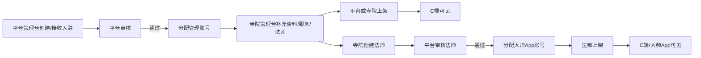

# 问玄东方 - 统一数据字典

> 本文档定义所有端共享的主数据基准。C端App、寺院管理台、法师工作台、商城管理台、平台管理台的示例数据必须与此字典保持一致。

> **规模概览**：全量初始化涉及默认 `askxuan` 在内 21 个数据库、104 条建表声明，对应 19 个下游服务及兼容共享库。详见 [db/init.sql](../../../askXuan-backend/db/init.sql)。

> **多数据库布局**：后端按业务域拆分为多个数据库（`askxuan_auth` 认证域 / `askxuan_user` 用户域 / `askxuan_temple` 寺院域 等）。`admin_account` / `role` / `permission` 位于 `askxuan_auth`，auth-service 的 DSN 也指向该库；认证服务校验寺院/法师绑定时通过最小只读授权访问 `askxuan_temple.temple` 与 `askxuan_master.master`。

## 1. 寺院数据

| ID | 名称 | 地区 | 类型 | 宗派 | 状态 | 地址 |
|----|------|------|------|------|------|------|
| T001 | 灵隐寺 | 浙江杭州 | 汉传佛教 | 禅宗 | 正常 | 浙江省杭州市西湖区灵隐路法云弄1号 |
| T002 | 北京白云观 | 北京西城 | 道教 | 全真派 | 正常 | 北京市西城区白云观街9号 |
| T003 | 嵩山少林寺 | 河南登封 | 汉传佛教 | 禅宗 | 正常 | 河南省郑州市登封市嵩山少林景区 |
| T004 | 大昭寺 | 西藏拉萨 | 藏传佛教 | 各派共尊 | 正常 | 西藏自治区拉萨市城关区八廓西街2号 |
| T005 | 普济禅寺 | 浙江舟山 | 汉传佛教 | 禅宗 | 待审核 | 浙江省舟山市普陀区普陀山镇香华街 |
| T006 | 武当山紫霄宫 | 湖北十堰 | 道教 | 武当道教 | 正常 | 湖北省十堰市丹江口市武当山特区紫霄村 |
| T007 | 九华山化城寺 | 安徽池州 | 汉传佛教 | 地藏法门 | 正常 | 安徽省池州市青阳县九华山风景区九华街 |
| T008 | 雍和宫 | 北京东城 | 藏传佛教 | 格鲁派 | 正常 | 北京市东城区雍和宫大街12号 |
| T009 | 青城山天师洞 | 四川都江堰 | 道教 | 正一派 | 正常 | 四川省成都市都江堰市青城山景区 |
| T010 | 湄洲妈祖祖庙 | 福建莆田 | 民间信仰 | 妈祖信俗 | 正常 | 福建省莆田市秀屿区湄洲北大道988号 |

## 2. 法师数据

| ID | 法号 | 俗名 | 所属寺院 | 职位 | 宗派 | 类型 | 认证状态 | 专长 |
|----|------|------|----------|------|------|------|----------|------|
| M001 | 明觉法师（演示） | 林知远 | 灵隐寺(T001) | 客堂法师 | 禅宗 | 佛教 | 已认证 | 禅修入门、佛教文化、祈愿礼仪 |
| M002 | 玄和道长（演示） | 赵清远 | 北京白云观(T002) | 经师 | 全真派 | 道教 | 已认证 | 道教文化、科仪讲解、养生导引 |
| M003 | 延澄法师（演示） | 周安行 | 嵩山少林寺(T003) | 禅修讲师 | 禅宗 | 佛教 | 已认证 | 禅修指导、少林文化、静心课程 |
| M004 | 嘉措讲师（演示） | — | 大昭寺(T004) | 文化讲师 | 各派共尊 | 佛教 | 已认证 | 藏传佛教文化、寺院历史、祈愿礼仪 |
| M005 | 慧闻法师（演示） | 孙明远 | 普济禅寺(T005) | 客堂法师 | 禅宗 | 佛教 | 待审核 | 观音文化、佛教礼仪、静心交流 |
| M006 | 守一道长（演示） | 张云舟 | 武当山紫霄宫(T006) | 经师 | 武当道教 | 道教 | 已认证 | 武当文化、太极养生、道教礼仪 |
| M007 | 行愿法师（演示） | 吴善行 | 九华山化城寺(T007) | 客堂法师 | 地藏法门 | 佛教 | 已认证 | 地藏文化、佛教礼仪、静心交流 |
| M008 | 嘉木扬讲师（演示） | — | 雍和宫(T008) | 文化讲师 | 格鲁派 | 佛教 | 已认证 | 藏传佛教文化、建筑讲解、祈愿礼仪 |
| M009 | 静虚道长（演示） | 陈守静 | 青城山天师洞(T009) | 经师 | 正一派 | 道教 | 已认证 | 青城道教文化、养生导引、礼仪讲解 |
| M010 | 林怀恩讲师（演示） | 林怀恩 | 湄洲妈祖祖庙(T010) | 文化讲师 | 妈祖信俗 | 民间信仰 | 已认证 | 妈祖文化、民俗礼仪、海洋文化 |

以上 10 位大师、法师、道长和文化讲师均为虚构演示人物，不代表对应真实场所的现任宗教教职人员。

演示 Master App 账号与 `master_id` 一一对应：M001 `zhihai`、M002 `xuanhe`、M003 `yancheng`、M004 `jiacuo`、M005 `huiwen`、M006 `shouyi`、M007 `xingyuan`、M008 `jiamuyang`、M009 `jingxu`、M010 `huaien`。M005 因大师及所属寺院待审核而停用，其余演示账号启用；生产环境必须重置演示凭据。

## 3. 服务类型（用户端13种）

| ID | 服务名称 | 类型 | 默认价格区间 | 关联法师 |
|----|----------|------|-------------|----------|
| S001 | 祈福 | 法事 | ¥100-500 | M001 M002 M004 M005 |
| S002 | 供灯 | 供养 | ¥50-300 | M001 M003 M004 |
| S003 | 上香 | 供养 | ¥30-200 | M001 M003 M004 |
| S004 | 还愿 | 法事 | ¥100-500 | M001 M003 M004 |
| S005 | 超度 | 法事 | ¥300-1000 | M001 M003 M004 |
| S006 | 开光 | 法事 | ¥168-500 | M001 M003 |
| S007 | 化太岁 | 法事 | ¥200-800 | M002 M006 |
| S008 | 求姻缘 | 祈愿 | ¥100-500 | M001 M005 |
| S009 | 求财运 | 祈愿 | ¥100-800 | M002 M006 |
| S010 | 求事业 | 祈愿 | ¥100-600 | M003 M006 |
| S011 | 求风水 | 咨询 | ¥200-1000 | M002 M006 |
| S012 | 求健康 | 祈愿 | ¥100-600 | M001 M004 |
| S013 | 求学业 | 祈愿 | ¥100-500 | M003 M005 |

## 3.1 寺院分类与服务标签规则

每个寺院同时具备两类标签，所有客户端、管理端、服务端必须使用同一字段含义：

| 标签类型 | 来源字段 | 用途 | 示例 |
|----------|----------|------|------|
| 一级信仰流派 | `belief_profile` + `temple.belief_code/master.belief_code` | C 端“按信仰找”、寺院/法师筛选、管理端基础信息 | 平台管理台创建、排序、启停；寺院管理台从启用项中关联 |
| 宗教/场所与具体宗派 | `temple.type` + `temple.sect` | 详情展示和兼容筛选 | 汉传佛教、道教道观；禅宗、全真派、格鲁派 |
| 服务能力标签 | `temple_service.service_code/service_name` | 找寺院左侧服务筛选、寺院卡片标签、预约服务入口 | 求姻缘、求财运、求事业、求风水、求健康、求学业、祈福、供灯、上香、还愿、超度、开光、化太岁 |

后端 `/api/v1/beliefs` 返回平台启用的一级流派；`/api/v1/service-types` 返回固定的 13 项标准服务类型；`/api/v1/temples` 必须返回 `beliefCode`、`serviceCodes`、`serviceTags`、`serviceCount`。C 端按标准服务编码筛选寺院，不得从寺院返回的展示文案反推筛选字典。寺院管理台只能从标准服务类型中选择开通项目，不得自定义服务编码或名称；寺院仍可维护价格、结构化时段、容量、上下架状态和诉求标签。

“按心愿办”以 `askxuan_product.intent_tag` 为心愿导航主数据，平台管理台只负责名称、文案、图标、排序和启停。13 个服务类型为固定业务目录：寺院管理台从目录中开通寺院服务，平台/寺院为大师配置大师服务。C 端通过 `/api/v1/intentions/tags` 获取心愿入口，通过 `/api/v1/intentions?code=` 获取寺院服务与大师服务列表。商品、DIY 和商城管理台不参与该聚合。

## 3.2 寺院与法师强关系

1. 一个寺院可以有多个法师。
2. 一个法师只能归属一个寺院，`master.temple_code` 必填且必须引用真实存在的 `temple.code`。
3. 不允许存在无寺院法师，也不允许寺院列表/详情展示不属于该寺院的法师。
4. 法师在 C端、大师 App、寺院管理台、平台管理台中的所属寺院均以 `master.temple_code` 为唯一来源，不以页面文案或本地 mock 推导。

## 4. 额外服务（DIY手串加持，价格必须精确匹配）

| ID | 服务名称 | 寺庙 | 法师 | 价格 | 描述 |
|----|----------|------|------|------|------|
| E001 | 灵隐寺·祈愿加持 | 灵隐寺(T001) | 明觉法师（演示）(M001) | **¥168** | 提供线上祈愿礼仪服务 |
| E002 | 北京白云观·道教文化祈愿 | 北京白云观(T002) | 玄和道长（演示）(M002) | **¥128** | 提供道教文化与祈愿礼仪服务 |
| E003 | 嵩山少林寺·禅修祈愿 | 嵩山少林寺(T003) | 延澄法师（演示）(M003) | **¥198** | 提供禅修文化与祈愿服务 |
| E004 | 大昭寺·文化祈愿 | 大昭寺(T004) | 嘉措讲师（演示）(M004) | **¥268** | 提供藏传佛教文化与祈愿礼仪讲解 |

> **严格规则**：这4项服务的名称、寺庙、法师、价格在所有端（C端diy-order、商城管理台service-list/service-edit/diy-order-detail、平台管理台）中必须完全一致。

## 5. DIY手串材料基准价格

| 材料 | 规格 | 单价 |
|------|------|------|
| 小叶紫檀圆珠 | 10mm | ¥28/颗 |
| 星月菩提 | 10mm | ¥18/颗 |
| 凤眼菩提 | 10mm | ¥22/颗 |
| 白玉 | 8mm | ¥35/颗 |
| 青金石 | 10mm | ¥25/颗 |
| 南红玛瑙 | 8mm | ¥32/颗 |
| 蜜蜡 | 10mm | ¥45/颗 |
| 黑曜石 | 10mm | ¥12/颗 |
| 藏银三通 | 10mm | ¥48/个 |
| 蜜蜡佛头 | 12mm | ¥68/个 |
| 花丝莲花吊坠 | 15mm | ¥20/个 |
| 白水晶隔片 | 6mm | ¥2.5/颗 |
| 流苏配饰 | — | ¥28/个 |
| 弹力绳 | — | ¥2/根 |

## 6. 功德金档位

| 档位 | 金额 |
|------|------|
| 随喜 | ¥0 |
| 小额 | ¥50 |
| 中额 | ¥100 |
| 大额 | ¥200 |
| 不限额 | 自定义输入 |

## 7. 预约订单状态流转

```
服务端计价并占位 → 待支付(pending_payment) → 支付成功 → 待确认 → 已确认 → 进行中 → 已完成
                         ↓ 15分钟超时                ↓
                      已取消并释放容量            已取消
```

## 8. DIY手串订单状态流转

> 与 [状态机.md](../architecture/状态机.md) §2 一致。完整状态含加持中间态。

| 状态值 | 中文名 | 说明 |
|--------|--------|------|
| `pending_review` | 待审核 | 服务端重定价创建订单；支付成功后仍等待商城审核 |
| `in_making` | 制作中 | 审核通过，商城开始制作 |
| `awaiting_blessing` | 等待加持 | 制作完成，等待寺院/法师加持（仅含加持订单） |
| `blessing_in_progress` | 加持中 | 法师正在执行加持仪式 |
| `blessing_completed` | 加持完成 | 加持完成，可进入发货（仅含加持订单） |
| `awaiting_shipment` | 待发货 | 制作完成（无加持）或加持完成，等待发货 |
| `shipped` | 已发货 | 商城已发货 |
| `completed` | 已完成 | 用户确认收货 |
| `cancelled` | 已取消 | 用户取消或审核不通过；审核驳回时归还材料/SKU库存 |
| `in_return` | 售后中 | 用户发起退换货 |

```
服务端重定价并扣库存 → pending_review(待付款/已支付待审核) → in_making(制作中)
                                        │
                   ┌────────────────────┴────────────────────┐
                   ▼                                         ▼
      awaiting_blessing(等待加持)                 awaiting_shipment(待发货)
                   │                                         │
                   ▼                                         │
      blessing_in_progress(加持中)                            │
                   │                                         │
                   ▼                                         │
      blessing_completed(加持完成) ──→ awaiting_shipment(待发货)
                                                   │
                                                   ▼
                                        shipped(已发货) → completed(已完成)
                                                   │
                                                   ▼
                                            in_return(售后中)

pending_review / in_making → cancelled(已取消)
```

## 9. 数据流转关系

```
┌─────────────┐    用户下单     ┌──────────────┐
│   C端App     │ ───────────→ │  寺院管理台    │
│  (用户侧)    │              │ (寺院管理员)    │
└──────┬───────┘              └──────────────┘
       │ DIY设计                      ↑
       ↓                             │ 加持任务
┌──────────────┐    制作/发货    ┌──────────────┐
│  商城管理台   │ ←─────────── │  法师工作台    │
│ (商城运营)    │    材料BOM    │ (法师个人)     │
└──────────────┘              └──────┬───────┘
                                      ↑
                               ┌──────────────┐
                               │  平台管理台    │
                               │ (平台运营)     │
                               └──────────────┘
```

- **预约流程**：C端下单 → 寺院管理台接单 → 法师工作台确认/拒绝 → 完成后评价
- **DIY手串流程**：C端设计 → 商城管理台审核制作 → 如选加持服务，派单到对应寺院管理台 → 寺院完成后回传 → 商城发货
- **入驻流程**：平台管理台创建/接收入驻申请 → 审核通过 → 分配管理账号 → 上架后进入 C端可见池
- **账号流程**：平台管理台创建管理账号 → 按角色绑定寺院/法师/商铺 → 登录时将绑定对象写入 JWT → 对应管理端仅能访问绑定对象的数据

## 10. 多端数据同步规则

| 数据域 | 源头 | 同步到 | 说明 |
|--------|------|--------|------|
| 寺院信息 | 平台管理台创建/审核/上架 | C端展示 + 寺院管理台编辑 | 平台为唯一主数据源；仅 `status=正常/推荐` 的寺院进入用户端；待审核必须完成初审和终审 |
| 法师信息 | 寺院管理台创建 + 平台审核/上架 | C端展示 + 法师工作台 | 寺院创建，平台审核；仅 `auth_status=已认证`、`shelf_status=on_shelf`、`platform_status=normal` 的法师进入用户端 |
| 寺院-法师关系 | `master.temple_code` | 所有端 | 法师必须且只能归属一个寺院；寺院详情的法师列表必须按该字段查询 |
| 寺院服务标签 | `temple_service` | C端找寺院 + 寺院管理台 + 平台管理台 | `service_code` 必须引用 `service_type.code`；服务上架后才参与用户端筛选 |
| 服务项目 | 寺院管理台创建/上架 | C端展示 | 寺院自主定价；服务码来自统一服务字典 |
| 额外服务 | 商城管理台创建 + 平台审核 | C端DIY下单展示 | 商城运营管理 |
| 材料库 | 商城管理台管理 | C端DIY设计页 | 商城运营管理 |
| 预约订单 | C端创建 | 寺院管理台 + 法师工作台 | 实时推送 |
| DIY订单 | C端创建 | 商城管理台 + (如有加持→寺院管理台) | 实时推送 |
| 用户信息 | C端注册 | 平台管理台查看 | 平台为管理源 |
| 管理账号 | 平台管理台创建/启停 | 平台管理台 + 寺院管理台 + 大师 App + 商城管理台 | `temple_admin` 必须绑定 `temple_id`；`master` 必须绑定 `master_id` 并自动校验所属寺院；账号禁用后不可登录 |
| 评价数据 | C端创建 | 寺院管理台 + 平台管理台 | 共享 |
| 财务结算 | 订单完成自动生成 | 商城管理台 + 平台管理台 + 法师工作台 | 月结 |
| 媒体资产 | 法师端上传，media-service 校验与回调更新 | C端播放 + 法师工作台管理 + 后续社区引用 | 业务表只保存 `mediaId`，播放状态以 media-service 为准 |
| 直播房间 | 法师工作台创建，直播 Provider 管理会话 | C端观看 + OpenIM 群聊 | 默认关闭；公开池仅包含 `live` 房间，推流地址仅房主可见 |
| 大师广场帖子 | 法师端创建，community-service 管理 | C端瀑布流 + 平台审核 | 只引用 `mediaId`；仅 `approved` 公开，普通用户不可发布 |
| 大师广场评论 | C端提交，平台端审核 | C端帖子详情 | 评论先审后显；通过后才增加公开评论数 |

## 11. 入驻、上架与账号分配规则



账号绑定约束：

| 角色 | 必填绑定 | 登录端 | 数据范围 |
|------|----------|--------|----------|
| 平台超管 | 无 | 平台管理台 | 全平台 |
| 寺院管理员 | `temple_id` | 寺院管理台 | 仅绑定寺院 |
| 法师/大师 | `master_id`，并派生 `temple_id` | 大师 App/法师工作台 | 仅绑定法师及其所属寺院 |
| 商城运营 | `shop_id` | 商城管理台 | 仅绑定商铺/商城域 |
| 平台客服 | 无 | 平台管理台 | 客服授权模块 |

可见性约束：

- C端寺院列表只展示平台审核通过且状态为正常/上架的寺院。
- C端法师列表只展示已认证、已上架且平台未封禁的法师。
- 寺院管理台只有绑定了 `temple_id` 的账号可以登录，并且只能管理该寺院的服务、法师、预约、加持任务。
- 大师 App 只有绑定了 `master_id` 的账号可以登录，并且该 `master_id` 必须属于一个真实寺院。
- 每位大师默认只分配一个 Master App 主账号。寺院管理台负责创建和维护本寺院大师资料，平台管理台负责资质审核、状态管理以及账号创建、改绑、启停和初始凭据交付；大师本人无权创建或分发账号。
- 大师账号只有在大师已认证、平台状态正常且所属寺院已通过审核时才可启用和登录；M005 的演示账号因待审核保持停用。

## 版本记录

| 版本 | 日期 | 说明 |
|------|------|------|
| v1.0 | 2026-06-30 | 初始版本，对齐5端数据 |
| v1.1 | 2026-07-07 | 补充寺院-法师强关系、13类服务标签、入驻上架与账号绑定规则 |
| v1.2 | 2026-07-13 | 补充媒体资产与直播房间跨端同步边界 |

---

## 大师双轨制（2026-08-16 新增）

### 大师分类（master.manage_by）
| 值 | 含义 | 管理方 | 客户端 |
|---|---|---|---|
| temple | 寺庙强绑定大师 | 寺院管理台 | 法师客户端（含寺庙协同：加持任务/排期） |
| platform | 野生大师（无寺庙） | 平台管理台（资质认证→审核→分发账号） | 法师客户端（仅个人功能） |

### 服务标签双轨
- 寺庙标签：S001-S013 固定目录 + 寺院定价（现有 temple 服务目录）
- 大师标签：`master_service_tag(master_code, service_code, price, status)`，两类大师均可配置，复用同一目录

### 对接规则（两类大师一致）
1. 先付费咨询（consultation_order payment_status=success）→ 再预约服务（POST /api/v1/master-bookings/:id，服务端强制校验）
2. 寺庙绑定大师：寺庙服务可全寺执行或指定大师执行；直约路径同上
3. 分账：寺庙绑定单按 booking 费率；野生大师单按 `commission_config.biz_type=wild_master`（默认 10% 平台 / 90% 大师，可调）
